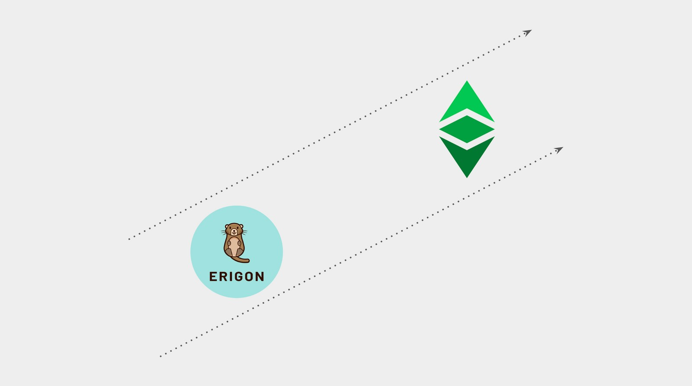
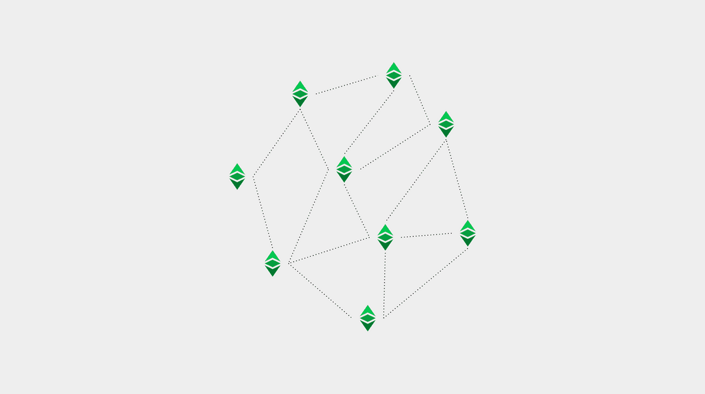

---
**欢迎由此观看或收听本期视频:**

<iframe width="560" height="315" src="https://www.youtube.com/embed/gBU56Ed4ltQ" title="YouTube video player" frameborder="0" allow="accelerometer; autoplay; clipboard-write; encrypted-media; gyroscope; picture-in-picture; web-share" allowfullscreen></iframe>

---

**这是该系列的第七部分，将解释目前在以太坊经典上运行或实现的三种软件客户端**

该系列将包括以下主题:


1. 网络、区块链和加密货币之间的区别
2. 区块链软件与区块链协议的区别
3. 区块链中是否存在软件客户端和服务器
4. 以太坊虚拟机区块链和以太坊经典
5. Core Geth详解
6. 超级账本Hyperledger Besu详解
7. Erigon详解

## 本系列中的回顾概念



在我们的前四篇文章中，我们已经解释了什么是网络、区块链和加密货币的基础知识;区块链软件与区块链协议的区别;加密货币网络中是否存在软件客户端和服务器;以及以太坊经典在以太坊虚拟机(EVM)区块链中的位置。

在本文中，我们将应用所有这些知识来解释什么是可以与以太坊经典一起工作的Erigon软件客户端，以及它的特性、类型和功能。

## 以太坊经典是一个网络、一个区块链、一个加密货币



正如我们在本系列的第一篇文章中解释的那样:

以太坊经典是一个网络，因为它是一个由机器、节点和一个名为区块链的共享数据库组成的系统。特别是，它是一个公共网络，其软件是开源的，因此任何人都可以审计并使用它来参与系统。

以太坊经典是一个区块链，因为它的数据库包含一个账户和余额的分类账，在那里交易被完全传输，并形成一个完全复制的区块链。

以太坊经典是一种加密货币，因为它的分类账跟踪一种名为ETC的硬币，这种硬币稀缺、耐用、制造成本高、可移植、可分割、可替代和可转让，因此它可以用于支付和价值储存。

## Erigon将成为与以太坊经典一起运作的节点客户端


区块链是点对点网络，系统中的每个参与机器称为一个节点。

一台机器要成为一个节点，它需要运行一个包含特定网络协议规则集的软件应用程序。

Erigon是一个以太坊网络节点软件，也被称为“软件客户端”，并正在适应以太坊经典操作的过程中。

因此，用于ETC的Erigon目前处于实验阶段，但可以下载用于使用和测试。然而，它还不是稳定的。

核心开发者表示，ETC支持目前进展顺利。

Erigon For ETC将是一个软件客户端和服务器

区块链网络不是分层系统，其中一些机器比其他机器有更大的影响力，或者有被允许的实例或特权。在ETC中，所有对等节点都是相等的，并且每15秒复制一次完全相同的状态。

这种复制意味着所有节点实际上都具有接收事务、接受区块、并将它们重新发送到所有其他节点的角色。类似的，当新节点连接到网络时，它们会访问现有参与节点的网络状态，然后从它们那里下载所有历史记录，称为初始块下载(Initial Block download, IBD)。

由于网络中所有节点的这种平等状态，以及所有节点都从所有其他节点发送和接收信息，因此没有真正不同的服务器和客户端角色，它们都是真正的服务器和客户端。

## Erigon for ETC将是一个完整的EVM节点软件

Erigon for ETC将是一个节点服务器和客户端，它将与所有EVM标准组件兼容，特别是与以太坊经典的挖掘功能兼容。

## Erigon的来源

Erigon是以太坊网络中最流行的软件客户端Go-Ethereum的一个分支。

这是一个 [同名](https://twitter.com/ErigonEth) 团队的项目，其目标是使节点更快地同步并减少磁盘存储大小。

他们遵循的策略是优化节点运行的许多过程，但主要的焦点是更改同步方法和修改数据结构。

## Erigon的独特特征

他们使用的同步方法称为暂态([staging](https://erigon.substack.com/p/staged-sync-and-short-history-of))。

该方法首先下载了整个区块链，并在本地离线单独处理验证函数，而不是在其他节点检索区块时下载并验证每个区块。

对于数据结构，他们对Merkle树进行了修改，以实现更快的写入和同步。

## Erigon for ETC可能会拥有不同配置

当Erigon完全被改编后，它将成为一个功能齐全的以太坊经典客户端-服务器，并可以通过以下配置使用:

**归档节点:** 存储区块头、哈希交易树(称为Merkle Patricia树)以及发送到区块链的所有交易的所有原始数据的节点。这是最大最沉重的操作和最长的下载类型的节点。

**完整节点:** 存储区块头和Merkle Patricia树，但不存储所有原始交易的节点。这是一种相对安全的节点，下载速度比归档节点快得多，操作也更轻。

**轻量节点:** 一个只存储区块头信息的节点。这是一种下载速度非常快，操作最轻的节点，但它的安全性低，依赖性更强，因为它总是需要网络中的其他节点来确认来自Merkle Patricia树的哈希交易，以便能够验证它们。

## Erigon for ETC可能会有不同功能

作为一个可配置且灵活的节点软件，当Erigon完全适应ETC时，它可以用于以下功能:

**验证节点:** 交易所、大型机构投资者和加密监管服务需要运行能够直接验证其在网络中的位置的节点。作为一个功能齐全的节点客户端，Erigon for ETC可以用于此功能。

**矿工:** 当ETC的Erigon稳定时，它将包含以太坊经典的完整挖矿算法，因此它可能被矿工和矿池使用来运行他们的操作。

**用于服务节点(NaaS):** 运行NaaS服务的初创公司和其他公司可以使用Erigon向第三方提供钱包查询、交易处理、统计和图表以及块资源管理器服务。

## 如何在以太坊经典上运行Erigon

要将Erigon作为实验性的以太坊经典节点运行，节点操作员和矿工必须到Github上的以下存储库并下载客户端:

https://github.com/ETCCooperative/erigon

要激活它指向ETC区块链，必须使用以下命令启动它:

```--erigon –chain classic```

---

**感谢您阅读本期文章！**

想要了解更多ETC Erigon，请访问: https://github.com/ETCCooperative/erigon

想要了解更多有关ETC的内容，请访问: https://ethereumclassic.org
