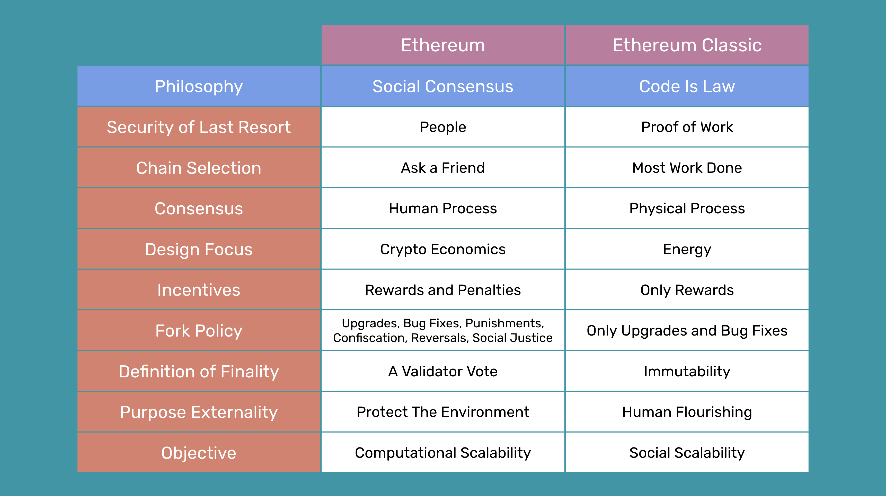

---
**You can listen to or watch this video here:**

<iframe width="560" height="315" src="https://www.youtube.com/embed/XF-AUbrnf9s" title="YouTube video player" frameborder="0" allow="accelerometer; autoplay; clipboard-write; encrypted-media; gyroscope; picture-in-picture; web-share" allowfullscreen></iframe>

---

Design philosophies and principles are a big influence of how blockchains work. After the Ethereum (ETH) migration to proof of stake, which completely changed its security model, it seems appropriate to make a comparison of that system's and Ethereum Classic's (ETC) core philosophies.

Ethereum's philosophical model may be called "Social Consensus" and Ethereum Classic's "Code Is Law". In this post, we will explain and compare both.

We will write "Social Consensus" and "Code Is Law" with capital case when used as the names for the philosophies.

## Ethereum's Social Consensus

The terminology used by the Ethereum Foundation, ETH ecosystem, and community has varied with time. On different occasions, their set of principles has been referred to as "weak subjectivity", "social slashing", "social information", or "people: the last line of defense". However, the latest name used with more frequency to describe their views has been "Social Consensus", so we are going to use this term to explain their general philosophical position.

It is worth noting, though, that the term "weak subjectivity" is a sort of acknowledgement that using people's subjective opinions and voting to run a cryptocurrency network is a sort of misdeed, since they called it "weak" to try to give some reassurance.

Social Consensus advocates claim that proof of stake and subjective agreement between network node operators is more secure than Code Is Law blockchains which use proof of work. This is false as Social Consensus doesn't even provide a focal point for participants to join, leave, and rejoin the network. This focal point provided by the "most work done" rule in proof of work is the only way to make a blockchain permissionless, decentralized, and censorship resistant.

The best chain selection mode that Social Consensus philosophy can provide is "ask a friend" or check with block explorers or some other website on the internet. 

This truly weak decision making process of Social Consensus and proof of stake stems from two beliefs they hold:

- That blockchain consensus is a human process, not a mechanical physical process.
- That humans are pretty good at achieving consensus in the long run.

As Social Consensus has these principles as its core beliefs, blockchains are built and used only for automation and scalability. Just as computers and software programs in traditional centralized systems, for them, blockchains are just mere practical tools.

This focus on humans as sources of safety makes Social Consensus proponents believe that proof of stake and proof of work can each ultimately be overpowered by state actors indifferently. For them, both systems are equally vulnerable, therefore whether they have human intervention as an embedded design feature is irrelevant.

Again, Social Consensus emphasizes that communities are good at consensus. 

Because Social Consensus believes in human agency, then it also believes in very human methods. This leads to the erroneous conclusion that proof of work is actually weaker because it incentivizes block producers only with rewards; that proof of stake does this with rewards and penalties, therefore, it must be more complete as an economic mechanism.

Social Consensus proponents focus a lot on what they call efficiency, but their definition of efficiency is whether block producers and validators have to be paid more or less to participate in the network. The measurement of efficiency they use is to calculate the total amount of capital locked for producing blocks, multiplied by the total rewards needed to pay for this capital, multiplied by how much time such capital is locked. The claim is that because proof of stake demands less of these metrics, then it must be more efficient.

The above is not only based upon a bad definition of efficiency, but it also shows a lack of understanding of the economic implications of the different models. If proof of stake validators require a lower reward, thus a lower return on investment (ROI), it is because their role in the system has significantly less risk for them as they do not actually sink capital to recover it in the distant future with uncertainty. Proof of work miners make enormous commitments of capital that they sink into hardware, data centers, human resources, and electricity with the expectation that they will recover their investment with a reasonable ROI in the long term.

Social Consensus has nearly zero marginal cost and risk. Proof of work requires risk taking, competitive merit, and sunk capital.

And this is where they are confused. Proof of work is purposely costly and unscalable computationally precisely to guarantee the benefits of decentralization, which is correctly measured by its social scalability: Anyone in the world may use a Code Is Law blockchain. Only a subset of the world may use Social Consensus networks.

Another deep misunderstanding held by Social Consensus supporters is that they believe that proof of work is centralized through mining pools and ASIC computing. This kind of thinking is incomprehensible at this point because after 14 years of operation of Bitcoin, and 7 years of Ethereum as a proof of work chain until the migration to proof of stake, neither chain has ever been centralized or captured by mining pools, mining firms, ASIC producers, or any other kind of agent.

To the contrary, proof of stake, with its Social Consensus philosophy, was captured [from the start](https://www.mevwatch.info/) when Ethereum migrated to that system as more than 70% of its blocks are censored on behalf of government agencies due to international sanctions policies.

One of the strongest (and most erroneous) arguments in Social Consensus philosophy is that blockchains are technological and social designs where their safety is sourced from cryptography, economics, and social agreement. This leaves out the most important invention of Bitcoin, and the only reason why the whole industry actually exists: Nakamoto Consensus.

Nakamoto Consensus is based on proof of work and can only be based on proof of work because it is the only way to assure the consensus of machines owned by strangers, spread across the world, who don't talk to each other, have no reason to trust each other, and who, in their complete isolation and without consulting anyone, reach absolute consensus on the state of the system every 10 minutes in the case of Bitcoin and every 15 seconds in the case of Ethereum Classic.

Cryptography, economics, and social agreement are just marginal tools and methods used to implement the system, they are not the keys to the design and its security. 

It was the enormous amount of electricity needed, the enormous amount of computational power required, the difficulty adjustment, and the importation of this information from the real physical world into the system that was the revolutionary solution to the problem of consensus and safety in the network.

Social Consensus' lack of acknowledgment of this truth and its naive refocusing on human virtue as a security measure is the major flaw of that philosophy.

This flaw fosters a belief in several falsehoods, one of which is that a blockchain is a sort of "crypto-economic organism" or some sort of righteous organization of people who will always be good for the world.

Social Consensus focuses on economics and virtue rather than physics and energy.

Social Consensus glorifies "the community", considers it the security of last resort, and believes that human voluntary agreement is what ultimately protects the accounts, property, dapps, and contracts inside a blockchain.

We would argue, that a Social Consensus network is not even a blockchain. Blocks are defined as batches of data that have to be sealed with a proof of work hash that must cost block producers enormous amounts of capital and energy.  

The ultimate purpose of Social Consensus is to protect the planet, to do no harm to the environment, and to heal the climate. The whole reason of existence of Bitcoin, Ethereum Classic and other true blockchains is human flourishing through trust minimization. 

Indeed, proof of work actually helps the environment as an externality much more than proof of stake because renewable energy is cheaper than fossil fuel electricity, and miners are constantly seeking to lower their costs so they naturally move to renewable energy sources, providing cash flow to that segment of the industry and promoting its growth. 

As Social Consensus believes in human agency, but human agency is prone to cheating, then penalties through slashing are required. Also, forks to reverse the chain, confiscate funds, slash bad actors, and change the history of the chain by majority voting are perfectly fine in that philosophy. If trust in intermediaries and human intervention were never the problem, then why was "trust minimization" even a concern?

Of course, Social Consensus has very little awareness of the perils that such actions and interventions will bring. It is unlikely that any actor in the network that is slashed by social consensus will passively accept a significant loss of their capital without a fight. Lawsuits and legal bureaucracy will be the name of the game in the Social Consensus world.

In Social Consensus philosophy, "finality" is defined as a 66% vote of validators. This seems to be strong for the naive eye, but it is just a mirage. It really means that with only 33% of bad actors the network may be disrupted. This has been the vulnerability that has existed in computing networks since they were invented.

To describe finality as a vote, is like saying that finality can be decreed by law or by a government. It is precisely because this is not true that Satoshi Nakamoto invented Bitcoin, Ethereum Classic exists, and Cypherpunks had been working on these technologies for decades.

However, people are the last defense for Social Consensus advocates, governance is paramount as an emergency response, and The DAO hard fork is regarded as an accomplishment.

## Ethereum Classic's Code Is Law

In Ethereum Classic the term "Code Is Law" has been unequivocal, unambiguous, determined, and clear since the day that Ethereum split from the original blockchain on July 20th of 2016 on block 1,920,000.

Code Is Law is as inextricably linked to proof of work as Social Consensus must escape it. Proof of work is the most secure consensus mechanism known to humankind for reaching consensus on the state of a peer to peer network.

Code Is Law is a principles first philosophy, all the rest comes after.

Code Is law means unstoppability, no downtime, censorship resistance, and the thorough minimization of the influence of third parties. These features are the only ones that can guarantee that the network will not be captured or influenced by special interests.

Code Is Law advocates believe in freedom from censorship, immutability, and that decentralized applications must run exactly as programmed.

Immutability, decentralization, and complete neutrality, which means no intervention by supposedly virtuous humans, is the only way to guarantee zero discrimination of anyone. Code Is Law beliefs include pseudo anonymity,  decentralization, a rejection of decisions by voting, and a rejection of irregular state changes  to the network.

Code Is Law philosophy has the knowledge at its root that superficial things like funds recoveries, returns to legitimate owners, and other on-chain manual interventions are wrong, not right. And they are wrong because nothing guarantees that such human interventions will not be used against the capital, applications, and transactions of users.

For Code Is Law to be true, and it is true in ETC, the ledger must be inviolable and immutable. "The greater good" in Social Consensus is a false promise, it is actually completely opposite to the safety of the property, agreements, and transactions of individuals.

Proof of work is the only mechanism known to man that guarantees permissionlessness, decentralization, censorship resistance, and immutability. And, these features guarantee no discrimination against any nationality, culture, creed, politics, race, or human condition. 

Where Social Consensus believes "people are good" Code Is Law believes "people are the problem we were trying to solve in the first place!"

Code Is Law means trust minimization and that Ethereum Classic cannot be shut down or intervened. This has been proven multiple times in its history. Forks are only to fix bugs or make necessary upgrades. Nothing more.

If Social Consensus were used for any kind of "good" change, then what prevents it to be used for any change. The only solution is no social consensus. Thus, Code Is Law.

Code Is Law means no change and the sanctity of the ledger. Anyone, anywhere in the world, even refrigerators, can use ETC. This is only possible with complete neutrality, and neutrality is only possible with true immutability. "Governance" doesn't even exist in Code Is Law. This is why neither ETC nor Bitcoin have foundations or leaders.

Code Is law is about rough consensus, which is free adoption, free and unlimited participation, and no tyranny of the elites or voting majorities. This makes the blockchain antifragile.

Code Is Law does not mean it supports crooks and thieves. Indeed, the worst crooks and thieves are actually kept out of it! And, the petty ones can be dealt with through the normal and time tested channels of legal systems and law enforcement.

Code Is Law is on the blockchain. Executions and transactions are final and immutable. It has nothing to do with human law. It is like the laws of physics.

The communities of Ethereum, Bitcoin, or Ethereum Classic cannot have the knowledge or capability for dealing with the disputes of billions of people worldwide. There is no such thing as blockchain justice. The resolution of these things must be carried out outside of the blockchain.

The only answer is neutrality, therefore the Code Is Law philosophy.  

---
### Sources:

### Ethereum Social Consensus ideas and writings:

- Proof of Stake: How I Learned to Love Weak Subjectivity: https://blog.ethereum.org/2014/11/25/proof-stake-learned-love-weak-subjectivity
- Proof of Stake Design Philosophy: https://medium.com/@VitalikButerin/a-proof-of-stake-design-philosophy-506585978d51
- What Is Social Coordination and Why It Is Needed: https://ethereum.org/en/developers/docs/consensus-mechanisms/pos/faqs/#what-is-social-coordination
- People: The Last Line of Defense: https://ethereum.org/en/developers/docs/consensus-mechanisms/pos/attack-and-defense/#people-the-last-line-of-defense

### Ethereum Classic foundational documents:

- The Ethereum Classic Declaration of Independence: https://ethereumclassic.org/ETC_Declaration_of_Independence.pdf
- Code is Law and the Quest for Justice: https://ethereumclassic.org/blog/2016-09-09-code-is-law
- A Crypto-Decentralist Manifesto: https://ethereumclassic.org/blog/2016-07-11-crypto-decentralist-manifesto
- Code is Law - Ethereum Classic community website: https://ethereumclassic.org/why-classic/code-is-law

---

**Thank you for reading this article!**

To learn more about ETC please go to: https://ethereumclassic.org
