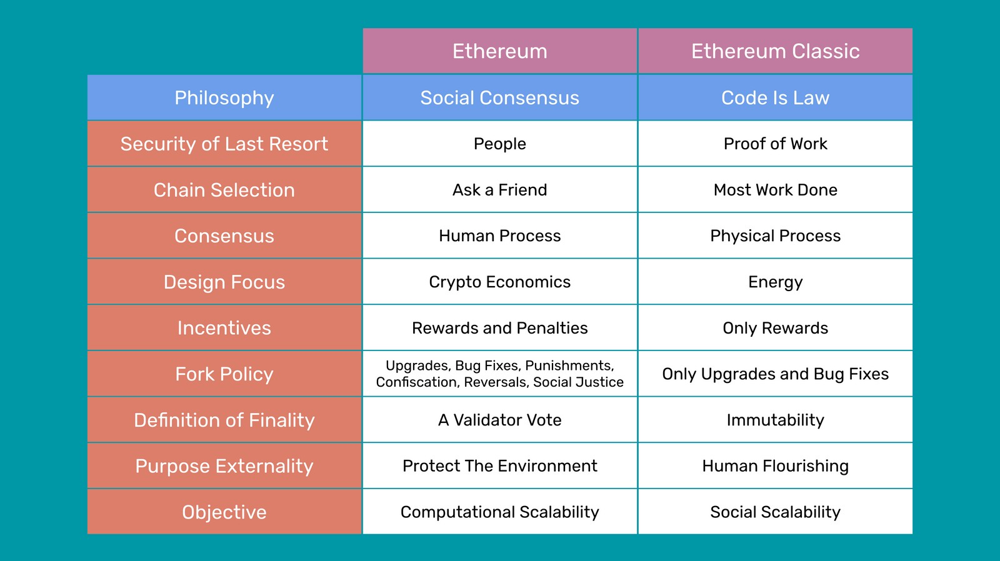

---
**您可以由此收听或观看本期视频:**

<iframe width="560" height="315" src="https://www.youtube.com/embed/XF-AUbrnf9s" title="YouTube video player" frameborder="0" allow="accelerometer; autoplay; clipboard-write; encrypted-media; gyroscope; picture-in-picture; web-share" allowfullscreen></iframe>

---

设计哲学和原则对区块链的工作方式有很大的影响。在以太坊(ETH)迁移到权益证明(Proof of Stake)之后，它完全改变了其安全模型，似乎是时候比较该系统和以太坊经典(ETC)的核心理念了。

以太坊的哲学模式可以称为“社会共识”，以太坊经典的“代码即法律”。在这篇文章中，我们将解释并比较这两者。

“社会共识”、“代码即法律”等哲学的名称要用大写字母来表示。

## 以太坊的社会共识

以太坊基金会、ETH生态系统和社区使用的术语随着时间的推移而变化。在不同的场合，他们的一套原则被称为“弱主观性”，“社会削减”，“社会信息”，或“人们:最后的防线”。然而，用于描述他们观点的最新名称是“社会共识”，因此我们将使用这个术语来解释他们的一般哲学立场。

然而，值得注意的是，“弱主观性”一词是在某种程度上承认，使用人们的主观意见和投票来运行加密货币网络是一种不当行为，因为他们称它为“弱”，以试图提供一些保证。

社会共识倡导者认为，与使用工作量证明的代码区块链相比，权益证明和网络节点运营商之间的主观协议更安全。这是错误的，因为社会共识甚至没有为参与者提供一个加入、离开和再次加入网络的焦点。由工作量证明中的“完成的工作量最多”规则提供的这个焦点是使区块链无许可、去中心化和抵制审查的唯一方法。

社会共识哲学所能提供的最佳链选择模式是“问朋友”，或者向区块探索者或互联网上的其他网站查询。

这种真正软弱的社会共识和利益证明决策过程源于他们持有的两个信念:

-区块链共识是一个人类过程，而不是机械物理过程。
-从长远来看，人类非常擅长达成共识。

由于社会共识的核心信念是这些原则，因此区块链的构建和使用仅用于自动化和可扩展性目的。就像传统中心化系统中的计算机和软件程序一样，对他们来说，区块链只是实用工具。

这种对人类作为安全来源的关注使社会共识的支持者认为，权益证明和工作量证明最终都可以被国家行为者冷漠地压倒。对于它们来说，两个系统都同样脆弱，因此它们是否有人工干预作为嵌入式设计特征是无关紧要的。

同样，社会共识强调的是社区擅长达成共识。

因为社会共识相信人类的能动性，那么它也相信非常人类的方法。这导致他们认为工作量证明实际上更弱，因为它只用奖励来激励区块生产者;他们表示，权益证明机制通过奖励和惩罚实现了这一点，因此，作为一种经济机制，它必须更加完整。

社会共识的支持者非常关注他们所谓的效率，但他们对效率的定义是，区块生产者和验证者是否必须获得更多或更少的报酬才能参与网络。他们使用的效率衡量方法是计算生产区块所锁定的总资本，乘以为这些资本支付的总回报，再乘以这些资本被锁定的时间。他们声称，因为权益证明对这些指标的要求更少，所以它一定更高效。

上述不仅是对效率的一个糟糕定义，而且缺乏对不同模型的经济含义的理解。如果权益证明验证者要求较低的回报，从而较低的投资回报率(ROI)，这是因为他们在系统中的角色对他们来说风险明显较小，因为他们实际上不会在具有不确定性的遥远未来投入资本来收回资本。矿工们在硬件、数据中心、人力资源和电力方面投入了大量的资金，并期望从长期来看能够以合理的投资回报率收回投资。

社会共识的边际成本和风险几乎为零。工作证明需要承担风险、竞争优势和投入资本。

这就是他们困惑的地方。工作量证明是故意昂贵和不可扩展的计算精确地保证去中心化的好处，这是通过其社会可扩展性来正确衡量的:世界上任何人都可以使用Code is Law区块链。世界上只有一小部分人可以使用社会共识网络。

社会共识支持者的另一个深刻误解是，他们认为工作量证明是通过矿池和ASIC计算集中的。这种想法在这一点上是不可理解的，因为在比特币运行了14年之后，在迁移到权益证明之前，以太坊作为工作证明链已经运行了7年，这两条链从未被矿池、矿业公司、ASIC生产商或任何其他类型的代理集中或捕获。

相反，当以太坊迁移到该系统时，由于国际制裁政策，超过70%的区块被政府机构审查，具有社会共识哲学的股权证明从[一开始](https://www.mevwatch.info/)就被捕获了。

社会共识哲学中最强有力(也是最错误的)的论点之一是，区块链是一种技术和社会设计，其安全性来自密码学、经济学和社会协议。这就忽略了比特币最重要的发明，也是整个行业存在的唯一原因:中本聪共识。

中本共识是基于证据的工作,只能基于证据的工作,因为它是唯一的方式保证机器属于陌生人的共识,在世界各地传播,不互相交谈,没有理由相信彼此,和谁,在他们完全的隔离,没有咨询任何人,达到绝对一致的系统状态每10分钟的比特币每15秒的Ethereum经典。

Cryptography, economics, and social agreement are just marginal tools and methods used to implement the system, they are not the keys to the design and its security. 

It was the enormous amount of electricity needed, the enormous amount of computational power required, the difficulty adjustment, and the importation of this information from the real physical world into the system that was the revolutionary solution to the problem of consensus and safety in the network.

Social Consensus' lack of acknowledgement of this truth and their naive refocusing on human virtue as a security measure is the major flaw of that philosophy.

This flaw makes them believe in several falsehoods, one of which is that a blockchain is a sort of "crypto-economic organism" or some sort of righteous organization of people who will always be good for the world.

Social Consensus focuses on economics and virtue rather than physics and energy.

Social Consensus glorifies "the community", considers it the security of last resort, and believes that human voluntary agreement is what ultimately protects the accounts, property, dapps, and contracts inside a blockchain.

We would argue, that a Social Consensus network is not even a blockchain. Blocks are defined as batches of data that have to be sealed with a proof of work hash that must cost block producers enormous amounts of capital and energy.  

The ultimate purpose of Social Consensus is to protect the planet, to do no harm to the environment, and to heal the climate. The whole reason of existence of Bitcoin, Ethereum Classic and other true blockchains is human flourishing through trust minimization. 

Indeed, proof of work actually helps the environment as an externality much more than proof of stake because renewable energy is cheaper than fossil fuel electricity, and miners are constantly seeking to lower their costs so they naturally move to renewable energy sources, providing cash flow to that segment of the industry and promoting its growth. 

As Social Consensus believes in human agency, but human agency is prone to cheating, then penalties through slashing are required. Also, forks to reverse the chain, confiscate funds, slash bad actors, and change the history of the chain by majority voting are perfectly fine in that philosophy. If trust in intermediaries and human intervention were never the problem, then why was "trust minimization" even a  concern?

Of course, Social Consensus has very little awareness of the perils that their actions and intervention will bring. It is unlikely that any actor in the network that is slashed by social consensus will passively accept a significant loss of their capital without a fight. Lawsuits and legal bureaucracy will be the name of the game in the Social Consensus world.

In Social Consensus philosophy, "finality" is defined as a 66% vote of validators. This seems to be strong for the naive eye, but it is just a mirage. It really means that with only 33% of bad actors the network may be disrupted. This has been the vulnerability that has existed in computing networks since they were invented.

To describe finality as a vote, is like saying that finality can be decreed by law or by a government. It is precisely because this is not true that Satoshi Nakamoto invented Bitcoin, Ethereum Classic exists, and Cypherpunks had been working on these technologies for decades.

However, people are the last defense for Social Consensus advocates, governance is paramount as an emergency response, and The DAO hard fork is regarded as an accomplishment.

## Ethereum Classic's Code Is Law

In Ethereum Classic the term "Code Is Law" has been unequivocal, unambiguous, determined, and clear since the day that Ethereum split from the original blockchain on July 20th of 2016 on block 1,920,000.

Code Is Law is as inextricably linked to proof of work as Social Consensus must escape it. Proof of work is the most secure consensus mechanism known to humankind for reaching consensus on the state of a peer to peer network.

Code Is Law is a principles first philosophy, all the rest comes after.

Code Is law means unstoppability, no downtime, censorship resistance, and the thorough minimization of the influence of third parties. These features are the only ones that can guarantee that the network will not be captured or influenced by special interests.

Code Is Law advocates believe in freedom from censorship, immutability, and that decentralized applications must run exactly as programmed.

Immutability, decentralization, and complete neutrality, which means no intervention by supposedly virtuous humans, is the only way to guarantee zero discrimination of anyone. Code Is Law beliefs include pseudo anonymity,  decentralization, a rejection of decisions by voting, and a rejection of irregular state changes  to the network.

Code Is Law philosophy has the knowledge at its root that superficial things like funds recoveries, returns to legitimate owners, and other on-chain manual interventions are wrong, not right. And they are wrong because nothing guarantees that such human interventions will not be used against the capital, applications, and transactions of users.

For Code Is Law to be true, and it is true in ETC, the ledger must be inviolable and immutable. "The greater good" in Social Consensus is a false promise, it is actually completely opposite to the safety of the property, agreements, and transactions of individuals.

Proof of work is the only mechanism known to man that guarantees permissionlessness, decentralization, censorship resistance, and immutability. And, these features guarantee no discrimination against any nationality, culture, creed, politics, race, or human condition. 

Where Social Consensus believes "people are good" Code Is Law believes "people are the problem we were trying to solve in the first place!"

Code Is Law means trust minimization and that Ethereum Classic cannot be shut down or intervened. This has been proven multiple times in its history. Forks are only to fix bugs or make necessary upgrades. Nothing more.

If Social Consensus were used for any kind of "good" change, then what prevents it to be used for any change. The only solution is no social consensus. Thus, Code Is Law.

Code Is Law means no change and the sanctity of the ledger. Anyone, anywhere in the world, even refrigerators, can use ETC. This is only possible with complete neutrality, and neutrality is only possible with true immutability. "Governance" doesn't even exist in Code Is Law. This is why neither ETC nor Bitcoin have foundations or leaders.

Code Is law is about rough consensus, which is free adoption, free and unlimited participation, and no tyranny of the elites or voting majorities. This makes the blockchain antifragile.

Code Is Law does not mean it supports crooks and thieves. Indeed, the worst crooks and thieves are actually kept out of it! And, the petty ones can be dealt with through the normal and time tested channels of legal systems and law enforcement.

Code Is Law is on the blockchain. Executions and transactions are final and immutable. It has nothing to do with human law. It is like the laws of physics.

The communities of Ethereum, Bitcoin, or Ethereum Classic cannot have the knowledge or capability for dealing with the disputes of billions of people worldwide. There is no such thing as blockchain justice. The resolution of these things must be carried out outside of the blockchain.

The only answer is neutrality, therefore the Code Is Law philosophy.  

---
### Sources:

### Ethereum Social Consensus ideas and writings:

- Proof of Stake: How I Learned to Love Weak Subjectivity: https://blog.ethereum.org/2014/11/25/proof-stake-learned-love-weak-subjectivity
- Proof of Stake Design Philosophy: https://medium.com/@VitalikButerin/a-proof-of-stake-design-philosophy-506585978d51
- What Is Social Coordination and Why It Is Needed: https://ethereum.org/en/developers/docs/consensus-mechanisms/pos/faqs/#what-is-social-coordination
- People: The Last Line of Defense: https://ethereum.org/en/developers/docs/consensus-mechanisms/pos/attack-and-defense/#people-the-last-line-of-defense

### Ethereum Classic foundational documents:

- The Ethereum Classic Declaration of Independence: https://ethereumclassic.org/ETC_Declaration_of_Independence.pdf
- Code is Law and the Quest for Justice: https://ethereumclassic.org/blog/2016-09-09-code-is-law
- A Crypto-Decentralist Manifesto: https://ethereumclassic.org/blog/2016-07-11-crypto-decentralist-manifesto
- Code is Law - Ethereum Classic community website: https://ethereumclassic.org/why-classic/code-is-law

---

**Thank you for reading this article!**

To learn more about ETC please go to: https://ethereumclassic.org
