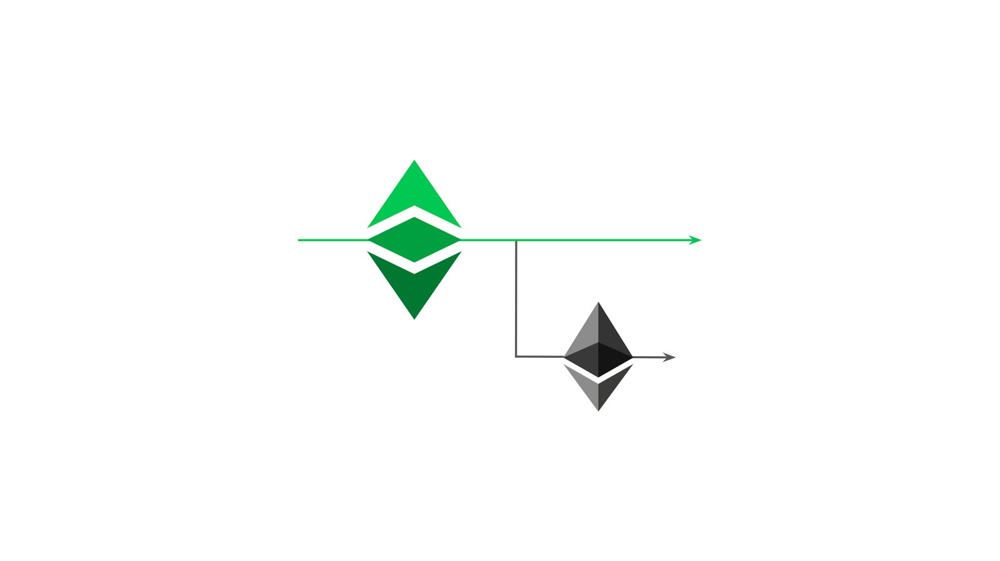

---
**You can listen to or watch this video here:**

<iframe width="560" height="315" src="https://www.youtube.com/embed/HksfzNs48uo" title="YouTube video player" frameborder="0" allow="accelerometer; autoplay; clipboard-write; encrypted-media; gyroscope; picture-in-picture; web-share" allowfullscreen></iframe>

---

## History: How Ethereum Split From Ethereum Classic

As we explained in the previous class, Ethereum (ETH) used the base technology of Bitcoin, a distributed ledger updated through proof of work based Nakamoto Consensus, but added programmability to the network.

It may sound counterintuitive because the industry has been misinformed for a long time, but Ethereum Classic (ETC) is actually the original and real Ethereum network founded by Vitalik Buterin.

The reason for this is that ETH split from ETC on July 20 of 2016. The cause for the split was The DAO hack and subsequent reversal of funds.

What happened is that the community at the time decided to confiscate the money from the hacker to return it to the original owners. The intervention occurred on block 1,920,000.

Approximately 95% of the Ethereum community went with the proposed irregular network change, but 5% continued with the unaltered Ethereum network, becoming known as Ethereum Classic.

By executing the fork and the confiscation, Ethereum broke the original immutability ethos, so this is when Ethereum Classic decided to follow a Code Is Law ethos by continuing with the original untampered chain. 

ETC is the same uninterrupted history of transactions to this day, and will continue forever.

Additionally, consistent with their “Social Consensus” philosophy, Ethereum moved to proof of stake, which is an inferior consensus design, in September of 2022 and has no fixed monetary policy.

Ethereum Classic will stay with proof of work based Nakamoto Consensus, the most secure consensus mechanism known in computer science, and a fixed monetary policy to guarantee the soundness of its cryptocurrency.

Consequently, as we will see in this class, Ethereum Classic is the philosophy of Bitcoin with the technology of Ethereum.

## Illustration of the Ethereum Split From Ethereum Classic 

Ethereum Classic and Ethereum were one blockchain when it was founded in 2015. Then, Ethereum split from Ethereum Classic on July 20th of 2016, on block 1,920,000, as they implemented the reversal of funds through an irregular state change.

Today, ETC is the original chain with an uninterrupted history of transactions, running the proof of work consensus mechanism, with a fixed monetary policy, and a Code Is Law philosophy. ETH has a Social Consensus philosophy, no monetary policy, its history has been changed and may be changed at any time, and runs the proof of stake consensus mechanism.

## Ethereum Classic’s Design

As said above, Ethereum Classic uses the same base technology as Bitcoin but added programmability.

The Ethereum Classic ledger stores accounts and balances as Bitcoin, but adds software programs which become decentralized, also called smart contracts, when they are sent to the network.

To accomplish this it has 6 major components:

1. The Ethereum Virtual Machine (EVM)
2. A programming language
3. State transition
4. The gas system
5. The ETChash mining algorithm
6. A fixed monetary policy

## 1. The Ethereum Virtual Machine (EVM)

The EVM is a software component that behaves like a computing machine. As part of the node software, it is replicated in all machines in the network, therefore it’s a decentralized virtual machine.

The way it works is that it has over 120 computing operation codes, or opcodes for short, that together provide near full computability.

Because node software clients may be installed in many kinds of computers with diverse operating systems, the EVM enables nodes to operate in their local environments with their local machines, and at the same time interact with the global network of blockchain nodes with a single and compatible computing standard.

This assures a unified way of operating the network and executing smart contracts inside the secure environment of Ethereum Classic.

## 2. A Programming Language

For software programs to be sent and stored in the network, and executed by the EVM, there had to be some programming languages that would be compatible and adapted for a blockchain environment.

Solidity was one of the programming languages that were created to write programs for Ethereum, and remains to this day the most popular one for building dapps on Ethereum and Ethereum Classic.

It is syntactically similar to JavaScript, which is widely used by many developers around the world, but it is adapted so it may work on a decentralized peer-to-peer setting.

## 3. State Transition

State transition is a computing model that Ethereum Classic uses so that the EVM may take inputs, execute programs, and produce new state outputs. This is done on a per block basis.

Bitcoin, in contrast, does not have state transition as account balances are calculated by netting out all the history of transactions that point to each account.

State transition in Ethereum Classic mimics the computing model of normal computers and enables all the participating nodes in the network to behave as a single machine, or global computer.

## 4. The Gas System

Basically, the 120 plus opcodes that work with the EVM have a specific cost in a unit called gas to be executed. When users send their transactions, they need to pay for the corresponding gas for miners to execute them.

This payment serves as compensation to miners and imposes a cost per transaction, which reduces spam significantly.

The gas system also imposes a limit of computation cycles that the ETC miners must use to resolve specific executions. If this limit is reached without results, then miners must stop and return the money to users. This solves what is called the halting problem, which is when machines get stuck when trying to resolve a computation.

## 5. The ETChash Mining Algorithm

One of the unique features of Ethereum Classic is the ETChash mining algorithm.

As Ethereum was using the ETHash algorithm, Ethereum Classic had to differentiate its mining format to defend itself from 51% attacks that came from the Ethereum computing base. This led to the creation of ETChash.

ETChash is a modification of ETHash where one component, the DAG, which is a large file that must be used during the mining process, was reduced in size and its size growth was slowed to permit smaller GPU miners; with GPU card capacities that had lower memories, such as 3GB, 4GB, and 6GB; mine and stay mining in Ethereum Classic for a longer period of time.

## 6. A Fixed Monetary Policy

The monetary policy of ETC is similar to that of Bitcoin: 

- The cryptocurrency is issued only to pay for miners work, making it sound money.
- It has a supply cap of 210,700,000 coins. 
- It has a decreasing schedule of miner rewards where they are discounted by 20% every 28 months. 
- It is part of the protocol, therefore the monetary policy is fixed.
- The cryptocurrency unit is highly divisible by 10^18.

## Next Classes: Ethereum Classic Features in More Detail

In this class we have explained that Ethereum Classic is the original chain and gave an overview of some of its components. 

In the next three classes we will see in more detail the following features: 

- ETC’s Philosophy of Code Is Law
- ETC’s Monetary Policy
- The Units and Denominations of the ETC Cryptocurrency

---

**Thank you for reading this article!**

To learn more about ETC please go to: https://ethereumclassic.org
