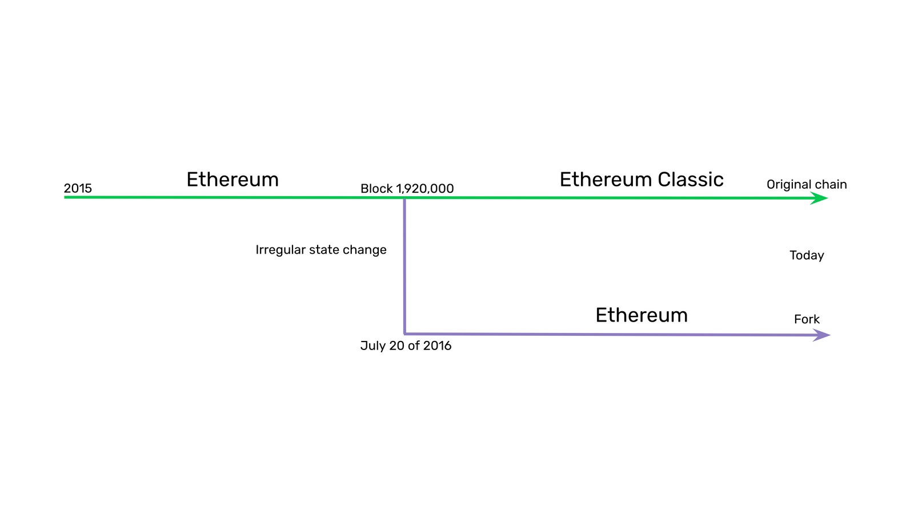

---
**你可以由此收听或观看本期视频:**

<iframe width="560" height="315" src="https://www.youtube.com/embed/HksfzNs48uo" title="YouTube video player" frameborder="0" allow="accelerometer; autoplay; clipboard-write; encrypted-media; gyroscope; picture-in-picture; web-share" allowfullscreen></iframe>

---

## 历史: 以太坊是如何从以太坊经典中分开来的

正如我们在上一节课中解释的那样，以太坊(ETH)使用了比特币的基础技术，这是一种通过基于工作量证明的中本聪共识进行更新的分布式账本，但为网络增加了可编程性。

这可能听起来有悖常理，因为业界已经被误导了很长一段时间，但以太坊经典(ETC)实际上是由Vitalik Buterin创建的最初和真实的以太坊网络。

原因是ETH在2016年7月20日与ETC分离。分裂的原因是DAO黑客和随后的资金逆转。

事情发生时，社区决定没收黑客的钱，并将其归还给原始所有者。干预发生在1,920,000区块。

大约95%的社区选择了以太坊，5%的社区选择了以太坊经典。

通过执行分叉和没收，以太坊打破了最初的不可篡改原则，因此以太坊经典决定遵循代码即法律的原则，继续使用原始的不可篡改链。

ETC至今仍是相同的、不间断的交易历史，并将永远持续下去。

此外，与他们的“社会共识”理念一致，以太坊在2022年9月转向了股权证明，这是一种劣质的共识设计，并且没有固定的货币政策。

以太坊经典将继续使用基于工作量证明的中本共识，这是计算机科学中已知的最安全的共识机制，并使用固定的货币政策来保证其加密货币的可靠性。

因此，正如我们将在本课程中看到的，以太坊经典是基于以太坊技术的比特币哲学。

## 以太坊从以太坊经典分离的图示

以太坊经典和以太坊在2015年成立时是一个区块链。然后，以太坊于2016年7月20日在1,920,000区块从以太坊经典中分离出来，因为他们通过不规则的状态变化实现了资金的逆转。

今天，ETC是原始链具有不间断的交易历史，运行的工作证明共识机制，具有固定的货币政策，并有代码即法律的哲学。ETH具有社会共识理念，没有货币政策，其历史已被更改且可能随时更改，运行股权证明共识机制。

## 以太坊经典的设计

如上所述，以太坊经典使用与比特币相同的基础技术，但增加了可编程性。

以太坊经典账本以比特币的形式存储账户和余额，但添加了去中心化的软件程序。当它们被发送到网络时也称为智能合约。

为了实现这一点，它有6个主要组成条件:

1. 以太坊虚拟机 (EVM)
2. 一种编程语言
3. 状态转换
4. Gas（矿工费）系统
5. ETChash哈希挖矿算法
6. 固定货币政策

## 1.以太坊虚拟机 (EVM)

EVM是一个行为类似于计算机的软件组件。作为节点软件的一部分。它被复制到网络中的所有机器中，因此它是一个去中心化的虚拟机。

它的工作方式是:它有超过120个计算操作代码，或简称opcodes，这些代码一起提供了几乎完全的可计算性。

由于节点软件客户端可以安装在具有不同操作系统的多种计算机上，因此EVM使节点能够以其本地计算机在其本地环境中运行，同时以单一且兼容的计算标准与区块链节点的全局网络进行交互。

这保证了在以太坊经典的安全环境中，以统一的方式操作网络和执行智能合约。

## 2.一种编程语言

为了在网络中发送和存储软件程序，并由EVM执行，必须有一些与区块链环境兼容和适应的编程语言。

Solidity是为以太坊编写程序而创建的编程语言之一，直到今天仍然是在以太坊和以太坊经典上构建dapp的最流行的编程语言。

它的语法类似于JavaScript，被世界各地的许多开发人员广泛使用。但它经过了调整，可以在去中心化的点对点环境下工作。

## 3.状态转换

状态转换是以太坊经典使用的计算模型，以便EVM可以接受输入，执行程序并产生新的状态输出。这是以区块为单位进行的。

相比之下，比特币没有状态转换，因为账户余额是通过计算指向每个账户的所有交易历史来计算的。

以太坊经典中的状态转换模拟了普通计算机的计算模型，并使网络中所有参与的节点表现为单个机器或全局计算机。

## 4.Gas（矿工费）系统

基本上，与EVM一起工作的120多个操作码在被执行的gas单元中具有特定的成本。当用户发送交易时，他们需要为矿工执行交易支付相应的挖矿费用。

这种支付作为对矿工的补偿，并对每笔交易施加成本，大大减少了垃圾邮件。

Gas系统还对ETC矿工必须使用的计算周期进行限制，以解决特定的执行。如果达到这个限制而没有结果，那么矿工必须停止并将钱退还给用户。这解决了所谓的停机问题，即机器在尝试解决计算问题时卡住。

## 5.ETChash哈希挖矿算法

以太坊经典的独特功能之一是ETChash哈希挖矿算法。

由于以太坊在使用ETHash算法，以太坊经典必须区分其挖矿格式，以抵御来自以太坊计算基地的51%攻击。这导致了ETChash的产生。

ETChash是ETHash的一种修改，其中一个组件DAG(在挖矿过程中必须使用的大文件)的大小被缩小，其大小的增长速度被放慢，以允许较小的GPU矿工工作;具有较低内存的GPU卡容量，如3GB、4GB和6GB;使以太坊经典挖矿时间更长。

## 6.固定的货币政策

ETC的货币政策与比特币很相似：

-加密货币仅用于支付矿工的工作费用，使其成为可靠的货币。
-它有210,700,000个金币的供给上限。
-它有一个递减的矿工奖励计划，每28个月打20%的折扣。
-这是协议的一部分，因此货币政策是固定的。
-加密货币单位可以被10^18高度整除。

## 下一节课: 更加详细的以太坊经典特征

在这节课中，我们解释了Ethereum Classic是原始链，并概述了它的一些组件。

在接下来的三个类中，我们将更详细地看到以下特性:

- ETC的“代码即法律”哲学
- ETC的货币政策
- ETC加密货币的单位和面额

---

**感谢您阅读本期文章!**

了解更多有关ETC: https://ethereumclassic.org
