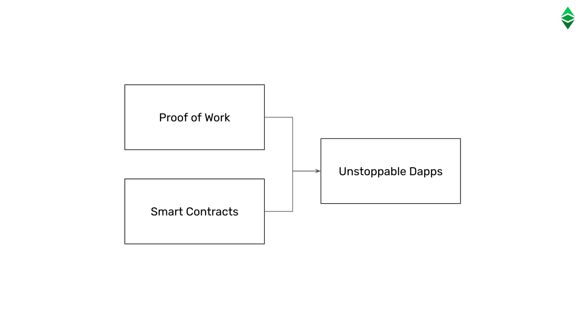

---
**You can listen to or watch this video here:**

[video]

---

As we explained in our previous class, Ethereum Classic (ETC) decided to follow a Code Is Law ethos by continuing with the original untampered chain when Ethereum (ETH) split from the mainnet due to The DAO hack.

ETH decided to tamper with the history of transactions to reverse the chain, but ETC is the same uninterrupted history of transactions to this day, and will continue forever.

In this class we will explain the meaning of the principle of Code Is Law, how it works, how it is applied in real life, and we show the foundational documents of ETC where this philosophy was originally laid out.

## The Meaning of Code Is Law

To understand Code Is Law it is important to remember that the first and overarching goal of blockchains is to reduce the dependency on trusted third parties with regards to the soundness of the currency, payments and savings with the currency, and for conducting economic transactions between individuals.

This level of safety was achieved inside the highly secure environment of blockchains such as Bitcoin and Ethereum Classic.

In this context, Code Is Law means that, once applications and transactions are entered into this secure blockchain environment, they become immutable and final.

Immutable and final means that they can never be changed again.

These guarantees enable human action on a global scale without any restrictions or barriers and assure a level of fairness and basic rights never achieved before.

The key to maintaining this secure environment is to keep it as neutral as possible, and the only way to maximize neutrality is to make it as rigid and strict as the laws of physics. Hence, the term Code Is Law. It is an analogy to physics.

This last concept is important, because Code Is Law does not mean “the law of the jungle”. Humans will always have disputes and problems to solve, but Code Is Law relegates these issues to be resolved outside of the secure internal environment of the blockchain.

So, Code Is Law means safety, immutability, and finality of the blockchain. Any conflicts or disagreements must be resolved between the parties through the traditional legal systems.

## How It Works

Code Is Law is a real feature of Ethereum Classic and not an inspirational statement. This is because decentralized applications, or dapps, and transactions in ETC are protected physically by the design of the network.

The three pillars of the design that provide this protection are smart contracts, a fixed supply, and proof of work.

Smart contracts are decentralized software agents that replace trusted third parties in the real world but inside the blockchain; fixed supply puts a long term algorithmic cap in the stock of ETC that will ever exist, so, as Bitcoin, it can guarantee the long term value of its currency; proof of work is the mechanism that secures the system by imposing a prohibitively large cost in computational work and energy to tamper with it.

These three pillars combined guarantee that the network is truly decentralized and immutable, and these characteristics make possible and true the principle of Code Is Law.

Code Is Law; the fact that all decentralized applications in the system will run as designed with no possibility of tampering, and that transactions will be posted and never reversed; guarantees the benefits of long term survivability, censorship resistance, and unstoppability of Ethereum Classic, and makes it uncompromisable and uncapturable.

## How Code Is Law Is Applied in Real Life

There are only two inventions in the blockchain industry: 

The proof of work based consensus mechanism, also known as Nakamoto Consensus, which provides the security of the system, and is the most secure method known to man able to achieve true decentralization in a peer-to-peer computing network.
Smart contracts, which provide programmability to blockchains, thus enabling the creation of autonomous agents that may replace trusted third parties, significantly reducing their costs and agency risks.

Ethereum Classic is the largest blockchain in the world that has these two inventions integrated in the same system. Therefore, decentralized applications are truly unstoppable in ETC. This is its real life value proposition.

## The Ethereum Classic Foundational Documents

The Code Is Law principle of Ethereum Classic was declared and stated since Ethereum split from it in 2016. This was expressed in various documents at the time and one other writing after.

To learn more about ETC’s principles it is worth reading them, so we list them here:

**“Declaration of Independence“ - 2016**

“Let it be known to the entire world that on July 20th, 2016, at block 1,920,000, we as a community of sovereign individuals stood united by a common vision to continue the original Ethereum blockchain that is truly free from censorship, fraud or third party interference. In realizing, that the blockchain represents absolute truth, we stand by it, supporting its immutability and its future. We do not make this declaration lightly, or without forethought to the consequences of our actions.”

Link: https://ethereumclassic.org/ETC_Declaration_of_Independence.pdf

**“A Crypto-Decentralist Manifesto“ - 2016**

“It’s important for anyone participating in blockchain-enabled cooperation to be on an equal footing with everyone else. It doesn’t matter if you wield huge economic power or only a tiny amount. It doesn’t matter whether you’re a saintly Mother Theresa or a vicious drug dealer. It doesn’t matter whether you’re a human or a refrigerator. It doesn’t matter what you believe in, what political theory you subscribe to, or whether you’re a moral or immoral person. A participant’s ethnicity, age, sex, profession, social standing, friends or affiliations, make or model, goals, purposes or intentions — none of this matters to the blockchain even a bit.”

Link: https://ethereumclassic.org/blog/2016-07-11-crypto-decentralist-manifesto

**“Code Is Law and the Quest for Justice“ - 2016**

“It’s this whole snake’s nest that could be avoided by refusing to be dragged into conflict resolution and quest for justice as related to smart contract execution. And it only requires sticking to principles of blockchain neutrality and immutability.

So, code is law on the blockchain. All executions are final, all transactions are immutable. For everything else, there is a time-tested way to adjudicate legal disputes and carry out the administration of justice. It’s called legal system.”

Link: https://ethereumclassic.org/blog/2016-09-09-code-is-law

**“Let’s Keep Ethereum Classic Classic“ - 2021**

“Our response to this is that particularly in the case of ETC, pragmatism is downstream of principles. Since day 0 (block 1,920,000), ETC has sold itself on these principles and has attracted its sizable following primarily because of these principles. Many of the developers and contributors working on ETC are only here because of those goals, and have contributed based on this understanding.”

Link: https://www.ethereumclassicclassic.org/

---

**Thank you for reading this article!**

To learn more about ETC please go to: https://ethereumclassic.org
