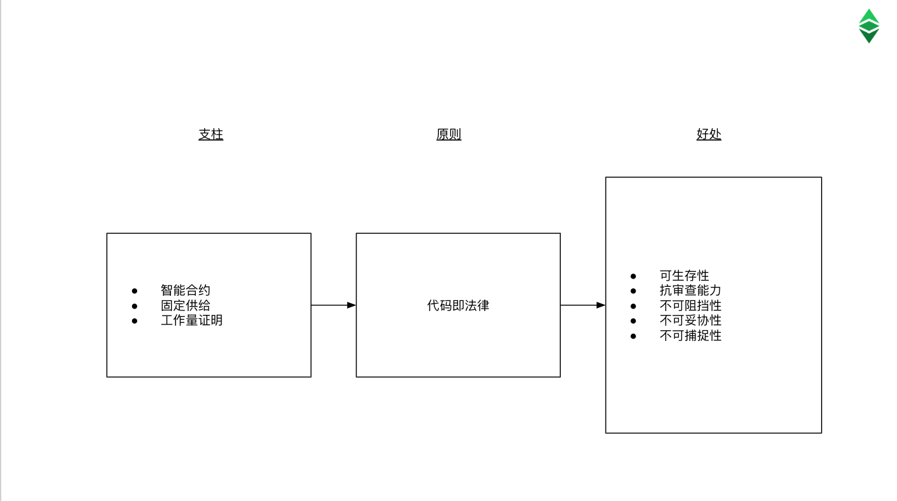
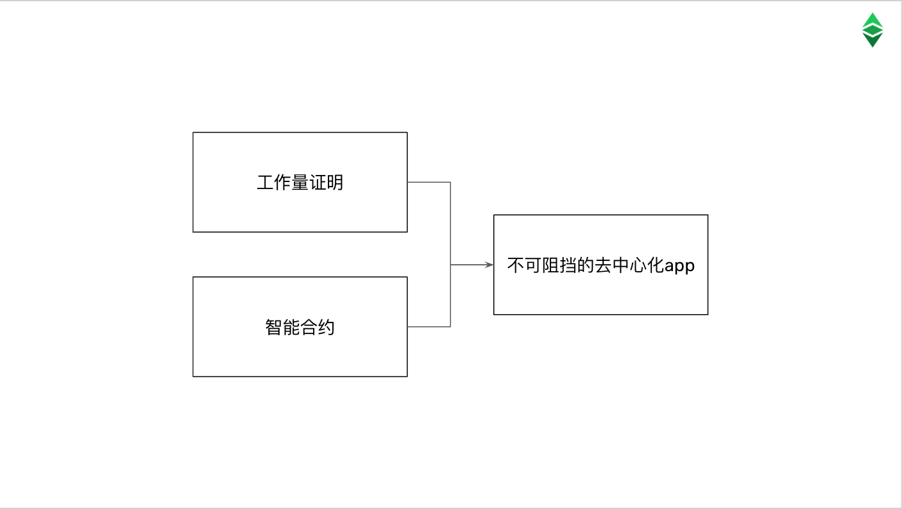

---
**欢迎由此观看或收听本期内容:**

<iframe width="560" height="315" src="https://www.youtube.com/embed/2-gE-DqcJdk" title="YouTube video player" frameborder="0" allow="accelerometer; autoplay; clipboard-write; encrypted-media; gyroscope; picture-in-picture; web-share" allowfullscreen></iframe>

---

正如我们在上一节课中解释的那样，以太坊经典(ETC)决定遵循“代码即法律”的精神，当以太坊(ETH)因DAO黑客而从主网分裂时，继续使用原始的未篡改链。

ETH决定篡改交易历史以逆转链，但ETC至今仍是相同的不间断交易历史，并将永远持续下去。

在本课程中，我们将解释“代码即法律”原则的含义、如何工作、如何在现实生活中应用，并展示ETC的基础文件，以及这一哲学最初是在哪里提出的。

## 代码即法律的意义

要理解代码就是法律，重要的是要记住区块链的首要目标是减少对可信第三方的依赖，包括货币的稳健性、货币的支付和储蓄，以及个人之间的经济交易。

这种级别的安全是在比特币和以太坊经典等高度安全的区块链环境中实现的。

在这种情况下，代码即法律意味着，一旦应用程序和事务进入这个安全的区块链环境，它们就变为最终版本，不可更改。

不可变和最终的意思是它们永远不会再被改变。

这些保障使全球范围内的人类行动不受任何限制或障碍，并确保达到前所未有的公平和基本权利水平。

维护这个安全环境的关键是尽可能地保持中立，而最大限度地保持中立的唯一方法就是让它像物理定律一样严格。因此，“代码即法律”一词应运而生。这是物理学的一个类比。

最后一个概念很重要，因为代码即法律并不意味着“弱肉强食”。人类总是会有争议和问题要解决，但代码就是法律将这些问题降级到区块链安全的内部环境之外。

所以，“代码即法律”意味着区块链的安全性、不可变性和终局性。当事人之间的任何冲突或分歧都必须通过传统的法律制度来解决。

## 如何运作

代码即法律是以太坊经典的一个真实特征，而不是一个鼓舞人心的声明。这是因为去中心化应用程序(dapp)和ETC中的交易受到网络设计的物理保护。

提供这种保护设计的三大支柱是智能合约、固定供应和工作量证明。

智能合约是去中心化的软件代理，取代现实世界中受信任的第三方，但在区块链;固定供应为ETC的库存设置了一个长期的算法上限，因此，作为比特币，它可以保证其货币的长期价值;工作量证明是一种机制，它通过在计算工作和能量上施加令人望而却步的巨大成本来保护系统。

这三个支柱结合起来保证了网络是真正去中心化和不可变的，这些特征使得“代码即法律”的原则成为可能和现实。

代码就是法律;事实上，系统中所有去中心化的应用程序都将按照设计运行，不可能被篡改，并且交易将被发布，永远不会被撤销;保证了以太坊经典的长期生存性、抗审查性和不可阻挡性的好处，并使其不可妥协和不可捕获。

## 代码即法律是如何运用到现实生活的

区块链行业只有两项发明:

基于工作量证明的共识机制，也称为中本共识，它提供了系统的安全性，是目前已知的能够在点对点计算网络中实现真正去中心化的最安全的方法。
智能合约为区块链提供可编程性，从而能够创建自治代理，可以取代受信任的第三方，显著降低其成本和代理风险。

以太坊经典是世界上最大的区块链，将这两项发明集成在同一个系统中。因此，去中心化应用在ETC中是真正不可阻挡的。这是它在现实生活中的价值主张。

## 以太坊经典基础文档

自2016年以太坊从以太坊分离以来，以太坊经典的代码即法律原则被陈述和宣布。这在当时的各种文件和后来的一篇文章中都有所体现。

要了解更多ETC的原则，值得一读，所以我们将它们列在这里:

**“宣布独立“ - 2016**

“让全世界都知道，在2016年7月20日，在1,920,000区块，我们作为一个主权个人社区团结在一个共同的愿景下，继续原始的以太坊区块链，真正不受审查、欺诈或第三方干预。意识到区块链代表绝对真理，我们支持它，支持它的不变性和未来。我们作出这一宣言并非轻率，也并非没有考虑到我们行动的后果.”

链接: https://ethereumclassic.org/ETC_Declaration_of_Independence.pdf

**“一份加密去中心化宣言“ - 2016**

“对于参与区块链合作的任何人来说，与其他人处于平等地位是很重要的。不管你是拥有巨大的经济实力，还是只拥有很小的经济实力。不管你是圣洁的特蕾莎修女还是邪恶的毒贩。不管你是人还是冰箱。你相信什么，你赞同什么政治理论，或者你是一个有道德的人还是一个不道德的人，都不重要。参与者的种族、年龄、性别、职业、社会地位、朋友或从属关系、品牌或模式、目标、目的或意图——这些对区块链来说一点都不重要。”

链接: https://ethereumclassic.org/blog/2016-07-11-crypto-decentralist-manifesto

**“代码即法律，追求正义“ - 2016**

“这是整个蛇窝，可以通过拒绝被拖入冲突解决和寻求与智能合约执行相关的正义来避免。它只需要坚持中立和不可变的原则。

所以，代码就是区块链上的法律。所有执行都是最终的，所有事务都是不可变的。对于其他任何事情，都有一种经过时间考验的方式来裁决法律纠纷和执行司法。这就是所谓的法律体系。”

链接: https://ethereumclassic.org/blog/2016-09-09-code-is-law

**“让我们保持以太坊经典的经典“ - 2021**

“我们对此的回应是，特别是在ETC的情况下，实用主义是原则的下游。从第0天(1,920,000区块)开始，ETC就以这些原则推销自己，并主要因为这些原则吸引了大量的追随者。许多致力于ETC的开发人员和贡献者只是因为这些目标才来到这里，并基于这种理解做出了贡献。”

链接: https://www.ethereumclassicclassic.org/

---

**感谢您阅读本期文章!**

了解更多有关ETC相关内容： https://ethereumclassic.org
