---
**You can listen to or watch this video here:**

<iframe width="560" height="315" src="https://www.youtube.com/embed/8rI_ADTDcGw" title="YouTube video player" frameborder="0" allow="accelerometer; autoplay; clipboard-write; encrypted-media; gyroscope; picture-in-picture; web-share" allowfullscreen></iframe>

---

In this tutorial we explain:

1. How to create your first wallet on Trust Wallet.
2. How to activate ETC.
3. How to receive ETC for the first time.
4. How to send ETC.
5. How to check your balance and transaction history.
6. How to back up your wallet (again).
7. How to create more wallets inside your Trust Wallet app.

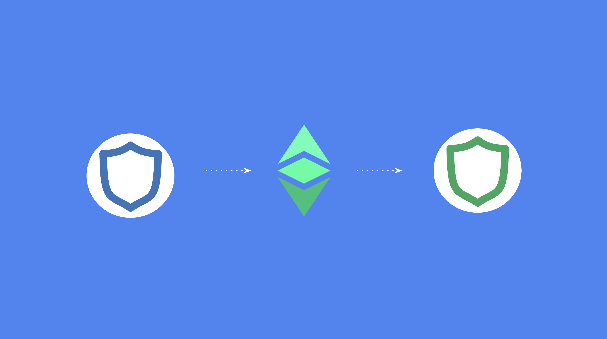

## Create Your First Wallet on Trust Wallet

Trust Wallet supports multiple wallets in the app with multiple crypto assets inside each wallet. To create your first wallet with Trust Wallet follow these instructions:

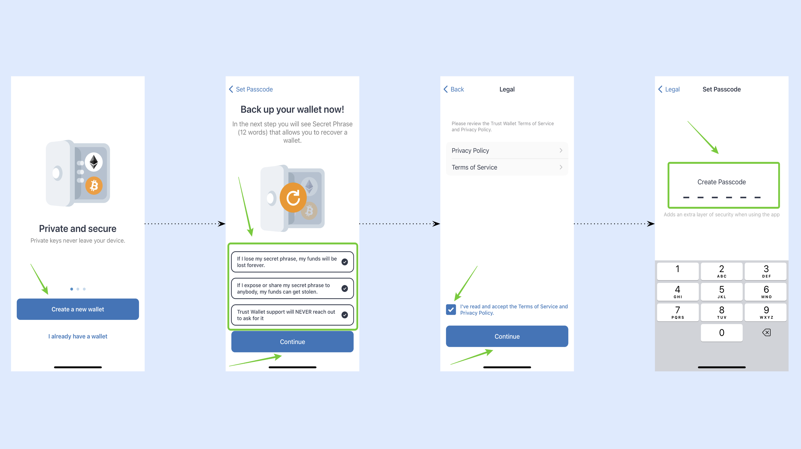

1. Download Trust Wallet, open it, and tap “Create a new wallet”.
2. Then, read and check all the disclaimer boxes and press “Continue”.
3. In the next screen, read the privacy policy and terms of service and check the box if you accept them.
4. In the next step, for security reasons, set up a six digit passcode for your Trust Wallet app.

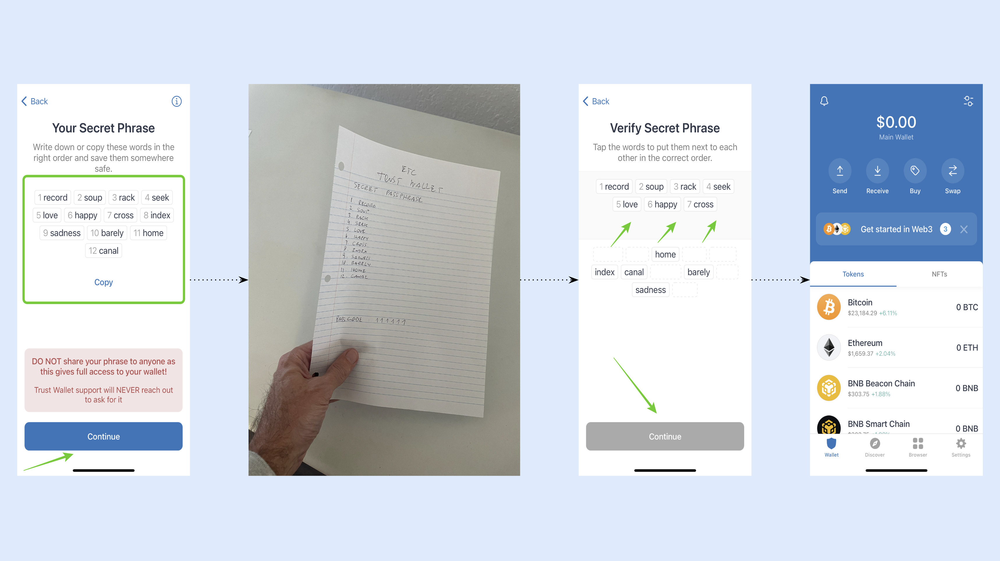

5. In the next step, you will see a twelve word secret phrase which you must write down on paper and keep in a safe place.
6. Write the twelve words down and keep them in a safe place as this is the only way to recover your wallet in case you lose it. Then, press “Continue”.
7. In the next step, you need to re-enter the same twelve words in their correct order to prove you have written them down. Then, press “Continue”.
8. In the next screen, you will see that your first wallet was created on Trust wallet.

## How to Activate Ethereum Classic in a Trust Wallet

Trust Wallet shows you Bitcoin, Ethereum, BNB Beacon Chain, and BNB Smart Chain as their default crypto assets. To add Ethereum Classic, follow these steps:

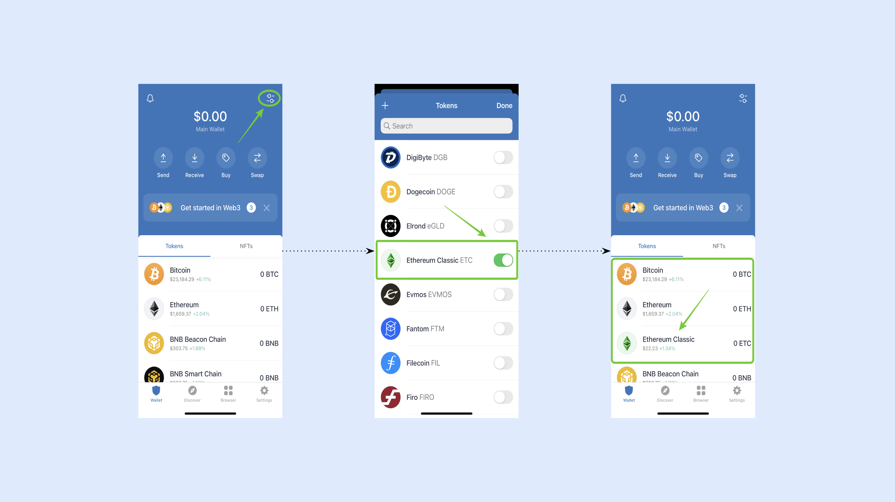

1. Click on the toggle icon on the top right of the app.
2. In the next screen, you will see a list of crypto assets. Scroll down to find ETC. Then, tap on the key to its right to toggle it on.
3. When you go back to the home screen you will find ETC activated in the list of crypto assets.

## How to Receive ETC

Once you have ETC activated in your Trust Wallet you can start using it. To receive ETC for the first time into your Trust Wallet ETC address, follow these instructions:

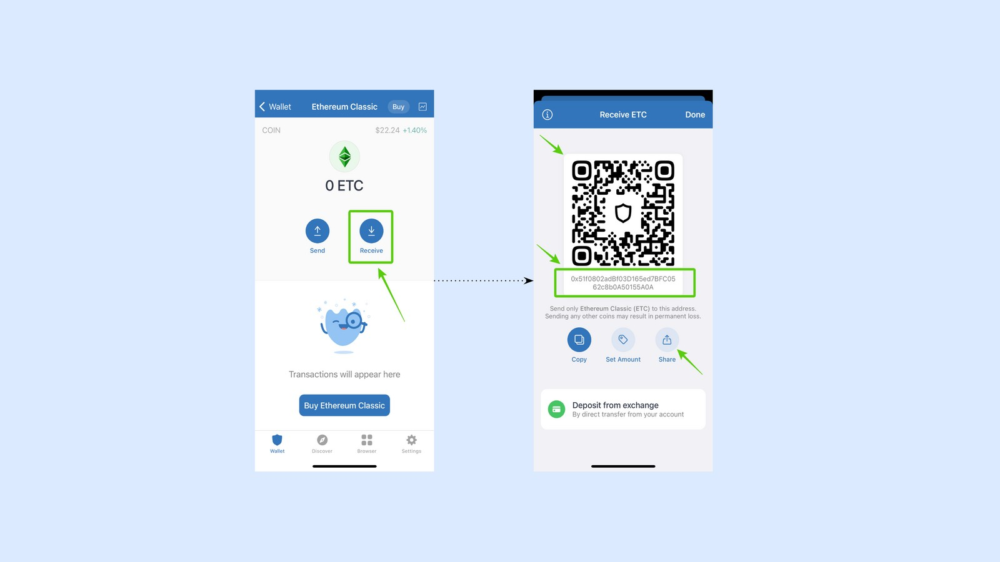

1. Tap on the ETC asset on the home.
2. In the next screen, you will see the “Send” and “Receive” buttons below the ETC icon. Tap on “Receive”
3. In the next screen, you will see a QR code that you may show others to send you ETC, you may copy the actual address to send it to others, or you may use the “share” button to share your address by text or other means.

## How to Send ETC

To send ETC, follow these instructions:

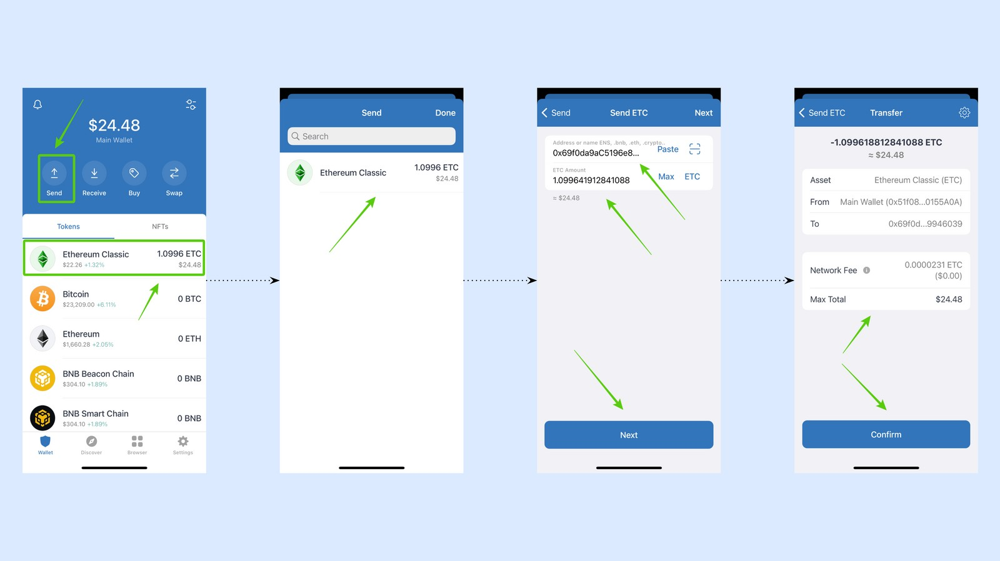

1. Tap the “Send” button on the home screen.
2. Select ETC as the crypto asset you wish to send.
3. In the next screen, enter the address you are sending ETC to and the amount (for this example we chose “Max”). Then, press “Next”.
4. In the last step, go over the transaction to check if it’s correct. If it’s correct, then press “Confirm”.

## Checking Your Balance and Transaction History

To just check you balance on Trust Wallet, you may see that on the home screen. If you wish to check your balance and transaction history for ETC, then tap on the ETC asset on the Home screen.

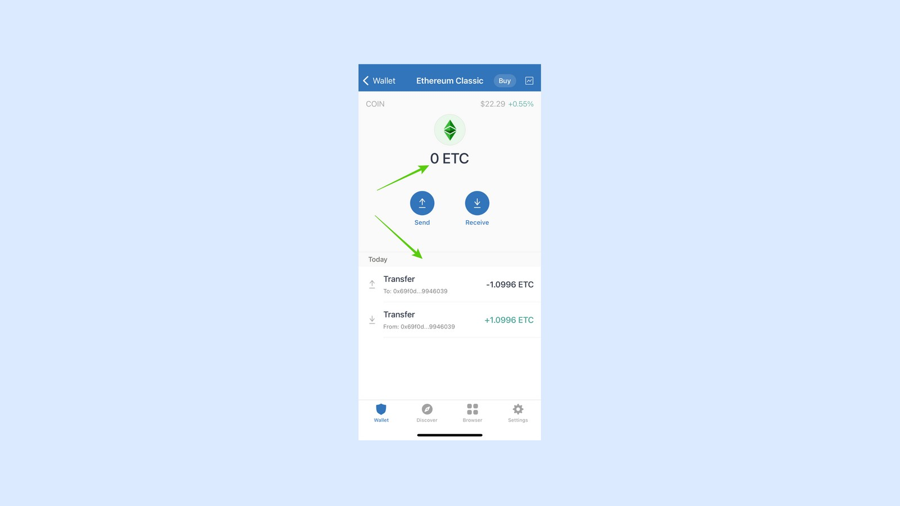

On the next screen you will see the balance at the top and the list of transactions bellow. You may scroll down through the transaction history to see all transactions for that address.

## Back Up Your Wallet (Again)

If for any reason you need to back up your Trust Wallet again, then follow these instructions:

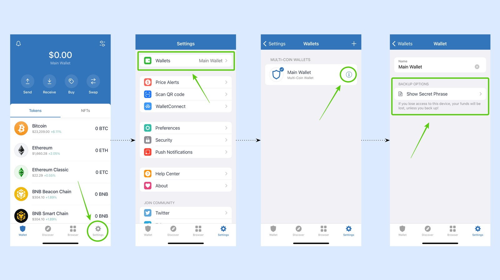

1. On the home screen, tap on the “Settings” button on the bottom right of the screen.
2. In the next step, select “Wallets” at the top of the menu.
3. In the next screen, you will see your wallet name with an information icon “i” to its right. Tap on the “i” icon.
4. In the next step, you will see there is an option to “Show Secret Phrase”. Tap on it.

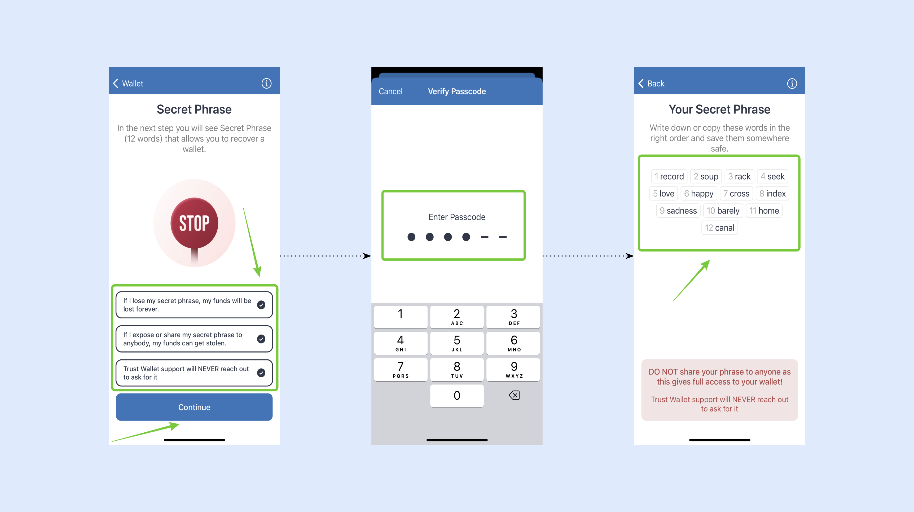

5. In the next screen, read and check all the disclaimer boxes and press “Continue”.
6. In the next step, for security reasons, you will need to enter your passcode so Trust Wallet may reveal your twelve word secret phrase.
7. After entering your passcode, you will see the twelve words so you can back them up again.

## How to Create More Wallets With ETC

As stated before, Trust Wallet supports multiple wallets with multiple crypto assets in them. To create more wallets with ETC in them, follow these instructions:

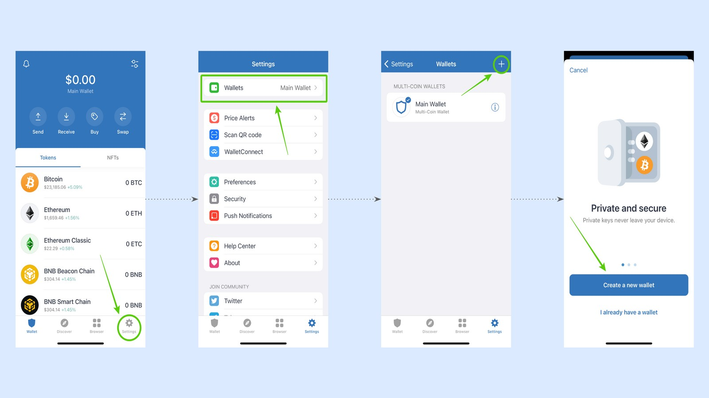

1. On the home screen, tap on the “Setting” icon on the bottom right.
2. In the next step, tap on the “Wallet” option in the menu.
3. In the next screen, tap on the “+” symbol on the top right corner of the screen.
4. In the next step, tap on “Create a new wallet”.

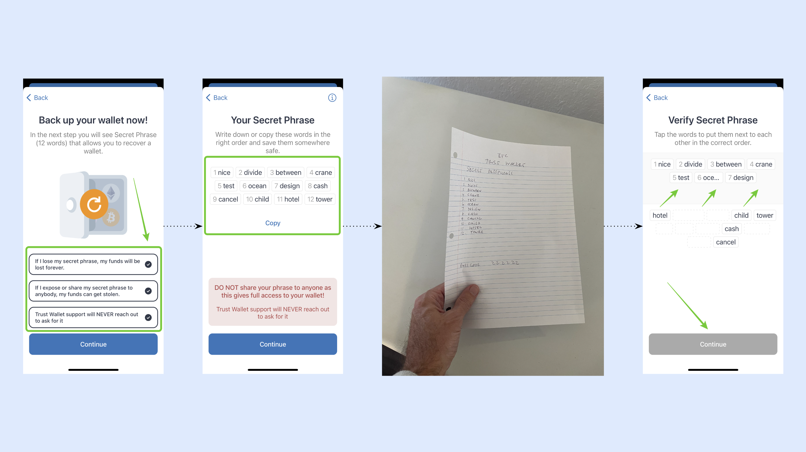

5. Then, read and check all the disclaimer boxes and press “Continue”.
6. In the next screen, you will see a new set of twelve words which will be the new secret passphrase for this new wallet.
7. Back up your new secret passphrase for your new wallet by writing it on paper and putting it in a safe place.
8. In the next step, re-enter the twelve words back into Trust Wallet as requested to confirm that you backed them up.

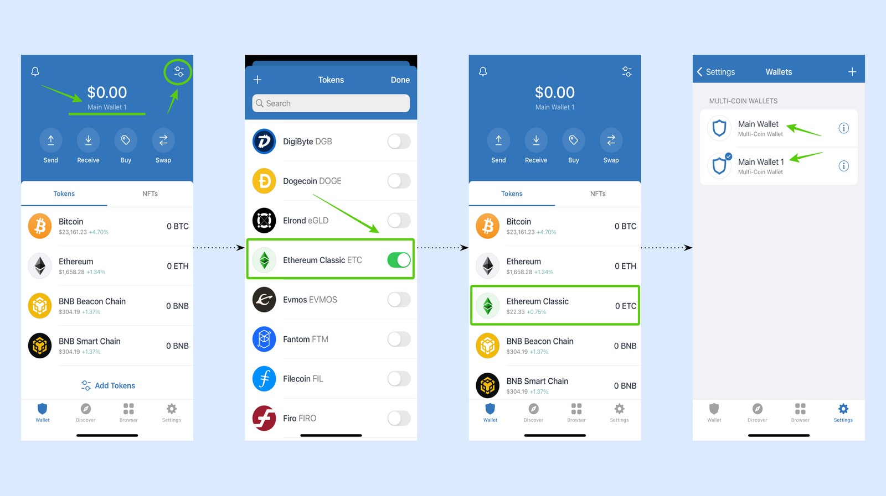

9. Then, Trust Wallet will take you automatically to the home screen of your new wallet. You will notice that your wallet has a different name than the original one.
10. To activate ETC in this new wallet, click on the toggle icon on the top right of the app.
11. In the next screen, you will see a list of crypto assets. Scroll down to find ETC. Then, tap on the key to its right to toggle it on.
12. When you go back to the home screen you will find ETC activated in the list of crypto assets. When you go back to settings, you will see that you have two wallets and that you can navigate between them.

---

**Thank you for reading this Ethereum Classic tutorial!**

To start using Trust Wallet with ETC go to: https://trustwallet.com

To learn more about ETC go to: https://ethereumclassic.org
