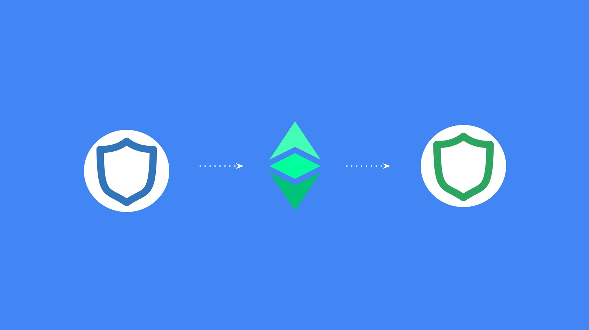
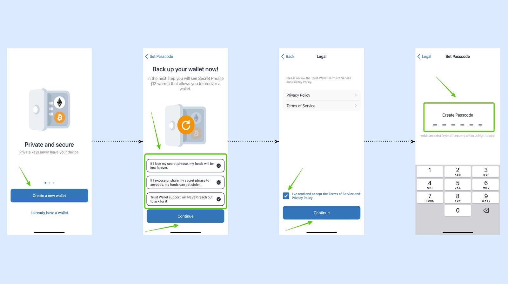
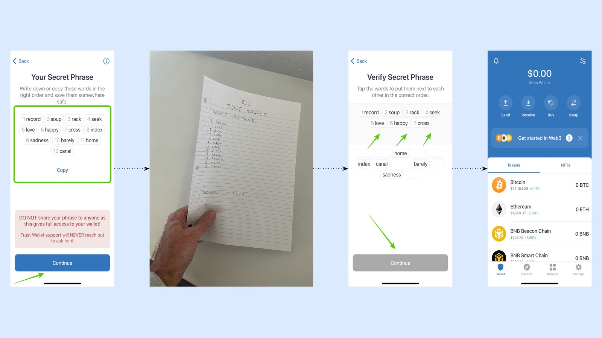
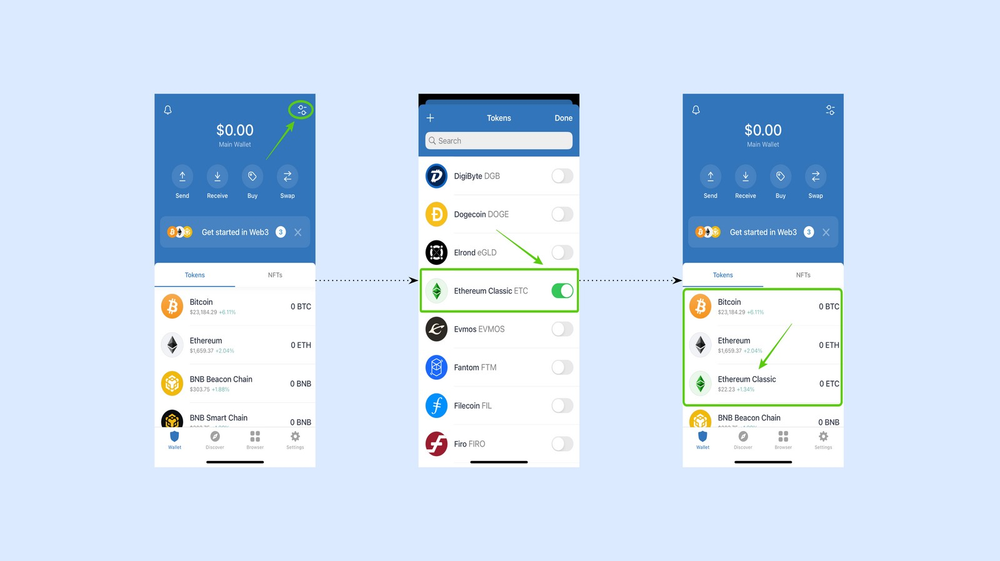
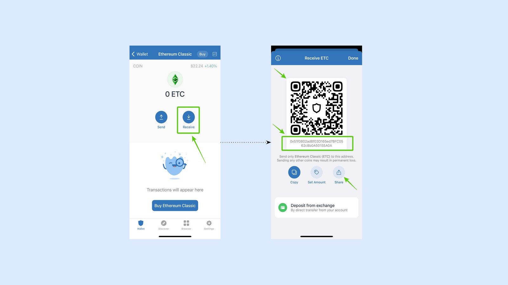
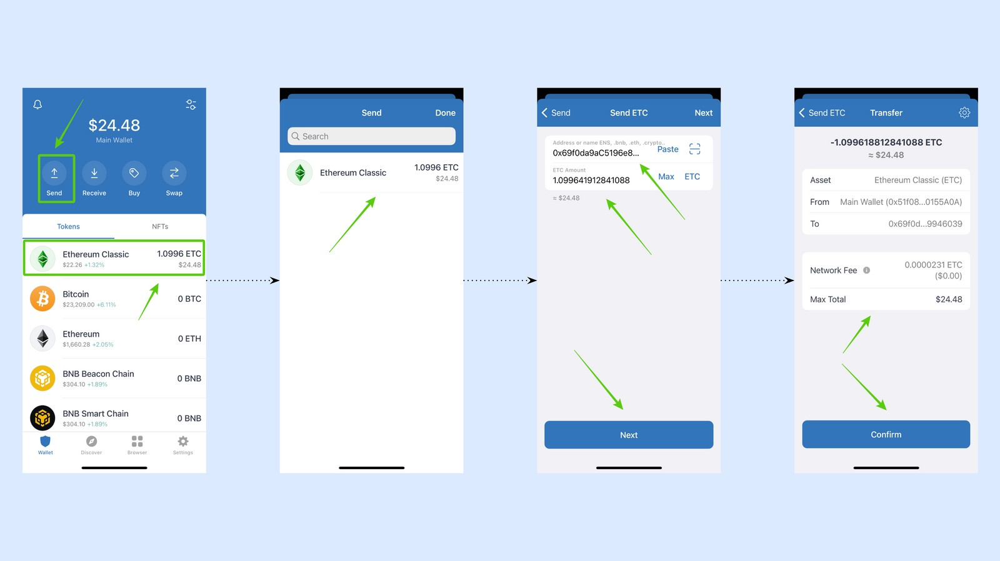
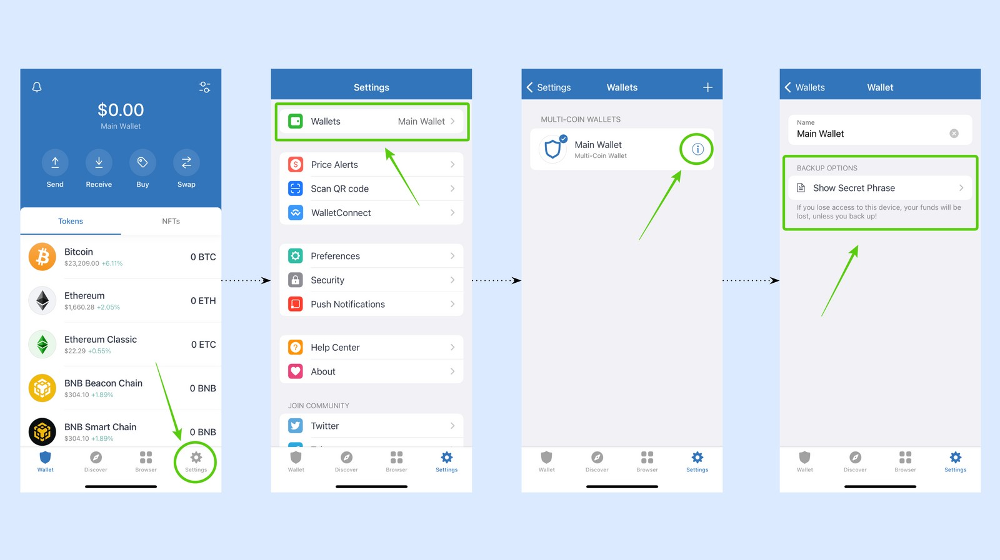
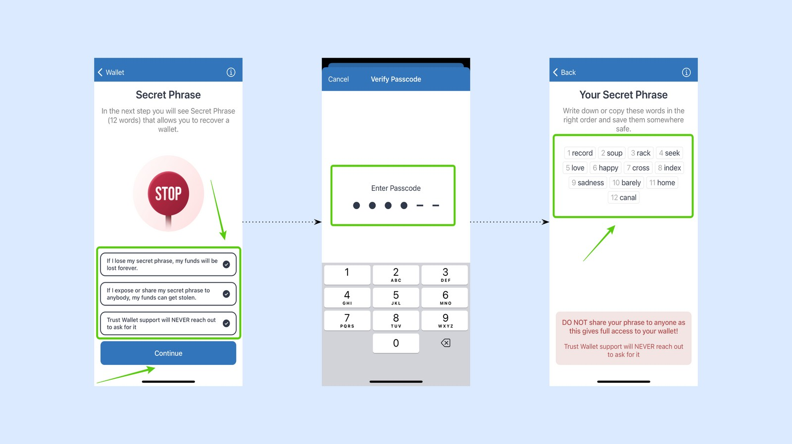
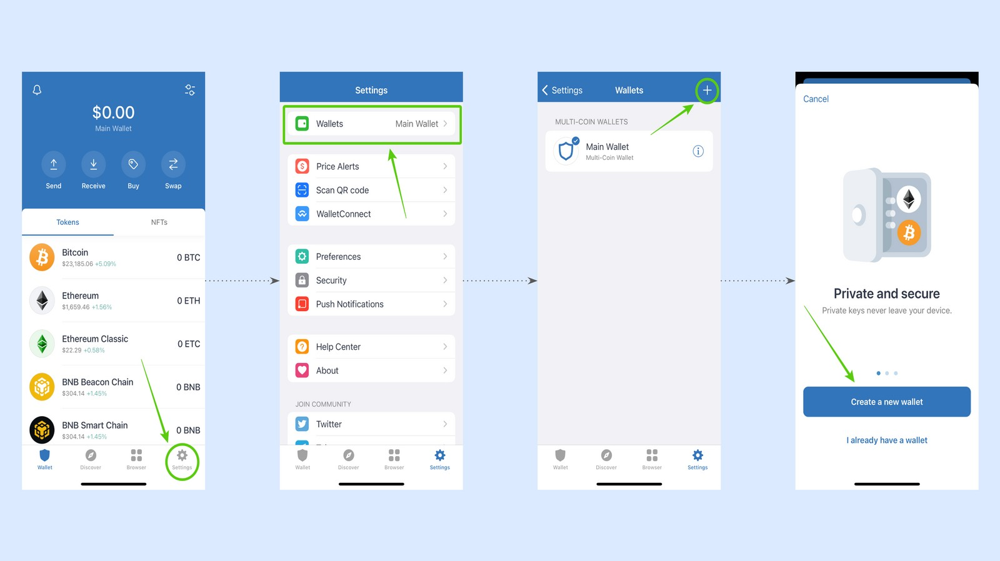
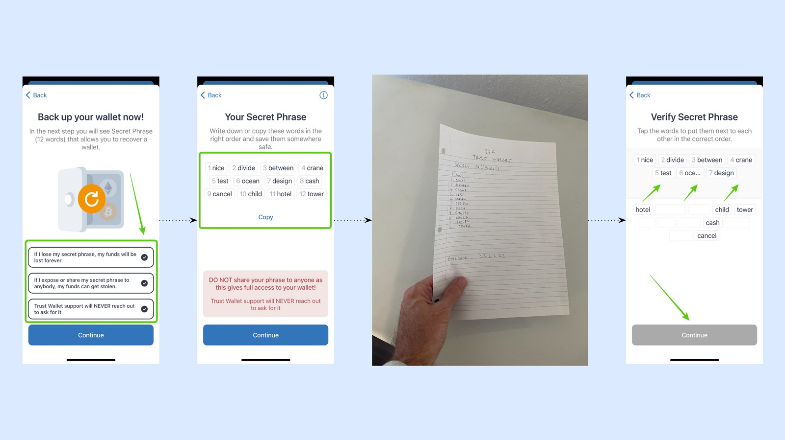

---
**您可以由此观看或收听本期视频:**

<iframe width="560" height="315" src="https://www.youtube.com/embed/8rI_ADTDcGw" title="YouTube video player" frameborder="0" allow="accelerometer; autoplay; clipboard-write; encrypted-media; gyroscope; picture-in-picture; web-share" allowfullscreen></iframe>

---

在本教程中，我们将解释:

1. 如何创建你的第一个信任钱包。
2. 如何激活ETC。
3. 如何第一次收到ETC。
4. 如何发送ETC。
5. 如何查看您的余额和交易记录。
6. 如何（再次）备份您的钱包。
7. 如何在您的信任钱包应用程序中创建更多的钱包。

## 在信任钱包上创建第一个钱包

信任钱包支持应用程序中的多个钱包，每个钱包中都有多个加密资产。要使用信任钱包创建第一个钱包，请遵循以下说明:

1. 下载信任钱包，打开它，点击“创建一个新钱包”。
2. 然后，阅读并勾选所有免责声明框，然后按“继续”。
3. 在下一个屏幕中，阅读隐私政策和服务条款，并勾选是否接受它们。
4. 下一步，出于安全考虑，为你的信任钱包应用程序设置一个六位数字的密码。

5. 在下一步中，你将看到一个12个单词的密码短语，您需要把它写在纸上并放在安全的地方。
6. 把这12个字写下来，放在安全的地方，因为这是您丢失钱包时找回钱包的唯一方法。然后，按“继续”键。
7. 下一步，您需要按正确的顺序重新输入这12个单词，以证明您已经把它们写下来了。然后，按“继续”键。
8. 在下一个屏幕中，您将看到您的第一个钱包是在信任钱包上创建的。

## 如何在信任钱包中激活以太坊经典

信任钱包向您显示比特币，以太坊，BNB信标链和BNB智能链作为默认加密资产。想添加以太坊经典，请遵循以下步骤:

1. 点击应用右上方的切换图标。
2. 在下一个屏幕中，您将看到一个加密资产列表。向下滚动找到ETC。然后，轻按它右边的键将其打开。
3. 当您回到主屏幕时，您会发现ETC在加密资产列表中被激活。

## 如何接收ETC

一旦您在信任钱包中激活了ETC，您就可以开始使用它了。想在您的信任钱包中第一次接收ETC，请遵循以下说明:

1. 点击主页上的ETC资产。
2. 在下一个界面中，您将看到ETC图标下面的“发送”和“接收”按钮。点击“接收”
3. 在接下来的画面中，您会看到一个二维码，您可以展示给需要发送ETC给您的人，也可以复制实际地址发送给别人，或可以使用“分享”按钮通过文字或其他方式分享您的地址。

## 如何发送ETC

如需发送ETC，请见以下教程。

1. 点击主界面的“发送”按钮。
2. 选择ETC作为您希望发送的加密资产。
3. 在下一个界面中，输入您要发送ETC的地址和金额(本例中我们选择“Max”)。然后，按“下一步”。
4. 在最后一步，检查交易是否正确。如正确，请按“确认”。

## 检查您的余额和交易历史

如您想查看信任钱包上的余额，您可以在主界面上看到。如您想查看您的ETC余额和交易历史，请在主界面上轻按“ETC资产”。

在下一个界面上，您将看到顶部的余额和下面的交易列表。您可以向下滚动交易历史以查看该地址的所有交易。

## （再次）备份您的钱包

如果出于任何原因，您需要再次备份您的信任钱包，请遵循以下说明:

1. 在主界面，轻按屏幕右下方的“设置”按钮。
2. 在下一步中，选择菜单顶部的“钱包”。
3. 在下一个界面中，您将看到您的钱包名称，其右侧有一个信息图标“i”。点击“i”图标。
4. 在下一步中，您将看到有一个选项“显示密码短语”。点击它。

5. 在下一个屏幕中，阅读并勾选所有免责声明框，然后按“继续”。
6. 在下一步中，出于安全原因，您需要输入密码，这样信任钱包就可以显示您的12个单词的密码短语。
7. 输入密码后，您将看到12个单词，因此您可以再次备份它们。

## 如何与ETC创建更多的钱包

如前所述，信任钱包支持多个钱包，其中包含多个加密资产。要创建更多带有ETC的钱包，请遵循以下说明:

1. 在主界面，轻按右下角的“设置”图标。
2. 下一步，点击菜单中的“钱包”选项。
3. 在下一个屏幕中，点击屏幕右上角的“+”符号。
4. 在下一步，点击“创建一个新钱包”。

5. 然后，阅读并勾选所有免责声明框，然后按“继续”。
6. 在下一个屏幕中，您将看到一组新的12个单词，这将是这个新钱包的新秘密密码。
7. 备份您新钱包的新密码，把它写在纸上，放在安全的地方。
8. 在下一步中，按照请求将12个单词重新输入进信任钱包，以确认您已将其备份。

9.  然后，信任钱包将自动带您到您的新钱包主界面。您会注意到您钱包的名字与原先不同。
10. 要在这个新钱包中激活ETC，请单击应用程序右上方的切换图标。
11. 在下一个屏幕中，您将看到一个加密资产列表。向下滚动找到ETC。然后，轻按它右边按键打开它。
12. 当您回到主屏幕时，您会发现ETC在加密资产列表中被激活。当您回到设置，您会看到有两个钱包，您可以在它们之间探索。

---

**感谢您阅读这篇以太坊经典教程!**

开始与ETC使用信任钱包: https://trustwallet.com

了解更多关于ETC的信息，请访问: https://ethereumclassic.org
