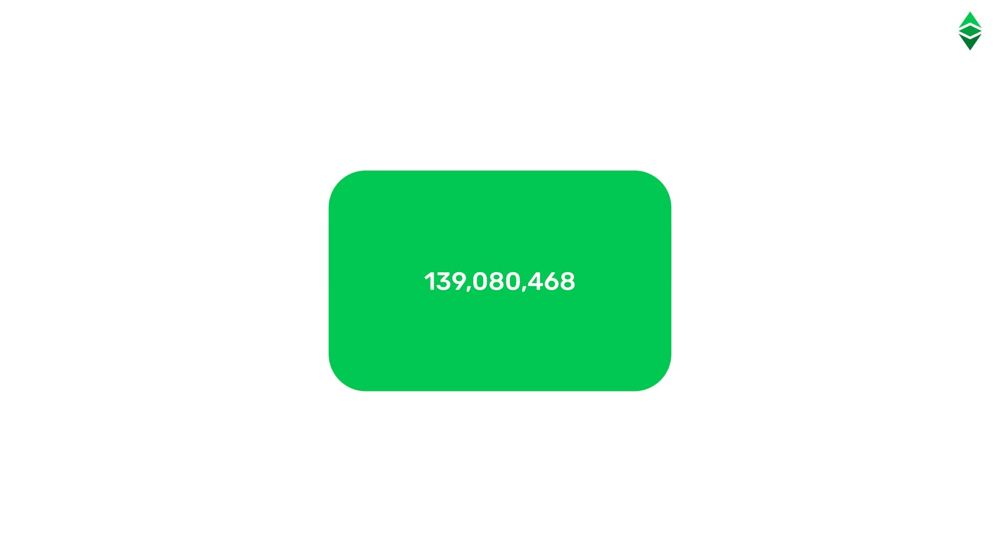
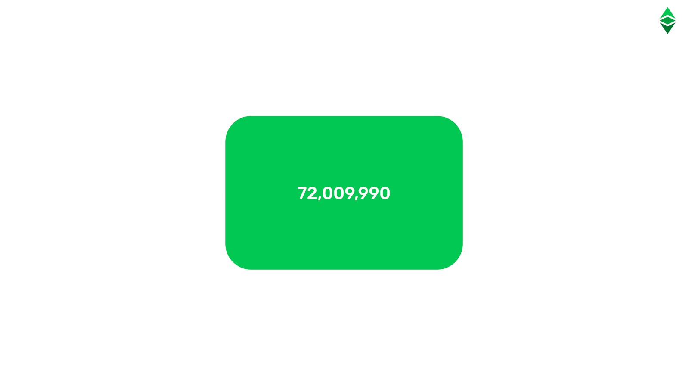
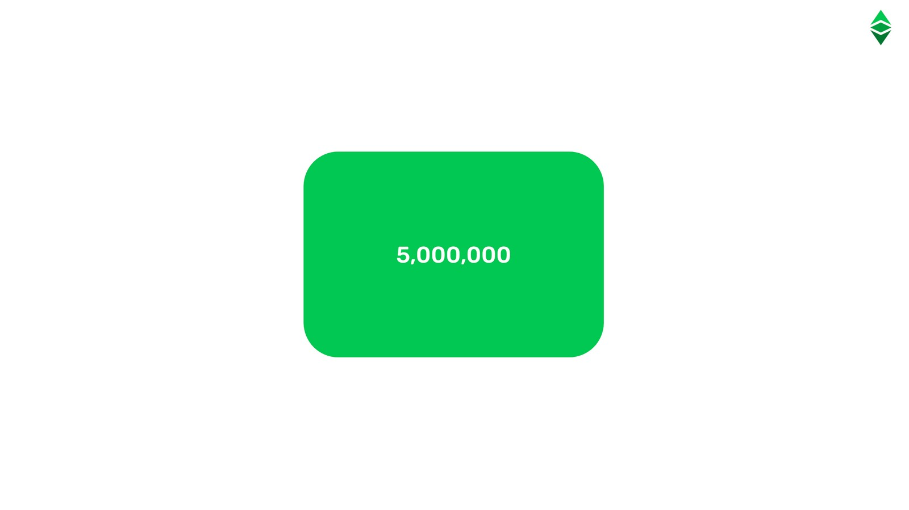
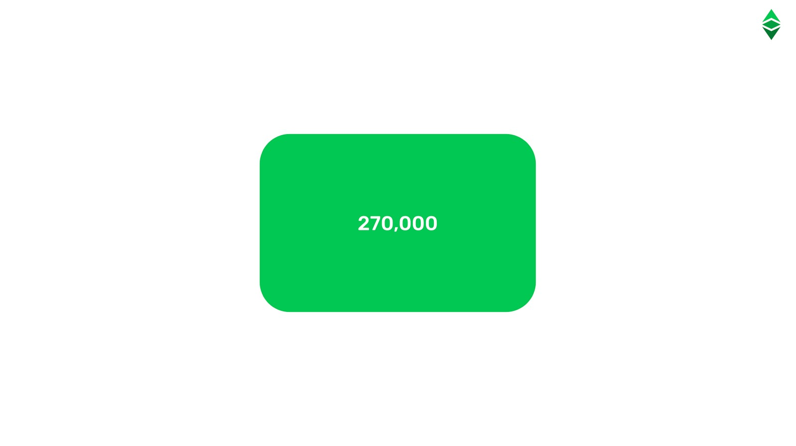
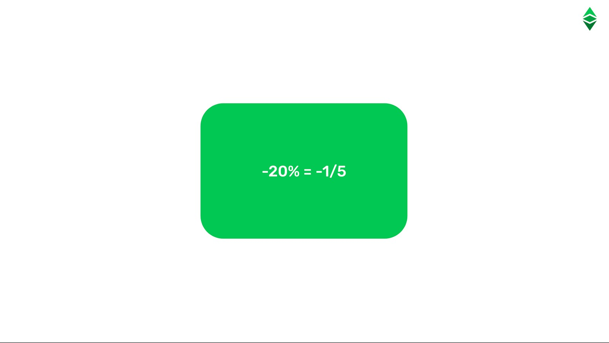
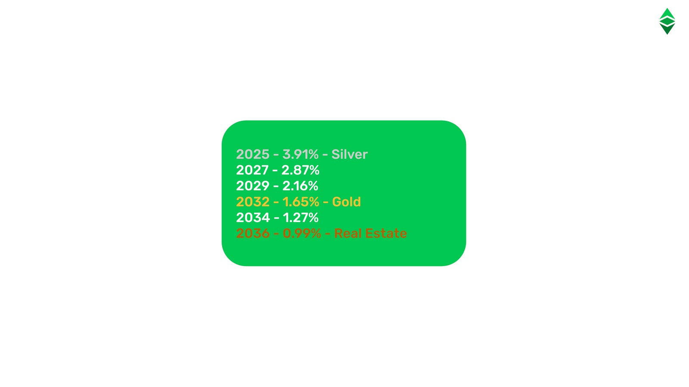
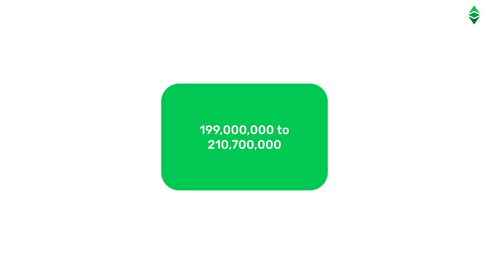
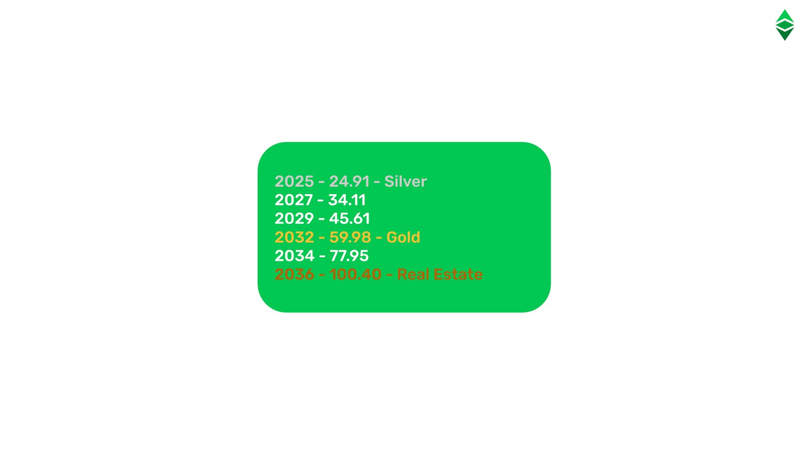

---
**You can listen to or watch this video here:**

<iframe width="560" height="315" src="https://www.youtube.com/embed/ugUsGjM3K6c" title="YouTube video player" frameborder="0" allow="accelerometer; autoplay; clipboard-write; encrypted-media; gyroscope; picture-in-picture; web-share" allowfullscreen></iframe>

---

When checking sources as CoinMarketCap, at the time of this writing, the supply of ETC was 139,080,468 coins and was growing at a rate of 2.56 coins per block.

However, as explained in previous classes, in the beginning Ethereum Classic and Ethereum were one blockchain and the monetary policy consisted of perpetually issuing 5 ETC/ETH per block to pay miners for their work.

When Ethereum split from Ethereum Classic on July 20th of 2016, the ETC ecosystem decided to follow a Code Is Law ethic which must include a more constrained monetary policy to guarantee the soundness of the currency.

This prompted the community to adopt a new but permanent monetary policy mimicking that of Bitcoin. The change was implemented on block 5,000,000 which occurred on December 11th of 2017.

In this class we will explain the monetary policy of Ethereum Classic by describing its components, which include the following:

1. The pre-mine
2. Eras
3. Block rewards
4. Uncle blocks
5. The fifthening
6. Inflation rate
7. Supply cap
8. Stock-to-flow ratio

We will refer to the cryptocurrency of the original unified chain as ETC/ETH, and as ETC or ETH when mentioning them separately after the Ethereum split. 

## 1. The Pre-Mine

In early 2014, Vitalik Buterin and his founding team did a presale, also called “pre-mine”, of ETC/ETH to finance the initial development of Ethereum for approximately 18 months. 

This resulted in the eventual issuance; on the genesis block, before any mining ever took place, hence “pre-mine”; of 60,009,990 ETC/ETH, which were allocated in July of 2015 to the initial supporters who invested in the pre-sale.

To this, the founding team allocated to themselves and the Ethereum Foundation another 12,000,000 ETC/ETH.

So, this brought the total pre-mine issuance of ETC/ETH to 72,009,990, and this forms part of the current supply of ETC and ETH in their respective networks.

## 2. Eras

As mentioned before, starting on block 5,000,000, ETC changed its monetary policy of unlimited supply to a capped supply model as Bitcoin’s.

The schedule followed was that every 5,000,000 blocks, or 28 months, ETC would discount by 20% the payment per block to miners. In this way, it would resemble Bitcoin’s schedule, which discounts the payment to miners by 50%, but every 48 months.

This means that in every era, miners would get paid 20% less as follows:

- Era 1, from block 1 to 5,000,000: 5 ETC
- Era 2, from block 5,000,001 to 10,000,000: 4 ETC
- Era 3, from block 10,000,001 to 15,000,000: 3.20 ETC
- Era 4, from block 15,000,001 to 20,000,000: 2.56 ETC (current era)...

...and so on until block rewards will diminish completely by approximately the year 2140.

## 3. Block Rewards

Block rewards are the method of issuing the money fairly and of compensating miners to secure the network by producing blocks.

It is described as “fair” because the coins are being issued and paid to people and entities who actually perform work for the network. Miners secure the network because their work imposes an enormous cost for any bad actors to tamper with the blockchain.

Additionally, the fact that the currency is issued only after performing significant work makes it sound money as it is unforgeably costly and scarce.

Block frequency and block rewards are the key components of the monetary policy because they determine the timing of the issuance, thus inflation rate and stock-to-flow ratio.

For example, as the ETC blocks are produced every 15 seconds on average, and the current block rewards are 2.56 ETC, then, in this era, the rate of currency issuance is 5,382,144 per year. This rate of inflation will be reduced by 20% every 28 months.

## 4. Uncle Blocks

As Ethereum Classic produces blocks every 15 seconds, instead of every ten minutes as Bitcoin, there are instances in which more than one valid block is produced by miners at any given time. However, only one block per round may be permitted, so to prevent any disincentive that miners may have for producing extra blocks in vain, there is a payment for these stale blocks, also called “uncle blocks”.

Since inception, there has been a rate of production of uncle blocks of more or less 5.4%, which is approximately 270,000 uncle blocks per era.

Uncle blocks were paid 4.375 ETC/ETH in the first era, but that payment was lowered to 0.125 ETC when the monetary policy was changed, and will be discounted, together with the normal block rewards, by 20% every 5,000,000 blocks.

## 5. The Fifthening

The event of the fifthening is celebrated by the ETC community every 28 months or 5,000,000 blocks and it happens on the date when the block of the next era is mined. 

For example, we are in the 4th era and the 5th era will start on block 20,000,001, which will happen sometime in August of 2024.

It is called the fifthening (fifth-ening) because the discount of 20% in each era is equivalent to one fifth of the block rewards and annual issuance.

The importance of the fifthening is that the annual supply rate is lowered, making ETC sounder money as time passes by. This soundness is reflected in both a lower annualized inflation rate and a higher stock-to-flow ratio.

## 6. Inflation Rate

What is called the inflation rate is the rate of production or issuance of new currency per year. 

When Ethereum Classic and Ethereum were one chain the annual rate of coin production was very high, at more than 14%, because the base was small and issuance was still high.

However, as the ETC eras have been progressing, its inflation rate has been drastically reduced. 

The production rate in this current era 4 is 3.91%, which is similar to the production rate of silver.

By the year 2032, in era 7, the issuance rate of ETC will be similar to gold’s.

And, by the year 2036, in era 9, it will be close or lower than the real estate annual production rate.

## 7. Supply Cap

Given the eras of ETC every 5,000,000 blocks, the block rewards and frequencies mentioned above, the discounts per era, the average uncle block rate of 270,000 per era, and the fact that it is divisible by 0.000000000000000001 (1e-18), then the ETC maximum supply in all of its history will be in a range of between 199,000,000 to 210,700,000 ETC.

The lower number of 199,000,000 reflects the current average production of uncle blocks of 5.4%, but in the unlikely scenario that uncle blocks are produced 100% of the time, then the maximum supply would be 210,700,000.

This is why it is generally stated that ETC has a supply cap of 210,700,000, but it is very likely that it will be lower than that.

## 8. ETC’s Stock to Flow Ratio

The stock-to-flow (S2F) ratio is a measure that is used to predict the value of commodities in the market, and is a very similar concept as inflation, but it is expressed as the current stock of a commodity divided by the new annual production or issuance.

For example, as there are 185,000 tonnes of gold in the world, and there are approximately 3,000 additional tonnes extracted every year, then the stock-to-flow ratio of gold is 61.67 (185,000 / 3,000 = 61.67) which corresponds to a 1.62% inflation rate. The higher the S2F ratio is, the more valuable the commodity should be.

As we have fairly accurate projections of the stock and issuance of ETC at all times, because its monetary policy is transparent and predictable, we can calculate what will be its stock-to-flow ratio in the future.

By 2025, the S2F ratio of ETC will be similar to that of silver at 24.91; by 2032, it will be similar to gold’s at 59.98; and, by 2036, it will be similar or higher than that of real estate at 100.40

---

**Thank you for reading this article!**

To learn more about ETC please go to: https://ethereumclassic.org
