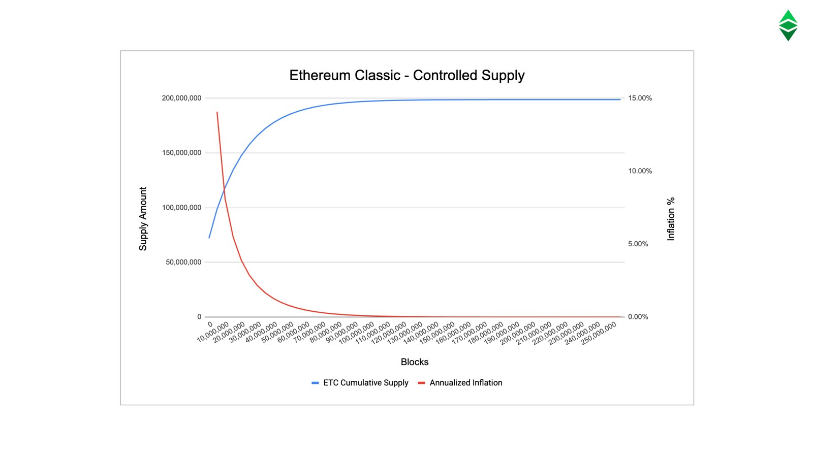

---
**欢迎由此收听或观看本期内容:**

<iframe width="560" height="315" src="https://www.youtube.com/embed/ugUsGjM3K6c" title="YouTube video player" frameborder="0" allow="accelerometer; autoplay; clipboard-write; encrypted-media; gyroscope; picture-in-picture; web-share" allowfullscreen></iframe>

---

根据CoinMarketCap核实来源，在撰写本文时，ETC的供应量为139,080,468个硬币，并以每个区块2.56个硬币的速度增长。

然而，正如在前面的课程中所解释的那样，在一开始，以太坊经典和以太坊是一个区块链，货币政策包括永久地在每个区块发行5个ETC/ETH来支付矿工的工作。

当以太坊在2016年7月20日从以太坊经典中分离出来时，ETC生态系统决定遵循“代码即法律”道德，这必须包括更严格的货币政策，以保证货币的稳健。

这促使社区采取了一种新的但永久性的货币政策，模仿比特币。这一变化是在2017年12月11日发生的5,000,000区块上实施的。

在本节课中，我们将通过描述以太坊经典的组成部分来解释其货币政策，其中包括以下内容:

1. 预挖矿（Pre-mine)
2. 时代
3. 区块奖励
4. 叔块
5. The fifthening
6. 通货膨胀率
7. 供应限制
8. 库存与流动比率

我们将原统一链的加密货币称为ETC/ETH，以太坊分裂后分别提及ETC或ETH。 

## 1. 预挖矿

2014年初，Vitalik Buterin和他的创始团队对ETC/ETH进行了预售，也称为“预挖矿”，为以太坊的初始开发提供了大约18个月的资金。

这导致了最终的发行;在起源区块，在任何采矿发生之前，因此称为“pre-mine”;60,009,990 ETC/ETH，于2015年7月分配给投资预售的最初支持者。

为此，创始团队为自己和以太坊基金会再分配了1200万ETC/ETH。

## 2. 时代

如前所述，从500万区块开始，ETC将其无限供应的货币政策改变为比特币的上限供应模式。

接下来的计划是，每500万个区块，或28个月，ETC将每个区块的付款折价20%给矿工。这样，它就类似于比特币的时间表，即每48个月向矿工支付50%的折扣。

这意味着，在每个时代，矿工的工资将减少20%，如下所示:

- 时代1，从区块1到5,000,000:5等
- 时代2，从区块5,000,001到10,000,000:4 ETC
- 时代3，从区块10,000,001到15,000,000:3.20 ETC
- 时代4，从区块15,000,001到20,000,000:2.56 ETC(当前时代)…

.．.以此类推，直到大约在2140年，区块奖励将完全减少。

## 3. 区块奖励

区块奖励是一种公平发行货币的方法，也是一种通过生产区块来补偿矿工以确保网络安全的方法。

它被描述为“公平”，因为这些币被发行并支付给实际为网络执行工作的个人和实体。矿工保护网络，因为他们的工作给任何不良行为者篡改区块链带来了巨大的成本。

此外，这种货币只有在完成重大工作后才发行，这使得它成为可靠的货币，因为它的成本和稀缺令人难以忘怀。

区块频率和区块奖励是货币政策的关键组成部分，因为它们决定了发行的时间，从而决定了通货膨胀率和库存流量比。

例如，ETC区块平均每15秒产生一次，当前的区块奖励为2.56 ETC，那么，在这个时代，货币的发行速度为每年5382144次。而且，通货膨胀率将每28个月降低20%。

## 4. 叔块

以太坊经典每15秒产生一个区块，而不是比特币每10分钟产生一个区块，在任何给定时间都有矿工产生多个有效区块的实例。然而，每轮可能只允许一个区块，因此为了防止矿工徒劳地生产额外的区块，对这些陈旧的区块有一种支付，也称为“叔块”。

自成立以来，叔块的生产速度大约为5.4%，每时代大约有27万个叔块。

叔块在第一个时代支付4.375 ETC/ETH，但随着货币政策的变化，该支付降低到0.125 ETC，并将与正常的区块奖励一起，每500万个区块折扣20%。

## 5. The Fifthening

ETC社区每28个月或500万个区块庆祝第5个时代的事件，它发生在下一个时代的区块被开采的日期。

例如，我们正处于第4个时代，第5个时代将从区块20,000,001开始，这将在2024年8月的某个时候发生。

之所以称为the fifthening(五分之一)，是因为每个时代20%的折扣相当于五分之一的区块奖励和年度发行。

The fifthening的重要性在于，随着时间的推移，年供应率降低了，ETC的货币变得更加稳健。这种稳健性反映在较低的年化通胀率和较高的库存流量比上。

## 6. 通货膨胀率

所谓的通货膨胀率是每年生产或发行新货币的速度。

当以太坊经典和以太坊是一条链时，每年的代币产量非常高，超过14%。因为基数很小，发行量仍然很高。

然而，随着ETC时代的发展，它的通货膨胀率已经大大降低。

当前时代4的产量为3.91%，与银的产量相似。

到2032年，即第七时代，ETC的发行率将与黄金的发行率相似。

到第9时代的2036年，将接近或低于房地产的年生产速度。

## 7. 供应限制

考虑到ETC每5,000,000个区块的时代，上面提到的区块奖励和频率，每个时代的折扣，每个时代的平均叔块率为270,000，以及它能被0.000000000000000001 (1e-18)除的事实，那么ETC历史上的最大供应将在199,000,000到210,700,000 ETC之间。

199,000,000这个较低的数字反映了目前叔块的平均产量为5.4%，但在叔块不太可能100%生产的的情况下，那么最大供应将是210700,000。

这就是为什么一般认为ETC的供应上限为210,700,000，但很可能会低于这一数字。

## 8. ETC的库存与流动比率

库存流动比(S2F)是一种用来预测市场上商品价值的指标，与通货膨胀的概念非常相似，但它表示为一种商品的当前库存除以新的年度生产或发行。

例如，世界上有185,000吨黄金，每年大约有3,000吨额外的黄金被提取，那么黄金的库存与流动比率为61.67(185,000 / 3,000 = 61.67)，对应的通货膨胀率为1.62%。S2F比值越高，商品越有价值。

由于我们在任何时候都对ETC的存量和发行量有相当准确的预测，因为它的货币政策是透明的和可预测的，所以我们可以计算出它未来的存量与流量比是多少。

到2025年，ETC的S2F比将与银的24.91相似;到2032年，它将与黄金的59.98相近;而且，到2036年，它将与房地产的100.40相似或更高。

---

**感谢您阅读本期文章!**

了解更多有关ETC相关内容，请访问: https://ethereumclassic.org
