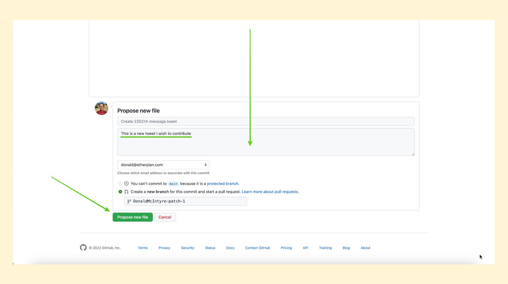

---
**您可以由此收听或观看本期内容:**

<iframe width="560" height="315" src="https://www.youtube.com/embed/-m01TAjZK7g" title="YouTube video player" frameborder="0" allow="accelerometer; autoplay; clipboard-write; encrypted-media; gyroscope; picture-in-picture; web-share" allowfullscreen></iframe>

---

这是该系列的第三部分，将解释如何以各种方式为以太坊经典做出贡献. 

该系列的视频和文章将包含“如何为ETC做贡献”的标题，并附带以下主题扩展: 

1. 改进建议程序(ECIP)
2. 社区网站
3. 社区微博
4. 社区志愿服务
5. 挖矿业
6. 操作节点
7. 捐款
8. 构建Dapp

## 什么是社区推文?

管理像ETC这样的去中心化系统是一种非常违反直觉的操作，因为我们人类习惯了中心化的组织。

一些需要以分散的方式进行整理的资源正是社交媒体帐户。

经过一些尝试和错误，以及一些[争议](https://etccooperative.org/posts/2023-02-01-pledge-to-the-ethereum-classic-community-with-regard-to-the-eth_classic-twitter-account-cn)，以太坊经典生态系统提出了一种非常创新的方法，用于在推特平台上，鼓励大众贡献并发表社交媒体推文。

系统由两个账号组成，[@eth_classic](https://twitter.com/eth_classic)
和[@etc_network](https://twitter.com/ETC_Network)，它使用GitHub作为平台来提出、批准和发布推文。

在这篇文章中我们将解释它是如何运作的。

## 谁可以为社区推文做贡献?

作为一个开源项目，世界上大多数人都可以为以太坊经典社区的推文做出贡献。

如前所述，这个过程位于一个名为GitHub的平台上，任何想要发表推文的人都必须在那里有一个账户。

ETC社区的Twitter帐户有管理员，因此所有提议的内容单元、图像和链接都将根据它们与ETC的相关性、它们是否符合“代码即法律”哲学以及它们是否符合道德准则来分析和接受。

## 什么样的推文是允许发表的?

每个账户的指导方针是不同的。

@eth_classic帐户被认为更广为人知，并且更正式。在这个账号的自述文件中，关于发布内容的说明如下:

•尊重性:没有淫秽，露骨的语言，种族主义，性别歧视等。
•中立性:不攻击或宣传非ETC项目，不搞闹剧。
•严肃性:没有表情包、笑话、妙语、热拍等。
•准确性:不涉及过于固执己见、有偏见或无法核实的信息。
•相关性:没有垃圾邮件，非ETC相关内容，限制关于同一主题的推文。
•微妙性:不要直接告诉人们购买ETC，而是告诉他们为什么。
•安全性:不涉及骗局，不鼓励购买资产。

@etc_network帐户不太知名，意图不算正式和严肃，所以某些表情包和memes将被允许使用。

## 如何在@eth_classic帐号中创建推文

1. 第一步，请访问

github.com/ethereumclassic/tweets-eth_classic

然后，打开“tweet”文件夹。

2. 在tweets文件夹中，您将看到所有已经在Twitter上发布的过去的推文

按下方框右上方的“添加文件”下拉菜单。

3. 在下拉菜单中，你会看到一个“创建新文件”的选项。按这个选项。

4. 在下一个界面中，您将看到可编辑文档的URL扩展名和文档主体。

URL扩展名必须遵循“YYMMDD-text.tweet”格式。例如，我们输入“230214-message”。“tweet”，其中“message”是我们希望用于此URL的文本。

推文的主体必须不超过240个字符，可以包括文本、链接和标签。

5. 一旦您输入了文档的URL和推文的文本主体，那么您必须在同一页面下为您发起的操作写一个描述。在这种情况下，我们将我们的贡献描述为“这是我希望贡献的一条新推文”（“This is a new tweet I wish to contribute”）。

然后，按下“propose file”按钮。

6. 在下一个屏幕中，您需要按下“Draft pull request”按钮，将新的tweet提议推送给ETC推特系统的管理员。

因为@eth_classic帐户有更多的限制(因为它是ETC的一种规范句柄)，只有当两个管理员审查提议的推文时，它才会被批准并推送到推特。

## 如何在@etc_network帐户中创建推文

1. 要为@etc_network句柄创建一个tweet，第一步是转到:

github.com/ethereumclassic/tweets-etc_network

然后，打开“tweets”文件夹.

2. 在tweets文件夹中，您将看到所有已经在推特上发布的过去的推文。

按下方框右上方的“添加文件”下拉菜单。

3. 在下拉菜单中，您会看到一个“创建新文件”（“Create new file”）的选项。请点击这个选项。

4. 在下一个界面中，您将看到您可编辑文档的URL扩展名和文档主体。

URL扩展名必须遵循“YYMMDD-text.tweet”格式。例如，我们输入“230214-message”。“tweet”，其中“message”是我们希望用于此URL的文本。

推文的主体必须不超过240个字符，可以包括文本、链接和标签。

5. 一旦输入了文档的URL和推文的文本主体，您必须在同一页面下，为您发起的操作写一个描述。在这种情况下，我们将我们的贡献描述为“这是我希望贡献的一条新推文”“This is a new tweet I wish to contribute”）。

然后，按下“propose file”按钮。

6. 在下一个屏幕中，您需要按下“Create pull request”按钮，将新的推文提议推送给ETC推特系统的管理员。

因为@etc_network帐户的限制较少，它将被批准并推送到Twitter，只需要一次管理审核。

## 其他推文格式和样式

在GitHub上每个ETC社区推文库中的自述文件都有关于如何输入以下类型推文的说明:

- 简单的推文(我们在这篇文章中展示的类型)
- 转发
- 回复
- 媒体形式推文
- 投票
- 线索推文

## 欢迎您的投稿!

我们希望这个教程已经解决了您对如何向ETC社区推文投稿的任何疑问。

欢迎您为以太坊经典做出贡献。

好的推文和memes总是受欢迎的!

---

**感谢您阅读本期文章!**

如您希望向@eth_classic帐户贡献推文，请访问: https://github.com/ethereumclassic/tweets-eth_classic

如您希望向@etc_network帐户贡献推文，请访问: https://github.com/ethereumclassic/tweets-etc_network

想了解更多关于以太坊经典的信息，请访问: https://ethereumclassic.org
