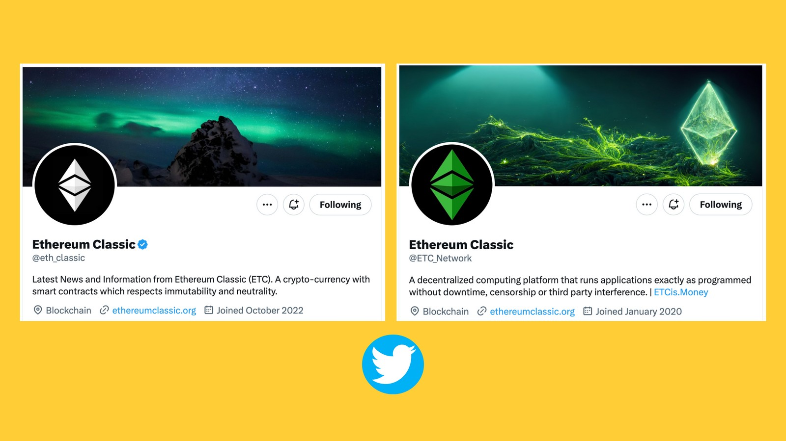
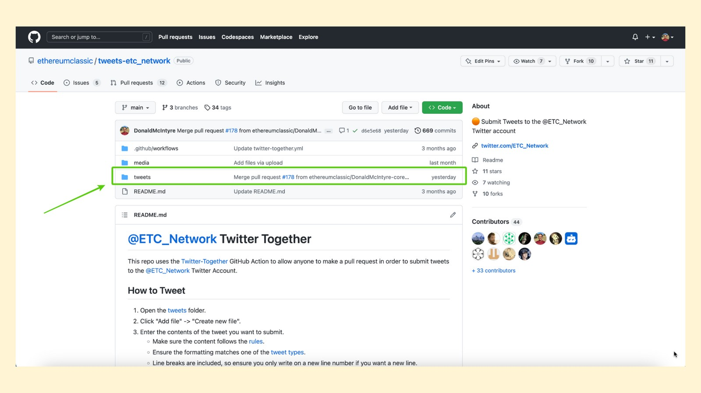

---
**You can listen to or watch this video here:**

<iframe width="560" height="315" src="https://www.youtube.com/embed/-m01TAjZK7g" title="YouTube video player" frameborder="0" allow="accelerometer; autoplay; clipboard-write; encrypted-media; gyroscope; picture-in-picture; web-share" allowfullscreen></iframe>

---

This is the third part of a series that will explain how to contribute to Ethereum Classic in a variety of ways. 

The videos and posts in the series will contain the title “How to Contribute to ETC:” with the following topic extensions: 

1. The Improvement Proposal Process (ECIP)
2. The Community Website
3. Community Tweets
4. Community Volunteering
5. Mining
6. Operating a Node
7. Donating Money
8. Building a Dapp

## What Are Community Tweets?

To manage a decentralized system as ETC is a very counterintuitive endeavour as we, humans, are used to centralized organizations.

Some of the resources that need to be sorted out in a decentralized manner are the canonical social media accounts for the project.

After some trials and errors, and several [controversies](https://etccooperative.org/posts/2023-02-01-pledge-to-the-ethereum-classic-community-with-regard-to-the-eth_classic-twitter-account-cn), the Ethereum Classic ecosystem has come up with a very innovative method for contributing and producing social media posts on the Twitter platform.

The system consists of two accounts, [@eth_classic](https://twitter.com/eth_classic)
and [@etc_network](https://twitter.com/ETC_Network), and it uses GitHub as the platform to propose, approve, and publish the tweets.

In this post we explain how it works.

## Who Can Contribute to Community Tweets?

Being an open source project, most people in the world may contribute to the Ethereum Classic community tweets.

As mentioned before, the process is located on a platform called GitHub and anyone who wishes to contribute must have an account there to propose their tweets.

The ETC community Twitter accounts have administrators, so all proposed content units, images, and links will be analyzed and accepted based on how relevant they are for ETC, how they fit with its Code Is Law philosophy, and if they comply with the ethical guidelines.

## What Kind of Tweets Are Permitted?

The guidelines are different for each account. 

The @eth_classic account is considered more well known and is intended to be more formal. In the readme file of this account, the instructions as to what is allowed to tweet are as follows:

• Dignity: No obscenities, explicit language, racism, sexism, etc.
• Neutrality: No attacking or promoting of non-ETC projects, no drama.
• Seriousness: No memes, jokes, quips, hot takes, etc.
• Accuracy: No linking to overly opinionated, biased or unverifiable information.
• Relevance: No spam, non-ETC related content, limit tweets about the same topic.
• Subtlety: Don't tell people to buy ETC directly, instead tell them why.
• Safety: No links to scams, no encouraging the purchase of assets. 

The @etc_network account is less well known and is intended to be less formal and serious. For example, some memes will be permitted.

## How to Create Tweets in the @eth_classic account

1. The first step is to go to:

github.com/ethereumclassic/tweets-eth_classic

Then, open the “tweets” folder.

2. In the tweets folder you will see all the past tweets that have already been posted on Twitter.

Press the “Add file” dropdown menu at the top right of the box.

3. In the dropdown menu, you will see an option that says “Create new file”. Press that option.

4. In the next screen you will see that you will be able to edit the URL extension of this document and the body of the document.

The URL extension must follow the format “YYMMDD-text.tweet”. For example, we typed “230214-message.tweet” where the word “message” is the text we wish to use for this URL.

The body of the tweet must be 240 characters or less and may include text, links, and hashtags.

5. Once you are done entering the URL of the document and the body of the tweet, then you have to go down in the same page and write a description for the action you are initiating. In this case, we described our contribution as “This is a new tweet I wish to contribute”. 

Then, press the “Propose file” button.

6. In the next screen, you need to press the “Draft pull request” button to push the new tweet proposal to the admins of the ETC Twitter system.

Because the @eth_classic account has more restrictions because it is a sort of canonical handle for ETC, it will be approved and pushed to Twitter only if two admins review the proposed tweet.

## How to Create Tweets in the @etc_network account

1. To create a tweet for the @etc_network handle, the first step is to go to:

github.com/ethereumclassic/tweets-etc_network

Then, open the “tweets” folder.

2. In the tweets folder you will see all the past tweets that have already been posted on Twitter.

Press the “Add file” dropdown menu at the top right of the box.

3. In the dropdown menu, you will see an option that says “Create new file”. Press that option.

4. In the next screen you will see that you will be able to edit the URL extension of this document and the body of the document.

The URL extension must follow the format “YYMMDD-text.tweet”. For example, we typed “230214-message.tweet” where the word “message” is the text we wish to use for this URL.

The body of the tweet must be 240 characters or less and may include text, links, and hashtags.

5. Once you are done entering the URL of the document and the body of the tweet, then you have to go down in the same page and write a description for the action you are initiating. In this case, we described our contribution as “This is a new tweet I wish to contribute”. 

Then, press the “Propose file” button.

6. In the next screen, you need to press the “Create pull request” button to push the new tweet proposal to the admins of the ETC Twitter system.

Because the @etc_network account has less restrictions, it will be approved and pushed to Twitter with only one admin review.

## Other Tweet Formats and Styles

The readme files in each of the ETC community tweet repositories on GitHub have instructions on how to enter the following kinds of tweets:

- Simple Tweet (the type we showed in this post)
- Retweets
- Replies
- Media
- Polls
- Threading

## You Are Welcome to Contribute!

We hope that this explanation has clarified any doubts you may have had about how to contribute to ETC community tweets.

You are welcome to contribute to Ethereum Classic.

Good tweets and memes are always welcome!

---

**Thank you for reading this article!**

To contribute tweets to the @eth_classic account go to: https://github.com/ethereumclassic/tweets-eth_classic

To contribute tweets to the @etc_network account go to: https://github.com/ethereumclassic/tweets-etc_network

To learn more about Ethereum Classic go to: https://ethereumclassic.org
