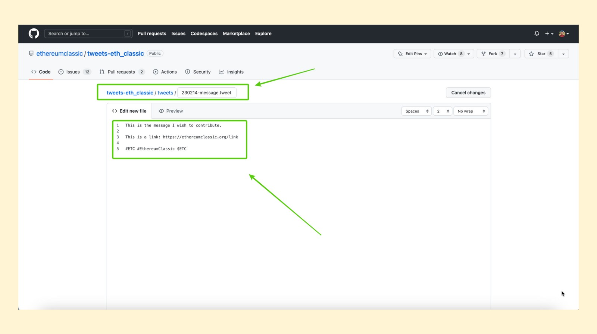
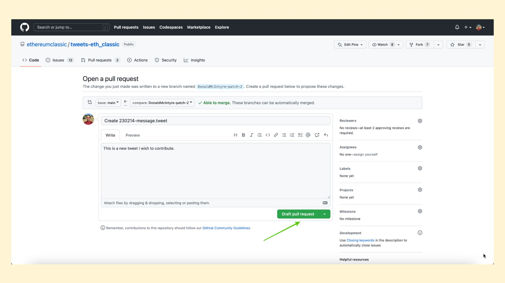
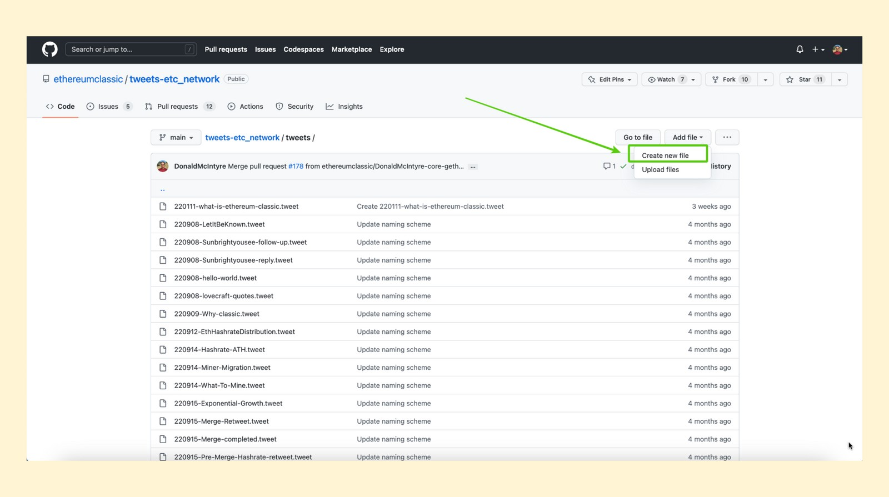

---
**您可以由此收听或观看本期内容:**

<iframe width="560" height="315" src="https://www.youtube.com/embed/-m01TAjZK7g" title="YouTube video player" frameborder="0" allow="accelerometer; autoplay; clipboard-write; encrypted-media; gyroscope; picture-in-picture; web-share" allowfullscreen></iframe>

---

这是该系列的第三部分，将解释如何以各种方式为以太坊经典做出贡献. 

该系列的视频和文章将包含“如何为ETC做贡献”的标题，并附带以下主题扩展: 

1. 改进建议程序(ECIP)
2. 社区网站
3. 社区微博
4. 社区志愿服务
5. 挖矿业
6. 操作节点
7. 捐款
8. 构建Dapp

## 什么是社区推文?

管理像ETC这样的去中心化系统是一种非常违反直觉的操作，因为我们人类习惯了中心化的组织。

一些需要以分散的方式进行整理的资源正是社交媒体帐户。

经过一些尝试和错误，以及一些[争议](https://etccooperative.org/posts/2023-02-01-pledge-to-the-ethereum-classic-community-with-regard-to-the-eth_classic-twitter-account-cn)，以太坊经典生态系统提出了一种非常创新的方法，用于在推特平台上，鼓励大众贡献并发表社交媒体推文。

系统由两个账号组成，[@eth_classic](https://twitter.com/eth_classic)
和[@etc_network](https://twitter.com/ETC_Network)，它使用GitHub作为平台来提出、批准和发布推文。

在这篇文章中我们将解释它是如何运作的。

## 谁可以为社区推文做贡献?

作为一个开源项目，世界上大多数人都可以为以太坊经典社区的推文做出贡献。

如前所述，这个过程位于一个名为GitHub的平台上，任何想要发表推文的人都必须在那里有一个账户。

ETC社区的Twitter帐户有管理员，因此所有提议的内容单元、图像和链接都将根据它们与ETC的相关性、它们是否符合“代码即法律”哲学以及它们是否符合道德准则来分析和接受。

## 什么样的推文是允许发表的?

每个账户的指导方针是不同的。

@eth_classic帐户被认为更广为人知，并且更正式。在这个账号的自述文件中，关于发布内容的说明如下:

•尊重性:没有淫秽，露骨的语言，种族主义，性别歧视等。
•中立性:不攻击或宣传非ETC项目，不搞闹剧。
•严肃性:没有表情包、笑话、妙语、热拍等。
•准确性:不涉及过于固执己见、有偏见或无法核实的信息。
•相关性:没有垃圾邮件，非ETC相关内容，限制关于同一主题的推文。
•微妙性:不要直接告诉人们购买ETC，而是告诉他们为什么。
•安全性:不涉及骗局，不鼓励购买资产。

@etc_network帐户不太知名，意图不算正式和严肃。所以某些表情包将被允许使用。

## 如何在@eth_classic帐号中创建推文

1. 第一步，请访问

github.com/ethereumclassic/tweets-eth_classic

然后，打开“tweet”文件夹。

2. 在tweets文件夹中，您将看到所有已经在Twitter上发布的过去的推文

按下方框右上方的“添加文件”下拉菜单。

3. 在下拉菜单中，你会看到一个“创建新文件”的选项。按这个选项。

4. In the next screen you will see that you will be able to edit the URL extension of this document and the body of the document.

The URL extension must follow the format “YYMMDD-text.tweet”. For example, we typed “230214-message.tweet” where the word “message” is the text we wish to use for this URL.

The body of the tweet must be 240 characters or less and may include text, links, and hashtags.

5. Once you are done entering the URL of the document and the body of the tweet, then you have to go down in the same page and write a description for the action you are initiating. In this case, we described our contribution as “This is a new tweet I wish to contribute”. 

Then, press the “Propose file” button.

6. In the next screen, you need to press the “Draft pull request” button to push the new tweet proposal to the admins of the ETC Twitter system.

Because the @eth_classic account has more restrictions because it is a sort of canonical handle for ETC, it will be approved and pushed to Twitter only if two admins review the proposed tweet.

## How to Create Tweets in the @etc_network account

1. To create a tweet for the @etc_network handle, the first step is to go to:

github.com/ethereumclassic/tweets-etc_network

Then, open the “tweets” folder.

2. In the tweets folder you will see all the past tweets that have already been posted on Twitter.

Press the “Add file” dropdown menu at the top right of the box.

3. In the dropdown menu, you will see an option that says “Create new file”. Press that option.

4. In the next screen you will see that you will be able to edit the URL extension of this document and the body of the document.

The URL extension must follow the format “YYMMDD-text.tweet”. For example, we typed “230214-message.tweet” where the word “message” is the text we wish to use for this URL.

The body of the tweet must be 240 characters or less and may include text, links, and hashtags.

5. Once you are done entering the URL of the document and the body of the tweet, then you have to go down in the same page and write a description for the action you are initiating. In this case, we described our contribution as “This is a new tweet I wish to contribute”. 

Then, press the “Propose file” button.

6. In the next screen, you need to press the “Create pull request” button to push the new tweet proposal to the admins of the ETC Twitter system.

Because the @etc_network account has less restrictions, it will be approved and pushed to Twitter with only one admin review.

## Other Tweet Formats and Styles

The readme files in each of the ETC community tweet repositories on GitHub have instructions on how to enter the following kinds of tweets:

- Simple Tweet (the type we showed in this post)
- Retweets
- Replies
- Media
- Polls
- Threading

## You Are Welcome to Contribute!

We hope that this explanation has clarified any doubts you may have had about how to contribute to ETC community tweets.

You are welcome to contribute to Ethereum Classic.

Good tweets and memes are always welcome!

---

**Thank you for reading this article!**

To contribute tweets to the @eth_classic account go to: https://github.com/ethereumclassic/tweets-eth_classic

To contribute tweets to the @etc_network account go to: https://github.com/ethereumclassic/tweets-etc_network

To learn more about Ethereum Classic go to: https://ethereumclassic.org
