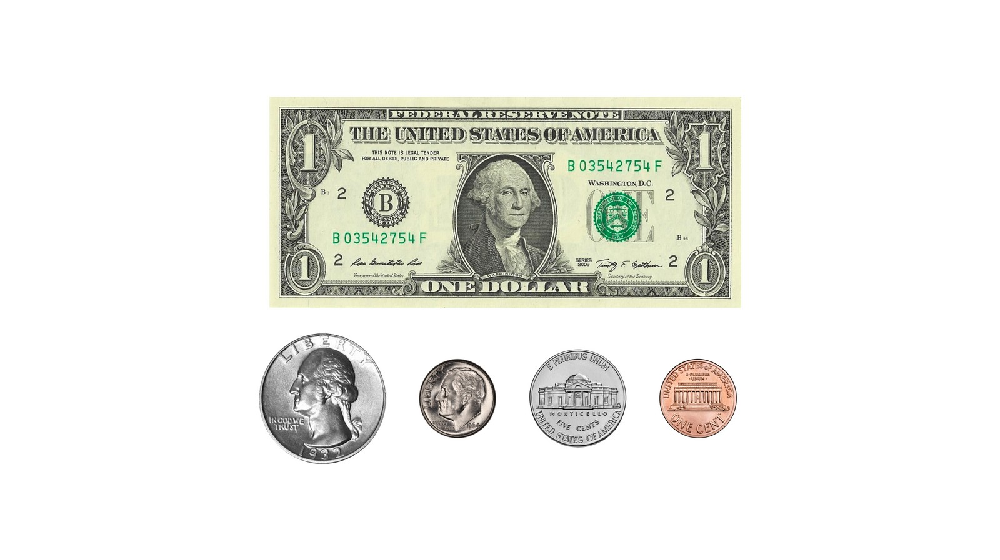
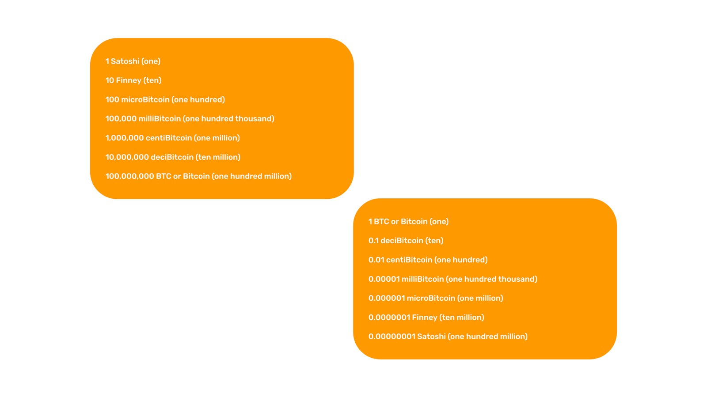
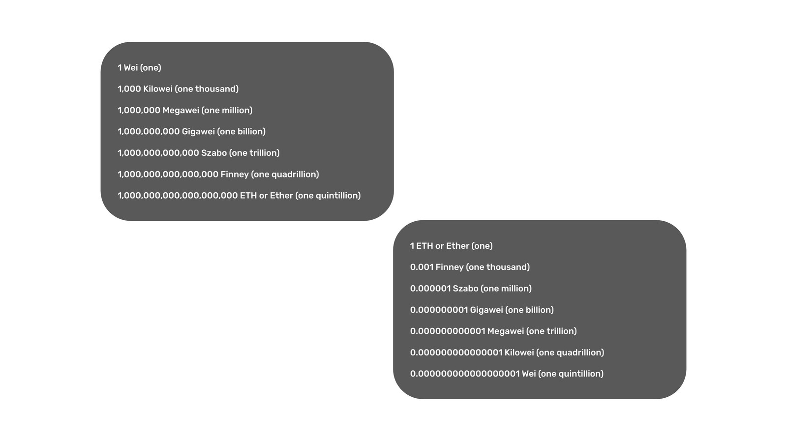
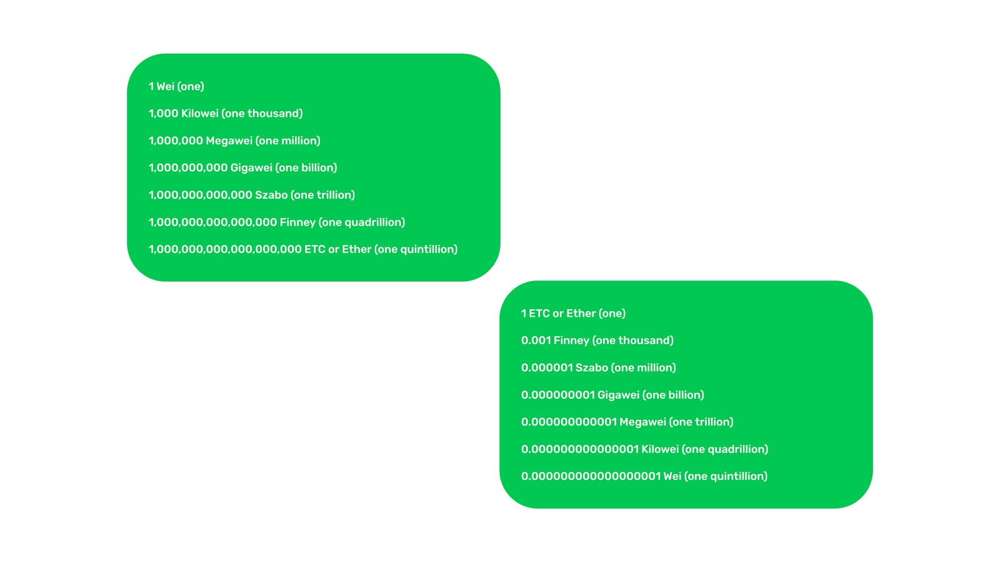

---
**You can listen to or watch this video here:**

<iframe width="560" height="315" src="https://www.youtube.com/embed/D31MuLYrW94" title="YouTube video player" frameborder="0" allow="accelerometer; autoplay; clipboard-write; encrypted-media; gyroscope; picture-in-picture; web-share" allowfullscreen></iframe>

---

In the previous class we explained Ethereum Classic’s monetary policy. A monetary policy is one aspect of money which focuses on its creation or issuance and how much stock there should be to make the money useful and sound.

Ethereum Classic has an absolute supply cap of 210,700,000 ETC and a fixed monetary policy that will discount by 20% the block rewards to miners every 5,000,000 blocks, which is equivalent to every 28 months.

In this class we will explain another aspect of money which is divisibility. ETC is highly divisible and to explain how its units and denominations work we will explain first how the dollar works, then Bitcoin, Ethereum, and finally Ethereum Classic.

## The Units and Denominations of the Dollar

The great majority of traditional currencies in all nations are structured the same way. They have a whole unit and then they are divided by one hundred, which is the smallest possible or atomic unit.

In the case of the US dollar, for example, the whole unit is the dollar. Then, it may be divided into one hundred units called cents.

In the middle, there are names given to different dollar quantities: Twenty five cents are called a quarter, ten cents are called a dime, and five cents are called a nickel.

The same logic applies to Bitcoin, Ethereum, and Ethereum Classic, but with different divisibility.

## The Units and Denominations of Bitcoin

In Bitcoin, the whole unit of the currency is called bitcoin or BTC, its symbol in the market is $BTC, and it is divisible by one hundred million.

For computing and machine purposes, this small unit is the one actually used as the whole unit. Consequently the currency is denominated as follows:

1 is a Satoshi (one unit)

10 a Finney (ten)

100 a microBitcoin (one hundred)

100,000 a milliBitcoin (one hundred thousand)

1,000,000 a centiBitcoin (one million)

10,000,000 a deciBitcoin (ten million)

100,000,000 a BTC or Bitcoin (one hundred million)

Multiplying 1 satoshi by ten gives one Finney, then a microBitcoin (one hundred), a milliBitcoin (one hundred thousand), a centiBitcoin (one million), a deciBitcoin (ten million), and finally a Bitcoin (one hundred million satoshis).

The name "Satoshi" was given to this atomic unit in honor of Satoshi Nakamoto, the inventor of Bitcoin.

For human readability, the units and denominations of Bitcoin are inverted in applications and wallets to show them as the normal whole unit of one BTC and from there are divisible by the quantities described above:

1 is a Bitcoin (one)

0.1 a deciBitcoin (ten)

0.01 a centiBitcoin (one hundred)

0.00001 a milliBitcoin (one hundred thousand)

0.000001 a microBitcoin (one million)

0.0000001 a Finney (ten million)

0.00000001 a Satoshi (one hundred million)

The above expressions are quantitatively identical as in the previous section, it is just a different way of expressing them.

## The Units and Denominations of Ethereum

In Ethereum, the whole unit of the currency is called ether or ETH, its symbol in the market is $ETH, and it is divisible by one quintillion, or a 1 with 18 zeros (1,000,000,000,000,000,000).

As with Bitcoin, for computing and machine purposes, this small unit is the one actually used as the whole unit. Consequently the currency is denominated as follows:

1 is a Wei (one)

1,000 a Kilowei (one thousand)

1,000,000 a Megawei (one million)

1,000,000,000 a Gigawei (one billion)

1,000,000,000,000 a Szabo (one trillion)

1,000,000,000,000,000 a Finney (one quadrillion)

1,000,000,000,000,000,000 an ETH or Ether (one quintillion)

Multiplying 1 Wei by one thousand gives a Kilowei, then a Megawei (one million), Gigawei (one billion), a Szabo (one trillion), a Finney (one quadrillion), and finally an ether (one quintillion Wei).

The name "Wei" was given to this atomic unit in honor of Wei Dai, who is the cypherpunk who had the idea of the first cryptocurrency network design in late 1998.

As in Bitcoin, for human readability, the units and denominations of Ethereum are inverted in applications and wallets to show them as the normal whole unit of one ETH. From there they are divisible by the quantities described above:

1 ETH or Ether (one)

0.001 is a Finney (one thousand)

0.000001 a Szabo (one million)

0.000000001 a Gigawei (one billion)

0.000000000001 a Megawei (one trillion)

0.000000000000001 a Kilowei (one quadrillion)

0.000000000000000001 a Wei (one quintillion)

The above expressions are quantitatively identical as in the previous section, it is just a different way of expressing them.

## The Units and Denominations of Ethereum Classic

In Ethereum Classic, the units and denominations work the same as in Ethereum. The whole unit of the currency is called ether or ETC, its symbol in the market is $ETC, and it is divisible by one quintillion.

As ETH and BTC, for computing and machine purposes, this unit is the one actually used as the whole unit. Consequently the currency is denominated as follows:

1 is a Wei (one)

1,000 a Kilowei (one thousand)

1,000,000 a Megawei (one million)

1,000,000,000 a Gigawei (one billion)

1,000,000,000,000 a Szabo (one trillion)

1,000,000,000,000,000 a Finney (one quadrillion)

1,000,000,000,000,000,000 an ETC or Ether (one quintillion)

As seen above, the minimal atomic denomination of ETC is 1 Wei, which is one quintillionth of an ether.

Multiplying 1 Wei by one thousand gives a Kilowei, then a Megawei (one million), Gigawei (one billion), a Szabo (one trillion), a Finney (one quadrillion), and finally an ether (one quintillion Wei).

As with Bitcoin and Ethereum, for human readability, the units and denominations of Ethereum Classic are inverted in applications and wallets to show them as the normal whole unit of one ETC. As with Bitcoin and Ethereum, they are again divisible by the quantities described above:

1 ETC or Ether (one)

0.001 is a Finney (one thousand)

0.000001 a Szabo (one million)

0.000000001 a Gigawei (one billion)

0.000000000001 a Megawei (one trillion)

0.000000000000001 a Kilowei (one quadrillion)

0.000000000000000001 a Wei (one quintillion)

The above expressions are quantitatively identical as in the previous section, it is just a different way of expressing them.

---

**Thank you for reading this article!**

To learn more about ETC please go to: https://ethereumclassic.org
