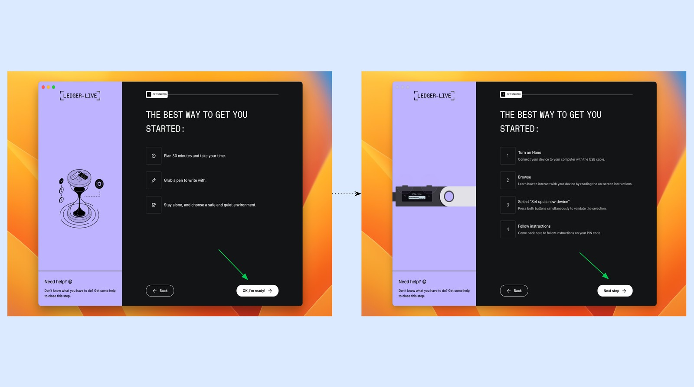
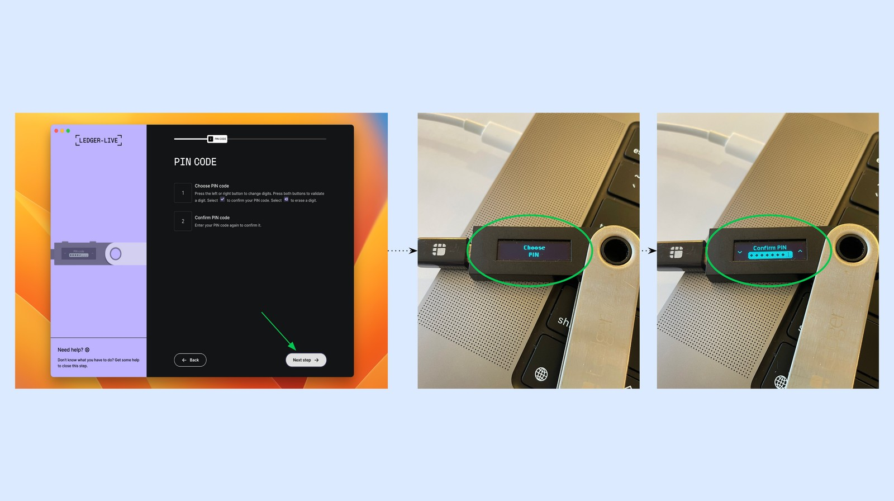
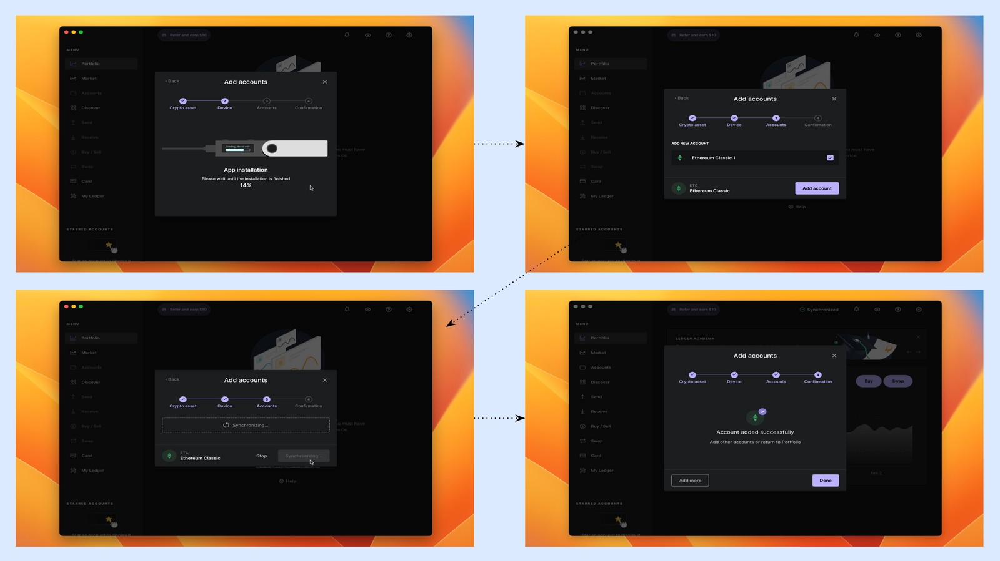
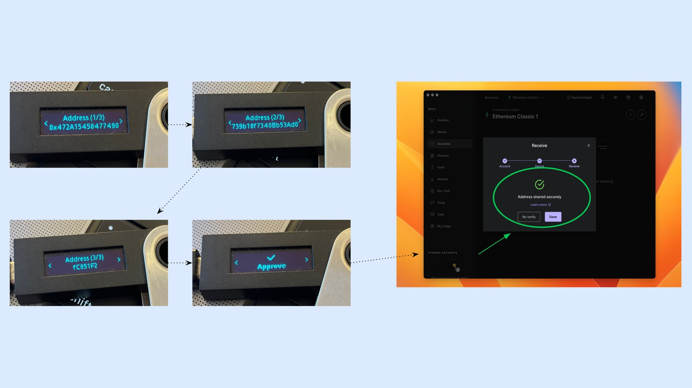
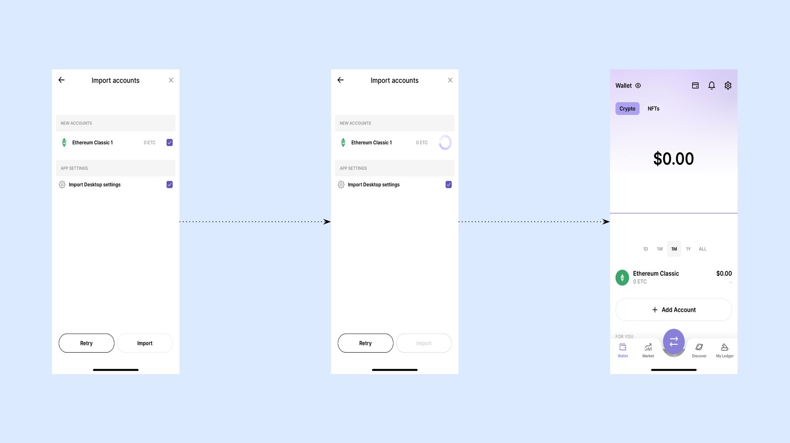

---
**You can listen to or watch this video here:**

<iframe width="560" height="315" src="https://www.youtube.com/embed/tMLRRV_uFuQ" title="YouTube video player" frameborder="0" allow="accelerometer; autoplay; clipboard-write; encrypted-media; gyroscope; picture-in-picture; web-share" allowfullscreen></iframe>

---

## The Ledger Hardware and Software Components

Ledger Nano S is a hardware wallet, so to use it you need to have your Ledger Nano S device, to install the Ledger Live app on your computer, and to install it on your phone if you want to use it on your mobile as well.

In this tutorial we explain how to set up you Ledger Nano S, adding and using Ethereum Classic with it, both on your computer and your mobile phone.

We will show the parallel actions on your Ledger Nanos S, your computer, and your mobile device when appropriate. 

## 1. Install the Ledger Live App on Your Computer

Everything starts with the hardware wallet and the Ledger Live app on your computer. To download it you need to go to:

https://www.ledger.com/start

Then, open it on your computer and press the “Get started” button.

## 2. Select Device and Setup Style

In the next few steps Ledger Live will ask you which device model you own, if you are setting it up for the first time, or if you already have a recovery phrase from before. Since this post is for Ledger Nano S and a new setup, then press “Select” on the Ledger Nano S model and then click the “SETUP NEW NANO S” link.

After this, the app will show you a short educational message. When you finished reading it, then press “Let’s do this”.

## 3. Prepare to Set Up Your Device and Turn it On

In the next screen, Ledger Live on your computer will explain how the process will work and how long it will take. After this, it will tell you to connect your Ledger Nano S to your computer (see the next screen for parallel actions on your Ledger Nano S device) and to follow the steps until you get to the message “Set up as new device”.

Press “Next step” on the Ledger Live app on your computer and “Set up as new device” by pressing both menu buttons at the same time at the top of your Ledger Nano S device.

### Connect Your Ledger Nano S and Set Up as New Device In Parallel

As you follow the steps on your computer app, connect your Ledger Nano S device to your computer and read the instructions.

When you get to the point where it says “Set up as new device”, then press both menu buttons at the top of your device at the same time as shown in the last image of this section.

## 4. Set Up the Device Pin Code

In the next step, Ledger Live on your computer will tell you that you need to select an eight digit PIN CODE for your device.

In parallel, you will see on your device the message “Choose PIN”. Press both menu buttons to select your PIN.

When you have selected and re-confirmed your PIN number on your Ledger Nano S device, it will go to the next step. Press “Next step” on your Ledger Live on your computer as well.

## 5. Write Down Your Recovery Phrase

In the next step, Ledger Live on your computer will ask you to check and write down your 24 word recovery phrase. On your device you will need to press the right menu button to start the process. You will see “word #1” first, then “word #2” next, and so on until you reached the 24th word. Write them all down in a card provided in the box of your Ledger Nano S. 

You got up to three cards, so you may copy the passphrase up to three times so you may put them in different safe places as a backup.

## 6. Confirm Your Recovery Phrase

To make sure that you copied the 24 word passphrase correctly and in the right order, Ledger Live on your computer will ask you to confirm each word. 

In parallel, on your Ledger Nano S device, you will see each word again as you press the right menu button. Several of them will be wrong on purpose, so you need to scroll right or left with the menu buttons to search for the correct words, confirming them by pressing both menu buttons.

When you confirm all 24 words, then your Ledger Nano S will tell you that your recovery phrase is set.

## 7. Hide Recovery Phrase and Perform Genuine Check

In the next screen, Ledger Live will ask you to hide your recovery phrase in a safe place, or several places if you made more copies. After this, it will greet you and ask you a few questions to see if you understood the security features of the system. Then, it will ask you to perform a “GENUINE CHECK” to make sure that the device you are using is real and from the original equipment manufacturer.

After the genuine check is approved and confirmed, press “Continue”.

## 8. Add Ethereum Classic to Your Ledger Nano S

In the next step, you will see the homepage of your Ledger Live app on your computer. The first thing it will ask you is to add an account. To add an Ethereum Classic account, we need to add the ETC app both inside the Ledger Live on your computer and on your Ledger Nano S device.

Press “Add account”. Then, search for “Ethereum Classic” in the field provided. When “Ethereum Classic (ETC)” appears, select it and press “Continue”.

In the next step, both your Ledger Live app on your computer and your Ledger Nano S device will start loading the ETC app in parallel. 

To let your Ledger Nano S load ETC, select “Allow Ledger manager” by pressing both menu buttons at the same time.

Wait until the Ethereum Classic app is loaded on both your devices.

As your Ledger Live app on your computer and your Ledger Nano S load ETC, you will see the progress on your computer. 

When it is loaded, you will see the first ETC account created, which will be labeled “Ethereum Classic 1”. Press “Add account”. After this, it will synchronize both machines and let you know that the ETC account was added successfully. 

Press “Done”.

## 9. Receive Ethereum Classic For the First Time

Now that you have an ETC account on your Ledger Nano S, you can manage it from your Ledger Live app on your computer.

To receive ETC for the first time, go to accounts and select your ETC account. Then, press the “Receive” button.

In the next pop up, select your ETC account (you may have several accounts if you wish), and then press “Continue”. 

In the next step, Ledger will show you the ETC address, which you may copy or use its QR code to show it to others so they may send you ETC.

However, Ledger will ask you to verify whether the address is genuine by using your Ledger Nano S device. For this, connect your device, enter the pin code, and open the Ethereum Classic app as shown in the images above.

When the application is ready it will ask you to verify your address. See next step.

On your Ledger Nano S device, you may move to the right or left using the menu buttons to see your address and check that it is the same one as shown on your Ledger Live app on your computer.

Once you verified the address, press the two menu buttons on your device to approve it.

Then, your Ledger Live app on your computer will tell you that the address was shared securely.

## 10. Send Ethereum Classic

To send ETC, go to your account again on the Ledger Live app on your computer. Then, press the “Send” button.

In the next screen, you will see a space provided to paste the “Recipient address”. Paste the recipient address and press “Continue”.

In the next step, Ledger Live on your computer will ask you to select how much ETC you wish to send and what amount of gas you wish to spend for this transaction. Select how much ETC you will send (we chose “Send max” for this example transaction) and the amount of gas (we chose MEDIUM).

In the next screen, Ledger Nano Live on your computer will show you a summary of the transaction you are going to send to the ETC blockchain. If everything looks ok, then press “Continue”.

In the next step, Ledger Live on your computer will ask you to confirm and sign the transaction on your Ledger Nano S device.

In parallel, on your device press “Open app Ethereum Classic”, then go ahead and review the transaction by pressing the right and left menu buttons.

As you go advancing to the right, you will see all the data of your transaction. Once you confirmed that the recipient address, amount, and gas fee are correct, then select “Accept and send” by pressing both menu buttons on your Ledger Nano S device at the same time.

In parallel, on your Ledger Live screen on your computer you will see that the transaction is being broadcast to the ETC blockchain.

Once it is broadcast, Ledger Live will let you know that the transaction was sent and will give you the option to view its details if you wish.

## 11. Connecting the Ledger Live Phone App to Your Ledger

Now that you have your Ledger Live on your computer installed and associated with your Ledger Nano S device, you may also set up and use the Ledger Live app on your phone.

To start, download Ledger Live on your phone. Then, press “Get started” and select “Yes, I do” when the app asks you if you own a Ledger.

In the next screen, select “Set up my ledger”. Then, you will see instructions on what to do on you computer Ledger Live app.

On your Ledger Live on your computer, open the settings menu on the top right hand corner of the screen. Then, select the Accounts tab on the top menu of the settings page.

Inside the accounts section, press the “Export” button to show a QR code in the next screen.

When you see the QR code on your computer screen, get the phone app and press the “I am ready to scan” button.

Scan the QR code on your computer screen to synchronize the Ledger Live phone app with your computer app.

Once it synchronizes, the Ledger Live phone app will show you your ETC account on the phone and the option to import settings.

Press “Import” to set up your ETC account on your phone.

After a while, your Ledger Live phone app will show the same account as on your computer. 

You are all set!

---

**Thank you for reading this article!**

To learn more about ETC please go to: https://ethereumclassic.org
