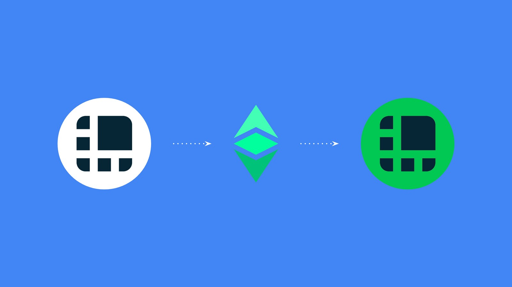
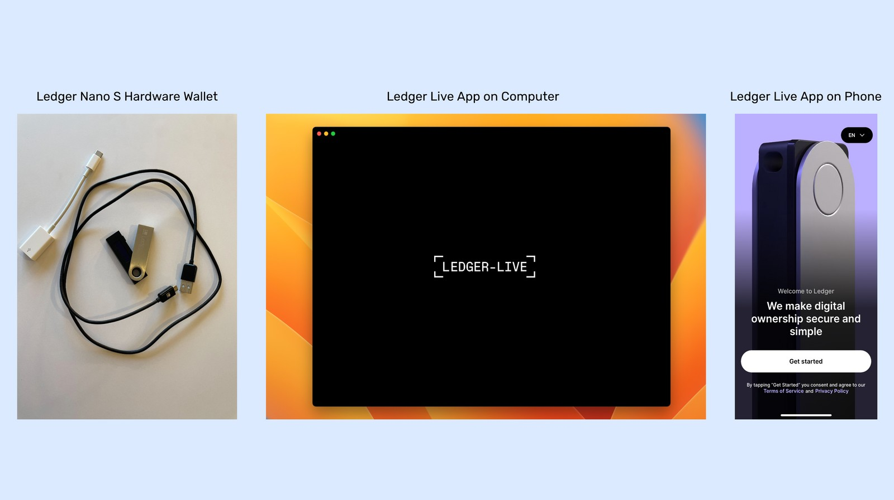
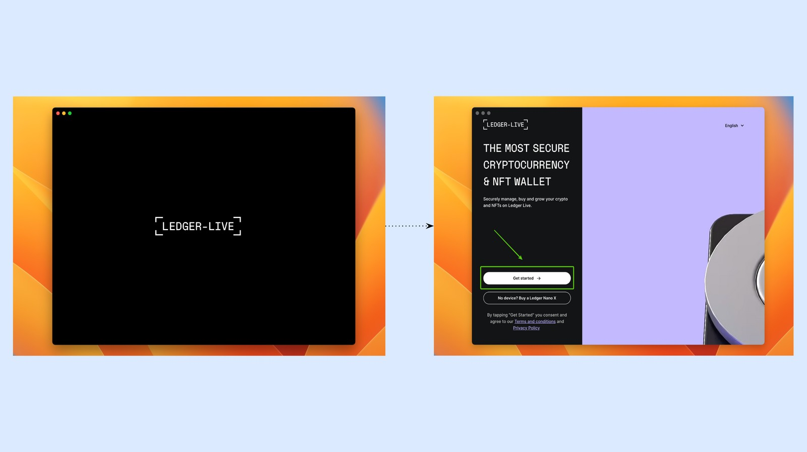
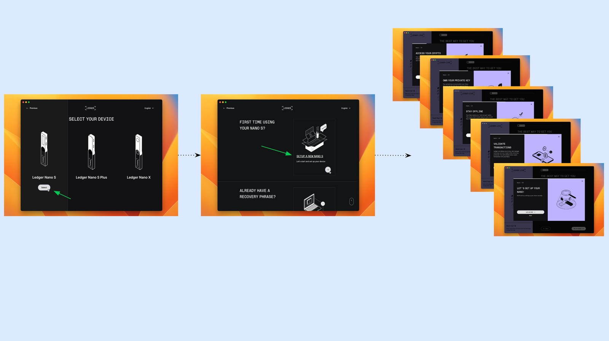
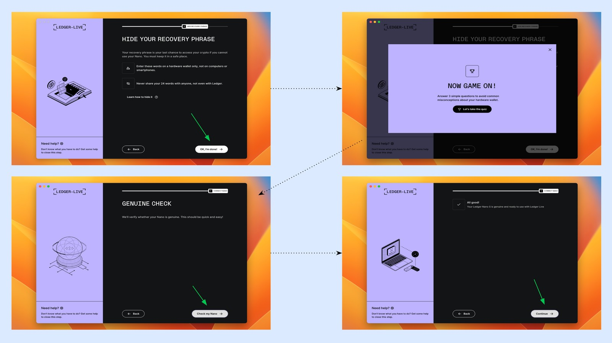
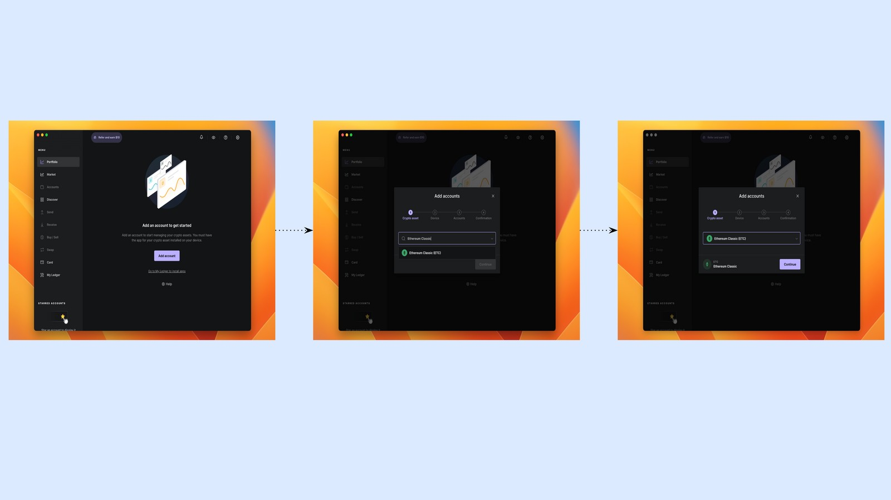
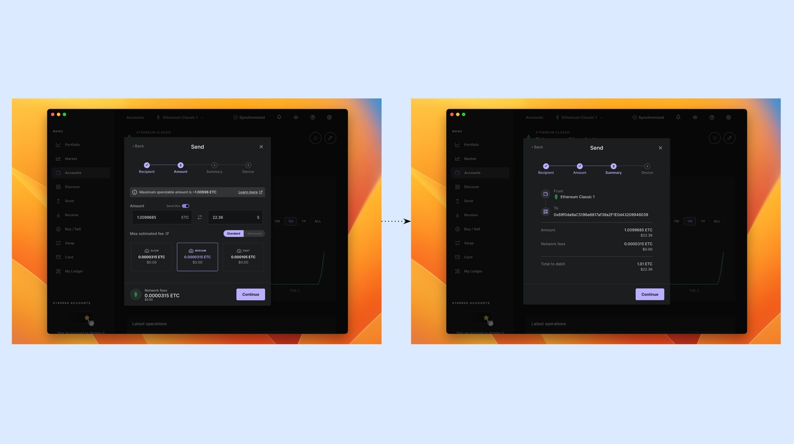
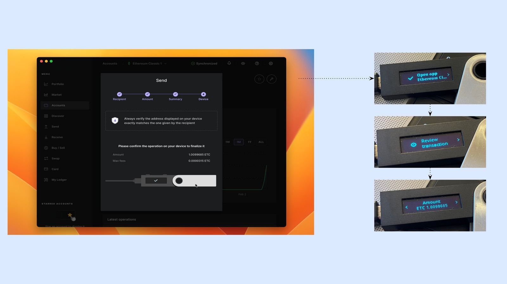
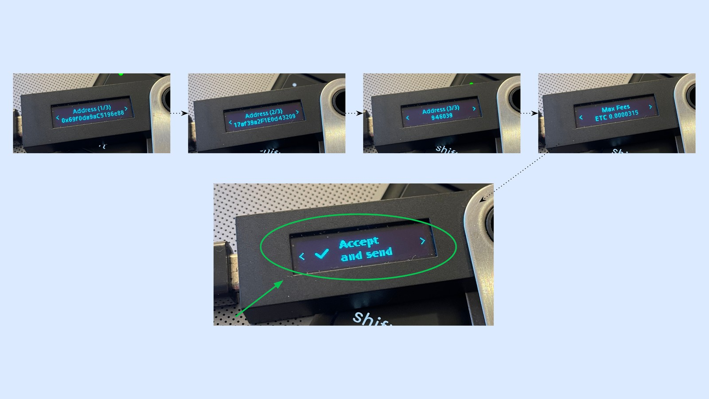

---
**您可以由此收听或观看本期内容:**

<iframe width="560" height="315" src="https://www.youtube.com/embed/tMLRRV_uFuQ" title="YouTube video player" frameborder="0" allow="accelerometer; autoplay; clipboard-write; encrypted-media; gyroscope; picture-in-picture; web-share" allowfullscreen></iframe>

---

在本文中，我们将解释如何将以太坊经典与Ledger Nano S一起使用。在对硬件钱包、桌面app、手机app做出详解的同时，也将解答如何添加以太坊经典的区块链并管理您的地址。

## 硬件与软件Ledger的组成部分

Ledger Nano S是一个硬件钱包，所以要使用它，需要有您的Ledger Nano S设备，在您的计算机上安装Ledger Live应用程序，如果你想在你的手机上使用它，也需要在你的手机上安装它。

本教程中，我们解释了如何设置创建你的分类账Nano S，以及如何在你的电脑和手机上通过ledger添加和使用以太坊经典。

我们将在适当的时候在您的分类账Nanos S、您的计算机和您的移动设备上显示并行操作。

## 1. 在您的计算机上安装Ledger Live应用程序

一切都从硬件钱包和计算机上的Ledger Live应用程序开始。要下载它，您需要访问:

https://www.ledger.com/start

然后，在您的电脑上打开它，按下“开始”按钮。

## 2. 选择设备和设置风格

在接下来的几个步骤，Ledger Live将询问您拥有的设备型号，如果您是第一次设置它，或如果您已经从以前的恢复短语。由于这篇文章是为分类Nano S和一个新的设置，然后按下分类Nano S模型上的”选择”，然后单击”设置新的Nano S”链接。

在这之后，该应用程序将向您显示一个简短的教育信息。当你读完它，然后按“Let's do this"("让我们这样做”)。

## 3. 准备好设置您的设备并将它打开

在接下来的几个步骤，如果您是第一次设置它，或如果您过去拥有恢复短语，Ledger Live将询问您拥有的设备型号。由于这篇文章是为Ledger Nano S和一个新的设置，然后按下Ledger Nano S模型上的“select”（“选择”），然后单击“SETUP NEW NANO S”（“设置新的Nano S”）链接。

在这之后，该应用程序将向您显示一个简短的教育信息。当你读完它，然后按“Let's do this”（“让我们这样做”）。

### 连接您的Ledger Nano，并设置为新的设备并行

当您遵循计算机应用程序上的步骤时，将您的Ledger Nano S设备连接到计算机并阅读说明。

当你到达它说“设置为新设备”的点时，然后按下设备顶部的两个菜单按钮，就像这部分的最后一张图片所示。

## 4. 设置设备Pin码

下一步，您电脑上的Ledger Live将告诉您，您需要为设备选择一个8位数字的PIN码。

同时，您将在您的设备上看到“选择PIN”的消息。按两个菜单按钮选择您的密码。

当您在Ledger Nano S设备上选择并重新确认您的密码时，按“Next step”它将进入下一步。

## 5. 将您的恢复短语写下来

下一步，计算机上的Ledger Live将要求您检查并写下您的24个单词恢复短语。在您的设备上，您将需要按下右键菜单按钮来启动这个过程。你会首先看到“1号单词”，然后是“2号单词”，以此类推，直到你看到第24个单词。把它们都写在你的Ledger Nano S盒子里的一张卡片上。

您最多有三张卡片，所以您可以最多复制密码三次，可以把它们放在不同的安全地方作为备份。

## 6. 确认您的恢复短语

为了确保您以正确的顺序正确地复制了24个单词的密码短语，计算机上的Ledger Live将要求您确认每个单词。

同时，在您的Ledger Nano S设备上，当您按下右菜单按钮时，您将再次看到每个单词。其中一些是故意出错的，所以您需要使用菜单按钮左右滚动来搜索正确的单词，通过按下两个菜单按钮来确认它们。

当您确认所有24个单词时，您的分类账Nano会告诉您，恢复短语已经设置好了。

## 7. 隐藏回复短语并且进行真实性检查

在下一个界面中，Ledger Live将要求您将您的恢复短语隐藏在一个或几个安全的地方。在这之后，它会问候您并问您一些问题，以了解您是否了解系统的安全特性。然后，它会要求您执行一个“真实的检查”，以确保你正在使用的设备是真实的，来自原始设备制造商。

真实性检查通过并确认后，按“继续”键。

## 8. 将以太坊经典添加到您的Ledger Nano S

下一步，您将在计算机上看到Ledger Live应用程序的主页。它会要求您做的第一件事是添加一个帐户。要添加以太坊经典帐户，我们需要在您的计算机上和您的Ledger Nano S设备上的Ledger Live中添加ETC应用程序。

按“添加帐户”。然后，在提供的领域搜索“以太坊经典”。当“以太坊经典(ETC)”出现时，选择它并按“继续”。

在下一步，您的计算机上的Ledger Live应用程序和您的Ledger Nano S设备将开始并行加载ETC应用程序。

要让您的Ledger Nano S加载ETC，选择“允许分类账管理器”并在同一时间按下两个菜单按钮。

一直等到以太坊经典应用程序加载到您的两个设备上。

当您的Ledger Live应用程序在您的计算机上和您的LedgerNano S加载ETC，您会看到您计算机上的进展。

当它加载时，您将看到第一个ETC帐户创建，它将被标记为”以太坊经典1”。按“添加帐户”。在此之后，它将同步两台机器，并让您知道ETC帐户已成功添加。

点击“完成”（“Done”）

## 9. 首次接收ETC

现在您在你的Ledger Nano S上有一个ETC账户，您可以从您计算机中的Ledger Live应用程序管理它。

要第一次接收ETC，请访问帐户并选择您的ETC帐户。然后，按“接收”键。

在下一个弹出窗口中，选择您的ETC帐户(如果您需要，您可能有多个帐户)，然后按“继续”。

下一步，Ledger将向您展示ETC地址，您可以复制或使用其二维码向他人展示，以便他们可能向您发送等。

然而，Ledger将要求您使用您的Ledger Nano S设备来验证地址是否真实。为此，连接您的设备，输入pin码，并打开以太坊经典应用程序，如上图所示。

当应用程序准备好时，它会要求您验证您的地址。参见下一步。

在您的Ledger Nano S设备上，您可以使用菜单按钮向左或向右移动，以查看您的地址，并检查它是否与您计算机上的分类账Live应用程序上显示的地址相同。

一旦您验证了地址，按下设备上的两个菜单按钮来批准它。

然后，您计算机上的Ledger Live应用程序将告诉您，该地址是安全共享的。

## 10. 发送以太坊经典

要发送ETC，请再次在计算机上的Ledger Live应用程序上访问您的账户。然后，按“发送”按钮。

在下一个界面中，您将看到一个用于粘贴“收件人地址”的空间。粘贴收件人地址，然后按“继续”。

在下一步，Ledger Live在您的计算机上将要求您选择您希望发送多少ETC以及您希望为这一交易花费多少矿工费。选择多少ETC，您将发送ETC(我们选择“发送最大”为这个例子的交易)和矿工费(我们选择了中等)。

在下一个界面中，Ledger Nano Live将在您的计算机上显示您将发送到ETC区块链的交易摘要。如果一切正常，然后按“继续”。

下一步，您电脑上的Ledger Live将要求您确认并在Ledger Nano S设备上签署交易。

同时，在您的设备上点击“打开应用程序以太坊经典”，然后通过按左右菜单按钮来审查交易。

当您向右前进时，您将看到您的交易的所有数据。一旦确认收件人地址、金额和矿工费用是正确的，然后同时按下Ledger Nano S设备上的两个菜单按钮，选择“接受并发送”。

同时，在您的计算机上Ledger Live界面上，您将看到交易正在广播给ETC区块链。

一旦它被广播，Ledger Live将让您知道交易已经发送，并将给您一个选项：如果您愿意，查看其详细信息。

## 11. 连接Ledger Live手机应用程序到您的账本

Now that you have your Ledger Live on your computer installed and associated with your Ledger Nano S device, you may also set up and use the Ledger Live app on your phone.

To start, download Ledger Live on your phone. Then, press “Get started” and select “Yes, I do” when the app asks you if you own a Ledger.

In the next screen, select “Set up my ledger”. Then, you will see instructions on what to do on you computer Ledger Live app.

On your Ledger Live on your computer, open the settings menu on the top right hand corner of the screen. Then, select the Accounts tab on the top menu of the settings page.

Inside the accounts section, press the “Export” button to show a QR code in the next screen.

When you see the QR code on your computer screen, get the phone app and press the “I am ready to scan” button.

Scan the QR code on your computer screen to synchronize the Ledger Live phone app with your computer app.

Once it synchronizes, the Ledger Live phone app will show you your ETC account on the phone and the option to import settings.

Press “Import” to set up your ETC account on your phone.

After a while, your Ledger Live phone app will show the same account as on your computer.

您已经完全设置好了!

---

**感谢您阅读本期文章!**

开始通过Ledger Nano S使用ETC，请访问: https://www.ledger.com

了解更多有关ETC，请访问: https://ethereumclassic.org
