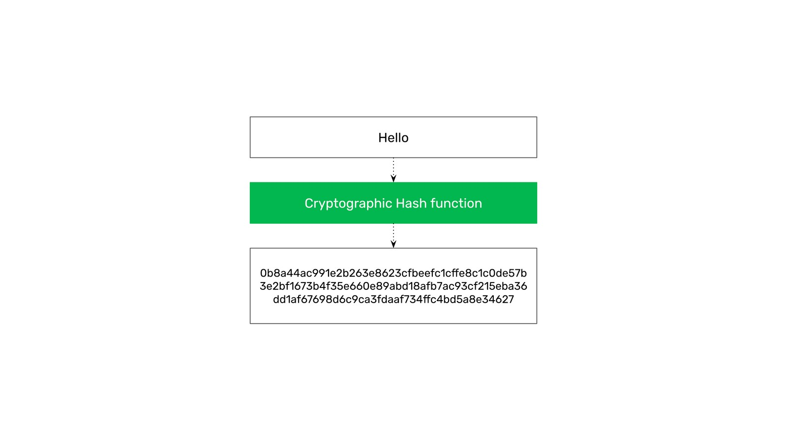
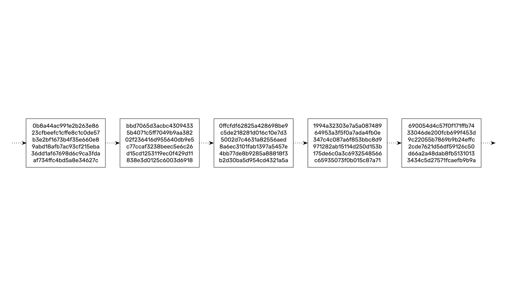
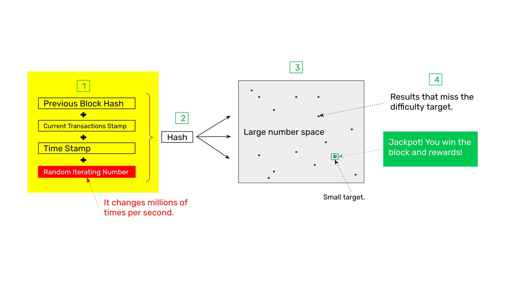
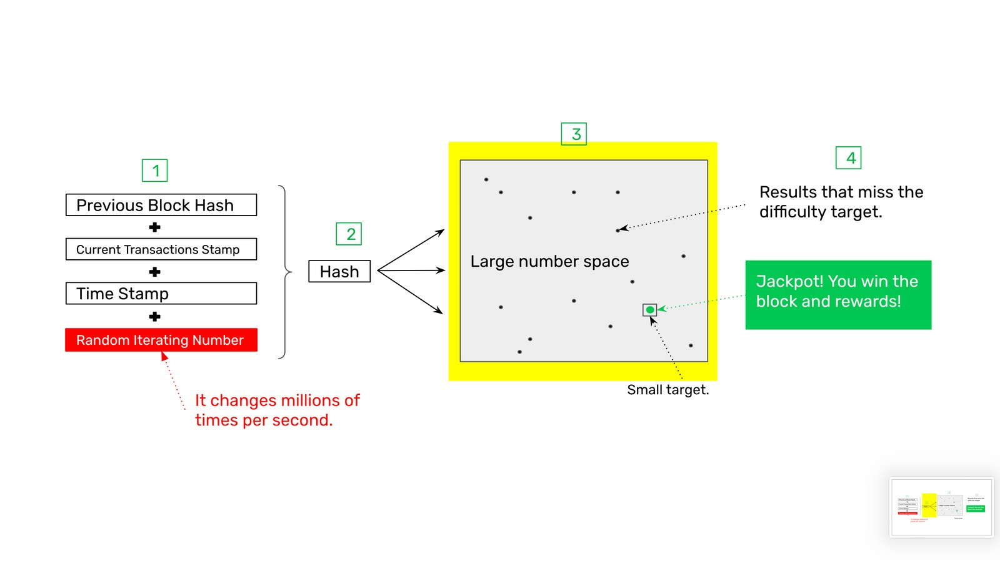

---
**You can listen to or watch this video here:**

<iframe width="560" height="315" src="https://www.youtube.com/embed/zi0w6NGpIqI" title="YouTube video player" frameborder="0" allow="accelerometer; autoplay; clipboard-write; encrypted-media; gyroscope; picture-in-picture; web-share" allowfullscreen></iframe>

---

## Nakamoto Consensus

The most important invention in the blockchain industry is the proof of work based consensus mechanism that Bitcoin and Ethereum Classic use. 

It is called Nakamoto Consensus and is the only way in which tens of thousands of computers around the world may reach an agreement as to the latest state of the network in a truly decentralized fashion.

The way it accomplishes this is by having computing machines, also called miners, do enormous amounts of work, consuming enormous amounts of electricity, to build blocks of transaction data which are then include in the database.

The process consists of the network receiving new transactions; transmitting them to all participating nodes in the system; then the same identical database of transactions is replicated across all nodes; this replication is enabled by miners who use proof of work to seal batches of transactions with costly cryptographic stamps; producing costly transaction blocks with these stamps which then they send to the rest of the network; the network then verifies the blocks and miners get paid for doing this work in the cryptocurrency of the system which has a fixed supply to make it sound and valuable.

## What Is a Cryptographic Stamp?

A cryptographic stamp or hash is a process by which any arbitrary piece of data may be transformed, through a hashing function, into a fixed large number.

For example, the word “Hello” may be transformed into the number:

`0b8a44ac991e2b263e8623cfbeefc1cffe8c1c0de57b3e2bf1673b4f35e660e8
9abd18afb7ac93cf215eba36dd1af67698d6c9ca3fdaaf734ffc4bd5a8e34627`

No matter what is the input, large or small, the function will always generate a large number which will represent the data given.

It is very easy for any computer to verify the hash by performing the hashing function with the provided data. 

## What Is a Chain of Blocks?

When a block of data is hashed, then the cryptographic stamp may be part of a chain of blocks of data by connecting the cryptographic stamps by hashing them sequentially.

For example, if we have the hash of block 1, then we can hash it and get the hash of block 2, then block 3, block 4, and son on indefinitely. This is how chains of related blocks of transactions are created in blockchains such as ETC, hence their name.

## How Proof of Work Works

The proof of work system in ETC consists of fours parts:

1. The block data to stamp
2. Hashing (creating the cryptographic stamp)
3. The target range (also known as difficulty)
4. The jackpot (hitting the target or difficulty range)

## 1. The Block Data to Stamp

The data to stamp in each block is very important because it includes three critical pieces of information and an independent random iterating number that is used to change the stamp in case the previous one didn’t work (see point 3. The Target Range, below).

The three critical pieces of information are the previous block hash to create a new link in the chain of blocks, a stamp of the current transactions to make sure that each one is included, and a time stamp of the moment the transactions for the block were gathered.

## 2. Hashing (Creating the Cryptographic Stamp)

Once the four pieces of data are put together by the miner machine, then it will create a cryptographic stamp or hash of that data using the hash function prescribed by the network algorithm. 

After doing this, it will check if the hash was successful, if it was not (see point 3. The Target Range, below) then it will go back and change the random iterating number and try again.

## 3. The Target Range (Also known as Difficulty)

Each time the block data to stamp is hashed, a number will be generated, if this number does not hit a small target range determined by the network protocol, then it will fail and the miner must try again with a different random iterating number. This is done millions of times per second because the majority of stamps fail, and this is the “work” in proof of work which is so costly and consumes so much electricity.

However, if the cryptographic stamp hits the target range, then that hash was successful. 

## 4. The Jackpot! (Hitting the Target or Difficulty Range)

When the miner hits the target range after millions or trillions of tries, then it is entitled to earn the reward for that block.

To earn the reward, the miner must immediately send the block to the rest of the network for verification. When the block is verified, meaning that all transactions, data, and hashes are correct, then the network will credit the reward payment into the miner’s account.

## Proof of Work Features

The revolutionary features of proof of work based Nakamoto Consensus are the following:

**1. Enables consensus between all computers:** Because the only block that will be accepted as the next block by all nodes in the network will be the one that has all the work done, then it is very easy for all nodes to decide on the same exact block every 15 seconds. Any alternative block sent by imposters that did not do the work will always be eliminated.

**2. Focal point for entry, exit, and reentry:** The same information, the great amount of work done by miners, that assures perfect consensus every 15 seconds between all machines of the system, is the same one that may be used by any new entrant into the system, or any machine that leaves and then wants to enter again, to know which is the correct chain of blocks just by verifying that the work was done. Any proposed impostor chains that did not do the work will always be eliminated.

**3. Protection of all the history of transactions:** For any transaction that has been sent and included in a block in ETC to be reversed or deleted the same amount of work that was done for its inclusion must be done again. This prevents any attacker from reversing past transactions, and the older a transaction is the more difficult it is to reverse or delete.

**4. The cost of creating blocks is equal to the cost of creating the currency:** As seen above, the rewards are paid to miners only if they do the work required to hash or stamp blocks, therefore the cost of creating blocks is the same as creating the money. This makes the cryptocurrency sound and attractive.

## Proof of Work Benefits

The features of proof of work based Nakamoto Consensus mentioned above combined produce the following benefits:

**Decentralization:** In their complete isolation, without consulting with anyone else, any node in the network anywhere in the world can know which is the latest block to add to the chain or which is the correct chain to join just by checking the proof of work. This enables an unprecedented level of decentralization in the system. 

**Permissionlessness:** Because anyone in the world, without consulting anyone else, just by having an internet connection and checking the proof of work, may join and leave the chain whenever they want, then the system is completely permissionless. There are no filters, licenses, or permissions to fulfill.

**Censorship resistance:** As the system becomes decentralized and permissionless, then the capacity to censor the system is dissolved. There is no way of preventing participants to participate or transactions to be sent to the network.

**Immutability:** Because proof of work consensus requires so much work to build the blockchain, then it is practically impossible that past transactions, accounts, balances, or smart contracts may be changed arbitrarily by third parties.

---

**Thank you for reading this article!**

To learn more about ETC please go to: https://ethereumclassic.org

