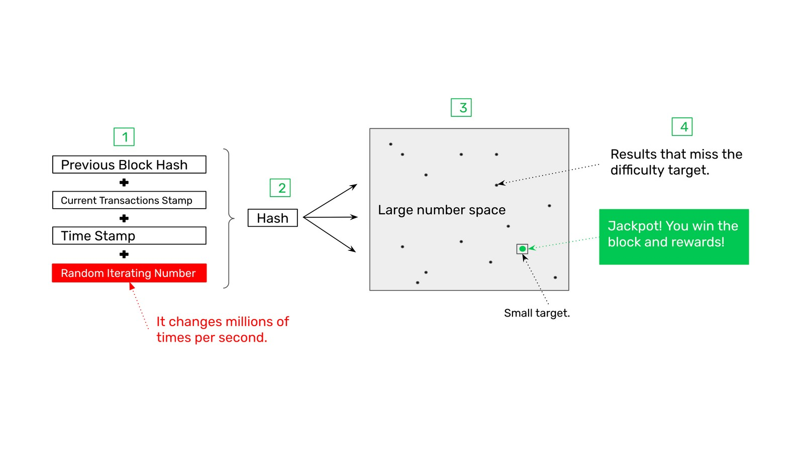
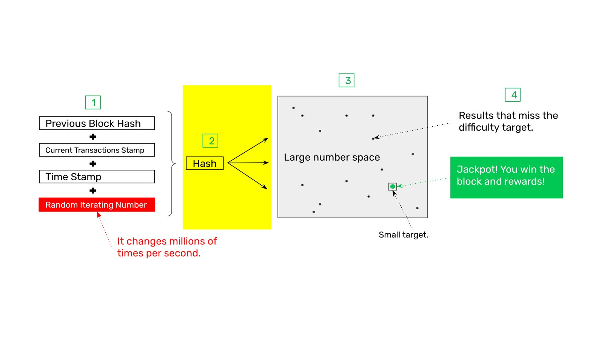
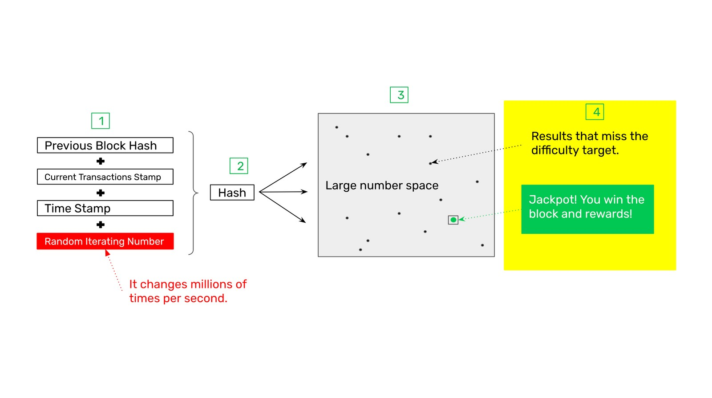

---
**您可以由此收听或观看本期内容:**

<iframe width="560" height="315" src="https://www.youtube.com/embed/zi0w6NGpIqI" title="YouTube video player" frameborder="0" allow="accelerometer; autoplay; clipboard-write; encrypted-media; gyroscope; picture-in-picture; web-share" allowfullscreen></iframe>

---

## 中本聪共识

区块链行业最重要的发明是比特币和以太坊经典使用的基于工作量证明的共识机制。

它被称为“中本共识”，是世界各地数以万计的计算机以真正去中心化的方式就网络的最新状态达成协议的唯一方式。

它实现这一点的方式是让计算机器(也被称为矿工)做大量的工作，消耗大量的电力，来构建交易数据块，然后将其包含在数据库中。

该过程包括网络接收新交易;将它们传输到系统中的所有参与节点;然后在所有节点上复制相同的事务数据库;这种复制是由矿工实现的，他们使用工作量证明来使用昂贵的加密印章来密封批量交易;用这些邮票产生昂贵的交易块，然后他们发送到网络的其他部分;然后，网络验证区块，矿工通过系统的加密货币获得报酬，该系统有固定的供应量，使其听起来和有价值。

## 什么是密码戳?

加密戳或哈希是一种过程，通过哈希函数，任何任意数据都可以转换为一个固定的大数字。

例如，单词“Hello”可以转换为数字:

`0b8a44ac991e2b263e8623cfbeefc1cffe8c1c0de57b3e2bf1673b4f35e660e8
9abd18afb7ac93cf215eba36dd1af67698d6c9ca3fdaaf734ffc4bd5a8e34627`

无论输入是大是小，函数总是会生成一个大的数字来表示给定的数据。

对于任何计算机来说，通过对所提供的数据执行哈希函数来验证哈希是非常容易的。

## 什么是区块的链？

当对数据块进行哈希处理时，加密戳可能是数据块链的一部分，通过按顺序哈希连接加密戳。

例如，如果我们有区块1的哈希，那么我们可以哈希它，然后得到区块2的哈希，然后是区块3，区块4，无限地类推。这就是在ETC等区块链中创建相关交易区块链的方式，因此得名。

## 工作量证明是如何运作的

ETC中的工作量证明系统由四个部分组成:

1. 需要戳的区块数据
2. 创建哈希(创建加密戳)
3. 目标范围(也称为难度)
4. 头奖(达到目标或难度范围)

## 1. 需要戳的区块数据

每个区块中要戳的数据非常重要，因为它包括三个关键信息和一个独立的随机迭代数，用于在前一个戳不起作用的情况下更改戳(参见第3点)。目标范围，如下)。

这三个关键的信息是:在区块链中创建新链接的前一个区块哈希，确保每个区块都被包括在内的当前交易的戳，以及收集区块交易的时刻戳。

## 2. 创建哈希(创建密码戳)

一旦四部分数据被矿机放在一起，那么它将使用网络算法规定的哈希函数创建该数据的加密戳或哈希。

这样做之后，它将检查哈希是否成功，如果不是(参见第3点)。目标范围，下面)，然后它将返回并改变随机迭代数，并再次尝试。

## 3. 目标范围（也称为难度）

每次对区块数据进行散列，都会生成一个数字，如果这个数字没有达到由网络协议确定的小目标范围，那么它将失败，矿工必须使用不同的随机迭代数字再次尝试。这是每秒数百万次，因为大多数戳记都失败了，这是工作量证明中的“工作”，成本很高，消耗大量电力。

但是，如果加密戳达到目标范围，则散列成功。

## 4. 头奖! (击中目标或难度范围)

当矿工在数百万或数万亿次尝试后达到目标范围时，那么它就有资格获得该区块的奖励。

为了获得奖励，矿工必须立即将区块发送到网络的其他部分进行验证。当区块被验证时，意味着所有的交易、数据和哈希都是正确的，然后网络将奖励支付记入矿工的账户。

## 工作量证明的功能

基于工作量证明的中本共识的革命性特征如下:

**1.** 因为网络中所有节点唯一接受的下一个区块将是已经完成所有工作的区块，所以所有节点很容易每15秒就决定使用相同的区块。任何由冒名顶替者发送的未完成工作的替代块将始终被消除。

**2.进入、退出和再进入的焦点:** 相同的信息，矿工所做的大量工作，确保系统中所有机器之间每15秒就能达成完美的共识，这是相同的信息，可以被任何新进入系统的人使用，或者任何离开然后想再次进入的机器使用，只需验证工作已经完成，就可以知道哪个是正确的区块链。任何提议的冒名顶替者链，没有做的工作将永远被淘汰。

**3.对所有交易历史的保护:** 对于任何已经发送并包含在ETC中的区块中的交易，要撤销或删除，必须再次执行为包含它所做的相同数量的工作。这可以防止任何攻击者逆转过去的事务，并且旧的事务越难逆转或删除。

**4.创建区块的成本等于创建货币的成本:** 如上所述，只有当矿工完成了哈希或标记区块所需的工作时，才会向他们支付奖励，因此创建区块的成本与创建货币相同。这使得加密货币的声音和吸引力。

## 工作量证明的好处

上面提到的基于工作量证明的中本共识的特点结合在一起产生了以下好处:

**去中心化:** 在完全隔离的情况下，无需与任何人协商，世界上任何地方的网络节点都可以通过检查工作证明来知道哪个是要添加到链中的最新区块，或者哪个是要加入的正确链。这使得系统的去中心化达到了前所未有的水平。

**无权限:** 因为世界上任何人，不需要咨询其他人，只要有互联网连接并检查工作证明，就可以随时加入和离开链，因此系统是完全无权限的。没有需要实现的过滤器、许可证或权限。

**审查阻力:** 当系统变得去中心化和无许可时，审查系统的能力就会消失。没有办法阻止参与者参与或将交易发送到网络。

**不可变性:** 因为工作量证明共识需要做很多工作来构建区块链，那么实际上不可能由第三方任意更改过去的交易、账户、余额或智能合约。

---

**感谢您阅读本期文章!**

了解更多有关ETC内容，请访问: https://ethereumclassic.org

