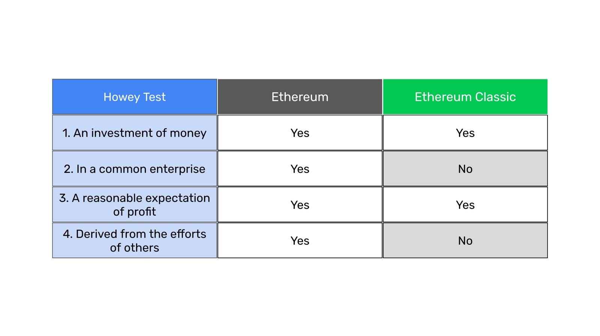
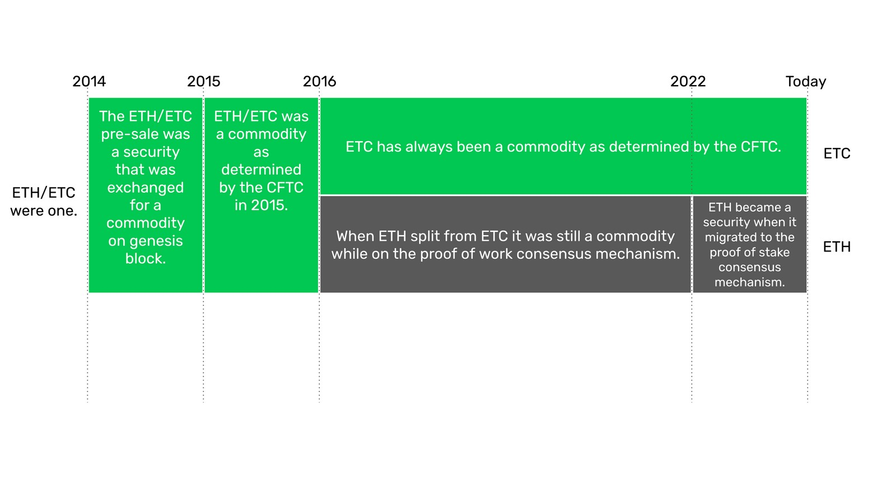
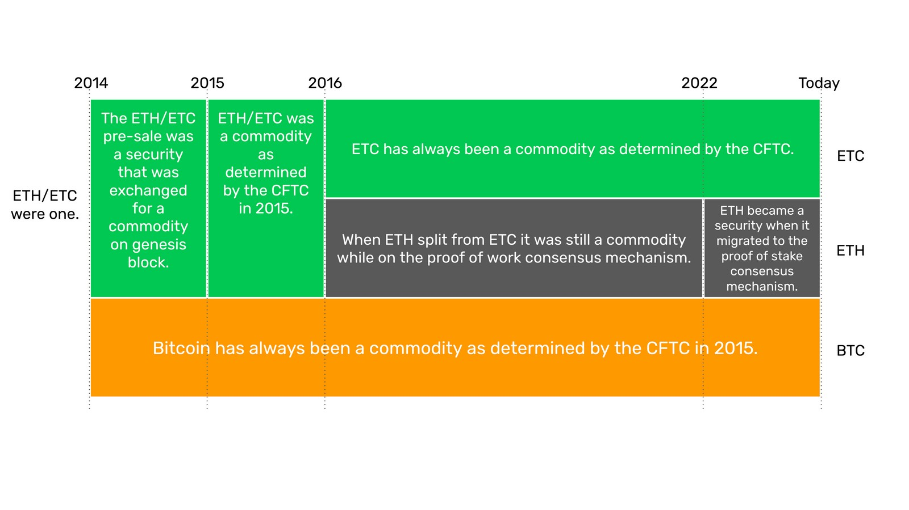

---
**You can listen to or watch this video here:**

<iframe width="560" height="315" src="https://www.youtube.com/embed/gn7OO_qXhwI" title="YouTube video player" frameborder="0" allow="accelerometer; autoplay; clipboard-write; encrypted-media; gyroscope; picture-in-picture; web-share" allowfullscreen></iframe>

---

## The Howey Test

To determine whether a unit of value, contract, or transaction is a security the U.S. Securities and Exchange Commission (SEC) [uses](https://www.sec.gov/corpfin/framework-investment-contract-analysis-digital-assets) what is called the Howey test, which was the basis for a ruling by the Supreme Court in 1946 that defined what is a security.

Under the test, a unit of value, contract, or transaction qualifies as a security if it has the following elements:

1. An investment of money
2. In a common enterprise
3. A reasonable expectation of profit
4. Derived from the efforts of others

Bitcoin (BTC) and Ethereum (ETH), and thus Ethereum Classic (ETC) after Ethereum split from it in 2016, were determined to [be commodities](https://www.cftc.gov/digitalassets/index.htm) by the Commodity Futures Trading Commission (CFTC) in 2015 because they were decentralized, therefore had no common enterprise directing them and their returns were not derived from the efforts of others.

The question is whether Ethereum, now under its proof of stake (PoS) consensus mechanism, still qualifies as a commodity.

## Comparing ETC and ETH Using the Howey Test

The table above serves to compare ETH and ETC as to how they fare with regards to the Howey test.

As seen in the table, in our opinion Ethereum now passes the test, therefore should be categorized as a security, because it involves all four elements while ETC is still a decentralized project so it should remain a commodity.

In the following sections we explain our comparison and rationale.

### 1. An Investment of Money:

In the first element of the Howey test, it is clear that both ETH and ETC are an investment of money in a unit of value. Many people use both cryptocurrencies just as way to pay for things, thus as units of exchange rather than as investments, but for many others they are stores of value and ways of trading in the market for profit.

### 2. In a common enterprise: 

Since its migration to proof of stake in September of 2022, ETH is a common enterprise because proof of stake is centralized. The model uses capital instead of proof of work based mining to determine who produces blocks. This makes the staking business have strong economies of scale which inexorably concentrate the industry into very few and entrenched staking pools. 

These pools may filter who may stake and/or who may be part of their validator set, or may be the node operators themselves who validate blocks and transactions. 

These few entities will remain mostly static. Seldom will any rotate away from the industry because of the moat inherent to their business models. They will act in conjunction with the Ethereum Foundation and, coordinating together, will clearly form a common enterprise directing the future of the system.

This level of centralization in Ethereum combined with the lack of cryptographic stamps when producing blocks without proof of work completely eliminates the chain selection point, thus nullifying the attributes of free exit and entry, permissionlessness, censorship resistance, and immutability without which Ethereum becomes a common enterprise with traditional centralized features and controls.

Ethereum Classic, however, remains a commodity because it uses and will continue to use the decentralized proof of work method of consensus for the foreseeable future. 

Therefore, there are not and can never be enterprises or groups that control ETC. Mining the coin and owning the coin will always be totally separate activities.

ETC has no foundation directing the roadmap of the system, and producing or verifying blocks are free, decentralized, and merit based activities.

### 3. A reasonable expectation of profit: 

As said before, although both ETH and ETC may be used purely as units of exchange, they may also be used as a store of value for price appreciation, therefore both qualify as having a reasonable expectation of profit.

### 4. Derived from the efforts of others: 

For the same reasons that Ethereum is now a common enterprise it is also a system where the expectation of the success of the system, and thus its future profits, are derived from the efforts of others. 

These “others” will be perfectly identifiable, as they will be 4 or 5 large staking pools and the Ethereum Foundation, and all together will act as a single enterprise. 

The PoS system is not a free merit system as PoW but a totally collaborative partnership between the pools and the validators, and the validators are essentially the same as the pools because they are their submissive contractors.

In the system, validators divide their tasks on a per block basis where one produces a block, then sends it to the other validators who vote on the block, and then send it to the the rest of the network who must accept them without objection.

Because ETC is PoW and decentralized, miners may pop up or leave whenever they want from anywhere in the world, compete to build blocks in their complete isolation, send them to the rest of the network for verification, and get paid based on their sole merit. No other filters or conditions exist. 

In ETC, the same reasons why it was a commodity before remains today: There is no common enterprise, therefore the future value of the token is just determined by future general adoption by the market, but not from a defined and collaborative group of centralized pool operators or managers as in Ethereum.

## A Historical Perspective of ETC’s and ETH’s Legal Status

From 2014 to 2016 both Ethereum and Ethereum Classic were one project, so we refer to them in this period as ETH/ETC. 

The project was financed with a crowdsale. Based on the Howey test it may be inferred that the ETH/ETC [crowdsale was, indeed, a security](https://twitter.com/WendellMoone/status/1623760982672564226). 

It was [founded](https://en.wikipedia.org/wiki/Ethereum) by Vitalik Buterin; then he partnered with several individuals to form a group of co-founders; they promised the expectation of profits out of the investment; created a foundation with the name of the network, even registering its trademarks; sold a unit of value previous to the creation of the cryptocurrency to gather funds for development; and promoted the crowdsale and Ethereum’s features, benefits, and appreciation potential just like any initial public offering of a stock would have been promoted.

However, this status as a security was likely limited to the period between the crowdsale and the launch of the network on July 30th of 2015. 

On July 30th of 2015, the initial securities of the project were transformed into the ETH cryptocurrency, which was subsequently categorized as a commodity by the CFTC.

This step may be interpreted to be an exchange and exit of the initial common enterprise between investors, Vitalik Buterin, his partners, and the Ethereum Foundation as the director of the project.

From there, the project became a truly decentralized, proof of work based, public blockchain. 

Even after Ethereum split from the ETC mainnet in 2016 due to the TheDAO hard fork, ETH kept its decentralization because it remained a proof of work blockchain.

This period lasted until September 15th of 2022.

Beginning September 15th of 2022, Ethereum cannot be described as a decentralized project because it migrated to Proof of Stake. Indeed, the moment it migrated, 51% of the blocks were censored by mega-staking pools to comply with international sanctions imposed by the U.S. Office of Foreign Assets Control (OFAC). A few months later, up to 70% of its blocks were censored.

As said before, PoS depends on large and entrenched pool operators that control the network. This, together with the control and influence that the Ethereum Foundation had from before, and the fact that the developers have incredible clout in the decisions about the protocol (for example, changing the supply of the token 6 times in its history) make it a centralized project dependent on others from the units’ of value perspective.

In the meantime, Bitcoin has always maintained its status as a commodity as determined by the CFTC in 2015. ETC is functionally a commodity, just like BTC, because it has exactly the same consensus design with its decentralist guarantees.

## Conclusion

It is worth noting that anything built on top of Ethereum Classic may be a commodity or a security. As a generalized and decentralized computing system, whatever the designs of dapps, layer 2 systems, and tokens may be will determine their status.

DAOs inside ETC structured as corporate stock, bonds, or derivatives will be securities. ERC-20 tokens that create coins, meme coins, or other tokens that don’t fall under the Howey test may be classified as commodities.

However, ETC as the base layer of these technologies is still a generic commodity.

The proof of stake algorithm in Ethereum implies a constant collaboration between validators, who are contractors of the pool operators. They produce blocks, vote on these blocks, and then send them to the rest of the network who have to accept them without question.

Additionally, participation by stakers from the public or node operators to run validating clients is filtered and restricted by pool operators. There is no decentralized free entry and exit from the system, therefore it is clearly a common enterprise.

ETH/ETC went through a centralized sale process when it was promoted during the crowdfunding, but then it became a decentralized blockchain when it was launched and was a proof of work system. 

When ETH split from the ETC mainnet in 2016, ETC was separated from the main community of developers and leaders of the Ethereum Foundation and became even more decentralized at the social layer. This is when its Code Is Law principle was established.

ETC never had a defined group of promoters. In fact, all the different groups of constituents in ETC rotate and migrate constantly.

For all the reasons stated above, we conclude that Ethereum Classic remains a commodity while Ethereum has reverted to being a security.

---

**Thank you for reading this article!**

To learn more about ETC please go to: https://ethereumclassic.org
