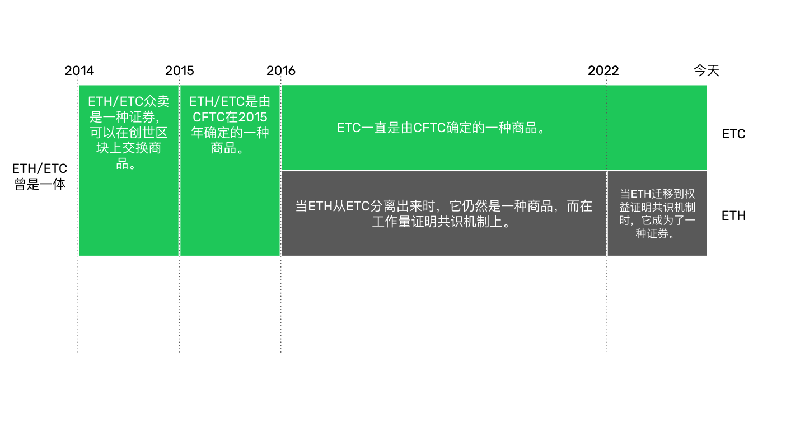

---
**您可以由此收听或观看本期视频:**

<iframe width="560" height="315" src="https://www.youtube.com/embed/gn7OO_qXhwI" title="YouTube video player" frameborder="0" allow="accelerometer; autoplay; clipboard-write; encrypted-media; gyroscope; picture-in-picture; web-share" allowfullscreen></iframe>

---

## Howey测试

为了确定一个价值单位、合同，或交易是否是证券，[美国证券交易委员会(SEC)](https://www.sec.gov/corpfin/framework-investment-contract-analysis-digital-assets)使用所谓的Howey测试，这是1946年最高法院裁定什么是证券的基础。

根据测试，如果一个价值单位、合同或交易具有以下要素，那么它就有资格成为证券:

1. 金钱投资
2. 在一个普通企业中
3. 合理的利润预期
5. 源自其他人的努力

比特币(BTC)和以太坊(ETH)，以及以太坊在2016年从以太坊分离出来后的以太坊经典(ETC)，在2015年被商品期货交易委员会(CFTC)确定为[商品](https://www.cftc.gov/digitalassets/index.htm)，因为它们是去中心化的，因此没有共同的企业指导它们，它们的回报不是来自其他人的努力。

问题是，以太坊现在在其权益证明(PoS)共识机制下，是否仍然有资格作为一种商品。

## 使用Howey检验比较ETC和ETH

上表用于比较ETH和ETC在Howey测试中的表现。

如表中所示，在我们看来，以太坊现在通过了测试，因此应该被归类为证券，因为它涉及所有四个元素。但是由于ETC仍然是一个去中心化的项目，因此它应该仍然是一种商品。

在下面的部分中，我们将解释我们的比较和基本原理。

### 1.金钱投资:

在Howey测试的第一个元素中，很明显，ETH和ETC都是对一个价值单位的货币投资。许多人使用这两种加密货币只是作为一种支付方式，因此是一种交换单位，而不是投资。但对许多人来说，它们是价值储存和在市场上进行利润交易的方式。

### 2.在一个普通企业中:

自2022年9月迁移到股权证明以来，ETH是一个常见的企业，因为股权证明是集中的。该模型使用资本而不是基于工作量证明的挖掘来确定谁生产区块。这使得押注业务具有强大的规模经济，不可避免地将该行业集中到极少数且根深蒂固的押注池中。

这些池可以过滤谁可能参与和/或谁可能是验证器集的一部分，或者可能是验证块和事务的节点操作符本身。

这几个实体将是静态的，这意味着他们很少会从行业中轮换，因为他们业务的壕沟，他们将与以太坊基金会协调行动，所有这些结合起来将明显形成一个共同的企业，指导系统的未来。

这种程度的中心化，以及在生产区块时缺乏工作量证明加密戳，完全消除了链的选择点，从而使以太坊具有自由进出、无许可、抗审查和不可更改的属性，使其成为具有传统中心化功能和控制的常见企业。

ETC仍然是一种商品，因为在可预见的未来，它仍然是工作量证明(PoW)。

因此，不会也永远不会有企业或集团来控制ETC，挖矿和拥有比特币将永远是完全独立的活动。

ETC没有指导系统路线图的基础，区块的生产或验证是自由的、去中心化的、基于价值的活动。

### 3.合理的利润预期:

如前所述，虽然ETH和ETC都可以纯粹用作交换单位，但它们也可以用作价格升值的价值储存，因此两者都有合理的利润预期。

### 4. 源自其他人的努力: 

由于同样的原因，以太坊现在是一个普通的企业，它也是一个系统，在这个系统中，对系统成功的期望，以及它未来的利润，都来自于其他人的努力。

这些“其他人”将是完全可识别的，因为它们将是4或5个大型赌注池和以太坊基金会，所有这些都将作为一个单一的企业。

PoS系统不是像PoW那样的绩效系统，而是池和验证者之间的完全协作伙伴关系，验证者本质上与池相同，因为他们之间是承包商的关系。

在系统中，验证者以每个区块为基础划分任务，其中一个生成一个区块，然后将其发送给对区块进行投票的其他验证者，然后将其发送给网络的其余部分，这些网络必须无异议地接受它们。

因为ETC是PoW和去中心化的，矿工可以随时从世界任何地方出现或离开，在完全隔离的情况下竞争构建区块，将它们发送到网络的其他地方进行验证，并根据他们唯一的优点获得报酬。不存在其他过滤器或条件。

在ETC中，它以前是一种商品的原因今天仍然存在:没有共同的企业，因此代币的未来价值只是由市场未来的普遍采用来决定，而不是像以太坊那样由一个定义好的集中式池运营商或管理者组成的协作组来决定。

## 以历史角度解读ETC和ETH法律地位

从2014年到2016年，以太坊和以太坊经典都是一个项目，所以我们在这段时间称之为ETH/ETC。

这个项目的资金来自众筹。根据Howey检验，可以推断ETH/ETC[众卖确实是一种证券](https://twitter.com/WendellMoone/status/1623760982672564226)。

它由Vitalik Buterin[创立](https://en.wikipedia.org/wiki/Ethereum);然后，他与几个人合作，组成了一个联合创始人小组;他们承诺期望从投资中获得利润;用网络的名字创建了一个基金会，甚至注册了它的商标;在加密货币创建之前出售一个单位的价值，以筹集开发资金;并推广了众筹和以太坊的功能、好处和升值潜力，就像任何首次公开发行股票一样。

然而，这种证券的地位可能仅限于众筹和2015年7月30日网络推出之间的这段时间。

2015年7月30日，该项目的初始证券转换为ETH加密货币，随后被CFTC归类为商品。

这一步可以解释为投资者、Vitalik Buterin及其合作伙伴和以太坊基金会作为项目总监之间的初始共同企业的交换和退出。

从这里开始，这个项目变成了一个真正去中心化、基于工作量证明的公共区块链。

即使以太坊在2016年因DAO硬分叉从ETC主网中分离出来，ETH仍然保持着去中心化，因为它仍然是工作证明区块链。

这段时间一直持续到2022年9月15日。

从2022年9月15日开始，以太坊不能被描述为一个去中心化的项目，因为它迁移到了权益证明。事实上，在它迁移的那一刻，51%的区块受到了大型赌注池的审查，以遵守美国外国资产控制办公室(OFAC)实施的国际制裁。几个月后，多达70%的区块被审查。

如前所述，PoS依赖于控制网络的大型和根深蒂固的池运营商。这一点，加上以太坊基金会以前拥有的控制和影响力，以及开发人员在协议决策中具有令人难以置信的影响力(例如，在其历史上改变了6次令币的供应)，使其成为一个从单位价值角度依赖于其他人的集中式项目。

与此同时，比特币一直保持着CFTC在2015年确定的商品地位，ETC在功能上也是一种商品，就像BTC一样，因为它具有完全相同的共识设计和去中心化保证。

## 总结

值得注意的是，任何建立在以太坊经典之上的东西都可能是一种商品或证券。作为一个广义和去中心化的计算系统，无论dapp、第二层系统和令牌的设计如何，都将决定它们的地位。

ETC内部结构为公司股票、债券或衍生品的DAO都将是证券。ERC-20代币可以创建币、迷因币或其他不属于Howey测试的代币，它们可以被归类为商品。

然而，ETC作为这些技术的基础层仍然是一种通用商品。

以太坊中的权益证明算法意味着验证者之间的持续合作，验证者是池运营商的承包商。他们生产区块，对这些区块进行投票，然后将这些区块发送给网络的其他部分，这些部分必须毫无疑问地接受它们。

此外，来自公共或节点操作员的涉众对运行验证客户端的参与将被池操作员过滤和限制。没有去中心化的自由进出系统，因此它显然是一个普通的企业。

ETH/ETC在众筹期间的推广过程中经历了一个中心化的销售过程，但随后它在推出时就变成了一个去中心化的区块链，是一个工作量证明系统。

当ETH在2016年从ETC主网中分离出来时，ETC从以太坊基金会的开发者和领导者的主要社区中分离出来，在社交层变得更加去中心化。这就是它的“代码即法律”原则确立的时候。

ETC从来没有一个明确的启动者群体。事实上，ETC中所有不同的组成部分都在不断地轮换和迁移。

基于上述所有原因，我们得出的结论是，以太坊经典仍然是一种商品，以太坊是一种证券。
---

**感谢您阅读本期文章!**

了解更多有关ETC内容，请访问: https://ethereumclassic.org
