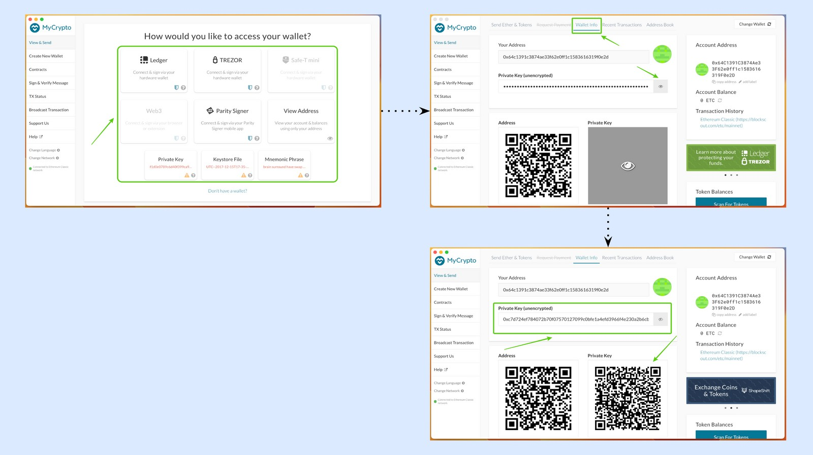
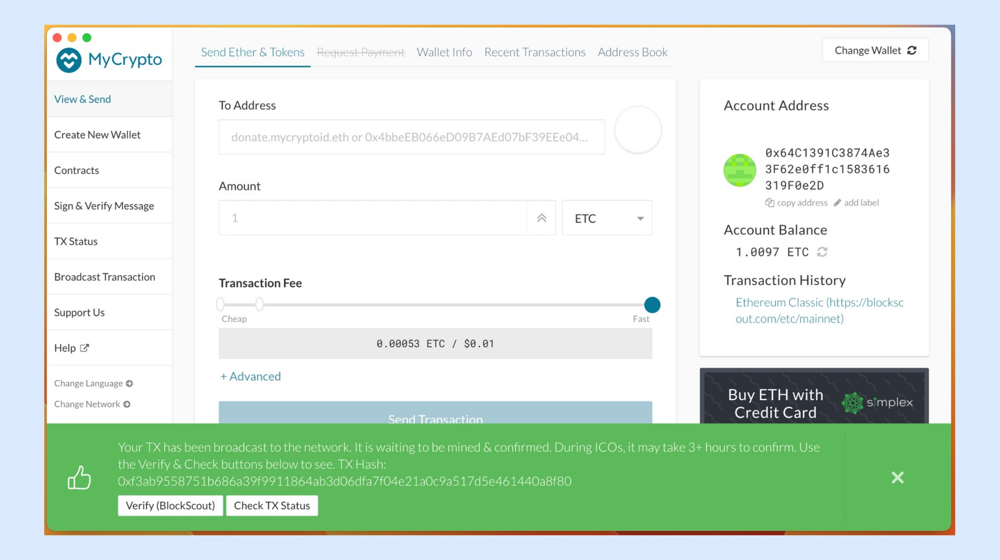

---
**You can listen to or watch this video here:**

<iframe width="560" height="315" src="https://www.youtube.com/embed/o4n6pqRyA1c" title="YouTube video player" frameborder="0" allow="accelerometer; autoplay; clipboard-write; encrypted-media; gyroscope; picture-in-picture; web-share" allowfullscreen></iframe>

---

MyCrypto is a special kind of wallet app because it offers multiple services and even connects to other wallets.

In this post we will explain how to connect MyCrypto to the Ethereum Classic (ETC) network, see wallet information, reveal private keys, check transactions, send ETC to other addresses, create new addresses, and just view address information without connecting the private keys. 

## 1. Download MyCrypto

The first step is to download MyCrypto into your computer by going to:

https://mycrypto.com/

Then open it.

## 2. Change the default network to Ethereum Classic

The default network in MyCrypto is Ethereum. To use it with ETC you need to change the network. To do so follow these steps:

1. Click on “Change Network” at the bottom of the left menu.
2. On the same menu, a list of networks will appear where you will see that Ethereum is selected.
3. Click on Ethereum Classic.
4. You will note at the bottom of the left menu that ETC is now the default chain.

## 3. See wallet information

To see the information of your ETC wallets, you need to connect the wallet type you use (Ledger, Trezor, Parity Signer, raw private key, keystore file, or mnemonic phrase) by clicking on the appropriate button.

When you connect your wallet from any of the types you use, you will land on the same default page for all of them.

To simply see wallet information of any address, click on the top menu the button that says “Wallet Info”.

## 4. Reveal private keys

To reveal the private keys of any of your ETC addresses from any type of wallet you use, select the type of wallet and connect the address you wish to use.

Then, click on “Wallet Info”.

You will note that there is a field with the hidden private key for your address. Click on the eye icon on the right of that field to reveal your private key for that address.

Below you will see that a QR code for that address is also revealed.

## 5. Check transactions

To see a list of your recent transactions that you made using MyCrypto, select the wallet type you wish to use and connect the address you want to check transactions for.

In the next screen, select the “Recent Transactions” button on the top menu.

In the next screen you will see the recent transactions for that address.

## 6. Send ETC to other addresses

To send ETC to other addresses, select the wallet type you will use. Then, click on the “Send Ether & Tokens” button on the top menu.

In the next screen paste the address you wish to send ETC to in the “To Address” field and set the amount you wish to send.

Then, press “Send Transaction”. 

In the next step, you need to check the transaction details. If they are ok, then press “Send”.

In the next screen, MyCrypto will show you a message with the transaction information and give you links to verify or check your sent transaction. 

## 7. Create more addresses with keystore files

In MyCrypto you may create more addresses using the wallet types you use (e.g. Ledger, Trezor, Parity Signer, keystore file, or mnemonic phrase). To create more addresses with Ledger, Trezor, or Parity Signer follow the respective product’s guidelines. To create a new wallet using a keystore file, do the following:

1. Select “Create New Wallet” on the left menu.
2. In the next screen select “Generate a Wallet”.
3. In the next step, select “Generate a Keystore File”.

4. In the next screen, MyCrypto will ask you to create a 12 character password for this particular keystore file (remember to record this password somewhere safe as without it there is no way to access your address).
5. In the next step, press “Download Keystore File” when you are ready.
6. The next step is to save the file on your computer. Press “Save”.

Now you have a new address in a new keystore file on your computer.

### Extra Paper Wallet

As an option, MyCrypto automatically creates and shows you a paper wallet associated with your keystore file. If you wish to use this address as a paper wallet, then press “Save Paper Wallet”.

In the next step, save the paper wallet on your computer as you saved your keystore file before.

If you prefer not to store a paper wallet for this address and only use the keystore file, then you can just discard this page and move on to use MyCrypto.

## 8. Generate a new secret passphrase

In the same way that you may create a new address using a keystore file, you may create more addresses with a mnemonic phrase, also known as secret passphrase.

To generate a new 12 word secret passphrase do the following:

1. Select “Create New Wallet” on the left menu.
2. In the next screen select “Generate a Wallet”.
3. In the next step, select “Generate a Mnemonic Phrase.

4. In the next screen, MyCrypto will show you your new 12 word secret passphrase. Write it down and, after the initial setup, put it away in a safe place as it is the only way to control and recover your addresses. Press “Confirm Phrase”.
5. In the next screen, select the correct order of the words in the form provided to confirm that you have written them correctly.
6. Once completed, press “Confirm Phrase”.

## 9. Just view addresses without using the private keys

To view an address’ simple information such as the assets and balances, you may use it without your private key.

To just view addresses without using the private keys go to “View & Send” in the left menu of MyCrypto.

Then, enter the address you wish to check information for and press “View Address”.

In the next screen you will see the address information.

---

**Thank you for reading this article!**

To use ETC with MyCrypto please go to: https://mycrypto.com

To learn more about ETC please go to: https://ethereumclassic.org
