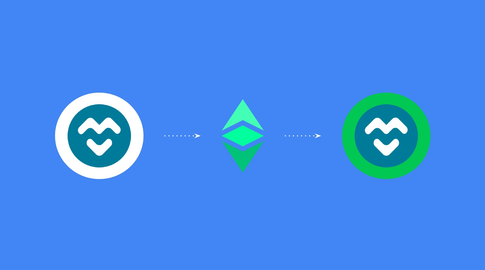
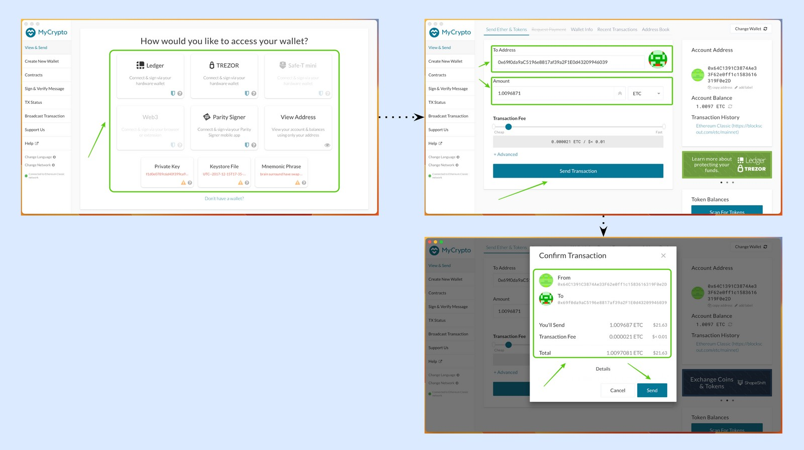
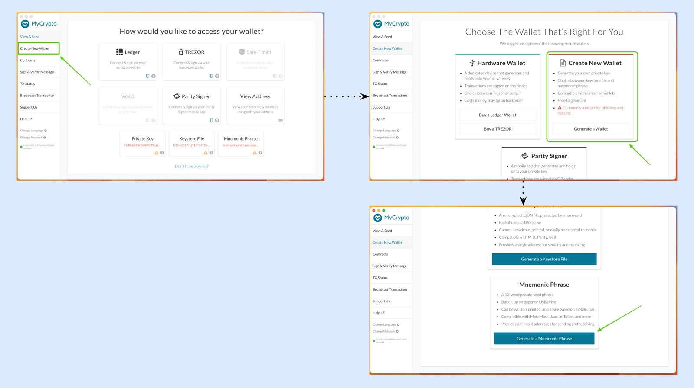
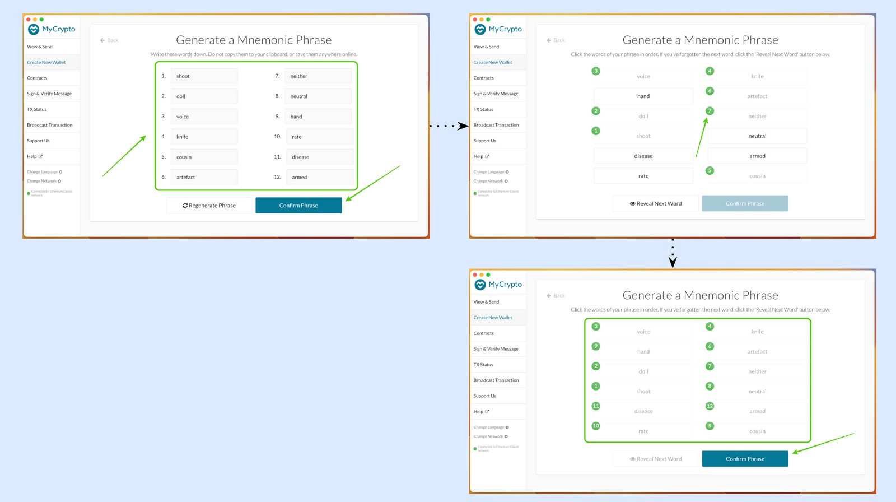
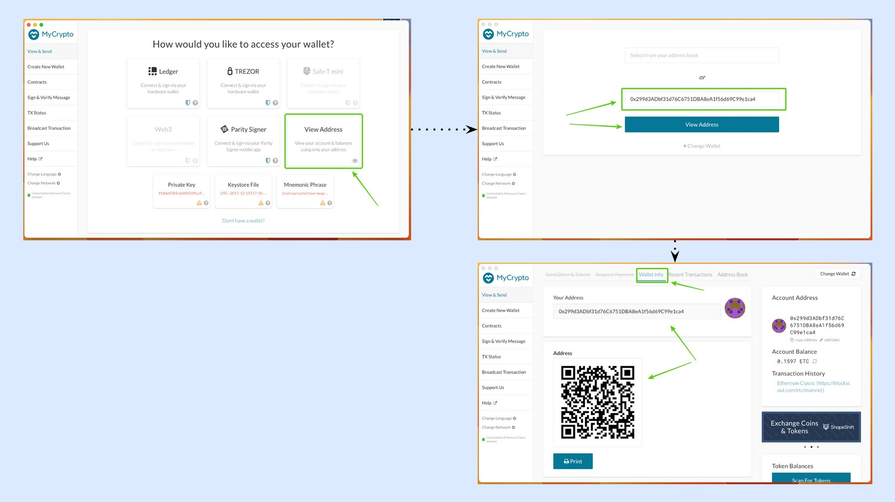

---
**您可以由此收听或观看本期视频:**

<iframe width="560" height="315" src="https://www.youtube.com/embed/o4n6pqRyA1c" title="YouTube video player" frameborder="0" allow="accelerometer; autoplay; clipboard-write; encrypted-media; gyroscope; picture-in-picture; web-share" allowfullscreen></iframe>

---

MyCrypto是一种特殊的钱包应用，因为它提供多种服务，甚至可以连接到其他钱包。

在这篇文章中，我们将解释如何将MyCrypto连接到以太坊经典(ETC)网络，查看钱包信息，显示私钥，检查交易，将ETC发送到其他地址，创建新地址，以及只查看地址信息而不连接私钥。

## 1.下载MyCrypto

将MyCrypto下载到电脑里的第一步便是访问

https://mycrypto.com/

然后打开该链接。

## 2.将默认网络设置成以太坊经典

MyCrypto的默认网络是以太坊。要在ETC上使用它，您需要改变网络。要做到这一点，请遵循以下步骤:

1. 点击左侧菜单底部的“更改网络”。
2. 在同一菜单上，将出现一个网络列表，您将看到以太坊被选中。
3. 点击以太坊经典。
4. 您将在左侧菜单底部注意到ETC现在是默认链。

## 3.查看钱包信息

要查看您的ETC钱包的信息，您需要通过单击相应的按钮连接您使用的钱包类型(Ledger, Trezor, Parity Signer，原始私钥，keystore文件或助记短语)。

当您连接您的钱包时，您将登陆到相同的默认页面。

要简单地查看任何地址的钱包信息，请单击顶部菜单上的“钱包信息”按钮。

## 4. 显示私钥

要从您使用的任何类型的钱包中显示您的任何ETC地址的私钥，请选择钱包类型并连接您希望使用的地址。

然后，点击“钱包信息”。

您将注意到有一个字段包含您的地址的隐藏私钥。单击该字段右侧的眼睛图标，显示该地址的私钥。

## 5.检查交易

要查看您使用MyCrypto进行的最近交易的列表，请选择您希望使用的钱包类型并连接您想要检查交易的地址。

在下一个屏幕中，选择顶部菜单上的“Recent Transactions”（最近交易）按钮。

在下一个屏幕中，您将看到该地址的最近交易。

## 6.发送ETC到其他地址

要将ETC发送到其他地址，请选择您将使用的钱包类型。然后，点击顶部菜单上的“发送以太币和代币”按钮。

在下一个屏幕中，将您希望发送ETC的地址粘贴在“to address”字段中，并设置您希望发送的金额。

然后，按“发送交易”。

在下一个屏幕中，MyCrypto将向您显示带有交易信息的消息，并为您提供验证或检查您发送的交易的链接。

## 7.使用密钥存储文件创建更多地址

在MyCrypto中，您可以使用您使用的钱包类型(例如分类帐，Trezor，奇偶校验签名者，keystore文件或助记短语)创建更多地址。要使用Ledger、Trezor或Parity签名者创建更多地址，请遵循各自产品的指导方针。要使用密钥存储文件创建一个新的钱包，请执行以下操作:

1. 在左侧菜单中选择“创建新钱包”。
2. 在下一个屏幕中选择“Generate a Wallet”（生成钱包）。
3.在下一步中，选择“Generate a Keystore File”（生成密钥存储文件）。

4. 在下一个屏幕中，MyCrypto将要求您为这个特定的密钥存储库文件创建一个12个字符的密码(请记住将此密码记录在安全的地方，因为没有它就无法访问您的地址)。
5. 在下一步中，当您准备好时，按“下载密钥存储库文件”。
6. 下一步是将文件保存到计算机上。按“保存”。

现在，您在计算机上的一个新的密钥存储库文件中有了一个新地址。

### 额外的纸质钱包

作为一个选项，MyCrypto会自动创建并显示与密钥存储库文件相关联的纸质钱包。如果您希望使用此地址作为纸钱包，请按“保存纸钱包”。

在下一步中，将纸质钱包保存在计算机上，就像之前保存密钥存储库文件一样。

如果您不愿意为这个地址存储纸质钱包，而只使用密钥存储库文件，那么您可以丢弃这个页面并继续使用MyCrypto。

## 8.生成一个新的秘密密码

与使用密钥存储文件创建新地址相同，可以使用助记短语(也称为秘密密码短语)创建更多地址。

要生成一个新的12个单词的秘密密码，请执行以下操作:

1. 在左侧菜单中选择“创建新钱包”。
2. 在下一个屏幕中选择“Generate a Wallet”（生成一个钱包）。
3. 在下一步中，选择“生成一个助记短语”。

4. 在下一个屏幕中，MyCrypto将向您显示新的12个单词的秘密密码。把它写下来，在初始设置后，把它放在一个安全的地方，因为这是唯一的方法来控制和恢复您的地址。按“确认短语”。
5. 在下一个屏幕中，选择所提供表单中单词的正确顺序，以确认它们的书写正确。
6. 完成后，按“确认短语”。

## 9.只查看地址而不使用私钥

如要查看地址的简单资料，例如资产及结余，你可以在没有私钥的情况下使用该地址。

要查看地址而不使用私钥去“查看和发送”在MyCrypto的左侧菜单。

然后，输入你想查看的地址，按“查看地址”。

在下一个屏幕中，您将看到地址信息。

---

**感谢您阅读本期内容！**

通过MyCrypto使用ETC，请访问: https://mycrypto.com

了解更多有关ETC，请访问: https://ethereumclassic.org
