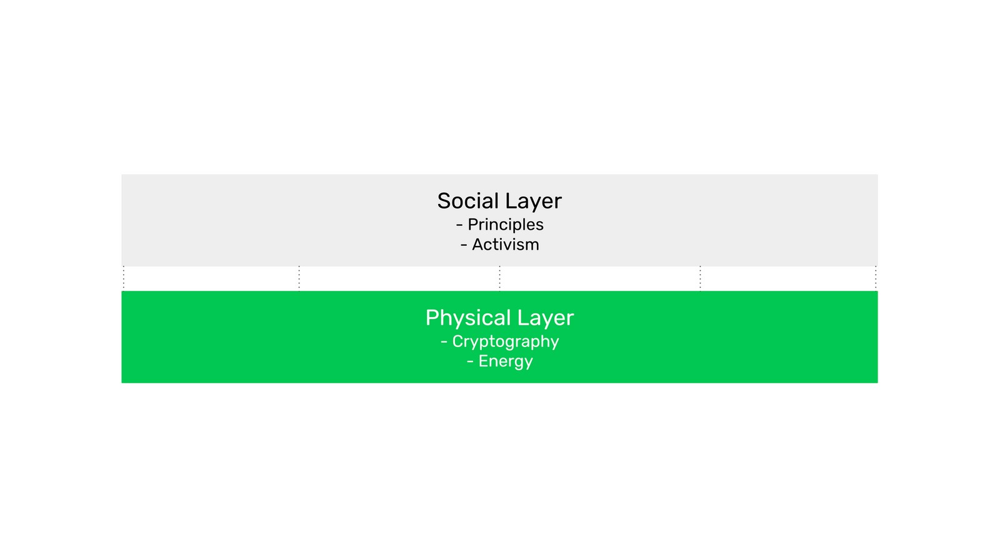

---
**You can listen to or watch this video here:**

<iframe width="560" height="315" src="https://www.youtube.com/embed/0FPTokHcgAE" title="YouTube video player" frameborder="0" allow="accelerometer; autoplay; clipboard-write; encrypted-media; gyroscope; picture-in-picture; web-share" allowfullscreen></iframe>

---

## 1. The Complete Security Model of Ethereum Classic

In past classes we have explained how Satoshi Nakamoto invented the proof of work (PoW) based consensus mechanism, what are its revolutionary features and benefits of decentralization, and how the mechanism works in detail.

However, Nakamoto Consensus alone is not the complete security model of a blockchain as Ethereum Classic (ETC). Proof of work is the most important safety barrier of the live operating network, but the operators themselves, who constitute what we call the social layer, collectively represent the other critical layer.

In this class we will explain what are the physical and social layers, their security models in more detail, how they work combined, and what are the possible attack types in each layer.

## 2. The Physical Layer vs the Social Layer 

The physical layer, which is the live operating network, is the most well known and consists of the protocol rules, the software clients that people must run in their machines to participate, cryptography, and the energy PoW uses that protects the blockchain.

The social layer consists of all the node operators (e.g. exchanges, wallets, dapps, startups, Node as a Service (NaaS) providers, block explorers, and independent participants), mining pools, and independent miners. It also includes the developers who conduct research and development to advance the protocol and fix bugs when necessary. All these constituents, plus users and investors who own the native cryptocurrency, decide whether to adopt changes through an improvement proposal process and by running the protocol through software clients.

Although the physical layer may be highly secure and indestructible, the truth is that if all the constituents in the network at the social layer were to agree on bad changes or corrupt practices, they could, technically, do it. 

However, this is extremely difficult because blockchain communities are usually very conservative and principled ecosystems and there is usually ample activism that analyzes and filters proposals and potential changes. This is why the combined systems of the social and physical layers are the complete story of how Ethereum Classic is protected.

But, how do the security models in each layer work? And, how do they work combined?

## 3. Physical Layer: Proof of Work Security

As we mentioned before, proof of work is the key security component of the physical layer, or live operating network.

The way it works is that there must be demand for ETC’s decentralized computing. If there is demand, then people will buy the cryptocurrency to use it, and as an investment, making the price rise. When the ETC price rises, then mining becomes more profitable. When miners becomes more profitable, they put more machines with more hashing power to build blocks for the network. When more hashing power is dedicated to the network, then it becomes more secure. And, when ETC is more secure, then demand for its decentralized computing grows, which, in turn, makes the price go up further, continuing the virtuous circle.

## 4. Social Layer: Coordination Problem Security

On the social layer, the key security component is that for all the constituents who participate in the network (i.e. exchanges, wallets, dapps, startups, Node as a Service (NaaS) providers, block explorers, independent participants, mining pools, and independent miners); who reside in different parts of the world, in different cultures, with different languages, and different worldviews; it is extremely difficult to coordinate to attack the network, censor it, or corrupt it. 

However, the economic incentives to use the network are conducive of increased use, as demand for decentralized computing grows. If demand for decentralized computing grows, then more dapp developers will build useful things on ETC. As more useful dapps will exist on the blockchain, then more users will be attracted to it. If more users are attracted to it, then more node operators will participate. The more node operators participate, from different parts of the world, the more difficult it is to coordinate attacks, making the blockchain even more secure. And, when ETC is more secure, then demand for its decentralized computing grows, which in turn makes more dapp developers build on ETC, continuing the virtuous circle.

## 5. The ETC Security Model Combined

The way these two security virtuous circles work combined; with proof of work as the key component at the live operating network, and the coordination problem as the key component at the social layer; is that both have incentives to increase price and participation, and as both sides grow, then demand for ETC computing services grows, which increases price and participation even more.

## 6. Social Layer Attacks and Defense Mechanisms

But, what are the possible attacks at the social layer and what are the defense mechanisms?

**Proposals for bad changes:** These are fixes or upgrades that reduce decentralization. Usually these proposals need to go through the Ethereum Classic Improvement Proposal process (ECIP). The way the global ecosystem defends ETC against this type of attack is by opposing and not approving such changes, or not adopting them if for some reason they are approved.

**Censorship:** When Ethereum migrated to proof of stake, it became more than 60% censored by the US Office of Foreign Assets Control (OFAC) nearly immediately because staking pools are centralized. The way ETC prevents this is by having miners join and leave the network whenever they want, wherever they are in the world, taking advantage of the lowest electricity prices possible wherever they may be. This level of decentralization is only possible with the attributes of proof of work explained in previous classes and this is why the PoW mining business is practically impossible to capture.

**External restrictions of use:** As mining is decentralized an practically impossible to capture, then external restrictions such as know your customer (KYC) and anti-money laundering (AML) prohibitions are only effective to users in their own geographies. But, as long as transactions or a smart contracts are sent to ETC from anywhere at anytime, and they comply with protocol rules, ETC will always process and execute them. 

**Backward compatibility:** Sometimes there are upgrades that break past smart contracts. These must be stopped at the social layer and are stopped in the same way as proposals for bad changes. 

*Important: In the unlikely scenario that the worldwide social layer entirely agrees to integrate bad changes, censorship, external restrictions, or upgrades that break backward compatibility, then there would be permanent losses of security. The only recourse left by individual users would be to pursue restitution through normal traditional systems such as the legal process and law enforcement, but this would be very difficult to achieve because of the decentralized nature of the system.*

## 7. Physical Layer Attacks and Defense Mechanisms

Because proof of work is such a powerful safety mechanism, the most plausible attacks may involve the most recent transactions rather than medium to long term past activity in the network.

**51% attacks:** These attacks consist of accumulating 50% or more of the computing power of the mining sector in ETC and then sending malicious blocks where very recent transactions are deleted, thus stealing money from the victims. The best defense against this kind of attack is by increasing the computing power dedicated to the network, but this is difficult to do in the short term. The other way is to wait for more confirmations than usual to make sure that, when ETC are received, it is highly unlikely that the transactions involved  will be reversed.  

**Disruption of dapps and contracts:** Another effect of 51% attacks, which can only delete recent transactions, is that sequences of transactions and economic activity between smart contracts may be disrupted. For example, if ETC are received, then transformed into WETC to trade in a decentralized exchange, then sold for another ERC-20 token, and that ERC-20 is then used to make a payment for something, all this sequence could be disrupted if the first transaction were deleted in a future block in the next few minutes or hours.

The defense mechanism against these disruptions is the same as with the more plain and simple 51% attacks mentioned above.

*Important: If attackers were able to build a computing power larger than 50% of the mining computing base of ETC, then they could disrupt the chain with 51% attacks, disrupt dapps, and this would constitute a permanent loss for those particular transactions. The only recourse left by individual users would be to pursue restitution through normal traditional systems such as the legal process and law enforcement. This would be easier to achieve because 51% attacks involve individual attackers and their victims only and not the system as a whole.*

ETC has, indeed, suffered 51% attacks in the past, but these are much less likely now that it is the largest PoW smart contracts blockchain in the world and its hashing power has increased five times since Ethereum migrated to proof of stake.

---

**Thank you for reading this article!**

To learn more about ETC please go to: https://ethereumclassic.org
