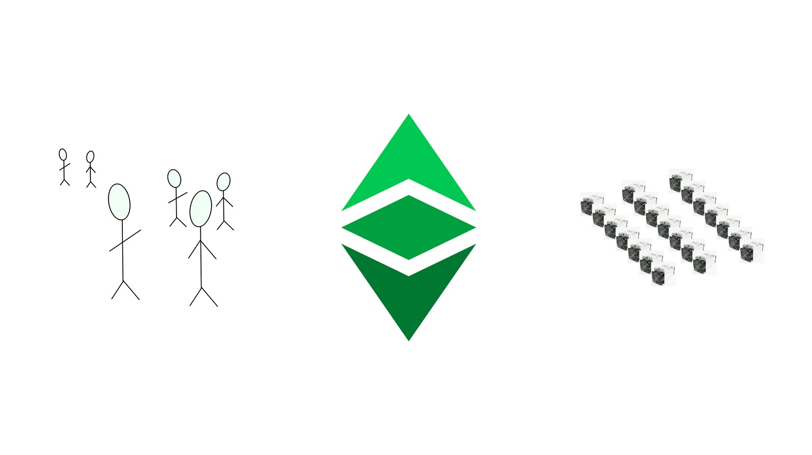
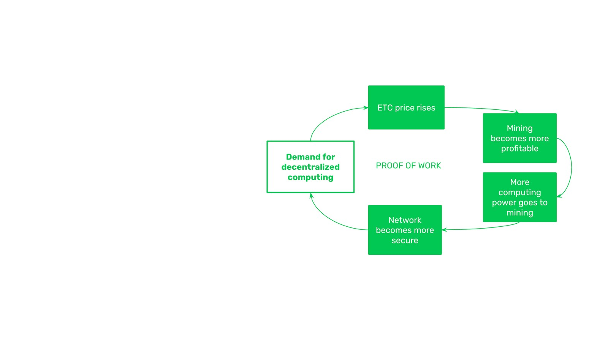
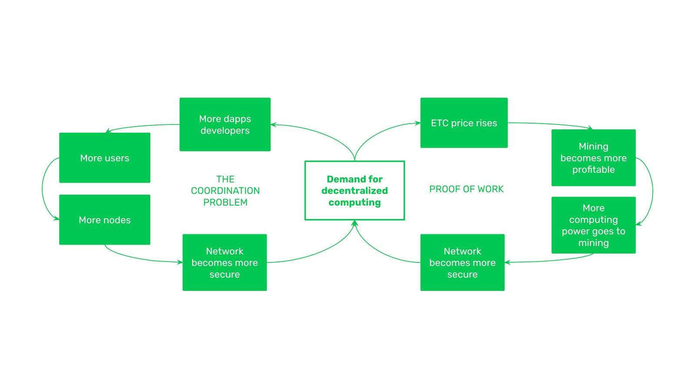

---
**您可以由此观看或收听本期视频:**

<iframe width="560" height="315" src="https://www.youtube.com/embed/0FPTokHcgAE" title="YouTube video player" frameborder="0" allow="accelerometer; autoplay; clipboard-write; encrypted-media; gyroscope; picture-in-picture; web-share" allowfullscreen></iframe>

---

## 1.以太坊经典的完整安全模型

在过去的课程中，我们已经解释了中本聪如何发明了基于工作量证明(PoW)的共识机制，它的革命性特征和去中心化的好处是什么，以及该机制是如何详细工作的。

然而，中本共识本身并不是像以太坊经典(ETC)那样的区块链的完整安全模型。工作量证明是直播运营网络最重要的安全屏障，但构成我们所说的社会层的运营者本身，共同代表了另一个关键层。

在本课程中，我们将解释什么是物理层和社会层，更详细地解释它们的安全模型，它们如何组合工作，以及每一层中可能的攻击类型。

## 2.物理层vs社会层

物理层，即实时操作网络，是最广为人知的，由协议规则、人们必须在其机器上运行才能参与的软件客户端、密码学和PoW用于保护区块链的能源组成。

社交层由所有节点运营商(如交易所、钱包、dapps、初创公司、节点即服务(NaaS)提供商、区块探索者和独立参与者)矿池和独立矿工组成。它还包括进行研究和开发以推进协议并在必要时修复错误的开发人员。所有这些组成部分，加上拥有原生加密货币的用户和投资者，决定是否通过改进建议流程和通过软件客户端运行协议来采用更改。

尽管物理层可能是高度安全且坚不可摧的，但事实是，如果社会层网络中的所有成员都同意糟糕的变化或腐败的做法，从技术上讲，他们可以做到这一点。

然而，这是极其困难的，因为区块链社区通常是非常保守和有原则的生态系统，通常有足够的行动主义来分析和过滤建议和潜在的变化。这就是为什么社会层和物理层的组合系统是以太坊经典如何受到保护的完整故事。

但是，每层中的安全模型是如何工作的呢?它们是如何结合在一起工作的呢?

## 3.物理层:工作安全证明

正如我们之前提到的，工作量证明是物理层或实时操作网络的关键安全组件。

它的工作方式是，ETC的去中心化计算必须有需求。如果有需求，那么人们就会购买加密货币来使用它，并将其作为一种投资，从而使价格上涨。当ETC价格上涨时，采矿就会变得更有利可图。当矿工变得更有利可图时，他们会投入更多具有更强哈希能力的机器来为网络构建区块。当更多的哈希能力被赋予网络时，它就会变得更安全。而且，当ETC更加安全时，对其去中心化计算的需求就会增长，这反过来又会使价格进一步上涨，继续良性循环。

## 4.社会层:协调问题安全

在社交层，关键的安全组件是参与网络的所有成员(即交易所、钱包、dapp、初创公司、节点即服务(NaaS)提供商、区块探索者、独立参与者、矿池和独立矿工);他们生活在世界不同的地方，有着不同的文化，使用不同的语言，有着不同的世界观;协调攻击网络、审查网络或破坏网络是极其困难的。

然而，随着分散式计算需求的增长，使用网络的经济激励有利于增加使用。如果对去中心化计算的需求增长，那么更多的dapp开发人员将在ETC上构建有用的东西。随着更多有用的dapp出现在区块链上，更多用户将被吸引到区块链上。如果有更多的用户被吸引，那么就会有更多的节点操作员参与其中。来自世界各地的节点操作员参与越多，协调攻击就越困难，使区块链更加安全。而且，当ETC更安全时，对其去中心化计算的需求就会增长，这反过来又会让更多的dapp开发人员在ETC上进行开发，继续良性循环。

## 5.ETC安全模型组合

这两种安全良性循环的结合方式;以工作量证明为现场运营网络的关键组成部分，协调问题为社交层的关键组成部分;双方都有提高价格和参与度的动机，随着双方的增长，ETC计算服务的需求也会增长，从而进一步提高价格和参与度。

## 6. 社会层攻击和防御机制

但是，在社会层面有什么可能的攻击，防御机制是什么?

**对不良更改的建议:** 这些是减少去中心化的修复或升级。通常这些提案需要经过以太坊经典改进提案流程(ECIP)。全球生态系统保护ETC免受此类攻击的方式是反对和不批准此类更改，或者如果出于某种原因批准了这些更改，则不采用它们。

**审查:** 当以太坊迁移到权益证明时，它几乎立即受到美国外国资产控制办公室(OFAC)超过60%的审查，因为权益池是集中的。ETC防止这种情况的方法是让矿工随时加入或离开网络，无论他们在世界上任何地方，都可以利用最低的电价。这种级别的去中心化只有在前面的课程中解释的工作量证明属性才可能实现，这就是为什么PoW挖矿业务实际上是不可能捕获的。

**外部使用限制:** 由于挖矿是去中心化的，几乎不可能捕获，那么外部限制，例如“了解您的客户(KYC)”和“反洗钱(AML)”禁令，仅对其所在地理位置的用户有效。但是，只要交易或智能合约在任何时间从任何地方发送到ETC，并且它们遵守协议规则，ETC将始终处理和执行它们。

**向后兼容性:** 有时会有打破过去智能合约的升级。这些必须从社会层面加以制止，并以与提出不好的改变的建议同样的方式加以制止。

*重要提示:在不太可能发生的情况下，全球社会层完全同意整合糟糕的更改、审查、外部限制或破坏向后兼容性的升级，那么就会出现永久的安全损失。个人用户剩下的唯一追索权将是通过正常的传统制度，例如法律程序和执法来寻求赔偿，但由于该制度的分散性质，这将很难实现。*

## 7.物理层攻击与防御机制

由于工作量证明是如此强大的安全机制，最可信的攻击可能涉及最近的交易，而不是网络中中长期的过去活动。

**51%攻击:** 这些攻击包括在ETC中积累50%或更多的挖矿部门的计算能力，然后发送恶意区块，删除最近的交易，从而从受害者那里窃取资金。抵御这类攻击的最佳方法是增加网络专用的计算能力，但这在短期内很难做到。另一种方法是等待比平时更多的确认，以确保当收到ETC时，所涉及的交易不太可能被逆转。

**Dapp和合约的中断:** 51%攻击的另一个影响是，只能删除最近的交易，智能合约之间的交易序列和经济活动可能会被中断。例如，如果收到ETC，然后转换为WETC在去中心化交易所进行交易，然后出售另一个ERC-20代币，然后用ERC-20代币支付某物，如果在未来几分钟或几小时内删除第一个交易，所有这些序列都可能被打乱。

针对这些中断的防御机制与上面提到的更简单的51%攻击相同。

*重要提示:如果攻击者能够建立一个超过ETC挖矿计算基础50%的计算能力，那么他们就可以用51%的攻击来破坏链，破坏dapps，这将对那些特定的交易构成永久性的损失。个人使用者剩下的唯一追索权将是通过正常的传统制度，例如法律程序和执法来寻求赔偿。这将更容易实现，因为51%的攻击只涉及个人攻击者和他们的受害者，而不是整个系统*

ETC在过去确实遭受过51%的攻击，但现在这种可能性要小得多，因为它是世界上最大的PoW智能合约区块链，自以太坊迁移到权益证明以来，它的哈希能力提高了5倍。

---

**感谢您阅读本篇文章！**

了解更多有关ETC相关内容，请访问: https://ethereumclassic.org
