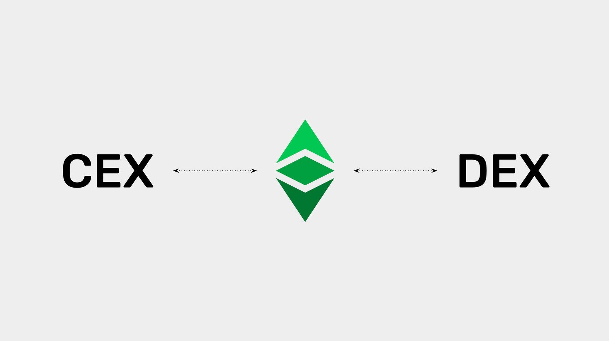

---
**You can listen to or watch this video here:**

<iframe width="560" height="315" src="https://www.youtube.com/embed/AdmPWn3XOYI" title="YouTube video player" frameborder="0" allow="accelerometer; autoplay; clipboard-write; encrypted-media; gyroscope; picture-in-picture; web-share" allowfullscreen></iframe>

---

## ETC in Centralized Exchanges and Decentralized Exchanges in ETC

We are still in a transition stage in the blockchain industry and the world where old style centralization and new paradigm decentralization are still coexisting.

The first steps to buy cryptocurrencies such as Bitcoin (BTC) and Ethereum Classic (ETC) were small companies that served as bridges between fiat money and cryptocurrencies. This is how today’s exchange biggest brands started.

As ETC is one of the main coins in the market, but at the same time is the largest proof of work smart contracts blockchain in the world, it trades in centralized exchanges (CEXs), but is also host of new era decentralized exchanges (DEXs).

In this tutorial, we will explain what are centralized and decentralized exchanges and what role ETC plays in them.  

## What Are Centralized Exchanges?

When people need to trade cryptocurrencies they have to find places on the internet where buyers and sellers meet to place their orders.

Centralized exchanges are companies that have these buyers and sellers as customers and provide an online book where their offers are published so they can match the trades between them. For this service they charge a fee per trade.

When trading with these entities, users must comply with local laws, therefore provide their identity documents, background information, and prove they are good citizens before receiving permission to trade.

These trading houses have become behemoths in the industry, handling billions of dollars in trades on a daily basis and commanding billion dollar valuations. Examples of these are Coinbase, Binance, and Kraken.

## ETC Trades in Many Centralized Exchanges

As we said before, ETC is one of the main cryptocurrencies in the world and the largest proof of work smart contracts blockchain. As such, it is widely traded and listed in [many centralized exchanges](https://coinmarketcap.com/currencies/ethereum-classic/markets/) including:

- Coinbase
- Binance
- Kraken
- BitHumb
- KuCoin
- BitFinex
- Bittrex
- Poloniex
- Huobi

## What Are Decentralized Exchanges?

Decentralized exchanges do the same thing as centralized exchanges, match buyers’ and sellers’ orders, but by means of a decentralized smart contract on a smart contracts blockchain.

Players in this segment include Uniswap, PancakeSwap, ETCswap, and HebeSwap.

This setup makes the entities themselves decentralized and anyone with an account on the blockchain may provide liquidity or enter sell or buy orders. No documentation or identity proofs are required.

ETC actually trades in decentralized exchanges such as PancakeSwap, hosted in the [Binance Smart Chain](https://tradingstrategy.ai/trading-view/binance/biswap/etc-bnb), ETCswap, and HebeSwap, these last two hosted in the Ethereum Classic blockchain itself.

## Decentralized Exchanges in ETC

As said before, because ETC is the largest proof of work smart contracts blockchain it hosts decentralized finance dapps some of which are decentralized exchanges.

The two main examples are ETCswap and HebeSwap. 

## What Is Wrapped ETC (WETC)?

When external coins such as BTC or ETC are listed in decentralized exchanges, such as Uniswap in Ethereum or PancakeSwap in Binance Smart Chain, they cannot be traded unless they are represented as ERC-20 tokens inside those networks. For this, there are services that hold BTC and ETC and then issue ERC-20 tokens on those chains.

For example, WBTC trades on Uniswap inside Ethereum, and [WETC](https://wrappedether.org/) trades on PancakeSwap inside Binance Smart Chain.

WETC is short for “wrapped ETC” which is the term used for this setup.

Because the native ETC coin in the Ethereum Classic blockchain is not compatible with the ERC-20 standard used by exchanges, it is actually traded as WETC as well on ETCswap and HebeSwap inside the ETC blockchain.

---

**Thank you for reading this article!**

To learn more about ETC please go to: https://ethereumclassic.org
