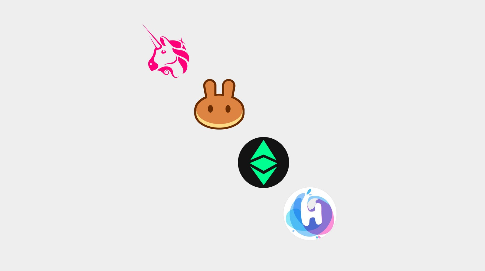
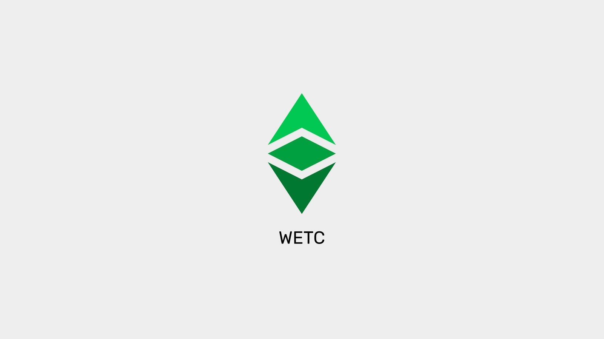

---
**您可以由此观看或收听本期内容：**

<iframe width="560" height="315" src="https://www.youtube.com/embed/AdmPWn3XOYI" title="YouTube video player" frameborder="0" allow="accelerometer; autoplay; clipboard-write; encrypted-media; gyroscope; picture-in-picture; web-share" allowfullscreen></iframe>

---

## 中心化交易所中的ETC和去中心化交易所中的ETC

区块链行业和世界仍处于过渡阶段，旧的中心化和新范式的去中心化仍在共存。

购买比特币(BTC)和以太坊经典(ETC)等加密货币的第一步是作为法定货币和加密货币之间桥梁的公司。这就是今天最大品牌交易所的起源。

由于ETC是市场上的主要货币之一，但同时也是世界上最大的工作量证明智能合约区块链，它在中心化交易所(cex)进行交易，同时也是新时代去中心化交易所(DEXs)的主机。

在本教程中，我们将解释什么是中心化和去中心化的交易所，以及ETC在其中扮演的角色。

## What Are Centralized Exchanges?

集中式交易所是那些拥有这些买家和卖家作为客户的公司，并提供在线簿册，在那里他们的报价被公布，这样他们就可以匹配他们之间的交易。对于这项服务，他们对每笔交易收取费用。

在与这些实体进行交易时，用户必须遵守当地法律，因此必须提供身份证件、背景信息，并证明他们是好公民，才能获得交易许可。

这些交易公司已经成为该行业的庞然大物，每天处理数十亿美元的交易，并拥有数十亿美元的估值。例如Coinbase, 必安和Kraken。

## ETC在许多中心化交易所进行交易

如前所述，ETC是世界上主要的加密货币之一，也是最大的工作量证明智能合约区块链。因此，它被广泛交易并在许多[中心化交易所](https://coinmarketcap.com/currencies/ethereum-classic/markets/)上市，包括:

- Coinbase
- 必安
- Kraken
- BitHumb
- KuCoin
- BitFinex
- Bittrex
- Poloniex
- 火币

## 什么是去中心化的交易所?

去中心化交易所做的事情和中心化交易所一样，匹配买家和卖家的订单，但通过智能合约上的去中心化智能合约区块链。

这一领域的参与者包括Uniswap、PancakeSwap、etswwap和HebeSwap。

这种设置使得实体本身去中心化，任何在区块链上拥有账户的人都可以提供流动性或输入卖出或买入订单。不需要文件或身份证明。

ETC实际上是在去中心化的交易所进行交易，如PancakeSwap，托管在[币安智能链](https://tradingstrategy.ai/trading-view/binance/biswap/etc-bnb), ETCswap, 和HebeSwap, 最后两个托管在以太坊经典区块链本身.

## ETC的去中心化交易

如前所述，因为ETC是最大的工作证明智能合约区块链，它托管去中心化的金融dapps，其中一些是去中心化的交易所。

两个主要的例子是etswwap和HebeSwap。

## 什么是Wrapped ETC (WETC)?

当BTC或ETC等外部货币在去中心化交易所中列出时，例如以太坊中的Uniswap或币安智能链中的PancakeSwap，除非它们在这些网络中以ERC-20代币的形式表示，否则它们无法进行交易。为此，有一些服务持有BTC和ETC，然后在这些链上发行ERC-20令牌。

例如，WBTC在以太坊内部的Uniswap上进行交易，[WETC](https://wrappedether.org/)在币安智能链内部的PancakeSwap上进行交易。

WETC是“Wrapped ETC”的缩写，这是用于这种设置的术语。

由于以太坊经典区块链中的原生ETC币与交易所使用的ERC-20标准不兼容，因此它实际上也在ETC区块链中的etswwap和HebeSwap上作为WETC进行交易。

---

**感谢您阅读本期文章!**

了解更多有关ETC，请访问: https://ethereumclassic.org
