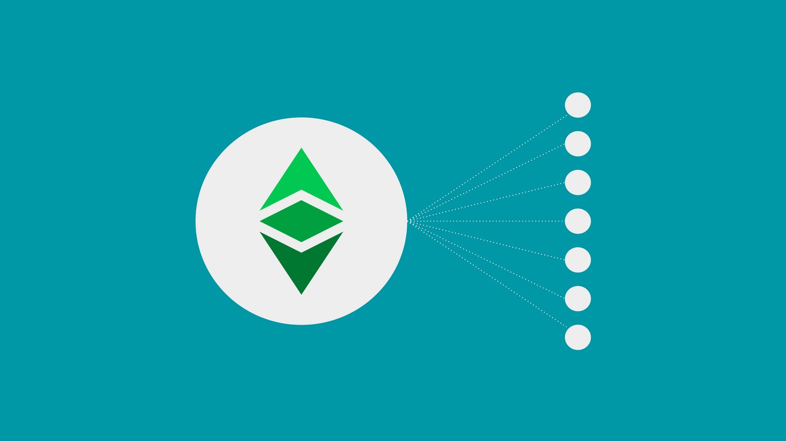
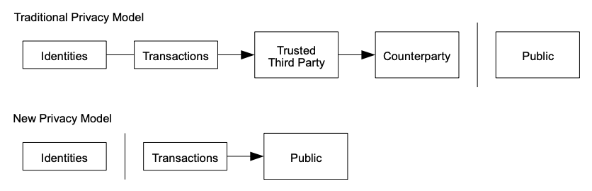

---
**欢迎由此收听或观看本期内容:**

<iframe width="560" height="315" src="https://www.youtube.com/embed/I9t3xHtAA48" title="YouTube video player" frameborder="0" allow="accelerometer; autoplay; clipboard-write; encrypted-media; gyroscope; picture-in-picture; web-share" allowfullscreen></iframe>

---

## 什么是信任最小化？

区块链行业的一个常见误解是，这些系统是“不可信的”，但这不是正确的术语或定义。

事实是，像以太坊经典(ETC)这样的区块链是“信任最小化”的，因为仍然有一些对第三方的依赖，这正是为什么重点应该保持这种方式。

我们所谈论的这种依赖性可以通过以下6个例子来说明:

**1. Dependency on miners:** Miners receive transactions from the network, hash them using enormous amounts of computational power and electricity, and then send the blocks to the rest of the network to include them in the blockchain. This means the network depends on the miner base to guarantee its security.

**2. Dependency on verification nodes:** When blocks are sent by miners to the rest of the network, then verification nodes get the new blocks and verify them. Once verified, blocks are included in the blockchain and the reward is deposited in the miner’s account. This establishes a dependency by regular users and miners on verifiers to keep the integrity of the data, to not include false information or transactions, and to get paid in the case of miners.

**3. Storage of the replicated database:** The blockchain itself is a giant database. Verification nodes not only verify, but also store the blockchain to keep the history for daily use, security, and for posterity. This is a huge dependency that the world has on node operators because the fully replicated database in all machines in the network is one of the keys to its security, which is maximized redundancy of the data.

**4. Transaction and block distribution:** For full replication of the database to exist, there has to be a distribution process of the transactions and blocks across all nodes globally. This is achieved by having all participating machines receive all transactions and all blocks and then re-send them to all other nodes. This is a dependency for participants and external users as this function would not be possible if it were not for the collaborative effort of all nodes.

**5. Bootstrapping nodes:** To be able to join the network for the first time or to connect again after being offline, each network software client has a list of bootstrapping nodes who are there to receive new entrants and to send them all the blocks of the database so they may synchronize and be part of it. This is a dependency on others to be able to join, and re-enter, and to be able to synch the history of the blockchain.

**6. Core developers:** Core developers are computer scientists and engineers who do research and development for upgrades and fix bugs that the system may have from time to time. They also act immediately on emergencies in case there is a split of the network or an attack that must be prevented. This is seldom the case, but it has happened even on the best and largest blockchains. This is a dependency on developers for these tasks.

So, if these dependencies exist, then why are blockchains considered trust minimized and secure?

The key to trust minimization is to distribute these dependencies amongst many third parties who may perform them indistinctly and interchangeably. 

From miners, to node operators, to developers, the way Ethereum Classic is designed is that none of these constituents are individually indispensable nor irreplaceable. 

Any miner in the world may join and leave the network whenever they want, any node operator may do the same, and core developers are several professionals from different regions, and anyone in the world may check and learn the code of ETC and work on it because it is an open source project.

At the operating network layer, the way of achieving this level of global distribution among many miners and verifying nodes is by using the proof of work based consensus mechanism because it is the only system that provides a permissionless point of entry and exit, which is the cryptographic stamp in each block. 

## Satoshi Nakamoto’s Focus on Trust Minimization

As an example of how important trust minimization is, and how it had been the central goal of Cypherpunks when building systems, Satoshi Nakamoto mentioned trust minimization directly or indirectly 14 times in the [Bitcoin white paper](https://bitcoin.org/bitcoin.pdf).

**Mention of trust minimization in the abstract:**

*- A purely peer-to-peer version of electronic cash would allow online payments to be sent directly from one party to another without going through a financial institution. Digital signatures provide part of the solution, but the main benefits are lost if a trusted third party is still required to prevent double-spending.*

**In the introduction:**

*- Commerce on the Internet has come to rely almost exclusively on financial institutions serving as trusted third parties to process electronic payments.*

*- While the system works well enough for most transactions, it still suffers from the inherent weaknesses of the trust based model.*

*- With the possibility of reversal, the need for trust spreads.*

*- These costs and payment uncertainties can be avoided in person by using physical currency, but no mechanism exists to make payments over a communications channel without a trusted party.*

*- What is needed is an electronic payment system based on cryptographic proof instead of trust, allowing any two willing parties to transact directly with each other without the need for a trusted third party.*

**In the Transactions section:**

*- A common solution is to introduce a trusted central authority, or mint, that checks every transaction for double spending.*

*- After each transaction, the coin must be returned to the mint to issue a new coin, and only coins issued directly from the mint are trusted not to be double-spent.*

*- To accomplish this without a trusted party, transactions must be publicly announced, and we need a system for participants to agree on a single history of the order in which they were received.*

**In the Privacy section:**

*- The traditional banking model achieves a level of privacy by limiting access to information to the parties involved and the trusted third party.*

**In the Privacy section diagram:**

A trusted third party is shown in the top part of the diagram to illustrate the traditional banking system. No trusted third party is shown in the bottom part as an indication of a more secure model.

**In the Conclusion:**

*- We have proposed a system for electronic transactions without relying on trust.*

**In the References section:**

*- [2] H. Massias, X.S. Avila, and J.-J. Quisquater, “Design of a secure timestamping service with minimal trust requirements,” In 20th Symposium on Information Theory in the Benelux, May 1999.*

## Why Should ETC Focus on Trust Minimization?

There are two reasons why Ethereum Classic should continuously focus on trust minimization.

The first is that once we understand that these systems are trust minimized and not trustless, then we are aware that there is some marginal risk that we are still depositing in trusted third parties. This risk may be augmented if there is no focus on trust minimization as any new changes or upgrades could increase it.

The second reason is that we are going to a world of globalization and centralization where trusted third parties will control every aspect of our lives if we don’t use systems as Ethereum Classic. ETC is a refuge against the inexorable arbitrary behavior of trusted third parties and a beacon of freedom for the world. And it must be kept this way.

---

**Thank you for reading this article!**

To learn more about ETC please go to: https://ethereumclassic.org
