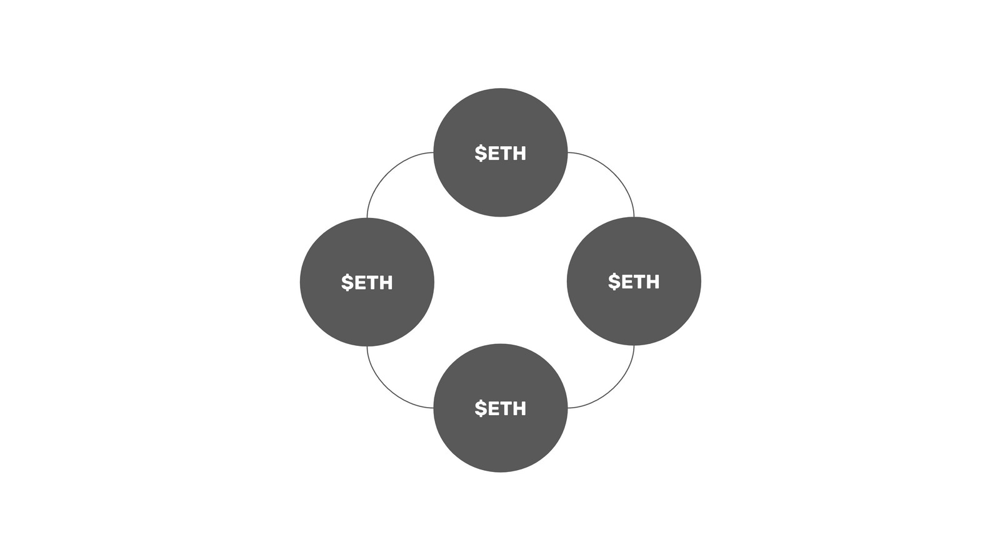

---
**You can listen to or watch this video here:**

<iframe width="560" height="315" src="https://www.youtube.com/embed/7jGOPq3RLjs" title="YouTube video player" frameborder="0" allow="accelerometer; autoplay; clipboard-write; encrypted-media; gyroscope; picture-in-picture; web-share" allowfullscreen></iframe>

---

## Proof of Stake Purpose

As we explained in class 5 of this course about Ethereum, proof of stake (PoS) eliminates the need for proof of work (PoW), which uses enormous amounts of computing power and electricity, and replaces it with user deposits in special accounts inside the ledger.

These deposits are called stakes and give their stakers the right to produce blocks, vote on them, and then include them in the blockchain. For this role, they get paid a reward per block.

The stated benefits of proof of stake are that it uses less electricity and it is more scalable. However, these saving in energy and scalability are accomplished at the expense of safety, as proof of stake is very similar to traditional systems as it does not have the decentralization guarantees that proof of work based Nakamoto Consensus has.

## Staking

Initially, the idea was that stakers were going to run a validator node, deposit capital in an account that would remain locked for several months, and produce and validate blocks for the network.

However, by the time Ethereum migrated to the proof of stake consensus mechanism in September 15th of 2022, the dominant model was to use staking pools to participate in the system.

This means now that the functions in staking have been deconstructed into three roles: staking (stakers deposit money), validating (network node operators run the validator software clients), and pooling (organizations that organize large pools of capital and hire validators).

Stakers in Ethereum now only make deposits in staking pools and don’t worry about the rest. In exchange, they receive a proxy token that represents the coins they staked so they can sell them in the market, recovering their capital whenever they want. For doing this, they receive rewards that derive from the block production process.

## Validators

In this deconstructed format described above, validators are the participants who run nodes in the network that produce and validate blocks.

Depending on the arrangement with the staking pools for which they work, these node operators bear the risk of the various penalties that the PoS system imposes for being offline, sending invalid blocks, or affirming wrong blocks.

Because of this, the validating node business has become a very specialized activity as sophisticated operations are needed to maintain very reliable data centers, with high uptimes, and ample redundancy to make sure their task is done as reliably and correctly as possible.

## Staking Pools

Staking pools serve the role of aggregating capital from regular users and running themselves or hiring validating node operators to deploy that capital to earn rewards.

Staking pools have evolved into two main models for now:

1. Exchange Sponsored Pools: These staking pools are managed by well known exchanges such as Coinbase or Binance. They offer their customers the possibility of staking their coins, and then they turn around and use this capital to run their own nodes in their own data centers to produce and validate blocks in the networks they target. These pools give their staking customers proxy tokens such as cbETH (Coinbase Wrapped Staked ETH) and BETH (Binance staked ETH).
2. Liquid Staking Derivatives (LSD) pools: Pools such as Lido and RocketPool are considered “liquid staking derivatives” pools because they invented the method of exchanging staked coins for proxy tokens. The way they work is that they deploy a smart contract in the blockchain and let anyone deposit coins to use as staking capital. Then, they hire node operators to deploy this capital and validate and produce blocks.

## Block Production Process

It is important to note, that even if the market has evolved into the staking pool model mainly, technically, however risky and unprofitable, it is entirely possible for end users to set up their own validating nodes, deposit their own capital, and produce and validate blocks directly.

Regardless of the model followed, the block production process works as a voting mechanism:

1. Of the validator set, one is chosen to produce the next block.
2. When the block is produced, it is sent to a committee of validators formed for that block.
3. The committee must vote with a supermajority of 2/3rds to validate the block.
4. Once the block is validated, then it is sent to the rest of the network for inclusion as the last state of the network.

## Centralization Risks

The main centralization risks of the proof of stake model revolve around the economies of scale of the system and how easy it is to capture the various staking operations.

**Staking pools and node operators/validators are static and easy to find:** Staking requires static accounts on the network, therefore it is easy to track and find validators and pools.

**Staking pools take deposits that are securities:** The Securities and Exchange Commission in the United States has decided that staking deposits in exchanges are securities, therefore completely subject to government regulation.

**Staking pools and node operators are inside the ledger:** In contrast to PoW mining, which is external, staking is an activity that happens inside the ledger of the blockchain. This means that if pools and validators get censored and captured, there is no way of separating from them as they would tag along even if the network splits.

**Staking pools will all be regulated financial institutions:** As seen with the growth and market share of centralized exchanges in the staking pool business, and now that the SEC has defined such business as a security, we can now more clearly observe that financial institutions are going to be the main stakers, node operators, and pool operators in Ethereum and other proof of stake networks.

**Staking pools suffer unrestricted economies of scale:** Just as the banking system, the staking industry will be dominated by 3 or 4 cartelized entities. This is because capital inside the network may flow with no local or real world restrictions.

**Staking pools and validators must be online all the time:** The fact that the design of proof of stake has many restrictions that proof of work does not, such as locked deposits, liveness penalties, and slashing, makes it very difficult to exit the system to relocate or hide in case of legal changes or geopolitical problems.

**In proof of stake, there is no alternative to centralized and captured pools:** Once the staking pool industry is centralized, there is no recourse by users to enter transactions that could eventually be processed by some staker outside of the dominating cartels. For the reasons stated above, the pooling cartel in proof of stake will necessarily have nearly 100% control of the system.

**Proof of stake does not have the decentralization guarantees that proof of work has:** Proof of work guarantees that miners and mining pools may change all the time, migrate from place to place, and exit and enter the network whenever they please because it has the two guarantees that proof of stake does not have: It enables consensus without having to check with anyone in the world except by just verifying the proof of work in the latest block, and it enables free entry and exit without having to check with anyone in the world except by just checking the most work done on the network.

## Benefits

The main benefit promoted by proof of stake advocates is that it saves 99% of the electricity that proof of work uses and thus helps the planet. It is true that it saves energy, but it is doubtful that large proof of work blockchains as Bitcoin and Ethereum Classic cause any harm to the environment. In fact, proof of work mining is actually performed using renewable energy in its majority, promoting and accelerating the migration to that electricity generation model.

The other benefit touted is that PoS is better for implementing new scaling solutions compared to the proof of work architecture. This is true, but in the end, both in PoS and PoW the great majority of high volume, low value transactions will be executed in layer 2 systems and above, so this benefit hardly has any marginal value over PoW.

---

**Thank you for reading this article!**

To learn more about ETC please go to: https://ethereumclassic.org
