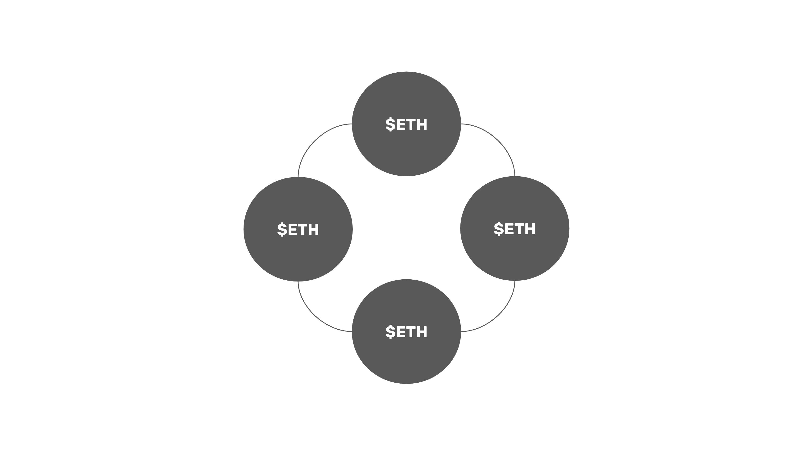

---
**您可以由此收听或观看本期内容:**

<iframe width="560" height="315" src="https://www.youtube.com/embed/7jGOPq3RLjs" title="YouTube video player" frameborder="0" allow="accelerometer; autoplay; clipboard-write; encrypted-media; gyroscope; picture-in-picture; web-share" allowfullscreen></iframe>

---

## 权益证明的目的

正如我们在本课程第5节课中关于以太坊的解释，权益证明(PoS)消除了工作量证明(PoW)的需要，PoW使用了大量的计算能力和电力，并将其替换为账本内特殊账户中的用户存款。

这些存款被称为股权，并赋予其股东生产区块的权利，对其进行投票，然后将其纳入区块链。对于这个角色，他们每个区块都会获得奖励。

权益证明的好处是它使用更少的电力，并且更具可扩展性。然而，这些节能和可扩展性是以牺牲安全性为代价的，因为权益证明与传统系统非常相似，因为它不具有基于中本共识的工作量证明所具有的去中心化保证。

## 权益质押

最初的想法是，股东将运行一个验证器节点，将资金存入一个将被锁定几个月的账户，并为网络生成和验证区块。

然而，当以太坊在2022年9月15日迁移到权益证明共识机制时，主导模式是使用权益池参与系统。

这意味着现在权益质押的功能已经被解构为三个角色:权益质押（质押者存款)、验证(网络节点运营商运行验证器软件客户端)和池(组织大型资本池并雇用验证器的组织)。

以太坊的股东现在只在权益质押池中存款，不用担心其他的。作为交换，他们会收到一个代表他们所押注的硬币的代理代币，这样他们就可以在市场上出售它们，随时可以收回资本。为此，他们获得了来自区块生产过程的奖励。

## 区块链验证者

在上面描述的这种解构格式中，验证者是在网络中运行产生和验证区块的节点的参与者。

根据与他们工作的持有量池的安排，这些节点操作员承担PoS系统因离线、发送无效区块或确认错误区块而施加的各种惩罚的风险。

因此，验证节点业务已经成为一项非常专业的活动，因为需要复杂的操作来维护非常可靠的数据中心，具有高正常运行时间和足够的冗余，以确保他们的任务尽可能可靠和正确地完成。

## 权益质押池

权益质押池的作用是聚集来自常规用户的资本，并自行运行或雇用验证节点操作员来部署这些资本以获得奖励。

权益质押池目前已经演变成两种主要模式:

1. 交易所赞助池:这些权益质押池由Coinbase或币安等知名交易所管理。他们为客户提供投币的可能性，然后他们转身使用这些资本在自己的数据中心运行自己的节点，在目标网络中生产和验证区块。这些池为他们的代币客户提供代理代币，如cbETH (Coinbase封装的有价ETH)和BETH(币安有价ETH)。
2. 液体押注衍生品(LSD)池:Lido和RocketPool等池被认为是“液体押注衍生品”池，因为它们发明了将押注硬币兑换为代理代币的方法。他们的工作方式是在区块链中部署智能合约，允许任何人存入硬币作为权益资本。然后，他们雇佣节点操作员来部署这些资本，并验证和生产区块。

## 区块生产流程

值得注意的是，即使市场在技术上主要演变为权益池模型，无论风险和无利可图，最终用户完全有可能建立自己的验证节点，存入自己的资金，并直接生产和验证区块。

无论遵循哪种模型，区块生产过程都是一种投票机制:

1. 在验证者集中，选择一个来生成下一个块。
2. 当生成块时，它被发送到为该块组成的验证者委员会。
3. 该委员会必须以2/3的绝对多数投票才能生效。
4. 一旦区块被验证，它就会被发送到网络的其他部分，作为网络的最后一个状态。

## 中心化风险

权益证明模型的主要集中化风险围绕着系统的规模经济以及捕获各种权益证明操作的容易程度。

**标记池和节点操作符/验证器是静态的，很容易找到:** 标记需要网络上的静态帐户，因此很容易跟踪和找到验证器和池。

**权益质押池吸收的存款是有价证券:** 美国证券交易委员会已经决定，在交易所的赌注存款是有价证券，因此完全受政府监管。

**权益质押池和节点操作符在账本内部:** 与外部的PoW挖矿相比，注记是发生在区块链账本内部的活动。这意味着如果池和验证器被审查和捕获，则无法将它们分离，因为即使网络分裂，它们也会跟随标记。

**权益质押池将全部是受监管的金融机构:** 正如集中式交易所在赌注池业务中的增长和市场份额所见，现在美国证券交易委员会已将此类业务定义为证券，我们现在可以更清楚地观察到，金融机构将成为以太坊和其他权益证明网络的主要股东、节点运营商和池运营商。

**权益质押池遭受不受限制的规模经济:** 就像银行系统一样，权益质押行业将由3或4个卡特尔实体主导。这是因为网络内的资本流动可能不受本地或现实世界的限制。

**权益质押池和验证者必须一直在线:** 事实上，权益证明的设计有许多工作证明没有的限制，比如锁定存款，活罚，以及大幅削减，这使得在法律变化或地缘政治问题时很难退出系统重新安置或隐藏。

**在权益证明中，除了中心化和捕获池之外，没有其他选择:** 一旦权益池行业中心化，用户就没有追索权来输入最终可能由主导卡特尔之外的某些利益相关者处理的交易。由于上述原因，权益证明中的池化卡特尔必然对系统拥有近100%的控制权。

**工作量证明不具有工作量证明所具有的去中心化保证:** 工作量证明保证矿工和矿池可以随时更改，从一个地方迁移到另一个地方，并随时退出和进入网络，因为它具有权益证明所不具有的两个保证:它实现了共识，而无需与世界上任何人进行验证，除非在最新的区块中验证工作证明;它实现了自由进入和退出，而无需与世界上任何人进行验证，除非只需检查网络上完成的大部分工作。

## 好处

权益证明的倡导者宣扬的主要好处是，它节省了工作量证明使用的99%的电力，从而帮助了地球。它确实节省了能源，但比特币和以太坊经典等大型工作量证明区块链是否会对环境造成任何损害，这一点值得怀疑。事实上，工作量证明挖矿实际上主要是使用可再生能源进行的，促进并加速了向这种发电模式的迁移。

另一个被吹捧的好处是，与工作量证明架构相比，PoS更适合实现新的扩展解决方案。这是正确的，但最终，无论是PoS还是PoW，绝大多数高容量、低价值的交易都将在第二层系统或更高的系统中执行，因此这种好处几乎没有任何边际价值。

---

**感谢您阅读本期内容!**

了解更多ETC相关内容，请访问: https://ethereumclassic.org
