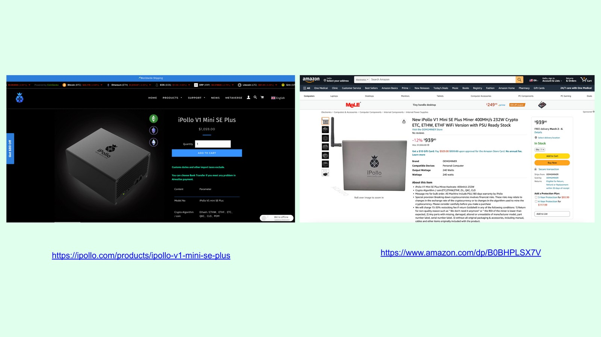
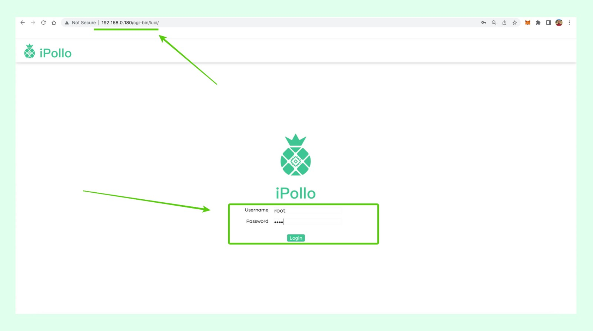

---
**You can listen to or watch this video here:**

<iframe width="560" height="315" src="https://www.youtube.com/embed/GszUmy3L48M" title="YouTube video player" frameborder="0" allow="accelerometer; autoplay; clipboard-write; encrypted-media; gyroscope; picture-in-picture; web-share" allowfullscreen></iframe>

---

## Mining Ethereum Classic

Since the migration of Ethereum to the proof of stake consensus algorithm in September of 2015, the hashrate of Ethereum Classic (ETC) has increased enormously.

As a consequence, by both hashrate and market cap, ETC is now the largest proof of work smart contracts blockchain in the world.

As many individuals and businesses are planning to enter the mining business, and to mine ETC in particular, we will create an infrastructure series to explain how to start mining Ethereum Classic.

In this post we explain how to mine ETC with an iPollo ASIC mining rig, using the 2miners mining pool.

## 1. Buy the iPollo Mining Rig

The first step is to get the ASIC mining rig from iPollo directly (they are based in Hong Kong and ship worldwide) or from Amazon if you prefer.

iPollo has three models that work with ETC. The one we are going to present today is the V1 Mini SE Plus, which you may buy on these links:

iPollo (Hong Kong):
https://ipollo.com/products/ipollo-v1-mini-se-plus

Amazon (USA):
https://www.amazon.com/dp/B0BHPLSX7V

*Disclaimer: we have no relationship with iPollo or Amazon, nor do we get any commissions or affiliate fees.*

## 2. iPollo ASIC Rig Unboxing and Necessary Components

When you get the iPollo V1 Mini SE Plus you will get four things:

1. The iPollo V1 Mini SE Plus mining machine
2. A transformer
3. An electric AC cable
4. A card with a QR code to their help page for instructions

The other three components that need to be provided by you to set up the mining operation are:

1. An ethernet cable to connect it to your local LAN
2. A local LAN, which is your internet connection from home or office (we use Cox in this example)
3. Your computer so you can manage the iPollo ASIC app from your browser

*Note: Because we use a MacBook Pro computer we needed to connect the iPollo to our local LAN using the Ethernet, but if you use a Windows computer, you may find the iPollo rig over the WiFi networks list in your PC.*

## 3. iPollo ASIC Rig Setup and Connection

To set up your mining rig, you need to connect the ethernet cable to the iPollo ASIC miner, and then connect the other end to your LAN modem.

Then, you need to connect the transformer to the iPollo ASIC miner as shown in the image, and then connect the AC cable to the transformer and to the wall electric feed.

## 4. Get the iPollo ASIC Mining Rig URL in Your Local LAN

Now that your mining rig is connected and powered, you have to find its IP address in your local LAN so you may access its app from your browser from your computer (your computer needs to be connected through ethernet cable or WiFi to the local LAN as well).

To do this, go to the IP address of your LAN modem (this may be Googled or requested to your internet provider if you don’t have it) access the app of your local LAN modem, find the iPollo machine in the “connected devices” section or equivalent, and then click on it to see its specific IP address.

In our example we use Cox as our internet provider, and the iPollo rig IP address is 192.168.0.180.

## 5. Log In to Your iPollo ASIC App

Once you know the IP of your iPollo mining machine you can type it on your browser to access its app, which is hosted in the machine itself.

In our example, we typed 192.168.0.180 on our browser (do not enter the prefixes “https” no “http” as this is a local connection) and we accessed the login page of the iPollo app.

To log in, you must type the Username “root” and the Password “root” (don’t worry, in the next step you will change the password).

## 6. Change the Password on Your iPollo ASIC Miner App

In this step you need to change the password of the app on your iPollo for security reasons.

For this, go to the “Password Change” tab on the left menu, then enter the new password and press “Save”.

## 7. Set Up Your Miner Credentials

To set up your miner credentials (the configuration data so your iPollo miner will be pointing to your account on the 2miners pool) go to the “Miner Configuration” tab on the left menu.

Once on that screen, change the default mining algorithm from ETHASH to ETCHASH on the dropdown menu at the center top of the page.

## 8. Get Miner Settings Information From The 2miners Mining Pool

Now you need to go to 2miners to get your credentials or configuration data. For this, go to:

https://etc.2miners.com/help 

Once there, create an ETC wallet as per the instructions or use an existing wallet you already have, if you wish.

Then, get the instruction shown further below in that page for “ASIC Settings”. The instructions are:

**URL: stratum+tcp://etc.2miners.com:1010**

**Worker: YOUR_WALLET_ADDRESS.ASIC_ID**

**Password: x**

## 9. Enter Your Configuration on Your iPollo

Now, you have to go back to the iPollo ASIC miner app and enter your configuration in the “Miner Configuration” page. In our example, we used the account shown below with the extension “ASIC_ID”, but you may use any ID number like ASIC_1 or ASIC_28, etc. The ID is in case you have several miners pointing to 2miners so you may identify them independently

Enter your configuration in the fields provided as shown in the image and press “Save & Apply”. Our miner configuration data in this example was: 

**Pool 1: stratum+tcp://etc.2miners.com:1010**

**Worker: 0x69f0da9aC5196e8817af39a2F1E0d43209946039.ASIC_ID**

**Password: x**

## 10. Check the Stats for Your Mining Rig

Once you saved and applied your miner configuration data, your iPollo ASIC rig will start mining for 2miners. You may go to the “Running Overview” tab on the left menu to see the activity of your miner live.

You must wait 5 to 10 minutes for your iPollo to talk to 2miners and establish a connection. After a while, you will see that the line in the chart will start to go up, increasing the hashrate that is pointing to your 2miners account. You will also see other stats as the temperature of your machine, the RPM of the fan, and the current hashrate output of your iPollo.

## 11. See if the Work Is Being Accepted

Then, you will want to see if the work of your iPollo is actually being accepted by the 2miners mining pool. For this, go to the “Information Overview” tab on the left menu to see the statistics.

In our example, the device number “0” (our machine) is enabled and active. For the URL which it is pointed to, it has performed 44 works of which 8 have been accepted, and 6:38 minutes have elapsed since we started mining.

From now on, your machine will be mining for 2 miners as long as it is on.

## 12. Check Your Miner Statistics at 2miners Regularly 

As your iPollo ASIC miner is participating in a mining pool, you will get revenues according to its policies very soon as the pool goes producing blocks for ETC. You can check your account and balances in the URL shown below by entering you account as the extension (in this example we are showing the account we used for this example):

https://etc.2miners.com/account/0x69f0da9aC5196e8817af39a2F1E0d43209946039

**Congrats! You are now mining ETC with an iPollo V1 Mini SE Plus through the 2miners mining pool!**

---

**Thank you for reading this article!**

To check out the various iPollo ASIC miner models for ETC go to: https://ipollo.com/collections/etc-miner

To check out the 2miners mining pool for ETC go to: https://etc.2miners.com

To learn more about ETC please go to: https://ethereumclassic.org
