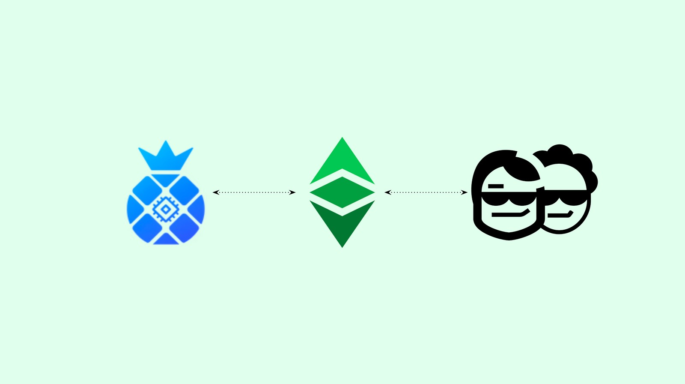
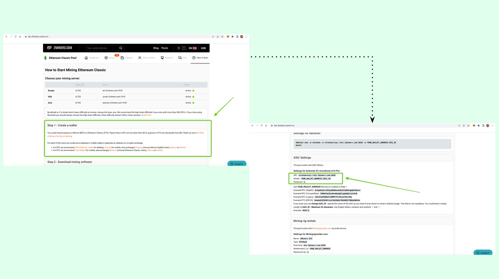
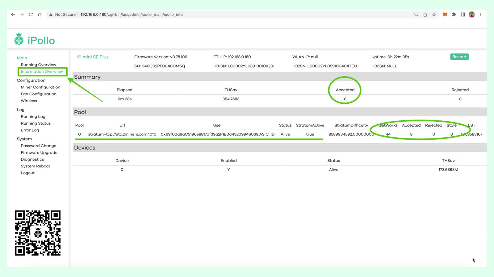

---
**您可以由此收听或观看本期内容:**

<iframe width="560" height="315" src="https://www.youtube.com/embed/GszUmy3L48M" title="YouTube video player" frameborder="0" allow="accelerometer; autoplay; clipboard-write; encrypted-media; gyroscope; picture-in-picture; web-share" allowfullscreen></iframe>

---

## 挖矿以太坊经典

自2015年9月以太坊迁移到权益证明共识算法以来，以太坊经典(ETC)的哈希率大幅提高。

因此，无论是哈希率还是市值，ETC现在都是世界上最大的工作量证明智能合约区块链。

由于许多个人和企业正计划进入挖矿业务，特别是挖掘ETC，我们将创建一个基础设施系列来解释如何开始挖掘以太坊经典。

在这篇文章中，我们将解释如何使用iPollo ASIC矿机，使用2miners矿池来挖掘ETC。

## 1.购买iPollo挖矿设备

第一步是直接从iPollo(总部为香港，并在全球范围内发货)或从亚马逊(如果你喜欢)获得ASIC矿机。

iPollo有三种与ETC兼容的模型。我们今天要介绍的是V1 Mini SE Plus，你可以在这些链接上购买:

iPollo (香港):
https://ipollo.com/products/ipollo-v1-mini-se-plus

亚马逊(美国):
https://www.amazon.com/dp/B0BHPLSX7V

*免责声明:我们与iPollo或亚马逊没有任何关系，我们也不收取任何佣金或附属费用。*

## 2. iPollo ASIC矿机开箱和必要的组件

当你得到ipollv1 Mini SE Plus时，你将得到四件物品:

1. ipollv1 Mini SE Plus矿机
2. 一个变压器
3. 交流电缆
4. 一张带有二维码的卡片，可以在他们的帮助页面上获得指引

你需要提供另外三个组件来设置挖掘操作:

1. 一根以太网电缆将它连接到本地局域网
2. 一个本地局域网，这是你从家里或办公室的互联网连接(在这个例子中我们使用Cox)
3.您的计算机，以便您可以从浏览器管理iPollo ASIC应用程序

*注意:因为我们使用的是MacBook Pro电脑，所以我们需要通过以太网将iPollo连接到我们的本地局域网，但如果你使用的是Windows电脑，你可能会在你电脑的WiFi网络列表中找到iPollo矿机。*

## 3. iPollo ASIC矿机设置和链接

要设置您的挖矿设备，您需要将以太网电缆连接到iPollo ASIC矿机，然后将另一端连接到局域网调制解调器。

然后，您需要将变压器如图所示连接到iPollo ASIC矿机，然后将交流电缆连接到变压器和墙壁电馈线上。

## 4. 在您的本地局域网中获取iPollo ASIC矿机URL

现在，您的矿机已经连接并通电了，你必须在本地局域网中找到它的IP地址，这样您就可以从电脑上的浏览器访问它的应用程序(您的电脑也需要通过以太网电缆或WiFi连接到本地局域网)。

要做到这一点，转到局域网调制解调器的IP地址(如果您没有它，您可能需要谷歌查询或联络您的互联网提供商)访问本地局域网调制解调器的应用程序，在“连接的设备”部分或同等内容中找到iPollo机器，然后单击它查看其特定的IP地址。

在我们的例子中，我们使用Cox作为我们的互联网提供商，并且iPollo钻机的IP地址是192.168.0.180。

## 5. 登录您的iPollo ASIC App

一旦您知道了您的iPollo矿机的IP，您就可以在浏览器上输入它来访问它的应用程序，它托管在机器本身。

在我们的例子中，我们在浏览器上输入192.168.0.180(不要输入前缀“https”和“http”，因为这是一个本地连接)，然后我们访问了iPollo应用程序的登录页面。

要登录，您必须输入用户名“root”和密码“root”(别担心，下一步您将修改密码)。

## 6. 在您的iPollo ASIC Miner应用程序上更改密码

在这一步中，出于安全原因，您需要在您的iPollo上更改应用程序的密码。

为此，进入左侧菜单的“密码更改”选项卡，然后输入新密码并按“保存”。

## 7. 设置你的矿机证书

要设置你的矿机证书(配置数据，这样您的iPollo矿工将指向您在2miners pool上的帐户)，请转到左侧菜单的“矿机配置”选项卡。

进入该界面后，在页面中央顶部的下拉菜单中将默认挖掘算法从ETHASH更改为ETCHASH。

## 8. 从2miners矿池获取矿机设置信息

现在您需要去2miners获取您的证书或配置数据。为此，请转到:

https://etc.2miners.com/help 

一旦到了那里，按照说明创建一个ETC钱包，或者如果您愿意，使用您已经拥有的现有钱包。

然后，在“ASIC设置”页面中获得进一步显示的说明。使用说明如下:

**URL: stratum+tcp://etc.2miners.com:1010**

**Worker: YOUR_WALLET_ADDRESS.ASIC_ID**

**密码: x**

## 9. 在您的iPollo上输入您的配置

现在，您需返回到iPollo ASIC矿工应用程序，并在“矿机配置”页面输入您的配置。在我们的示例中，我们使用了如下所示的帐户，扩展名为“ASIC_ID”，但您可以使用任何ID号码，如ASIC_1或ASIC_28等。ID是为了防止您有几个矿机指向2miners，这样您就可以独立地识别他们

在如图所示的字段中输入您的配置，然后按“保存&应用”。本例中的矿工配置数据为:

**Pool 1: stratum+tcp://etc.2miners.com:1010**

**Worker: 0x69f0da9aC5196e8817af39a2F1E0d43209946039.ASIC_ID**

**密码: x**

## 10. 检查您的采矿设备的统计数据

一旦您保存并应用了您的矿工配置数据，您的iPollo ASIC矿机将开始在2miner挖掘。您可以到左侧菜单的“运行概述”选项卡查看您的矿机活动。

您必须等待5到10分钟，以便您的iPollo与2miners通话并建立连接。过了一段时间，您会看到图表中的这条线开始上升，增加指向您的2miners账户的哈希率。您还将看到其他的统计信息，如机器的温度、风扇的RPM和当前iPollo的哈希值输出。

## 11.查看工作是否被接受

然后，您会想看您的iPollo的工作是否被2miners矿池接受。为此，请转到左侧菜单的“信息概述”选项卡查看统计数据。

在我们的示例中，设备编号为“0”(我们的机器)已启用并处于活动状态。对于它所指向的URL，它已经执行了44次工作，其中8次被接受，从我们开始挖矿到现在已经过去了6分38分钟。

从现在开始，只要您的机器开着，它就会在2miner上挖矿。

## 12. 定期检查您的矿工统计数据

由于您的iPollo ASIC矿机正在参与一个矿池，一旦矿池开始为ETC生产区块，您就会根据其政策获得收益。您可以检查您的帐户和余额在URL中显示，通过输入您的帐户作为扩展名(在这个例子中，我们显示的是我们用于这个例子的帐户):

https://etc.2miners.com/account/0x69f0da9aC5196e8817af39a2F1E0d43209946039

**恭喜!您现在正在使用ipollv1 Mini SE Plus，通过2miners矿池挖掘ETC !**

---

**感谢您阅读本期文章!**

想要查看用于ETC的各种iPollo ASIC矿机模型，请访问: https://ipollo.com/collections/etc-miner

想要查看ETC的2miners矿池，请访问: https://etc.2miners.com

想要了解更多有关ETC相关内容，请访问: https://ethereumclassic.org
