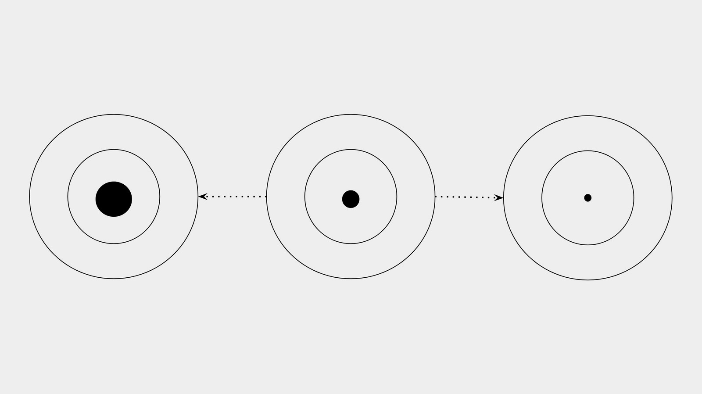

---
**You can listen to or watch this video here:**

<iframe width="560" height="315" src="https://www.youtube.com/embed/PgAaPaNdrHw" title="YouTube video player" frameborder="0" allow="accelerometer; autoplay; clipboard-write; encrypted-media; gyroscope; picture-in-picture; web-share" allowfullscreen></iframe>

---

## Blockchain Networks Need a Consensus Mechanism

A network of peer-to-peer computers as Ethereum Classic (ETC); that maintains a ledger with accounts, balances, and smart contracts; with owners from different parts of the world, from different cultures, who speak different languages, have different worldviews, and don’t know or trust each other, need a secure consensus mechanism to update and keep the latest state of the system.

The reason that digital currencies hadn’t existed before Bitcoin was because there was no such consensus mechanism invented yet.

Previous solutions to consensus were too insecure as they only guaranteed fault tolerance up to a threshold of one third of failing or dishonest nodes.

## Proof of Work Is the Solution to Consensus

The invention of proof of work (PoW) based consensus by Satoshi Nakamoto when he launched Bitcoin in 2009 solved this problem. Nakamoto Consensus, as it is known, raised the threshold of fault tolerance from one third of participating nodes to one half plus one, also known symbolically as 51%.

Not only did it raise the security margin of the system, but it also guaranteed an unprecedented level of decentralization, permissionlessness, and censorship resistance.

Additionally, it brought a high degree of monetary soundness to the cryptocurrency inside the network because the cost of producing the money is the same as producing the blocks using PoW.

Ethereum Classic uses the same consensus method as Bitcoin.

## PoW Uses Computing Power and Energy

Proof of work consensus uses enormous computing power and enormous amounts of energy in the form of electricity to build blocks.

The fact that these large investments in machines and energy are required is precisely why all participating nodes may reach global consensus on a block per block basis and enter and exit the system whenever they wish. 

This is all done with no central administrators directing them, without any permissions, and without the need for node operators to identify themselves.

## PoW Produces a Cryptographic Stamp

A cryptographic stamp or hash is the result of this work. It is like an inviolable engraving that authenticates the transactions per block.

This is because to produce the stamp requires enormous amounts of computing power and electricity consumption.

This feature makes the blocks and the blockchain practically impossible to forge or tamper with.

It also makes the cryptocurrency sound money because it imposes such a cost to produce it, very much like gold in the real world.

## The Cryptographic Stamp Is What Enables Consensus

The cryptographic stamp is what keeps all participating nodes informed of what is the next correct block and which is the correct blockchain.

This double role is key for the network because participating nodes may always stay up to date with the blockchain, and exit and enter whenever they wish, without anyone directing them.

The way for online nodes to know which is the correct next block is just by checking the proof of work in each block. 

For new entrants, the way of knowing if they are joining the right network is just by checking the blockchain with the most accumulated work done.

## However, Changes in Hashrate Messes Things Up

But, what would happen if the dedicated computing power increases or decreases significantly?

As Bitcoin has a block time of 10 minutes, Ethereum Classic has a block time of 15 seconds. This means that a block, together with its new issuance of coins as a reward for miners, is built every 15 seconds stabilizing the creation of the money and the amount of data accumulated by the network. 

Block times would become either very fast or very slow with increases or decreases in computing power dedicated to the system. This may happen as computing becomes more efficient with innovation as time passes, when miners just buy more machines and point them to the network, or when they decide to turn off their machines because profitability is low.

If blocks become very fast, then the issuance of the currency would increase, raising inflation, and bloating the network with too many blocks. If blocks become very slow, the issuance would be very deflationary, and the use of the network would become impractical as transactions would take too long to execute.

## The Solution Is the Difficulty Adjustment

The solution to keep the blocks at a steady and stable rate is by adjusting the mining difficulty.

As said before, the hashrate of ETC may grow when machines become more efficient as time passes by, or when miners just buy more machines increasing the computing power dedicated to the network. 

When this happens, blocks may become much faster than 15 seconds. To slow them down again, the network adjusts the difficulty higher so it may take about 15 seconds again, on average, to build blocks.

When hashrate shrinks for any reason, then blocks become too slow. To speed them up, the network adjusts the difficulty lower so it may fine tune the block times back to around 15 seconds, on average. 

## How Proof of Work Works

The best way to explain the difficulty adjustment is by explaining how proof of work works. It all start with miners receiving and preparing the block data. When they have it together, then they hash the data to create a cryptographic stamp for that information. When they create the stamp, they check if the stamp hit a target imposed by the network. If the target is not hit, which happens the great majority of times, then miners have to go back and re-hash the information, producing a new stamp, that they have to check again. This may happen quadrillions of times per second and this is why there is so much work involved, with so much computing power and electricity usage in PoW mining.

When any miner finally hits the target, which happens, on average, every 15 seconds in ETC, then it sends the finished block to the rest of the network so it may be verified and the miner may get his reward. 

## Difficulty Adjustment Means to Adjust the Target

So, the difficulty adjustment is to increase or decrease the target that the cryptographic stamp must hit for the block hash to be considered valid. An adjustment to a larger target means it is easier to hit so block times are reduced. An adjustment to a smaller target means it is harder to hit, thus increasing the block times.

The network is constantly measuring how much time elapses between blocks. When it gets above or below certain parameters, then the difficulty is adjusted higher or lower to get back to the target 15 seconds per block, on average.

## How Difficulty Is Measured

Network difficulty is measured as the number of hashes per second, on average, that must be performed by all miners combined to hit the desired block times. 

In other words, it is measured in how many times per second miners should calculate a hash function to create a cryptographic stamp that hits the target.

The quantities used in the industry to set difficulty targets are usually the following:

- Kilohashes per second (KH/s) = 1,000 H/s
- Megahashes per second (MH/s) = 1,000,000 H/s
- Gigahashes per second (GH/s) = 1,000,000,000 H/s
- Terahashes per second TH/s = 1,000,000,000,000 H/s
- Petahashes per second (PH/s) = 1,000,000,000,000,000 H/s

## ETC’s Current Network Difficulty

For example, ETC’s current network difficulty at the time of this writing is 1.63 petahashes per second.

This means that miners collectively should work at a rate of 1,630,000,000,000,000 hashes per second to discover, on average, a block every 15 seconds.

---

**Thank you for reading this article!**

To learn more about ETC please go to: https://ethereumclassic.org
