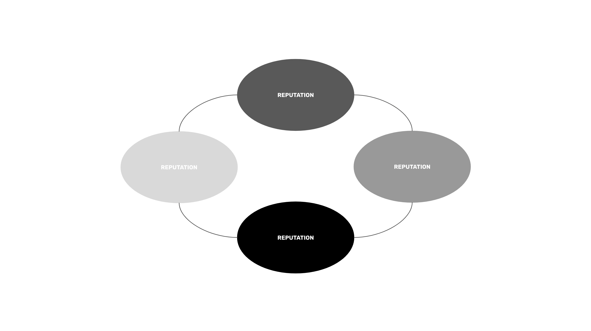

---
**You can listen to or watch this video here:**

<iframe width="560" height="315" src="https://www.youtube.com/embed/TtRT7aQGwbQ" title="YouTube video player" frameborder="0" allow="accelerometer; autoplay; clipboard-write; encrypted-media; gyroscope; picture-in-picture; web-share" allowfullscreen></iframe>

---

## Proof of Authority Purpose

Proof of Authority (PoA) consensus is meant to avoid investment in computational power and energy as in Proof of Work (PoW) consensus.

It is also made to avoid investment in staking deposits as in Proof of Stake (PoS) consensus.

However, PoA still provides a replicated and shared database as in a PoW or PoS network, so that known operators in trust groups; such as banks, governments, and corporations and its customers and providers; may interact more efficiently than in siloed traditional systems.

## How Does PoA Work?

In PoA, designated trusted actors are chosen to produce and validate blocks for the network.

One of the validators is selected to produce a block per round.

Then, they send the block to the rest of the validators.

When the rest of the validators receive they block, they vote on it by supermajority of 2/3 rds or unanimously, depending on the network.

After being approved, the block is sent to the rest of the network participants who accept it as the next canonical state of the network.

## Centralization

The whole purpose of blockchains is decentralization, but PoA networks are clearly centralized.

PoA is useful for certain use cases between trusted participants such as banks, governments, and corporations with their constituents and business ecosystems, as mentioned before.

The reason for which least a supermajority of 2/3 rds is needed to vote on blocks to validate them is to neutralize the 1/3 who could disrupt the network because systems that are not Proof of Work have only a 1/3 fault tolerance.

PoA blockchains are characterized by a limited number of actors who run the network nodes.

## Incentives to Use Proof of Authority Consensus

The primary incentive to use a PoA system is control. Many organizations and industries need to control their networks to be able to filter who may use them, enter transactions, and see the data hosted in them.

As PoA blockchains may also pay a block reward to validators, this may be an incentive for participation, especially when they are public networks which use a hybrid of PoA and PoS consensus mechanisms.

Another incentive is to share data between the trusted participants to have redundancy of the data, or what is called replication in proof of work systems.

## Comparisons With PoW and PoS

In PoW, work is required to produce blocks to earn the block rewards.

In PoS, validators want to earn rewards and not lose their staked capital through slashing and penalties.

In PoA, validators want to earn rewards or the benefits of participating in the system and not lose their reputation. This is the security assumption of the system.

---

**Thank you for reading this article!**

To learn more about ETC please go to: https://ethereumclassic.org
