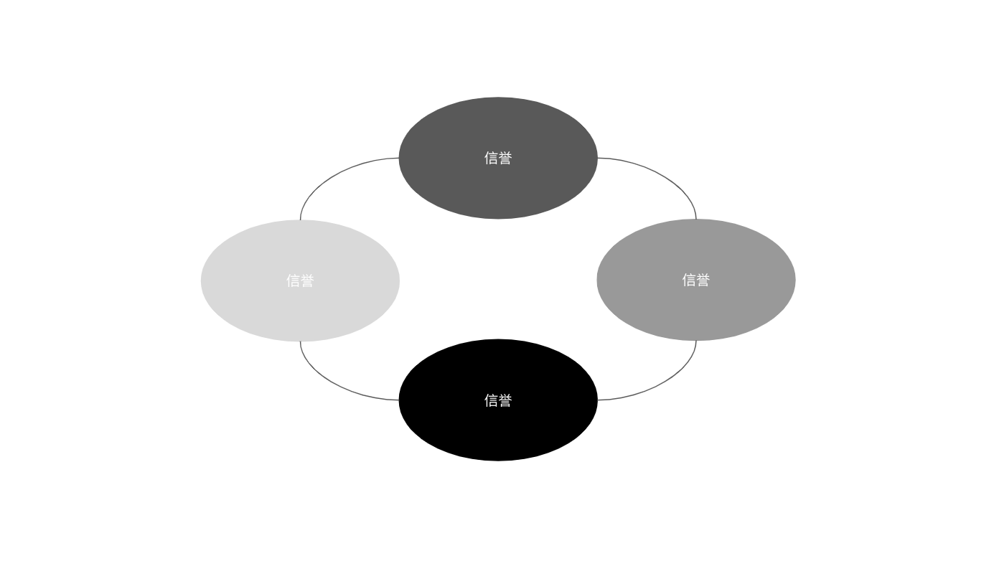

---
**您可以由此收听或观看本期视频:**

<iframe width="560" height="315" src="https://www.youtube.com/embed/TtRT7aQGwbQ" title="YouTube video player" frameborder="0" allow="accelerometer; autoplay; clipboard-write; encrypted-media; gyroscope; picture-in-picture; web-share" allowfullscreen></iframe>

---

## 权力证明的目的

权威证明(PoA)共识旨在避免像工作量证明(PoW)共识那样在计算能力和能量上的投资。

它也是为了避免投资于股权证明(PoS)共识中的股权存款。

然而，PoA仍然提供了一个复制和共享的数据库，就像在PoW或PoS网络中一样，因此信任组中的已知操作员;例如银行、政府、企业及其客户和供应商;可能比传统的竖井系统更有效地相互作用。

## PoA是如何运作的?

在PoA中，选择指定的可信参与者为网络生成和验证区块。

每轮选中一个验证器来生成一个区块。

然后，它们将块发送给其他验证器。

当其他验证者收到他们阻塞的消息时，他们会根据网络的不同，以2/3的绝对多数或一致投票。

在被批准后，该块被发送到接受它作为网络的下一个规范状态的其他网络参与者。

## 中心化

区块链的全部目的是去中心化，但PoA网络显然是中心化的。

如前所述，PoA对于可信参与者之间的某些用例非常有用，例如银行、政府和公司及其成员和业务生态系统。

至少需要2/3的绝对多数才能对区块进行投票来验证它们的原因是为了抵消可能破坏网络的1/3，因为没有工作量证明的系统只有1/3的容错性。

## 使用权威证明共识的激励机制

使用PoA系统的主要动机是控制。许多组织和行业需要控制他们的网络，以便能够过滤谁可以使用它们，输入交易，并查看托管在其中的数据。

由于PoA区块链也可以向验证者支付区块奖励，这可能是一种参与的激励，特别是当它们是使用PoA和PoS共识机制混合的公共网络时。

另一个动机是在受信任的参与者之间共享数据，以获得数据的冗余，或者在工作量证明系统中称为复制。

## 与PoW和PoS的比较

在PoW中，需要工作来生产区块以获得区块奖励。

在PoS中，验证者希望获得奖励，而不是通过削减和惩罚失去他们的赌注资本。

在PoA中，验证者希望获得参与系统的奖励或好处，而不失去他们的声誉。这是系统的安全假设。

---

**感谢您阅读本期文章!**

了解更多有关ETC，请访问: https://ethereumclassic.org
