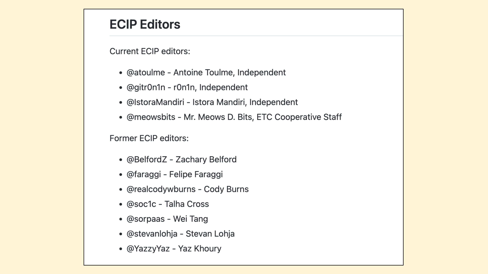
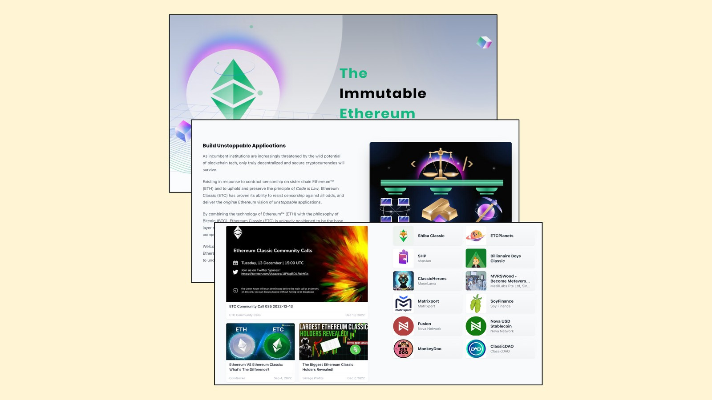

---
**You can listen to or watch this video here:**

<iframe width="560" height="315" src="https://www.youtube.com/embed/1dVSwqU6MOs" title="YouTube video player" frameborder="0" allow="accelerometer; autoplay; clipboard-write; encrypted-media; gyroscope; picture-in-picture; web-share" allowfullscreen></iframe>

---

This is the fourth part of a series that will explain how to contribute to Ethereum Classic (ETC) in a variety of ways. 

The videos and posts in the series will contain the title “How to Contribute to ETC:” with the following topic extensions: 

1. The Improvement Proposal Process (ECIP)
2. The Community Website
3. Community Tweets
4. Community Volunteering
5. Mining
6. Operating a Node
7. Donating Money
8. Building a Dapp

## What Is Community Volunteering in the Context of ETC?

Open source software projects tend to have large shares of volunteering because their purpose is usually to contribute useful products to the world for free.

Public blockchains must be open source projects as transparency and free participation are critical elements of their design. Consequently, the profiles of these projects tend to be similar to passionate grassroots movements.

ETC is no different. Its history is a history of survival after TheDAO hard fork, fighting for ideals against all odds, and a principled existence. All these are driven by volunteers who believe in the project and its values.

In this post we explain the different ways in which people may volunteer in the ETC ecosystem.

## Being Part of the Conversation

The most common way of participating in ETC is by sharing opinions, reading other opinions, and participating in the conversation in general.

There is a core community of several hundred if not thousands of people who talk about ETC, its current affairs, price, comparisons to other projects, future, and other topics on a daily basis through various channels.

This community is a critical part of the Ethereum Classic broader ecosystem because their conversation helps disseminate useful and important information about the system, its constituents, its market trends, applications, and other key issues on a global scale.

## Participating Through the Different Social Channels

The ETC ecosystem is a global network of participants, many of whom are node operators, miners, investors, developers, users, researchers, and other kinds of interested parties.

They all participate through several social channels of which the most popular are:

- ETC Discord: https://ethereumclassic.org/discord
- Following on Twitter: [@eth_classic](https://twitter.com/eth_classic) and [@etc_network](https://twitter.com/etc_network)
- ETC Telegram: [@ethclassic_army](https://t.me/ethclassic_army) and [@KimiCapital](https://t.me/KimiCapital)
- ETC Cooperative Discord: https://discord.gg/5wDyd6u6pU
- Discussions on GitHub: https://github.com/ethereumclassic 
- Reddit: https://reddit.com/r/EthereumClassic
- WeChat in Chinese: https://etccooperative.org/nanli777.jpg (there you will find the QR code for the WeChat channel)

## Moderating Social Channels

A more advanced way of participation is by moderating social channels.

The ETC Discord is moderated by around six individuals who diligently apply the community rules on a daily basis, moderate commentary, organize channels, and keep the community alive and vibrant.

The Twitter accounts are managed by many volunteer contributors who keep the system working, approve Tweets submitted by the public, and adjust the flow of information to ETC’s principles.

The ECIP process, the main system for proposing new protocol and software changes to ETC, is maintained by four volunteers.

## Tweeting Through Twitter Together

As mentioned in the previous section, the Ethereum Classic community maintains two Twitter accounts to disseminate significant information about Ethereum Classic and promote the use of the ETC network. The public may submit proposals for tweets to be sent from these accounts using the community's “Twitter Together” system.

Found on the GitHub website,  repositories for these two accounts are located at:

- Eth_Classic account: 

https://github.com/ethereumclassic/tweets-eth_classic 

- Etc_Network account: 

https://github.com/ethereumclassic/tweets-etc_network

Anyone with tweet suggestions may submit them by following the instructions found in the repositories' README.ml file. Tweets are filtered and managed by volunteer ETC admins who take care that the content adheres to Twitter's rules and ETC’s principles.

## Debating Proposals of the ECIP Process

As ETC is an open source project, any changes to its protocol or software must go through a public process called the Ethereum Classic Improvement Proposal (ECIP) process.

This is a critical function in the ecosystem as these potential changes could modify the network’s security model, thus presenting a risk to its integrity.

For this reason, there are many volunteers who read each proposal and analyze it thoroughly before emitting their opinions about it. Sometimes they may support changes and other times vehemently oppose them.

This is a very important function that anyone who has the time, knowledge, and dedication may do. And, it is one of the ways in which the safety and purpose of the ETC blockchain is preserved. 

## Contributing to the ETC Community Website

The main information source for Ethereum Classic is the community website located at:

https://ethereumclassic.org

There, a community of contributors, administrators and editors, maintain all the necessary information for the world to be up to date about everything ETC.

Anyone in the world may contribute valuable information including:

- Links to external articles
- Links to external videos
- Original posts
- Frequently asked questions
- The “Why Classic?” section
- The Knowledge base
- A Services page
- A Community Page
- A Network page
- A Mining page
- A Development page
- All other static pages (About, Sitemap, etc.)

## Research, Writing, and Producing Videos

One of the most valuable ways of volunteering for ETC is by using your talents and knowledge to advance the network. There are many contributors who do research, write, and produce videos regularly for Ethereum Classic.

A great way of doing this is by starting your own ETC YouTube channel and/or blog. Examples of these are:

- [Etherplan](https://etherplan.com)
- [PatientMoney](https://www.youtube.com/@PatientMoney)
- [SavageProfits](https://www.youtube.com/@SavageProfits)
- [StonkInsights](https://www.youtube.com/@stonkinsights)
- Ethereum Classic Updates: https://www.youtube.com/@ETCupdates

---

**Thank you for reading this article!**

To learn more about ETC please go to: https://ethereumclassic.org
