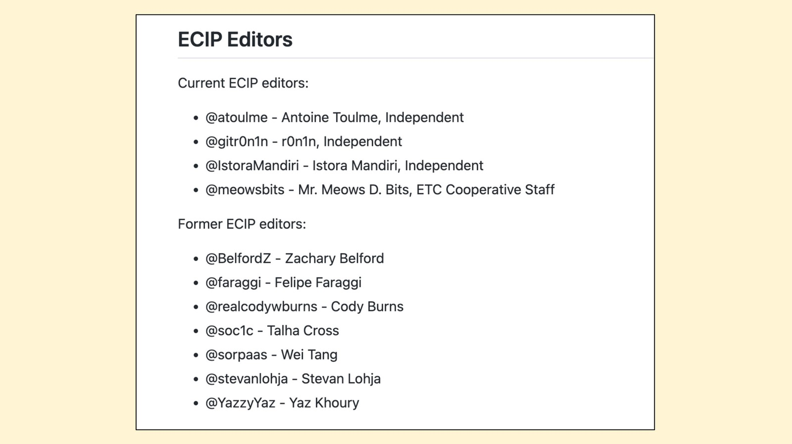
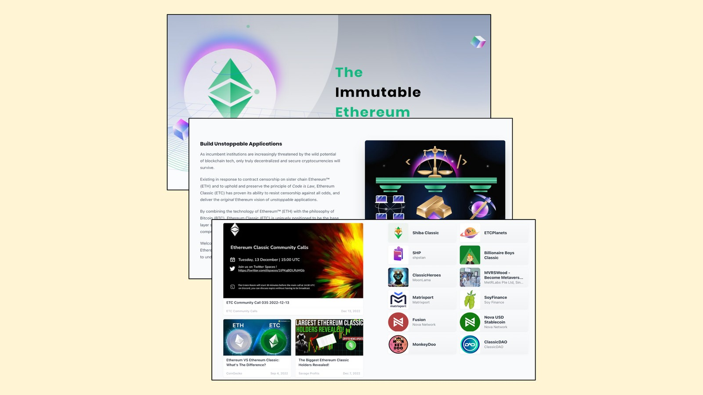

---
**您可以由此收听或观看本期内容:**

<iframe width="560" height="315" src="https://www.youtube.com/embed/1dVSwqU6MOs" title="YouTube video player" frameborder="0" allow="accelerometer; autoplay; clipboard-write; encrypted-media; gyroscope; picture-in-picture; web-share" allowfullscreen></iframe>

---

这是本系列文章的第四部分，将解释如何以多种方式为Ethereum Classic (ETC)做出贡献。

该系列的视频和帖子将包含标题“How to Contribute to ETC:”，后跟以下主题扩展：

1.改进提案流程（ECIP）
2.社区网站
3.社区推文
4.社区志愿工作
5.挖矿
6.操作节点
7.捐赠资金
8.构建Dapp

## 以ETC为背景的社区志愿工作是什么？

开源软件项目通常有很多志愿工作，因为它们的目的通常是免费为世界贡献有用的产品。

公共区块链必须是开源项目，因为透明度和免费参与是其设计的关键要素。因此，这些项目的特点往往类似于充满激情的草根运动。

ETC也不例外。它的历史是TheDAO硬分叉之后的生存史，是在万难之中为理想而战、坚持原则的存在。这一切都是由相信这个项目和其价值的志愿者所推动的。

在本文中，我们将解释人们可以在ETC生态系统中进行志愿工作的不同方式。

## 参与讨论

最常见的参与ETC的方式是分享意见、阅读其他意见，并在总体上参与谈话。

有一个核心社区由几百人甚至几千人组成，他们每天通过各种渠道谈论ETC，包括当前事件、价格、与其他项目的比较、未来以及其他主题。

这个社区是以太经典更广泛生态系统的关键部分，因为他们的谈话有助于在全球范围内传播关于系统、构成部分、市场趋势、应用和其他关键问题的有用和重要信息。

## 通过社交媒体渠道参与

ETC生态系统是一个由全球参与者组成的网络，其中许多人是节点操作者、矿工、投资者、开发人员、用户、研究人员和其他类型的利益相关者。

他们通过几个社交渠道参与，其中最受欢迎的是：

- ETC Discord: https://ethereumclassic.org/discord
- 关注推特[@eth_classic](https://twitter.com/eth_classic)和[@etc_network](https://twitter.com/etc_network)
- ETC电报: [@ethclassic_army](https://t.me/ethclassic_army)和[@KimiCapital](https://t.me/KimiCapital)
- ETC Cooperative Discord: https://discord.gg/5wDyd6u6pU
- GitHub讨论: https://github.com/ethereumclassic 
- Reddit: https://reddit.com/r/EthereumClassic
- 中文微信: https://etccooperative.org/nanli777.jpg (您可以由此找到微信群的二维码)

## 社交媒体频道的管理

更高级的参与方式是通过管理社交媒体频道。

ETC Discord由约6名工作人员进行管理，他们每天认真执行社区规则，管理评论，组织频道，使社区保持生机勃勃。

Twitter账号由许多志愿者贡献者管理，他们使系统正常运转，审核公众提交的推文，并根据ETC的原则调整信息流量。

ECIP流程是向ETC提出新协议和软件更改建议的主要系统，由四名志愿者维护。

## 一起在推特发推文

如前所述，公众可以通过ETC社区Twitter账户提交推文，这个系统叫做“一起发推文”。

这是通过一个名为GitHub的网站完成的，在这两个账户的存储库中，它们位于：

- Eth_Classic账户: 

https://github.com/ethereumclassic/tweets-eth_classic 

- Etc_Network账户: 

https://github.com/ethereumclassic/tweets-etc_network

任何人都可以按照说明前往那里提交推文。这些推文将由ETC管理员进行过滤和管理，他们会确保内容符合规则和ETC的原则。

## 讨论ECIP流程的提议

由于ETC是一个开源项目，对其协议或软件的任何更改都必须经过一个名为Ethereum Classic Improvement Proposal（ECIP）的公共流程。

这是生态系统中的关键功能，因为这些潜在的更改可能会修改网络的安全模型，从而对其完整性构成风险。

因此，有许多志愿者在发表意见之前会阅读每个提议并对其进行彻底分析。有时他们可能支持更改，有时则强烈反对。

这是一项非常重要的功能，任何有时间、知识和奉献精神的人都可以做。它是保护ETC区块链安全和目的的方式之一。

## ETC社区网站做出贡献

以太坊经典的主要信息来源是社区网站，位于以下网址：

https://ethereumclassic.org

在那里，由贡献者、管理员和编辑组成的社区维护了所有必要的信息，使全世界都能及时了解有关ETC的一切。

全世界任何人都可以贡献有价值的信息，包括：

- 链接到外部文章
- 链接到外部视频
- 原始帖子
- 常见问题解答
- “为什么选择经典”部分
- 知识库
- 服务页面
- 社区页面
- 网络页面
- 挖矿页面
- 开发页面
- 所有其他静态页面（关于、网站地图等）

## 研究、撰写和制作视频

为ETC做出贡献的最有价值的方法之一是利用您的才能和知识推进网络。有许多贡献者定期为以太坊经典进行研究、撰写和制作视频。

一个很好的方法是开设自己的ETC YouTube频道和/或博客。以下是其中的例子：

- Etherplan: https://etherplan.com
- PatientMoney: https://www.youtube.com/@PatientMoney
- SavageProfits: https://www.youtube.com/@SavageProfits
- StonkInsights: https://www.youtube.com/@stonkinsights
- 以太坊经典最新消息: https://www.youtube.com/@ETCupdates

---

**感谢您阅读本期文章!**

了解更多有关ETC相关内容，请访问: https://ethereumclassic.org
