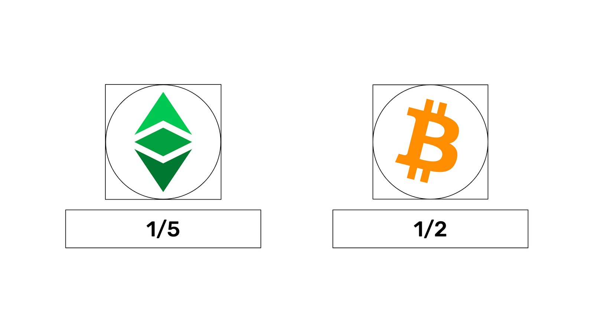

---
**You can listen to or watch this video here:**

<iframe width="560" height="315" src="https://www.youtube.com/embed/JaNkywXLg2M" title="YouTube video player" frameborder="0" allow="accelerometer; autoplay; clipboard-write; encrypted-media; gyroscope; picture-in-picture; web-share" allowfullscreen></iframe>

---

## What is the Fifthening in ETC?

Ethereum Classic’s monetary policy has a rule that every 5,000,000 blocks it will reduce the mining reward by 20%. This is called the fifthening because it is a 1/5 cut in the issuance of the coin.

The mining reward is the amount of ETC that is issued to pay for miners to produce blocks for the network.

In ETC, a block is currently being produced every 13.1525 seconds on average.

The historial schedule of payments per block to miners by the Ethereum Classic network has been the following:

**Era 1:** 5.00 ETC, from block 0, which happened on June 30, 2015

**Era 2:** 4.00 ETC, from block 5,000,000, which happened on December 11, 2017

**Era 3:** 3.20 ETC, from block 10,000,000 which happened on March 17, 2020

**Era 4:** 2.56 ETC, from block 15,000,000 which happened on April 25, 2022

Because ETC is now on block 17,088,524 as of this writing, it is paying 2.56 ETC per block as we are in era 4.

In the next era, which will be era 5, the block reward will be reduced to 2.048 ETC.

## When Will ETC’s Next Fifthening Happen?

To estimate when the next ETC fifthening will happen we need to know how many blocks are left until the next fifthening. Then, we need to multiply that number of blocks by the average block time of the network in seconds. This will give us the number of seconds left until the next fifthening. If we transform that amount into days, then we will be able to add the result to the current date and determine when the next fifthening will happen.

**Following the above logic we will do the following calculation:**

Current ETC block at the time of this writing: 17,088,524

Next fifthening block number: 20,000,000

Blocks left until the next fifthening: 20,000,000 - 17,088,524 = 2,911,476

Seconds left to the next fifthening: 2,911,476 x 13.1525 = 38,293,188

Days left to the next fifthening: 38,293,188 / 60 / 60 / 24 = 443.2081

Current date at the time of this writing: March 8, 2023

**Current date + 443.2081 days = May 25, 2024**

## What is the Halving in Bitcoin?

Bitcoin’s monetary policy has a rule that every 210,000 blocks it will reduce the mining reward by 50%. This is called the halving because it is a 1/2 cut in the issuance of the coin.

The mining reward is the amount of BTC that is issued to pay for miners to produce blocks for the network.

In BTC, a block is currently being produced every 9.2660 minutes on average.

The historial schedule of payments per block to miners by the Bitcoin network has been the following:

**Era 1:** 50.00 BTC, from block 0, which happened on January 03, 2009

**Era 2:** 25.00 BTC, from block 210,000, which happened on November 28, 2012

**Era 3:** 12.50 BTC, from block 420,000 which happened on July 09, 2016

**Era 4:** 6.25 BTC, from block 630,000 which happened on May 11, 2020

Because Bitcoin is now on block 779,961 as of this writing, it is paying 6.25 BTC per block as we are in era 4.

In the next era, which will be era 5, the block reward will be reduced to 3.125 BTC.

## When Will Bitcoin’s Next Halving Happen?

To estimate when the next BTC halving will happen we need to know how many blocks are left to the next halving. Then, we need to multiply that number of blocks by the average block time of the network in minutes. This will give us the number of minutes left to the next halving. If we transform that amount into days, then we will be able to add the result to the current date and determine when the next halving will happen.

**Following the above logic we will do the following calculation:**

Current BTC block at the time of this writing: 779,961

Next halving block number: 840,000

Blocks left to the next halving: 840,000 - 779,961 = 60,039

Minutes left to the next halving: 60,039 x 9.2660 = 556,321

Days left until the next halving: 556,321 / 60 / 24 = 386.33

Current date at the time of this writing: March 8, 2023

**Current date + 386.33 days = March 29, 2024**

## Why Are the Fifthening and the Halving Important?

The  most important feature of the ETC and BTC currencies is that they are considered digital gold because they require enormous amounts of work and energy to create them. 

In addition to this cost of production, both Ethereum Classic and Bitcoin have capped supplies as their monetary policies reduce the payments to miners in the quantities explained above.

These characteristics of both coins mimic the scarcity of gold in the real world, giving them great demand as decentralized and permissionless units of exchange and stores of value.

The fifthening and the halving are important because they approximate the inflation rate of ETC and BTC to that of gold, which is historically around 1.7%. As both ETC and BTC issuances will eventually go to zero, they will actually have lower inflation rates than gold.

The current inflation rate of BTC is 1.84% and by the next halving, in March of 2024, it will go down to 0.92%.

The current inflation rate of ETC is 4.83% and by the next fifthening in May of 2024 it will go down to 3.87%. By the year 2032, ETC will have an inflation rate of 1.67%, very similar to that of gold, and lower than the current inflation of Bitcoin.

Both ETC and BTC are sound money and transferable permissionlessly over the internet.

---

**Thank you for reading this article!**

To monitor the ETC fifthening clock go to: https://etcis.money/

Tomonitor the Bitcoin halving clock go to: https://buybitcoinworldwide.com/halving/

To learn more about ETC please go to: https://ethereumclassic.org
