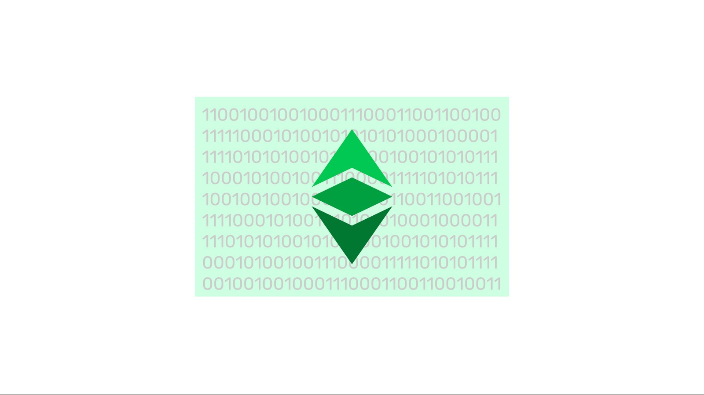

---
**You can listen to or watch this video here:**

<iframe width="560" height="315" src="https://www.youtube.com/embed/81xZPZXU3_w" title="YouTube video player" frameborder="0" allow="accelerometer; autoplay; clipboard-write; encrypted-media; gyroscope; picture-in-picture; web-share" allowfullscreen></iframe>

---

## Origin of Smart Contracts

Smart contracts were invented by Nick Szabo in 1994. At that time he wrote:

*“An idea I've recently converged on, after studying areas from cryptography to Electronic Data Interchange (EDI) to business practice, is the concept of smart contracts. I define a smart contract as a computerized transaction protocol that executes terms of a contract. The general objectives of smart contract design are to satisfy common contractual conditions (such as payment terms, liens, confidentiality, and even enforcement), minimize exceptions both malicious and accidental, and minimize the need for trusted intermediaries. Related economic goals include lowering fraud loss, arbitration and enforcement costs, and other transaction costs.”*

Link: https://web.archive.org/web/20150321052107/http://www.virtualschool.edu/mon/Economics/SmartContracts.html

## Satoshi Nakamoto’s Attempts at Smart Contracts

Bitcoin was invented and launched by Satoshi Nakamoto in 2009. About smart contracts in 2010 he wrote:

*“The design supports a tremendous variety of possible transaction types that I designed years ago.  Escrow transactions, bonded contracts, third party arbitration, multi-party signature, etc.  If Bitcoin catches on in a big way, these are things we'll want to explore in the future, but they all had to be designed at the beginning to make sure they would be possible later.”*

Link: https://bitcointalk.org/index.php?topic=195.msg1611#msg1611

## What Are Smart Contracts?

Smart contracts are software programs that are hosted in blockchain networks such as Ethereum Classic (ETC), Ethereum (ETH), and others. 

These programs represent, as Szabo explained originally, contract or transaction protocols between individuals and businesses.

When developers write these software programs and send them to a blockchain such as Ethereum Classic they become decentralized.

## How Do Smart Contracts Work?

When a software program is sent to the blockchain, it immediately gets replicated in all machines of the network. This transforms it into a decentralized software program, and these are what are called smart contracts.

Smart contracts have their own accounts and balances inside the network and, to execute them, users need to send transactions directed to them so all the machines in the network may execute the code in parallel and do whatever the program is designed to do.

## The Key Is Trust Minimization

The original goal of Cypherpunks like Nick Szabo was to reduce the dependence by economic agents from trusted third parties.

Smart contracts replace trusted third parties with what are called autonomous agents. 

This is because once they are deployed to blockchain networks, they become not only decentralized but part of the public domain. This means that anyone may send money to and use these autonomous agents for whatever service they provide.

## Smart Contracts Are the Backend Code of the Web3

The web 3 is a new paradigm of the internet. Today, the core code, or backend, of websites and applications, plus the images and data that work together to power websites and apps are usually stored and executed in centralized data centers or cloud services.

By using the blockchain industry, entire websites and applications may be transferred to decentralized blockchains where the backend code is stored and executed in specialized smart contract blockchains such as ETC, and the images and data may be stored in decentralized file storage blockchains such as Filecoin and others.

In this way, users would access the websites and apps through their browsers, but the websites and applications themselves would be entirely decentralized as all their components would be hosted in public networks and none would significantly depend on particular trusted third parties.

## Examples of Smart Contracts

Examples of current decentralized applications powered by smart contracts are:

- Decentralized exchanges such as [Uniswap](https://app.uniswap.org/), [PancakeSwap](https://pancakeswap.finance/), [HebeSwap](https://pancakeswap.finance/), and [ETCSwap](https://swap.ethereumclassic.com/#/swap).

- NFT’s such as [CryptoKitties](https://www.cryptokitties.co/), [ETC Punks](https://etcpunks.com/), [Classic Rewards](https://www.classicrewards.io/), and Beelple’s [digital art](https://www.christies.com/features/Monumental-collage-by-Beeple-is-first-purely-digital-artwork-NFT-to-come-to-auction-11510-7.aspx).

- [Stablecoins](https://www.coingecko.com/en/categories/stablecoins) such as Tether, USD Coin, and Binance USD.

- And ERC-20 tokens such as [Shiba Inu](https://shibatoken.com/) and [Shiba Inu Classic](https://www.shibaclassic.sc/).

## Security of Smart Contracts

Smart contracts have the same security guarantees as the blockchain in which they are deployed.

In a proof of work blockchain as ETC, smart contracts, therefore dapps and web3, are truly decentralized, permissionless, and immutable.

These attributes make possible the Code Is Law principle in Ethereum Classic which means that applications in ETC are truly unstoppable.

## ETC Is the Largest PoW Smart Contracts Blockchain in the World

When Ethereum migrated to proof of stake in September 15 of 2022, Ethereum Classic automatically became the largest proof of work smart contracts blockchain in the world and the fifth largest proof of work network.

This positions ETC in one of the most valuable niches in the industry. 

As proof of stake networks battle for market share, spending billions of dollars in communication campaigns, subsidies to developers, and making noise to be noticed, the market is distracted in short term speculation and conjectures about these prone to centralization and insecure systems.

As time passes by, the world begins to notice the differences, and users start to demand true security and decentralization, ETC will likely reap the benefits of its solid foundations. 

---

**Thank you for reading this article!**

To learn more about ETC please go to: https://ethereumclassic.org
