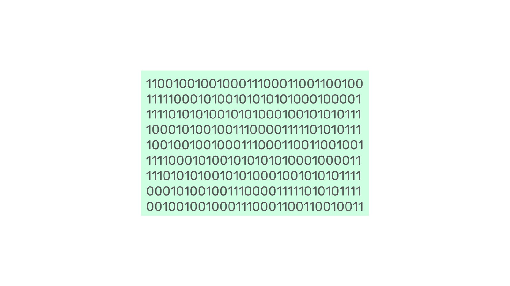

---
**您可以由此收听或观看本期内容:**

<iframe width="560" height="315" src="https://www.youtube.com/embed/81xZPZXU3_w" title="YouTube video player" frameborder="0" allow="accelerometer; autoplay; clipboard-write; encrypted-media; gyroscope; picture-in-picture; web-share" allowfullscreen></iframe>

---

## 智能合约的起源

智能合约是Nick Szabo在1994年发明的。当时他写道:

*“在研究了从密码学到电子数据交换(EDI)再到商业实践等领域后，我最近集中在一个想法上，那就是智能合约的概念。我将智能合约定义为执行合约条款的计算机化交易协议。智能合约设计的总体目标是满足常见的合同条件(如支付条款、留置权、机密性，甚至执行)，最大限度地减少恶意和意外的异常，并最大限度地减少对可信中介的需求。相关的经济目标包括降低欺诈损失、仲裁和执法成本以及其他交易成本。”*

链接: https://web.archive.org/web/20150321052107/http://www.virtualschool.edu/mon/Economics/SmartContracts.html

## 中本聪对智能合约的尝试

比特币是中本聪(Satoshi Nakamoto)在2009年发明并推出的。关于智能合约，他在2010年写道:

*“该设计支持我多年前设计的各种可能的交易类型。托管交易、保税合同、第三方仲裁、多方签字等。如果比特币大受欢迎，这些都是我们未来想要探索的东西，但它们都必须在一开始就设计好，以确保以后成为可能。”*

链接: https://bitcointalk.org/index.php?topic=195.msg1611#msg1611

## 什么是智能合约?

智能合约是托管在区块链网络中的软件程序，如以太坊经典(ETC)、以太坊(ETH)等。

正如Szabo最初解释的那样，这些程序代表了个人和企业之间的合同或交易协议。

当开发人员编写这些软件程序并将它们发送到以太坊经典等区块链时，它们就变得去中心化了。

## 智能合约是如何运作的?

当一个软件程序被发送到区块链时，它立即被复制到网络中的所有机器上。这将它转换成一个去中心化的软件程序，这些就是所谓的智能合约。

智能合约在网络中有自己的账户和余额，为了执行它们，用户需要发送定向给它们的交易，这样网络中的所有机器都可以并行执行代码，并执行程序设计的任何功能。

## 关键是信任最小化

像Nick Szabo这样的密码朋克最初的目标是减少经济代理人对可信第三方的依赖。

智能合约用所谓的自主代理取代了可信的第三方。

这是因为一旦它们被部署到区块链网络，它们不仅变得去中心化，而且成为公共领域的一部分。这意味着任何人都可以向这些自主代理发送资金并使用它们提供的任何服务。

## 智能合约是Web3的后端代码

Web3是互联网的一种新范式。如今，网站和应用程序的核心代码或后端，以及共同支撑网站和应用程序的图像和数据，通常存储和执行在集中式数据中心或云服务中。

通过使用区块链行业，整个网站和应用程序可以转移到去中心化的区块链上，后端代码存储和执行在专门的智能合约区块链中，如ETC，图像和数据可以存储在去中心化的文件存储区块链中，如Filecoin等。

通过这种方式，用户可以通过浏览器访问网站和应用程序，但网站和应用程序本身将完全去中心化，因为它们的所有组件都将托管在公共网络中，没有一个会显著依赖于特定的可信第三方。

## 智能合约的示例

目前由智能合约支持的去中心化应用程序的例子有:

- 去中心化交易所比如[Uniswap](https://app.uniswap.org/), [PancakeSwap](https://pancakeswap.finance/), [HebeSwap](https://pancakeswap.finance/), 和[ETCSwap](https://swap.ethereumclassic.com/#/swap).

- NFT项目例如[CryptoKitties](https://www.cryptokitties.co/), [ETC Punks](https://etcpunks.com/), [Classic Rewards](https://www.classicrewards.io/),和 Beelple的[数字艺术](https://www.christies.com/features/Monumental-collage-by-Beeple-is-first-purely-digital-artwork-NFT-to-come-to-auction-11510-7.aspx).

- [稳定币](https://www.coingecko.com/en/categories/stablecoins) 例如Tether, 美金币, 和必安美金.

- 和ERC-20代币，比如[Shiba Inu](https://shibatoken.com/)和[Shiba Inu经典](https://www.shibaclassic.sc/).

## 智能合约的安全性

智能合约与其部署的区块链具有相同的安全保证。

在以工作量证明为基础的区块链，如ETC中，智能合约、dapp和web3是真正分散、无需许可和不可变的。

这些特点使得以太坊经典中的“代码即法律”原则成为可能，也就是说，ETC中的应用程序是真正无法被停止的。

## ETC是全球最大的工作量证明智能合约区块链

当以太坊在2022年9月15日迁移到权益证明时，以太坊经典自动成为世界上最大的智能合约工作量证明区块链和第五大工作量证明网络。

这使ETC处于行业中最有价值的领域之一。

随着权益证明网络争夺市场份额，花费数十亿美元进行通讯宣传、对开发人员提供补贴并制造噪音以引起关注，市场分散于短期投机和关于这些易于中心化和不安全的系统的猜测之中。

随着时间的推移，世界开始注意到差异，用户开始要求真正的安全性和去中心化，ETC可能会收获其坚实基础的好处。

---

**感谢您阅读本期文章!**

了解更多有关ETC，请访问: https://ethereumclassic.org
