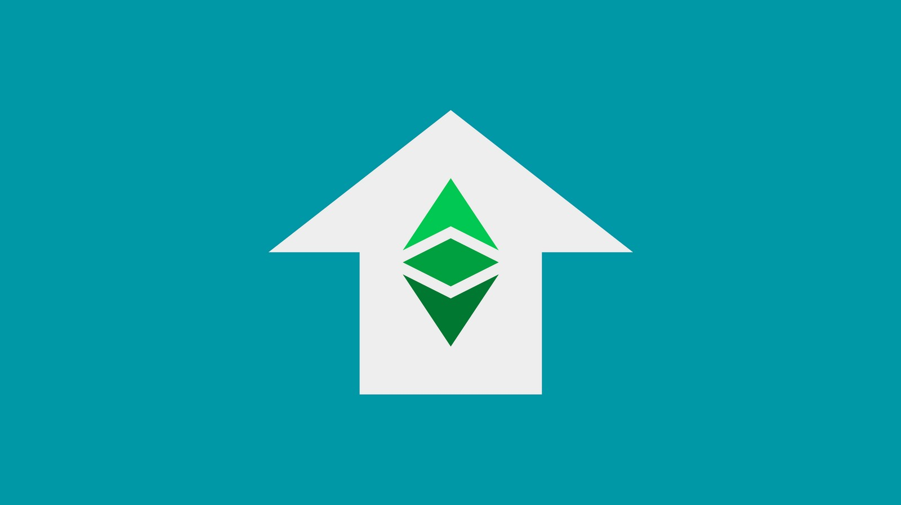

---
**You can listen to or watch this video here:**

<iframe width="560" height="315" src="https://www.youtube.com/embed/ltV3gnrmHo4" title="YouTube video player" frameborder="0" allow="accelerometer; autoplay; clipboard-write; encrypted-media; gyroscope; picture-in-picture; web-share" allowfullscreen></iframe>

---

The fact that Ethereum Classic (ETC) is a proof of work blockchain, with fixed monetary policy, and smart contracts gives it features that make it very valuable.

The main benefits of these features are true decentralization, soundness of the money, and programmability.

Decentralization means trust minimization, which makes it secure. And, by secure we mean that it is immutable, permissionless, and censorship resistant on a global scale.

All these benefits combined make ETC valuable to many types of participants around the world for various reasons that we will explain in this post.

## ETC Is Sound Money

ETC is sound money because its coin is scarce, durable, costly to create, portable, divisible, fungible, and transferable. These features are basic physical attributes we evolved to demand so we could have a unit of value to exchange for goods and services and to use as a store of value for future spending.

A basic need of humans is to work to provide value to others so we can be rewarded for that value to sustain ourselves, our families, and our communities.

With sound money we reduced transactional costs and we introduced a unit of value that could be distributed between ourselves to divide labour, thus foster the explosion of innovation that resulted in our current modern age.

ETC is sound money that provides all these benefits because its currency is very costly to create due to proof of work, and it has a fixed monetary policy which guarantees that the stock of the coin will not exceed 210,700,000 units, and it will be distributed fairly and at a decreasing rate in the next 120 years.

## ETC Is Programmable

In addition to being sound money, the native cryptocurrency of ETC is programmable through smart contracts. 

Smart contracts are software programs that application developers may write and when they send them to the network they become decentralized as they are replicated across all nodes in the system, making them decentralized applications or dapps, for short.

This programmability, combined with its decentralization and the soundness of its money, gives ETC incredible value and versatility for users and developers alike.

Smart contracts are a key for further trust minimization, making ETC even more valuable than simple ledger systems as Bitcoin and Litecoin, because decentralized applications are like autonomous agents that replace the need for service providers hosted in proprietary data centers or cloud services.

## ETC Is Good Business For Miners

As ETC is the largest proof of work smart contracts blockchain in the world, and has a market capitalization in the billions, it is a very good business for proof of work miners. 

Because ETC still has a long way to run as it rises further to become one of the top 2 blockchains in the world, miners are flocking to the network for the opportunity to put to work their GPUs and ASIC machines, and many of them are accumulating ETC for the long term rather than liquidating it to pay their bills or to exchange for other assets.

ETC is currently the fourth largest mining computing base after Bitcoin, DogeCoin, and Litecoin, but in the short term it will likely surpass DOGE and LTC to become the second largest mining base in the world.

## ETC Is Good Business for Economic Nodes

Economic nodes are those nodes in the blockchain that are operated by businesses that use ETC to generate revenues. Examples of these are exchanges, wallet providers, block explorers, node as a service (NaaS) providers, data services, crypto custody services, and many others.

Historically, trading volume in ETC against fiat and other cryptocurrencies has ranked very high in exchanges. This makes ETC a very good business for these players as well as for software and hardware wallet providers.

ETC is listed in most top exchanges and featured in most top wallet brands. As it is widely used by the public globally, it is featured in many data services and various blockchain access and custody providers.

Because running an ETC node is simple and straightforward, many of these businesses are node operators who value the ability to verify the data, transactions, and blocks by themselves. This is the basis of the saying “run your own node!” in the industry.

## ETC Is Good for Global Users

ETC is incredibly valuable for users globally. 

Because it is a proof of work blockchain, with a fixed monetary policy, and smart contracts, it provides something that the world will increasingly demand as time passes by: Unstoppability.

The fact that ETC is truly decentralized, trust minimized, and thus censorship resistant, permissionless, and immutable is of an incalculable value for millions across the planet.

As governments and corporations cooperate more and more to centralize and control the money, speech, and property through technology, and even imagine a central world government, reducing basic rights of the people everywhere, the demand for real decentralized computing and money will rise proportionately. People will be able to escape the tyranny of this dystopian world by using ETC as their refuge.

For all of these reasons, Ethereum Classic has enormous value.

---

**Thank you for reading this article!**

To learn more about ETC please go to: https://ethereumclassic.org
