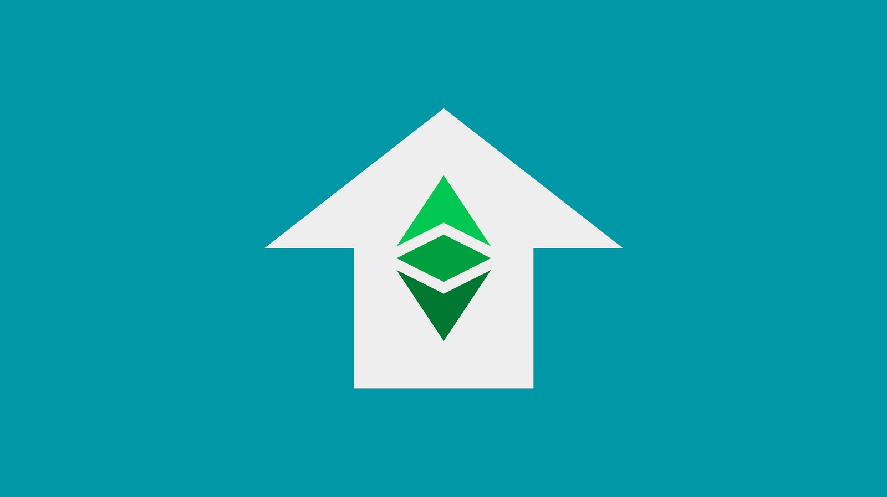

---
**You can listen to or watch this video here:**

<iframe width="560" height="315" src="https://www.youtube.com/embed/ltV3gnrmHo4" title="YouTube video player" frameborder="0" allow="accelerometer; autoplay; clipboard-write; encrypted-media; gyroscope; picture-in-picture; web-share" allowfullscreen></iframe>

---

以太坊经典（ETC）作为一种工作量证明的区块链，具有固定的货币政策和智能合约功能，使其非常有价值。

这些特点的主要好处是真正的去中心化、货币的稳定性和可编程性。

去中心化意味着最小化信任，这使它更加安全。这里说的安全，我们指的是它在全球范围内是不可变、无需许可和抗审查的。

所有这些好处结合在一起使ETC对世界各地的许多类型的参与者都具有价值，出于各种原因，我们将在本文中解释这些原因。

## ETC是稳健的货币

ETC是稳健的货币，因为它的货币供应是稀缺的、持久的、难以创造的、可携带、可分割、可替代和可转移的。这些特点是我们演变出来的基本物理属性，我们要求它们，以便我们可以交换货物和服务，并用作未来支出的价值存储。

人类的基本需求为他人提供价值，以便我们可以因为这种价值而获得回报，以维持自己、家庭和社区。

通过稳健的货币，我们减少了交易成本，并引入了一种可以在我们之间分配的价值单位，以分工合作，从而促进了创新的爆炸，导致了我们当前的现代时代。

ETC是稳健的货币，提供所有这些好处，因为它的货币供应非常昂贵，由于工作量证明的原因，并且它有一个固定的货币政策，保证货币的存量不超过21,070万个单位，并且在未来120年内公平分配，且分配速度逐渐减少。

## ETC是可编程的

除了作为有价值的货币外，ETC的本地加密货币还可以通过智能合约进行编程。

智能合约是应用程序开发人员编写的软件程序，当他们将其发送到网络时，它们会被复制到系统中的所有节点上，从而使它们成为去中心化应用程序或dapp。

这种可编程性，加上其去中心化和货币的稳定性，为用户和开发人员提供了难以置信的价值和多功能性。

智能合约是进一步信任最小化的关键，使ETC比比特币和莱特币等简单账本系统更具价值，因为去中心化应用程序就像自主代理，取代了托管在专有数据中心或云服务中的服务提供商的需求。

## ETC对于矿工是有利的业务

作为全球最大的工作量证明智能合约区块链，并拥有数十亿美元的市值，ETC对于工作量证明矿工来说是非常有利可图的。

因为ETC还有很长的路要走，它将进一步上升成为全球前两个区块链之一，矿工们正在涌向网络，利用他们的GPU和ASIC机器，他们中的许多人正在长期积累ETC而不是将其出售以支付账单或交换其他资产。

ETC目前是比特币、狗狗币和莱特币之后的第四大挖掘计算基础，但在短期内，它很可能会超过DOGE和LTC，成为世界上第二大挖掘基础。

## ETC对于经济节点也是有利的业务

经济节点是区块链中由企业运营的节点，这些节点使用ETC来产生收入。其中包括交易所、钱包提供商、区块浏览器、节点即服务（NaaS）提供商、数据服务、加密货币托管服务等。

从历史上看，在交易所中，ETC与法定货币和其他加密货币的交易量排名非常高。这使ETC对这些参与者以及软件和硬件钱包提供商来说都是非常好的业务。

ETC在大多数顶级交易所上市，并在大多数顶级钱包品牌中推荐。由于全球公众广泛使用它，它也出现在许多数据服务和各种区块链访问和托管服务中。

因为运行 ETC 节点简单直接，许多这些企业都是节点运营商，他们重视自己验证数据、交易和区块的能力。这就是该行业中“运行自己的节点！”的基础。

## ETC对全球的用户的都有利

ETC 对全球用户来说价值非常高。

因为它是一种工作量证明的区块链，具有固定的货币政策和智能合约，它提供了随着时间推移，世界将越来越需要的东西：不可阻挡性。

ETC 真正去中心化、信任最小化，因此具有抗审查、无需许可和不可变性等无法估量的价值，为全球数百万人提供了庇护所。

随着政府和企业通过技术越来越多地合作，以实现中央化和控制货币、言论和财产，甚至设想建立一个中央世界政府，削减人民的基本权利，对真正的去中心化计算和货币的需求将相应增加。人们将能够通过使用 ETC 作为庇护所来逃离这个反乌托邦世界的暴政。

由于所有这些原因，以太经典具有巨大的价值。

---

**感谢您阅读本期内容!**

想要了解更多有关ETC相关内容，请访问: https://ethereumclassic.org
