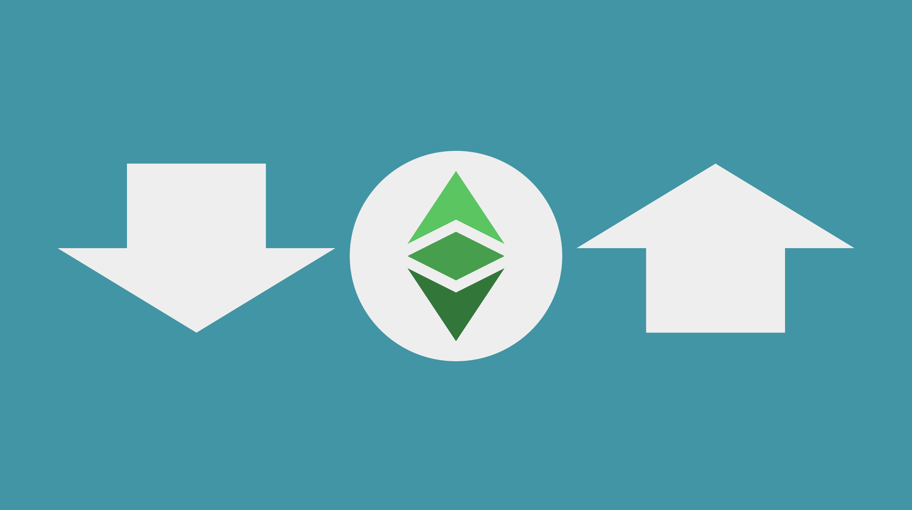

---
**您可以由此收听或观看本期视频:**

<iframe width="560" height="315" src="https://www.youtube.com/embed/wfas7sUqnzs" title="YouTube video player" frameborder="0" allow="accelerometer; autoplay; clipboard-write; encrypted-media; gyroscope; picture-in-picture; web-share" allowfullscreen></iframe>

---
区块链的全部目的是去中心化。

去中心化是指在个人和企业之间的经济交易中，减少对任何特定的可信任第三方作为中介的依赖。

这种信任最小化的原因是为了减少受信任的第三方通常最终对系统用户施加的可能限制。

可信第三方通常施加的限制可能包括交易成本、锁定成本，甚至完全阻止对服务的访问。

系统越集中，受信任的第三方限制它的风险就越大。因此，在如何设计区块链时要谨慎，尽可能降低集中化的风险，是该行业的关键任务。

在信任最小化、变更、复杂性和协议政治之间取得平衡是本文的主题。

## 什么是社会可扩展性

“社会可扩展性”一词是由Nick Szabo在他的经典帖子 “[Money, blockchains, and social scalability](http://unenumerated.blogspot.com/2017/02/money-blockchains-and-social-scalability.html)”中首次提出的。

Szabo定义的社会可扩展性是指一个系统能够被越来越多的用户使用，而不会遇到减少或阻碍新用户使用的限制。

一个不具备社会可扩展性的系统的一个很好的例子是银行系统。在美国这样的先进经济体中，有近600万户家庭没有银行账户。在美国之外，绝大多数国家的无银行账户人口比例在7%至50%以上。

这种排斥的原因有两个。第一个原因是政府为了“安全原因”控制人民，在金融机构上强加严格的监管，以过滤出可能不是犯罪分子的潜在客户。第二个原因是由于这些监管，金融机构获得和服务客户变得非常昂贵，因此它们只把市场营销和分销的努力集中在中高收入人群上。

在基于工作量证明的Nakamoto共识区块链行业中，像以太经典（ETC）、比特币（BTC）和莱特币（LTC）这样的网络在牺牲计算可扩展性的情况下专注于高社会可扩展性。

这意味着在ETC的情况下，完全复制数据、对其进行哈希处理，然后再次完全复制块，生成完全相同的账本、账户余额和智能合约的副本的过程非常计算效率低下，但这是实现去中心化的唯一方式，使全世界所有人都可以无限制地访问系统。

这就是计算可扩展性为社会可扩展性做出的折衷。

由于点对点网络的物理特性，任何专注于计算可扩展性的系统必须牺牲去中心化，因此也就失去了社会可扩展性。

这或多或少就像政府为了追求完全和纯粹的安全而牺牲了相当多的人口，这些人必须被排除在基本服务之外，比如银行服务。

## 什么是ETC的钙化?

正如我们之前所说，小心设计区块链，尽量减少中心化风险，是这个行业的关键任务。

另一方面，这些系统需要不时地更新新功能，并且每当它们出现时，必须修复错误。

然而，区块链越频繁地升级，就越容易引入糟糕或错误的修改到系统中。

这个问题通常被称为“攻击面”，这意味着系统的表面越大，就越容易在其中挖掘漏洞。换句话说，它的代码和规则越多，就越容易找到攻击它的方法。

这就是为什么术语“钙化”通常被使用并成为行业目标的原因。钙化意味着达到一个足够功能的网络，以保证其升级和错误修复的完全停止。然后，所有新功能和功能都可以在更高层次的顶部继续构建。

在像以太坊经典这样的网络中，攻击面问题有三个角度：复杂性、政治和变化。

## 复杂性

复杂度攻击面：构建系统所需的规则和代码越复杂，黑客发现攻击方式的隐藏路径就越多。

复杂性还会增加隐藏的错误或未预见的故障的风险。

减少这个攻击面的方法是减少复杂性或达到钙化点，使系统足够功能，以支持所有外部互补协议的新功能和创新。

例如，卷积、通道和其他在ETC之上构建的扩展系统，而不是将其内部分片或将它们整合到网络中。

## 协议政治

争议攻击面：争议越多的决策，就越有机会说服生态系统接受减少去中心化的不良升级。

在区块链网络中，有几个组成部分参与讨论新的变更提案。这些辩论可能变得非常激烈，甚至有时会有毒性。有时，拥有足够预算、魅力或影响力的方面可能实际上会说服参与者做出可怕的更改。这些例子中最著名的是以太坊从工作量证明到完全容易集中的权益证明的迁移。

这些过程将开发人员、经济节点运营商和矿工变成了为自身利益而战的政治动物。

钙化将完全避免这个问题，因为不再有通过花哨的论点和技巧来欺骗生态系统的可能性。

## 改变

改变的攻击面：更多的变化和升级，就有更多的机会引入错误规则或漏洞。

与协议政治类似，即使是必要的和有益的变化频率，也是对系统的风险。

过去曾经发生过比特币出现一个没有被人发现的漏洞，当发现时，他们不得不进行紧急更改。

除了可能仍存在的隐藏漏洞， 钙化将消除这种风险，至少不会引入新的错误和漏洞，因为不会向协议引入新的代码或规则。

## 寻求平衡

寻求信任最小化、改变、复杂性、和协议政治之间平衡的最好办法是通过减少变化来达到协议钙化，并且允许新的功能和设计目标到达更高的层度。

这也是让我们将社会扩展性达到最佳的方法。

---

**感谢您阅读本期内容!**

了解更多有关以太坊经典，请访问: https://ethereumclassic.org
