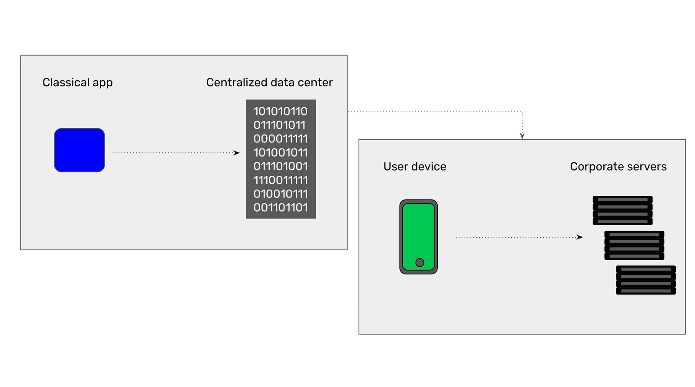
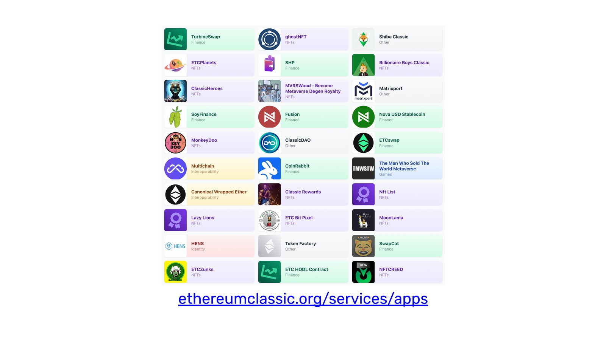

---
**You can listen to or watch this video here:**

<iframe width="560" height="315" src="https://www.youtube.com/embed/1ZDBhpGhjVA" title="YouTube video player" frameborder="0" allow="accelerometer; autoplay; clipboard-write; encrypted-media; gyroscope; picture-in-picture; web-share" allowfullscreen></iframe>

---

## What Are Classical Apps?

To explain what are decentralized application we will describe first what are classical applications.

When we use applications in our computers or phones, we use software programs that are useful for documents, spreadsheets, ecommerce, banking, social media, texting, and many other services.

Normally these apps are controlled and provided by tech companies, corporations, banks, or governments. If they are controlled by the private sector, they are usually also controlled by governments because governments can regulate and order corporations to do essentially what they want.

These kinds of applications are, therefore, centralized, censorable, permissioned, confiscatable, and, in many cases, monopolistic or oligopolistic.

The way classical apps work is that if, for example, you are using your app from your phone, then you generate whatever action or transaction you want to perform and then the app communicates with the central data center of the provider, which may be a tech company, corporation, bank, or government. 

In terms of hardware format, your phone as a device sends a message to the corporate or government servers of the provider, so they interact this way.

## What Are Dapps?

When we use applications that are hosted inside a blockchain as Ethereum Classic (ETC) or Ethereum (ETH), then we are using decentralized applications, or dapps, because they are not hosted in centralized data centers and servers but in decentralized networks that are called blockchains.

As dapps are basically interaction between your app on the phone and a blockchain, then they are not controlled by tech companies, corporations, banks, or governments.

Because blockchains are networks of peer-to-peer nodes that are distributed across the globe, and they all have an exact replica of all the data, including your accounts and dapps, then all your information is decentralized and impossible to control except by you with your private keys.

A word of caution: When you use the apps of centralized exchanges such as Coinbase, Kraken, or Binance, those are NOT dapps. Even though they deal with cryptocurrencies, they are centralized tech companies.

The way dapps work is that if, for example, you are using a dapp from your phone, you usually open your crypto wallet, such as MetaMask, use their browser to reach a dapp website, and then enter your transaction there. When the transaction is entered, it is sent to a smart contract inside a blockchain such as ETC instead of the central data center of a tech company, corporation, bank, or government.

In terms of hardware format, your phone as a device sends a message to the server of the dapp website, which then responds by forming a transaction, which is then sent by your wallet on your phone to the blockchain network.

## What Are Dapps For?

For now dapps may be used for decentralized exchanges to buy and sell tokens and native cryptocurrencies, for NFTs and NFT exchanges, meme coins, stablecoins, games, domain name services, and several other services.

In the future, in a paradigm called web3, which we will explain in our next class, dapps will provide an ample variety of services comparable to today’s traditional classical technology.

Dapps will be expanded to full banking services, ecommerce, social media, property registries, hotel and flight booking, supply chain management, industrial applications, and many others.

The great benefits of decentralized applications are that they are censorship resistant, permissionless, and immutable. This enables an incredible degree of security at the individual level on a global scale.

## Dapps on Ethereum Classic

Ethereum Classic is the largest smart contracts proof of work blockchain in the world, therefore the most secure dapp platform in the planet.

On ETC, it may be considered that deployed smart contracts and dapps behave under the principle of “Code Is Law” which means that when they are hosted in ETC, they are truly secure, thus decentralized, censorship resistant, permissionless, and immutable. This provides a very high guarantee for people’s basic rights globally.

Currently dapps on ETC range from NFTs, decentralized exchanges, gaming, domain services, meme coins, to defi applications.

You may find dapps on ETC here:

https://ethereumclassic.org/services/apps

Soon, there will likely be more applications such as property registries, treasuries, ecommerce dapps, bonds, DAOs, and many more high value use cases.

---

**Thank you for reading this article!**

To learn more about ETC please go to: https://ethereumclassic.org
