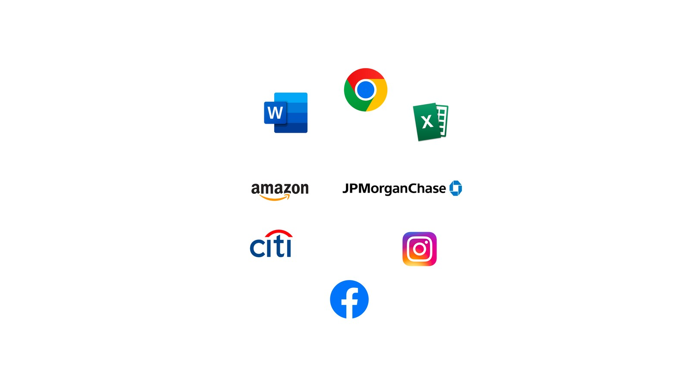
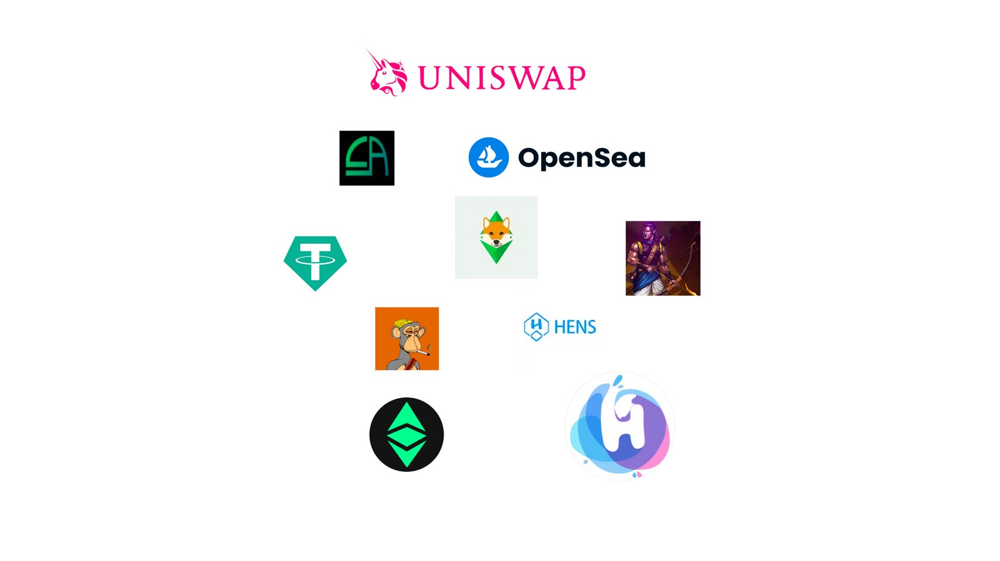
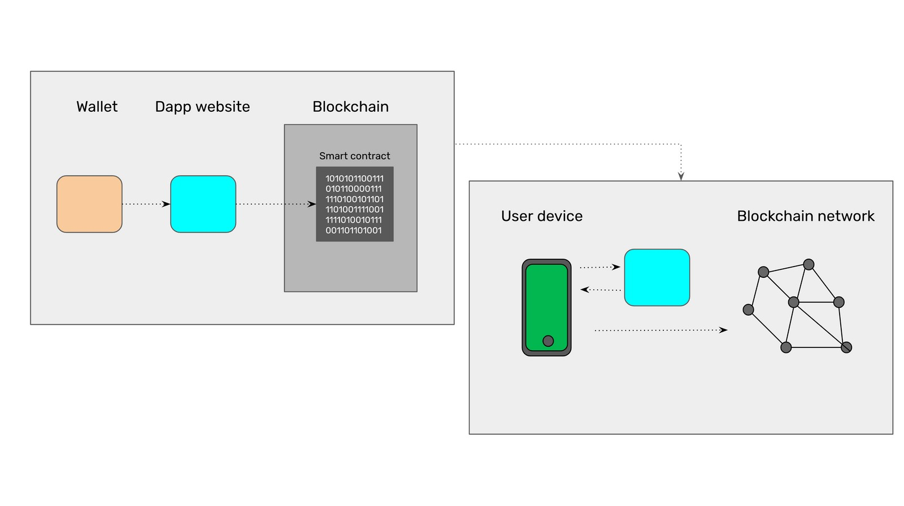

---
**您可以由此收听或者观看本期内容:**

<iframe width="560" height="315" src="https://www.youtube.com/embed/1ZDBhpGhjVA" title="YouTube video player" frameborder="0" allow="accelerometer; autoplay; clipboard-write; encrypted-media; gyroscope; picture-in-picture; web-share" allowfullscreen></iframe>

---

## 什么是经典的App？

为了解释什么是去中心化应用，我们将首先描述什么是经典的应用。

当我们在电脑或手机上使用应用程序时，我们使用的软件程序对文档、电子表格、电子商务、银行、社交媒体、短信和许多其他服务都很有用。

通常情况下，这些应用程序由科技公司、企业、银行或政府控制和提供。如果它们由私营部门控制，它们通常也由政府控制，因为政府可以监管和命令公司做他们想做的事情。

因此，这些类型的应用程序是集中的、可审查的、可许可的、可没收的，并且在许多情况下是垄断的或寡头垄断的。

经典应用程序的工作方式是，例如，如果你正在使用你的手机应用程序，然后你生成任何你想要执行的操作或交易，然后应用程序与提供商的中央数据中心通信，提供商可能是一家科技公司、公司、银行或政府。

在硬件格式方面，您的手机作为设备向提供商的企业或政府服务器发送消息，因此它们以这种方式进行交互。

## 很么是Dapp?

当我们使用托管在区块链中的应用程序作为以太坊经典(ETC)或以太坊(ETH)时，我们使用的是去中心化应用程序(dapp)，因为它们不是托管在集中式数据中心和服务器中，而是托管在被称为区块链的去中心化网络中。

由于dapp基本上是你手机上的应用程序和区块链之间的交互，因此它们不受科技公司、公司、银行或政府的控制。

因为区块链是分布在全球的点对点节点网络，它们都有所有数据的精确副本，包括你的账户和dapp，那么你的所有信息都是去中心化的，除非你用你的私钥控制。

提醒一句:当你使用中心化交易所(如Coinbase、Kraken或Binance)的应用程序时，这些应用程序不是dapp。尽管他们处理加密货币，但他们是中心化的科技公司。

Dapp的工作方式是，例如，如果你从手机上使用dapp，你通常会打开你的加密钱包，比如MetaMask，使用他们的浏览器访问dapp网站，然后在那里输入你的交易。当交易被输入时，它被发送到区块链(例如ETC)内部的智能合约，而不是技术公司、公司、银行或政府的中央数据中心。

在硬件格式上，你的手机作为一个设备向dapp网站的服务器发送一条消息，然后由dapp网站的服务器通过形成交易进行响应，然后由你手机上的钱包发送到区块链网络。

## Dapps为何所用?

目前dapps可以用于去中心化的交易所，用于购买和销售代币和原生加密货币，用于NFT和NFT交易所，meme币，稳定币，游戏，域名服务和其他几种服务。

在未来，在一个叫做web3的范式中，我们将在下一节课中解释，dapps将提供与今天的传统经典技术相当的丰富多样的服务。

Dapps将扩展到全面的银行服务、电子商务、社交媒体、财产登记、酒店和航班预订、供应链管理、工业应用等领域。

去中心化应用程序的最大好处是它们是抗审查的、无许可的和不可更改的。这在全球范围内的个人层面上实现了难以置信的安全程度。

## 以太坊经典的dapps

以太坊经典是世界上最大的智能合约工作量证明区块链，因此是地球上最安全的dapp平台。

在ETC上，可以认为部署的智能合约和dapp的行为遵循“代码即法律”的原则，这意味着当它们托管在ETC中时，它们是真正安全的，因此是去中心化的、抗审查的、无许可的和不可更改的。这为全球人民的基本权利提供了非常高的保障。

目前，ETC上的dapps范围从nft、去中心化交易所、游戏、域服务、meme币到defi应用程序。

你可以在ETC上找到dapps:

https://ethereumclassic.org/services/apps

很快，会有更多的应用程序，如财产注册、国债、电子商务dapp、债券、DAO，以及更多高价值的用例。
---

**感谢您阅读本期文章!**

了解更多有关ETC，请访问: https://ethereumclassic.org
