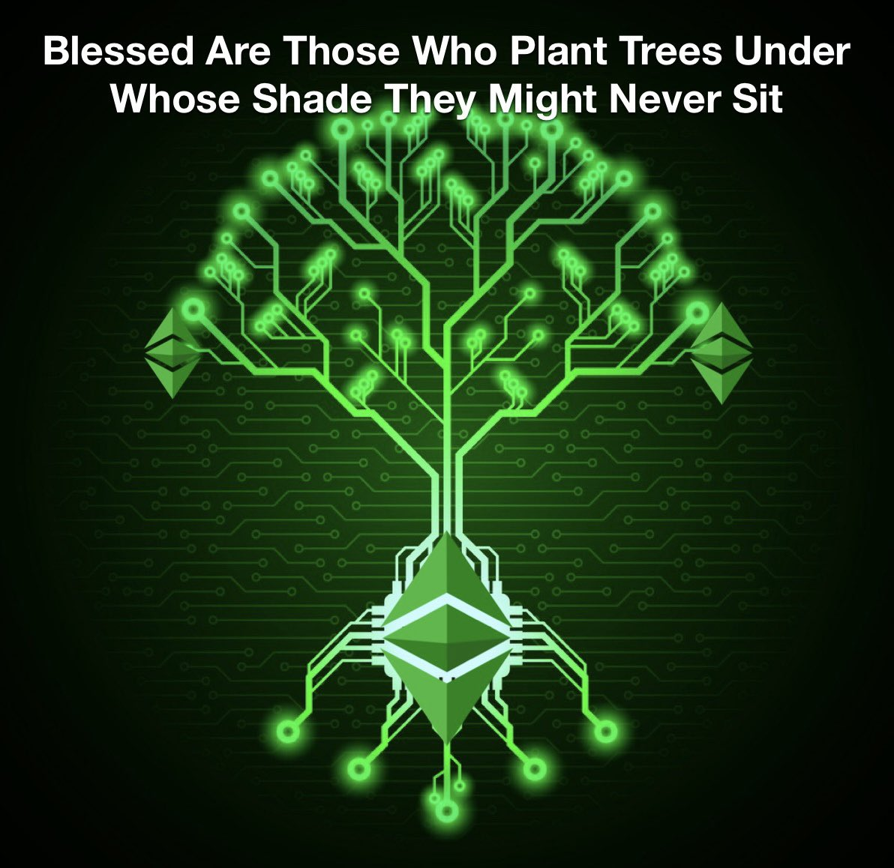

In this post, we'll delve into how Ethereum Classic's future potential can be explained through a well-known pattern found in nature. Just like the resilient oak tree, ETC begins its journey with modest origins. Gradually, it outperforms its competitors, defying short-term trends with its long-term strategy. As a result, it has the ability to survive numerous cycles, maturing into a towering presence and imprinting an enduring legacy.

## Rooted in Core Principles

An oak tree's strength and resilience are deeply connected to its roots, which anchor it firmly to the ground and provide essential nutrients. Similarly, Ethereum Classic's success is deeply rooted in its unwavering commitment to core principles of decentralization, immutability, and security. These principles have not only guided ETC's development but have also created a solid foundation for its long-term growth. By staying true to its roots, Ethereum Classic has built a platform that can weather the storms of the rapidly evolving crypto landscape and continue to thrive.

## Cutting Through the Weeds

ETC has maintained a foundation capable of weathering the crypto market's short-term thinking, much like a great oak tree. Its first significant test came in the form of the DAO hack and subsequent hard fork. Ethereum chose short-term convenience, intervening to reverse the hack's effects, whereas ETC remained committed to its "Code is Law" philosophy, preserving the platform's integrity.

This unwavering dedication to core principles highlights Ethereum Classic's resilience and determination, allowing it to stand firm amidst challenges. In contrast, the rapid growth of other projects, like weeds, may momentarily grab attention. However, their weaker roots and foundations often lead to their quick demise, as they lack the stability to withstand the test of time.

Ethereum Classic's solid foundation, rooted in decentralization, immutability, and security, primes it for slow but steady growth like a mighty oak tree. As it continues to expand and strengthen its presence in the crypto space, ETC's commitment to its core principles ensures it will outperform competitors with weaker foundations. In the long run, Ethereum Classic has the potential of a lasting impact in the world of decentralized technology, as many other projects come and go like seasonal weeds.

## From Sapling to Maturity

Just like an oak sapling in a crowded field of weeds, ETC has faced numerous challenges and attacks over the years. Since the DAO fork, it has survived 51% attacks and resisted contentious hard forks. The ETC community has weathered these storms and the project only grew to be stronger on the other side. Each challenge has tested ETC's resilience and commitment to decentralization, and it has consistently passed with flying colors.

Today, ETC resembles a young oak that has survived the initial challenges of growth and has begun to grow its roots deep into the earth. The hard part is over, and as it continues to mature and expand, it will become a towering symbol of strength and resilience in the world of decentralized technology.

## Withstanding the Storms of Change

As Ethereum shifts to a Proof of Stake (PoS) consensus mechanism, Ethereum Classic stands tall as the largest smart contract platform still embracing the proven and secure Proof of Work (PoW) model. This transition further highlights ETC's long-term potential in the ever-evolving crypto landscape.

Imagine a lush and fertile forest where two trees stand side by side. The first tree is a mighty oak, deeply rooted and strong, while the second tree, though tall and seemingly robust, has shallow roots and is not as firmly grounded. A fierce storm rolls in, and the shallow-rooted tree struggles to hold its ground, eventually toppling over, while the mighty oak remains unyielding, withstanding the tempest without faltering.

In the world of cryptocurrencies, Ethereum Classic (ETC) is like the mighty oak, steadfast and deeply rooted in its core principles and PoW consensus mechanism. Many other projects, on the other hand, are venturing into uncharted territory with the PoS consensus mechanism, exposing themselves to unforeseen risks and challenges, much like the shallow-rooted tree in the storm.

## Hard Wood Truths

ETC's longevity is a hard truth that sets it apart from other crypto projects. Like a mighty oak tree that has survived countless storms, ETC has stood the test of time and continues to grow stronger with each passing cycle.

While other projects have come and gone like dandelions in the wind, ETC has remained steadfast and committed to its vision. Its longevity and staying power are impressive, forcing people to wonder why it has continued to grow while others have faded away.

With its proven longevity and staying power, ETC is well-positioned to attract more attention and interest from the crypto community. As more people recognize the impressive feat of its continued existence and growth in a volatile market, it is positioned to snowball into greater awareness and adoption.

## Symbiotic Compatibility

Just as plants in an ecosystem coexist and collaborate for mutual benefit, Ethereum Classic's compatibility with Ethereum (ETH) Smart Contracts opens up a world of opportunities for synergy between the two networks. This compatibility enables developers to easily build and deploy applications on both networks, harnessing the unique strengths of each platform. By embracing this symbiotic relationship, Ethereum Classic can continue to innovate and evolve, growing stronger as part of a larger, interconnected ecosystem.

## Branching Out

A thriving oak tree provides a lush and fertile environment for various plants and animals to flourish. In the same way, Ethereum Classic is cultivating a growing ecosystem of decentralized applications (dApps) that can thrive on its platform. As ETC attracts more developers and users, the potential for new and innovative use cases expands, driving further growth and adoption. By fostering a rich and diverse ecosystem, Ethereum Classic is creating a fertile ground for creativity, innovation, and collaboration in the world of decentralized technology.

As the crypto market continues to evolve, it's evident that ETC is here to stay. Its long-term strategy and proven track record distinguish it from other projects that prioritize short-term gains. ETC is poised to rise above the noise and reach new heights, like an oak tree that has weathered many storms.

## Planting Seeds for Future Generations

In summary, Ethereum Classic (ETC) exemplifies resilience and long-term potential, much like a mighty oak tree, with its deeply rooted commitment to core principles of decentralization, immutability, and security. 

By nurturing the growth of Ethereum Classic, we are not only investing in its present success but also fostering a legacy that will benefit the future of decentralized technology. As we continue to plant the seeds of innovation and collaboration within the ETC ecosystem, we are paving the way for a brighter, more inclusive, and decentralized future for all.

Let us be the ones to water the tree of Ethereum Classic today, so that the generations to come may enjoy the fruits of our labor and find shelter in the shade of a thriving and resilient network.

