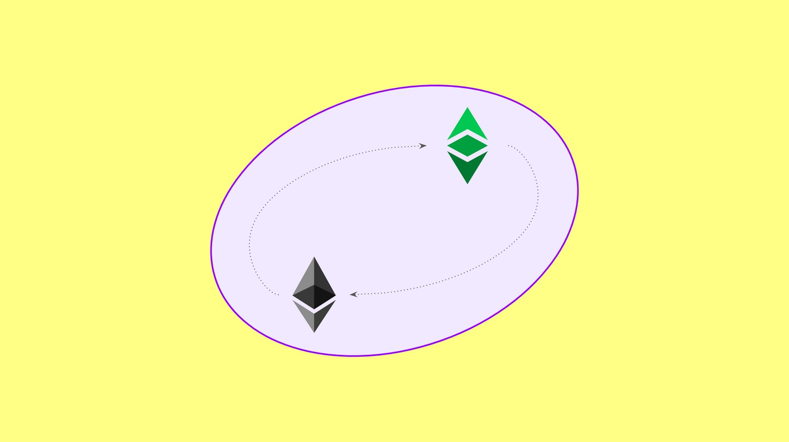

---
**您可以由此收听或观看本期内容**

<iframe width="560" height="315" src="https://www.youtube.com/embed/tVjFoqpwrFc" title="YouTube video player" frameborder="0" allow="accelerometer; autoplay; clipboard-write; encrypted-media; gyroscope; picture-in-picture; web-share" allowfullscreen></iframe>

---

正如我们在我们的文章“[以太经典的创新在于不可阻挡性](https://ethereumclassic.org/blog/2023-01-18-the-innovation-of-ethereum-classic-is-unstoppability)”, 中指出的那样，ETC不是关于最新的花哨功能，而是关于去中心化、无需许可、抗审查和不可变性。

这些特性赋予了以太经典区块链真正的代码即法则哲学的优势，因为账户、余额和dapps是真正不可阻挡的。

然而，认为ETC是一种静态的、没有创新的区块链是错误的。

相反，以太经典是，而且将永远是最先进的技术。

ETC与其他主要寻求创新的网络的区别在于，ETC只会整合那些肯定并增强其原则的创新。

## 以太经典是更大生态系统的一部分

ETC是一个更大的生态系统，被称为[“EVM标准”](https://ethereumclassic.org/blog/2022-12-06-ethereum-virtual-machine-blockchains-and-ethereum-classic)。

“EVM”代表“以太坊虚拟机”，是所有遵循此格式的网络的基础技术。

EVM协议组件包括以下内容：

- 一个EVM来执行操作码。
- 一个GAS系统，为每个操作码指定计算成本，以防止垃圾邮件和停机问题。
- 编程语言，Solidity是最常用的一种，以便开发人员可以构建可由EVM执行的dapps。
- 状态转换，以便EVM可以接收输入，执行程序并产生新的状态输出。
- 将软件程序（智能合约）存储在分类账中，将其转化为分散的程序。

以上所有技术组件使得区块链能够运行智能合约，而ETC实际上是该标准中的第一个网络和世界上第一个智能合约网络。

作为世界上最大的工作量证明智能合约区块链，ETC在这个领域扮演着非常重要的角色，并且将始终更新以符合标准。

## 与以太坊的运营平衡

作为一个EVM区块链，ETC与其他系统如以太坊、BNB智能链、Cardano、Polkadot、TRON、Solana、Avalanche、Polygon和EOS处于同级别的对等群体之中。

通常，研究和开发的领导地位由以太坊社区维护，但生态系统中任何一项技术的变化或升级通常会引发其他成员的更新，因为与标准保持一致对于系统的兼容性和使用非常重要。

作为其尖端技术的例子，ETC已经实现了几项升级，使其与以太坊保持运营平衡。这些包括Atlantis、Agharta、Phoenix、Magneto和Mystique升级。而且，每当需要普遍的EVM标准更新时，ETC将继续通过更多的升级实施这些变化。

需要注意的是，ETC通常会集成EVM标准功能，这些功能代表更好的技术或功能，但很可能会留下会损害其安全性和原则的更改。一个这样的例子是，ETC没有像以太坊那样迁移到权益证明共识机制。

## Atlantis升级

作为以太虚拟机区块链，ETC与其他一些系统如以太坊、BNB智能链、Cardano、Polkadot、TRON、Solana、Avalanche、Polygon和EOS一起构成了同行组。

通常，研究和开发领导权由以太社区维护，但生态系统中任何一项技术的更改或升级通常都会触发其他成员的更新，因为与标准保持一致对于系统的兼容性和使用非常重要。

作为其技术的先进之处，ETC已经实现了几个升级，使其与以太坊保持运营一致性，其中包括Atlantis、Agharta、Phoenix、Magneto和Mystique升级。每当需要进行一般EVM标准更新时，ETC将继续通过更多的升级来实现这些变化。

需要注意的一点是，ETC通常会集成EVM标准功能，这些功能代表更好的技术或功能，但很可能会排除会损害其安全和原则的变化。其中一个例子是，ETC没有像以太坊一样迁移到权益证明共识机制。

以Atlantis升级为历史例子，该升级于2019年9月12日的第8,772,000个块中实现，以太经典核心开发人员实施了以太坊虚假龙和拜占庭网络协议升级。

这些更改是通过以太经典改进提案(ECIP)1054实现的：

https://ecips.ethereumclassic.org/ECIPs/ecip-1054

## Agharta升级

随着在2020年1月11日发生的区块9,573,000上的Agharta升级，以太经典核心开发人员实施了以太坊Constantinople和St. Petersburg网络协议升级，以保持与其姐妹链的运行一致性。

这些变化是通过以太经典改进提案（ECIP）1056实施的：

https://ecips.ethereumclassic.org/ECIPs/ecip-1056

## Phoenix升级

在2020年6月1日的区块10,500,839上，以太经典核心开发人员实施了Phoenix升级，以实现与其姐妹链的运行一致性。该升级包括以太坊Istanbul网络协议升级。

这些变化是通过以太经典改进提案（ECIP）1088实施的：

https://ecips.ethereumclassic.org/ECIPs/ecip-1088

## Magneto升级

随着Magneto升级在2021年7月23日的第13,189,133个块上实施，Ethereum Classic核心开发人员实施了Ethereum Berlin网络协议升级，以保持与其姊妹链的操作平衡。

这些更改是通过Ethereum Classic改进提案（ECIP）1103实施的：

https://ecips.ethereumclassic.org/ECIPs/ecip-1103

## Mystique升级

在2022年2月12日的区块号14,525,000上进行了神秘升级，以太坊经典核心开发人员实现了以太坊伦敦网络协议升级，以保持与其姊妹链的运行一致性。

这些更改是通过以太坊经典改进提案（ECIP）1104实现的。

https://ecips.ethereumclassic.org/ECIPs/ecip-1104

## EVM EOF 升级的合作

另一个例子是以及为什么 Ethereum Classic 将会与最新的 EVM 标准技术保持同步，前提是不违反其原则，即网络软件客户端的三位核心开发人员将与即将到来的通用 EVM 标准升级——Ethereum Virtual Machine Object Format 升级，简称 EVM EOF 升级进行合作。

EVM EOF 升级可能会在 Ethereum Cancún 硬分叉中于 2023 年末进行。

这次更新可能包含的 EIP 是：

EIP-3860 “限制和计量 initcode”
EIP-3540 “EVM 对象格式 v1”
EIP-3670 “代码验证”
EIP-4200 “静态相对跳转”
EIP-4750 “functions”
EIP-5450 “堆栈验证”

经过这次更改，以太经典区块链可能会在2024年上半年完全与新的EVM标准规范兼容，因为出于安全原因和作为更为保守的区块链，它通常会等待3到6个月来跟随新的升级。

这对整个EVM生态系统来说是一次历史性的升级，因为它将解决技术堆栈中存在已久的几个问题，并将使基础层协议更接近固化的目标。

## 关于钙化的说明

虽然在这篇文章中我们在表达和解释如何保持 ETC 与行业中所有最重要的创新同步，但重要的是要考虑到，为了成为不可变且不受审查的工作量证明区块链，单纯为了变革而变革本身并不是一个安全的策略。

事实上，一个称为“钙化”的概念，其中变化被大大减少甚至完全消失，是 ETC 以及整个 EVM 领域作为一个整体的重要目标。

钙化将变更和升级的风险最小化，这些变更和升级可能会破坏区块链系统的去中心化和无需许可性。这就是为什么理解创新不是 ETC 网络的主要动机，也不会是未来的主要动机的重要性所在。主要动机将始终是不可阻挡性。因此，早日达到钙化状态对全球用户来说都是更好的选择。

---

**感谢您阅读本期文章!**

了解更多有关ETC相关内容，请访问: https://ethereumclassic.org
