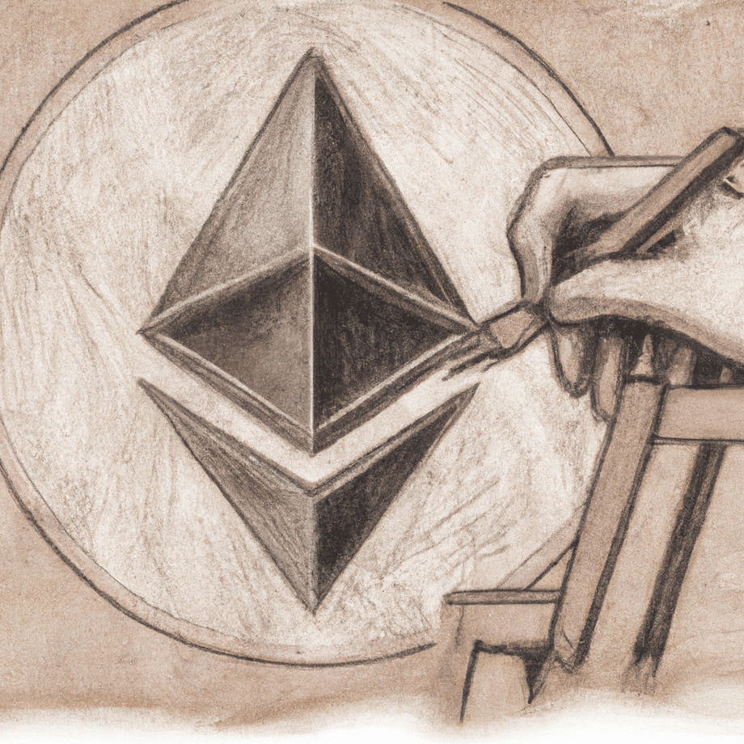

## It started with a question…

Without a doubt, Ethereum Classic is a world-class, highly secure, fully EVM-compatible blockchain network. Since its inception as the original Ethereum, it has been recognized as having the potential to empower humankind’s freedom from dependence on the conventional centralized institutions and untrustworthy “trusted” third parties who created and control what some have called the modern-day system of global enslavement: the world-wide central bank-based corporate-controlled financial system and economy.

Ethereum Classic’s endurance and resilience have been battle-tested and proven formidable in the face of blatant attacks on its network, social smears and media maneuverings, abandonment by its creators, and attempts to hijack control of its off-chain assets. Why, then, does Ethereum Classic seem to be so undervalued and underutilized when compared to the broader cryptospace?

## All the traits of a winner, but…

Ethereum Classic (ETC) has two unique attributes that are found in combination in no other blockchain project. One is its well-defined, fixed, and sound monetary policy that includes a capped total token emission like that of Bitcoin. According to that policy, there will never be more than 210,700,000 ETC in existence. This ensures that Ethereum Classic is sound money suitable as a long-term store of value.

The other unique property of Ethereum Classic is its Foundation. Not an organization such as the one that manages the forked-Ethereum network, Vitalik Buterin’s Ethereum Foundation, but rather it is a fundamental mindset; a required conceptualization and understanding of those core values and principles that led to Ethereum Classic’s existence, that guides developers, miners, users and an ungoverned, unauthorized and, where circumstance requires, highly toxic self-appointed community of gatekeepers and defenders who zealously guard the Ethereum Classic protocol defending it from those who would attempt to attack, take over, weaken or circumvent that Foundation.

The Ethereum Classic Declaration of Independence and other documents written during the months following the forking of Ethereum detail the components of its Foundation. It is the only governance to which Ethereum Classic is subject thereby ensuring enduring longevity, independence, autonomy, and stability for those projects built upon it. Where Bitcoin had Satoshi, Ethereum Classic has its Foundation.

These two qualities combine to position Ethereum Classic as the most secure and stable EVM-compatible blockchain in existence. This fact has become more evident as, with the migration of forked-Ethereum to the proof-of-stake social consensus mechanism, ETC’s miner constituent has grown exponentially further ensuring its security and stability. With ETC so well positioned, we ask once again, why is ETC not already the top cryptocurrency?

## Something was missing…

In order to realize its great potential and take its rightful place alongside Bitcoin at the top of the cryptocurrency landscape, Ethereum Classic requires access to thoughtfully designed and diligently administrated infrastructure tools and financial systems like those developed and deployed on forked-Ethereum and other blockchains. Not having a well-developed, robust financial infrastructure at the base layer has been a major obstacle to widening acceptance and promoting the broad use of the ETC network.

In 2022, Ethereum Classic welcomed the introduction of several new financial platforms and services to the ETC network ecosystem. Projects such as HebeSwap, ETCSwap, and others, have begun to deploy the financial tools necessary to facilitate the ultimate success of ETC. While the development efforts of projects such as these are clearly positive, the ETC user base has not shown signs of expansion as was the expected response to these new projects’ releases. This is most evident in the distinct lack of exponential growth in on-chain transaction volume. Where is the growth? Why is it not happening?

## What is STILL missing?

Ethereum Classic is a permissionless “do-ocracy”. It is decentralization at its finest, but it is not perfect. With no central authority leading from on high, it is oftentimes difficult to see where the progress is happening and where new attention is needed. It is dangerously easy to fall into complacency about the tools and services that ETC needs in order to experience the growth we desire to see. Using the rationalization that “someone is probably already doing that”, opportunities to contribute real value to the network are left laying on the table, identified as valuable but left dormant. And as time passes, opportunities fade. Lest Ethereum Classic itself fades, immediate action is required. Due to its decentralized nature, it is not possible to simply “tell” the community what needs to be done. It is up to each of us to identify the needs and then take action to help fill those needs. This is the essence of the ValueForge.

One financial tool currently still missing from the Ethereum Classic ecosystem is a native stablecoin that utilizes ETC as its base currency and holds true to the principles of the ETC Foundation. ValueForge was founded to ultimately take up that challenge. The project, named ValueForgedETC, is ValueForge’s endeavor to provide that tool, an ETC-native stablecoin platform worthy of ETC, in a unique and innovative format. We are confident that access to this and other high-level financial tools and instruments will attract new developers and projects to the ETC ecosystem while promoting broader overall network usage from an ever-growing user base.

## So what time is it?

It is time; time for Ethereum Classic to make all its promise a reality, time for vindication as those who sought to harm Ethereum Classic realize that their efforts have only made it stronger and more ready for this moment, time to watch cryptospace and the entire financial world concede that the ETC Foundation is truth, as many have known all along. It’s time to realize that what has been missing is not a protocol, a platform, or a tool. It’s not a market condition, not a bull or a bear, and it’s not a technical analysis. What’s missing is *you*. What’s missing is *me*. The only way our decentralized ambitions will be realized is if we all stop waiting for ETC’s time to come and start making now ETC’s time ourselves. Right now.

It is indeed time; time to bring to Ethereum Classic all the tools needed to reach its full potential.

The time is now.

It’s time to shine.

It’s time to forge.

> If Not Us, Who? If Not Now, When?
> - Ronald Reagan quoting the prophet Hillel

---

This post was originally published to https://medium.com/@TheCrowbill/unleashing-ethereum-classic-95a1125a8fde