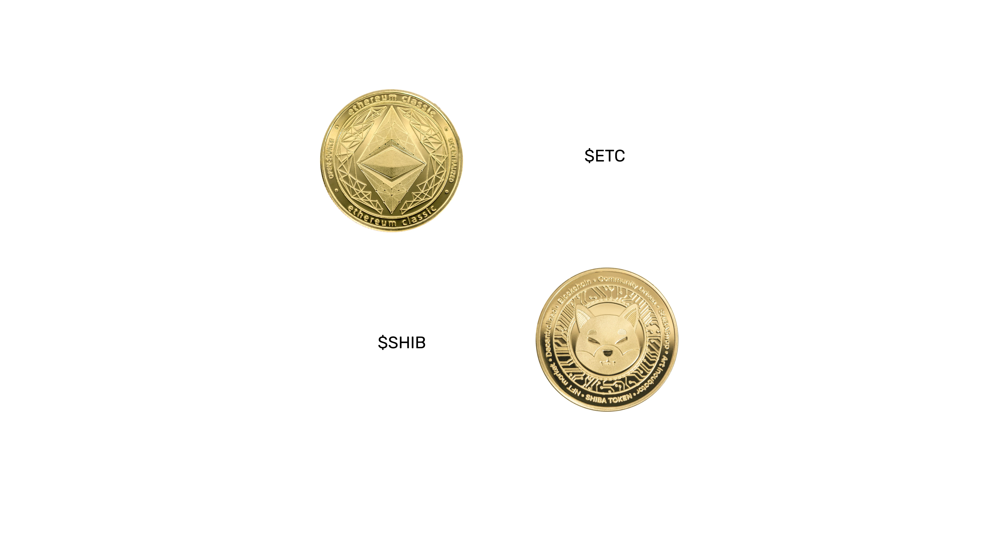
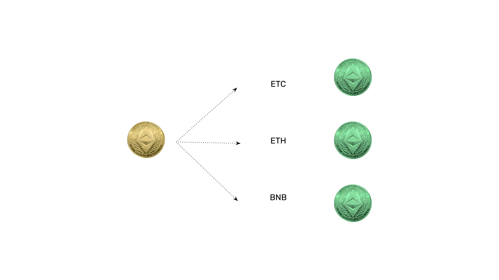

---
**You can listen to or watch this video here:**

<iframe width="560" height="315" src="https://www.youtube.com/embed/Q03_NutyP7Q" title="YouTube video player" frameborder="0" allow="accelerometer; autoplay; clipboard-write; encrypted-media; gyroscope; picture-in-picture; web-share" allowfullscreen></iframe>

---

## Native Cryptocurrencies vs ERC-20 Tokens

Native cryptocurrencies are the coins inside blockchains that are used to pay block producers and transaction fees. They are a fundamental component of the protocols of these systems. 

They are “native” because they are the ones issued on a per block basis, by protocol, to pay for miners or validators in proof of work or proof of stake blockchains. 

Examples of native cryptocurrencies are $ETC in the Ethereum Classic (ETC) blockchain, $BTC in Bitcoin (BTC), and $ETH in Ethereum (ETH).

An ERC-20 token is created using smart contracts deployed on EVM (Ethereum Virtual Machine) blockchains such as ETC or Ethereum.

These are not native because they are not used for block rewards or transaction fees, they are just created freely by dapp developers, and may be used for many things.

Examples of ERC-20 tokens may be SHIBA Inu Classic in ETC or SHIBA Inu in Ethereum.

## Dapps Use the ERC-20 Token Standard

When Ethereum Classic and Ethereum were one blockchain in 2015, the native coin was created and issued to pay for block rewards and transaction fees to miners. When Ethereum split from ETC, their cryptocurrencies $ETH and $ETC became their native coins respectively.

However, as both Ethereum Classic and Ethereum are smart contracts blockchains, now developers may create many ERC-20 tokens inside ETC and ETH for their dapps or many other use cases.

Because ERC-20 tokens are a standard that the great majority of developers are using, it has turned into the de facto format for nearly all tokens. This has prompted all dapp developers to build capabilities for ERC-20 tokens, but to make their dapps compatible with the native cryptocurrencies adds more complexity.

To avoid this complexity, a cool way to solve the problem was to create an ERC-20 smart contract that would transform $ETC into $WETC.

## ETC in an ERC-20 Smart Contract Is WETC

Wrapped ETC or WETC, which goes by the symbol $WETC in the market, is an ERC-20 token that is convertible into ETC and vice versa.

To create new $WETC users need to send $ETC into a smart contract and the smart contract will return $WETC to their account.

For example, if a user sends 100 $ETC to the Wrapped ETC smart contract, then it will return 100 $WETC to the user’s account.

Whenever users wish to transform their $WETC back into $ETC, they can send their $WETC to the smart contract and it will return $ETC to their account.

For example, if a user sends 100 $WETC to the Wrapped ETC smart contract, then it will return 100 $ETC to the user’s account.

## WETC Works With All Dapps That Support The ERC-20 Standard

As so many dapps support the ERC-20 smart contract standard, then WETC has become a convenient way to keep some money to use them.

This is especially true for swap decentralized exchanges where users may trade $WETC for many other kinds of ERC-20 tokens.

In the future many external assets, such as stocks, bonds, mutuals funds, ETFs, derivatives, and futures contracts will be represented as ERC-20 tokens inside blockchains and will be traded in decentralized swap exchanges.

## WETC May Exist in Several Blockchains

As ERC-20 tokens may represent assets outside blockchains, then even coins from other blockchains may be represented as ERC-20 tokens.

For example, WETC may exist inside Ethereum Classic to use with dapps, but also inside Ethereum, Binance Smart Chain, and many other smart contracts blockchains.

This facilitates what is called blockchain interoperability.

However, for now the technology that is called “bridges” which does these connections, is not as secure as the blockchain environment, so it is always safer to return back any wrapped tokens to their original chains whenever possible.

Examples of wrapped tokens that exist in multiple chains are WETC, WETH, WBTC, WBNB, and many others.

---

**Thank you for reading this article!**

To learn more about ETC please go to: https://ethereumclassic.org
