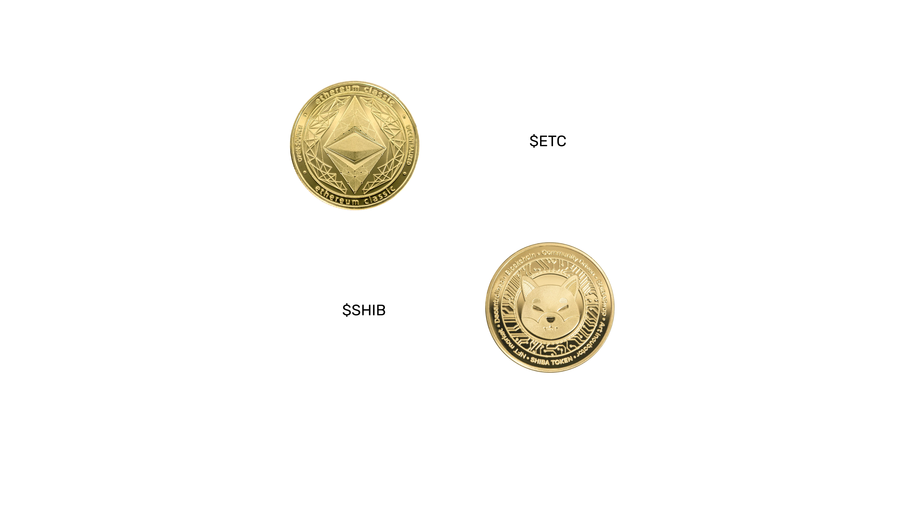
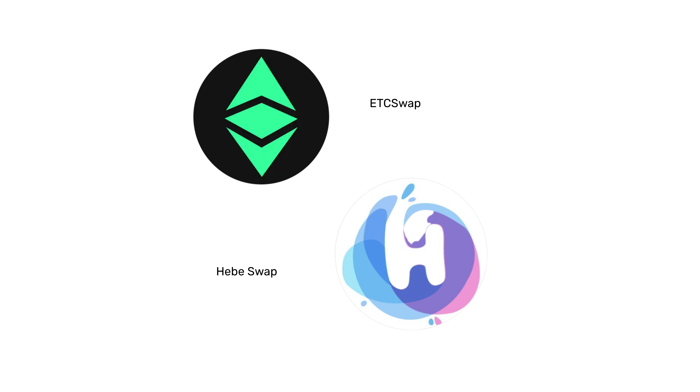
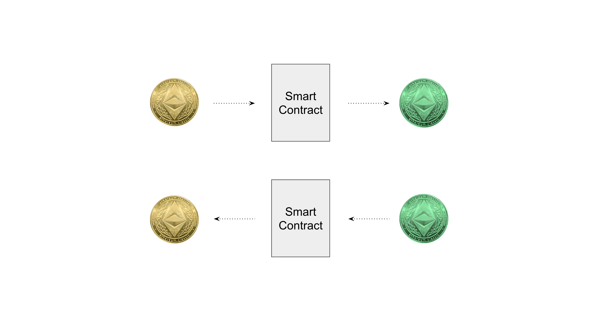
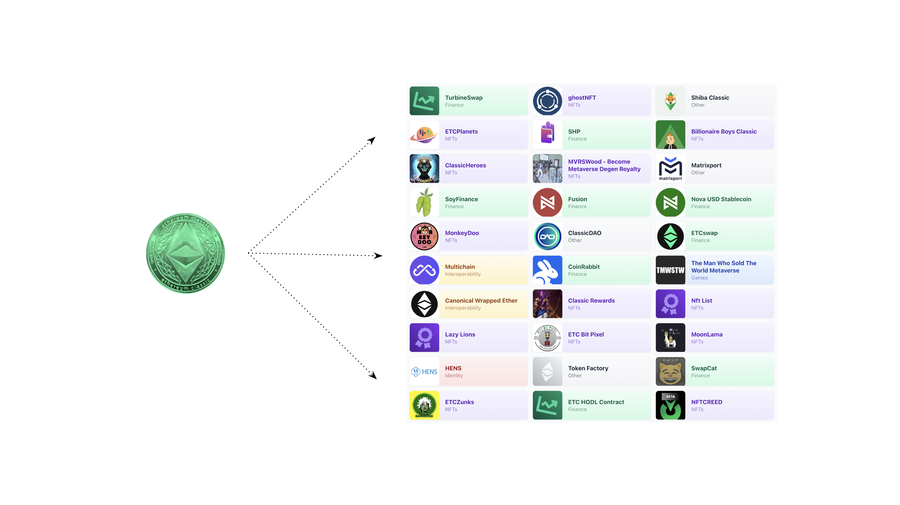
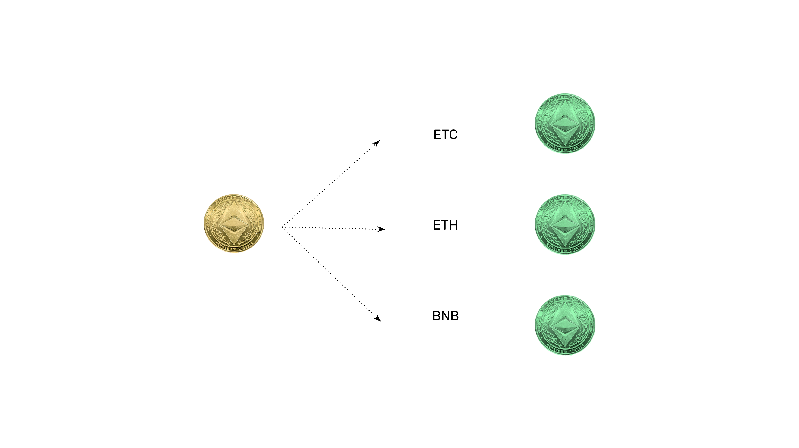

---
**您可以由此收听或观看本期内容:**

<iframe width="560" height="315" src="https://www.youtube.com/embed/Q03_NutyP7Q" title="YouTube video player" frameborder="0" allow="accelerometer; autoplay; clipboard-write; encrypted-media; gyroscope; picture-in-picture; web-share" allowfullscreen></iframe>

---

## 原生加密货币和ERC-20代币

原生加密货币是区块链中的硬币，用于支付区块生产者和交易费用。它们是这些系统协议的基本组成部分。

它们是“原生的”，因为它们是根据协议以每个区块为基础发行的，用于支付工作量证明或权益证明区块链中的矿工或验证者。

原生加密货币的例子有以太坊经典(ETC)区块链中的$ETC，比特币(BTC)中的$BTC和以太坊(ETH)中的$ETH。

ERC-20代币是在ETC或以太坊等智能合约区块链中使用智能合约创建的代币。

它们不是原生的，因为它们不用于区块奖励或交易费用，它们只是由dapp开发人员自由创建的，并且可以用于许多事情。

ERC-20代币的例子可能是ETC中的SHIBA INU经典或以太坊中的SHIBA INU。

## Dapps 使用 ERC-20 代币标准

在2015年，当以太坊经典和以太坊还是一个区块链时，本地代币被创建并发行，用于支付给矿工的区块奖励和交易手续费。当以太坊与以太坊经典分开后，它们的加密货币$ETH和$ETC分别成为它们的本地代币。

然而，由于以太坊经典和以太坊都是智能合约区块链，开发人员现在可以在ETC和ETH中创建许多ERC-20代币，用于他们的Dapps或许多其他用例。

由于ERC-20代币是大多数开发人员正在使用的标准，它已经成为了几乎所有代币的事实标准。这促使所有Dapp开发人员构建支持ERC-20代币的功能，但使其Dapp与本地加密货币兼容会增加更多的复杂性。

为了避免这种复杂性，解决问题的一个好办法是创建一个ERC-20智能合约，将$ETC转换为$WETC。

## 在 ERC-20 智能合约中的 ETC 是 WETC

Wrapped ETC或WETC，市场上使用符号$WETC，是可转换成ETC和反之的ERC-20代币。

要创建新的$WETC，用户需要将$ETC发送到智能合约，智能合约将返回$WETC到他们的账户。

例如，如果用户向包装的ETC智能合约发送100个$ETC，则它将返回100个$WETC到用户的账户。

每当用户想要将他们的$WETC转换回$ETC时，他们可以将他们的$WETC发送到智能合约，智能合约将返回$ETC到他们的账户。

例如，如果用户向包装的ETC智能合约发送100个$WETC，则它将返回100个$ETC到用户的账户。

## WETC与支持ERC-20标准的所有Dapps兼容

由于许多dapps支持ERC-20智能合约标准，因此WETC已成为一种方便的方式来存储一些资金以便使用。

这对于交换型去中心化交易所特别适用，用户可以在这些交易所中交易$WETC和许多其他种类的ERC-20代币。

将来，许多外部资产，例如股票、债券、共同基金、ETF、衍生品和期货合约，都将表示为区块链内的ERC-20代币，并将在去中心化交换所中交易。

## WETC可能存在于多个区块链中

A由于ERC-20代币可以代表区块链外的资产，因此甚至来自其他区块链的货币也可以表示为ERC-20代币。

例如，WETC可以存在于Ethereum Classic内用于dapps，但也可以存在于Ethereum、Binance Smart Chain和许多其他智能合约区块链中。

这促进了所谓的区块链互操作性。

然而，目前被称为“桥梁”的技术用于建立这些连接，不像区块链环境那样安全，因此尽可能将任何封装的代币返回到它们的原始链上更安全。

存在于多个链中的封装代币的示例包括WETC、WETH、WBTC、WBNB等等。

---

**感谢您阅读本期文章!**

了解更多有关ETC，请访问: https://ethereumclassic.org
